# 使用先进的计算机视觉技术的鲁棒车道发现:中期项目更新

> 原文：<https://towardsdatascience.com/robust-lane-finding-using-advanced-computer-vision-techniques-mid-project-update-540387e95ed3?source=collection_archive---------0----------------------->

车道发现对于开发自动驾驶机器人或自动驾驶汽车的算法至关重要。车道寻找算法必须对变化的光线条件、天气条件、道路上的其他汽车/车辆、道路的曲率和道路本身的类型具有鲁棒性。在这篇文章中，我们提出了一种基于先进的计算机视觉技术的算法，从仪表板上安装的摄像头视频中识别左右车道。我们在以下步骤中实现了车道寻找算法，

1.  不失真的相机图像，并应用透视变换获得街道的鸟瞰图。
2.  转换到 HSV 色彩空间并应用颜色遮罩来识别黄线
3.  应用 Sobel 滤波器以获得具有潜在线条/边缘的图像
4.  组合来自 Sobel 过滤器和 HSV 颜色遮罩的二进制遮罩
5.  应用移动平均过滤器来去除任何可能是由于图像中的其他伪像造成的标记或特征。
6.  应用多项式回归计算左右车道
7.  应用帧到帧平滑以丢弃图像之间的噪点，并在图像上画回线条。
8.  计算曲率和车道偏离，并将其写在图像上。

接下来我们将详细讨论每个步骤。上述过程的最终结果如下所示，

Advanced lane finding using computer vision

下面的视频展示了制作上面的视频所涉及的所有步骤的诊断视图。

第一步:不失真的相机图像和应用透视变换。

当相机镜头捕捉图像时，它们捕捉的不是真实的图像，而是原始图像的变形。图像中心的点具有较低的失真，而远离中心的点具有较高的失真。这种失真可能是由于与相机中心的距离不同、不同镜头位置的光线弯曲不同或透视失真造成的。一篇关于不同类型失真的好文章可以在[这里](https://photographylife.com/what-is-distortion)找到。

因此，图像处理的第一步是对原始图像进行去失真处理。对用于不失真摄像机图像的算法的详细描述可以在[这里](https://nl.mathworks.com/products/demos/symbolictlbx/Pixel_location/Camera_Lens_Undistortion.html)找到。对于我们的算法，我们首先使用提供的棋盘图像计算相机失真矩阵和失真参数。然后，我们加载相机矩阵，并使用它来不失真的图像。下图显示了未失真的结果。最后一个面板显示了原始图像和未失真图像之间的差异。

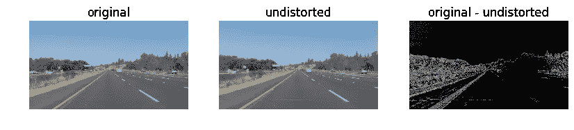

Removing image distortion

接下来，我们应用透视变换来获得道路的鸟瞰图。我们首先在原始相机图像中识别 4 个点，然后拉伸图像，使 4 个点之间的区域形成一个矩形截面。

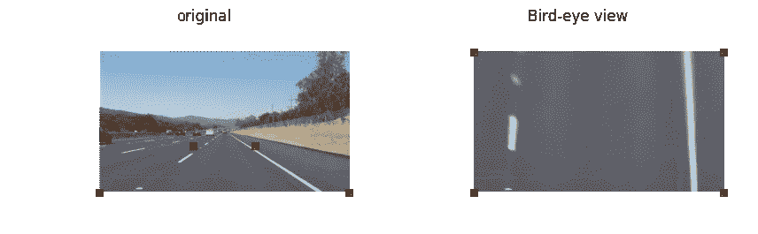

Perspective transform to get bird-eye view

一旦获得了俯视图，我们就开始确定车道。

**步骤 2:转换到 HSV 色彩空间并应用颜色遮罩**

下一步是将鸟瞰图 RGB 图像转换为 HSV 颜色方案。HSV 指的是色调、饱和度、数值。HSV 方案是作为一种更直观的方式来表示颜色而开发的。色调(或 H)代表特定的颜色，饱和度(或 S)代表颜色的数量，数值(或 V)代表相对于类似照明的白色的亮度。因此，通过将图像转换为 HSV 尺度，可以获得良好的颜色分辨率。我们使用 HSV 颜色空间来识别黄色和白色。我们应用黄色面具作为

```
yellow_hsv_low  = np.array([ 0, 80, 200])
yellow_hsv_high = np.array([ 40, 255, 255])
res = apply_color_mask(image_HSV,warped,yellow_hsv_low,yellow_hsv_high)
```

其中，apply_color_mask 返回指定强度介于低值和高值之间的像素。应用黄色蒙版的结果是，

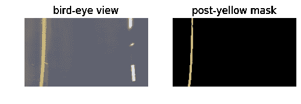

Applying yellow-mask

因为黄色掩模对于不同的照明条件非常鲁棒，因为黄色的不同照明图像是通过改变亮度通道而产生的，同时保持色调或颜色通道固定。下图显示了不同照明条件下应用黄色遮罩的效果。

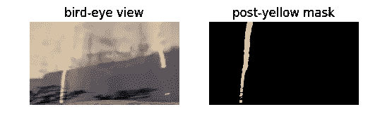

Yellow mask on shadowed and bright patch of road

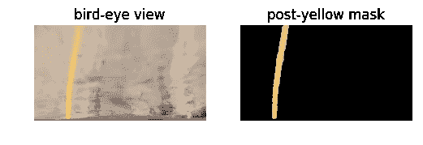

Yellow mask on bright patch of road

类似地，使用阈值应用白色遮罩，如下所示

```
white_hsv_low  = np.array([  20,   0,   200])
white_hsv_high = np.array([ 255,  80, 255])
```

为了识别白线，

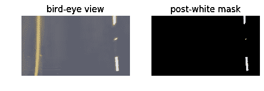

Applying white mask,

一旦应用黄色和白色蒙版，通过如下组合两个通道蒙版获得来自彩色蒙版的通道。

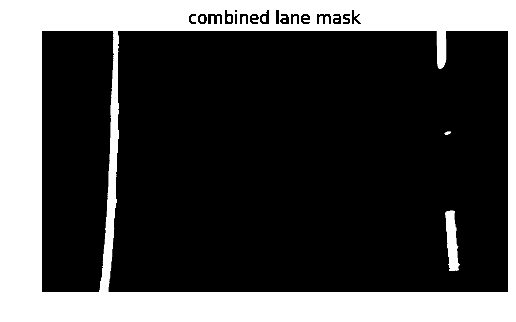

Combined lane from color masks

**第三步:应用索贝尔过滤器得到潜在的线条/边缘**

下一步是应用索贝尔过滤器，以获得潜在的线/边缘。如果道路上没有其他黄色或白色标记，上面的颜色遮罩是选择车道标记的好方法。这并不总是可能的，因为道路上可能有白色或黄色的文字。因此，为了避免混淆，我们还使用 Sobel 滤波器进行边缘检测。Sobel 滤波器用于图像处理，通过执行原始图像和 Sobel 算子(或滤波器)的 2-D 卷积来获得图像的边缘。这个操作可以表示为，

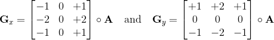

Sobel filter, circle denotes convolution operation

沿着 x 和 y 方向 Sobel 滤波器给出了沿着 x 和 y 方向的图像强度的梯度或变化。然后，这些强度可以通过大小和方向进行阈值处理，以获得仅在边缘处等于 1 的二进制图像。我们将应用 Sobel 滤波器，并对 HLS 图像的 S 和 L 通道的 x 和 y 方向的梯度幅度进行阈值处理。我们选择 HLS 通道是因为在以前的实验中，发现 HLS 颜色空间对于检测边缘是最鲁棒的。

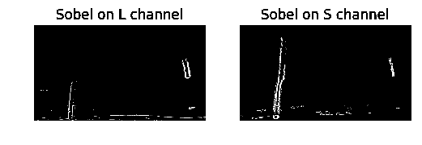

Sobel filter applied on L and S channel of image

**第四步:组合索贝尔滤镜和彩色蒙版**

接下来，我们将来自 Sobel 过滤器的二进制掩码和颜色掩码相结合，以获得车道的更强指示符。车道应该是深色背景上的白色或黄色标记，因此应该显示较大的坡度。白色和黄色通道的组合 Sobel 图像和颜色遮罩如下所示。

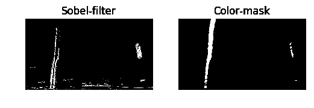

Lane masks from Sobel filters and color masks

来自颜色掩蔽和 Sobel 滤波器的最终组合的车道和边缘掩蔽如下所示。很明显，原始图像中预期有车道的区域用粗粗线突出显示。我们能够获得这些粗线是因为我们结合了边缘检测和颜色掩膜。

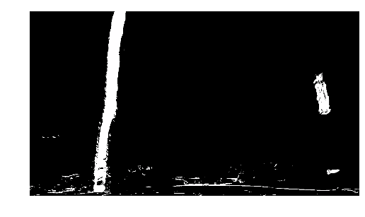

Final combined lane mask

第五步:应用窗口来删除任何可能是由于图像中的其他伪像而产生的标记或特征。

在最终的合成蒙版中，我们看到了许多可能是由其他伪像造成的边缘特征，其中一个突出的是由汽车引擎盖造成的水平线。因此，我们计算沿 x 方向的所有像素的平均值，并使用移动平均滤波器来获得沿 x 方向的平滑强度分布。然后，我们应用阈值 0.05 来识别可能包含车道线的区域。这些区域边界用蓝线表示。

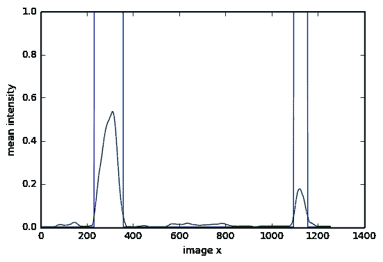

Plot of intensity along X direction

我们使用这些峰的左右边缘作为边界来选择左右车道标志点。通过去除左右车道标志的点，我们得到了表示车道的点，

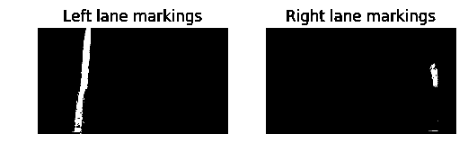

Left and right lane markings

**步骤 6:应用多项式回归计算左右车道**

接下来，我们使用多项式回归获得二次拟合来近似车道线。我们使用 numpy 的简单多项式拟合函数来计算左右车道的二次拟合。一旦获得了左和右车道的二次拟合，我们将它们画回到图像上，并如下用青绿色标记左和右车道之间的区域。

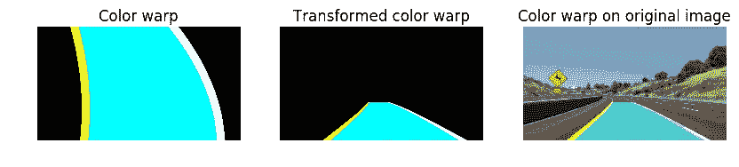

Redrawing lane lines and lane back on the original image

**第七步:逐帧平滑去除图像间的噪声，并在图像上画线。**

接下来，我们通过一阶滤波器对帧进行平滑处理。我们还包括一个干扰抑制例程，该例程丢弃任何系数与前一帧中的系数偏差超过 5%的多项式拟合。

**步骤 8:计算车道曲率和车道偏差**

最后，我们计算了曲率半径和车道偏离，并实现了一个简单的车道偏离警告系统，如果车道偏离超过 30 厘米，该系统会将蓝绿色区域变为红色。

**反思**

这是一个非常有趣的项目。最有趣的部分是查看在以前的简单项目中开发的技术如何应用于更一般的场景。这个项目的工作远未结束。当前的算法不够健壮，不足以推广到挑战视频，但性能非常好。我们将在最终报告中详细介绍一个更强大的算法。

**致谢**:

我非常感谢 Udacity 选择我作为第一批，这让我能够与许多志同道合的人联系。一如既往，从与亨里克·特纳曼和陈志强的讨论中学到了很多。我也感谢获得 NVIDA 的 GPU 拨款。虽然这是工作用的，但我也用它来办公。

特别感谢一位同学陈志强。John 发布了一个简单的解决方案来实现管道的诊断视图，但是当论坛从旧论坛迁移过来时，这个解决方案被删除了。尽管约翰在度假，他还是及时上传了新论坛上的代码片段，并把[链接](https://carnd-forums.udacity.com/questions/32706990/want-to-create-a-diagnostic-view-into-your-lane-finding-pipeline)发给了我。

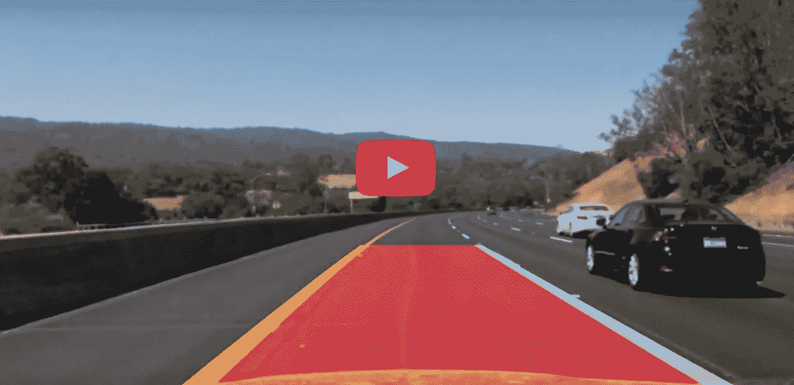