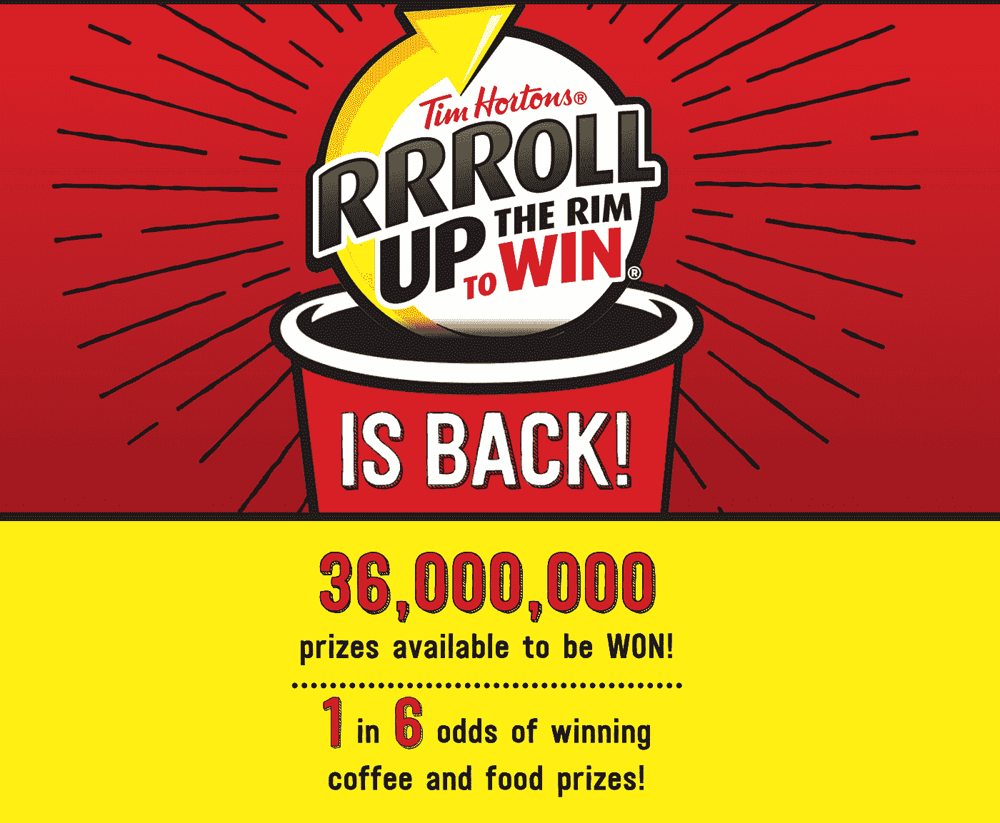
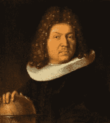
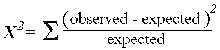

# 卷起轮圈:真的是六分之一吗？

> 原文：<https://towardsdatascience.com/roll-up-the-rim-is-it-actually-1-in-6-965b77c92642?source=collection_archive---------7----------------------->



## 蒂姆·霍顿名言的统计分析

蒂姆·霍顿即将赢得 2018 年的比赛。你每买一杯热饮，就有六分之一的几率中奖(奖品包括免费甜甜圈、咖啡和汽车)。随着比赛的进行，对他们标志性的“六分之一”声明的怀疑也在增加。

这是运气不佳、确认偏差或者可能蒂米斯实际上在欺骗我们的综合结果。由于没有人能够购买流通中的全部 3600 万杯，没有人能够绝对肯定地反驳或证实他们的说法。

然而，即使样本量相对较小，我们也可以用*证据*来说明他们的陈述有多准确。

## 数据收集

在对朋友和家人进行调查后，我收集了 108 种购买饮料的相关数据。其中，16 个是赢家。乍一看，这意味着 1/6.75 的可能性。还不错。*但这是否足够接近六分之一来支持 Timmies 的签名声明呢？*

先说一个假设。

## **假设:**有 1/6 的中奖几率。

你可能不同意这个假设，但没关系——如果我们有证据，我们可以稍后反驳它。因为有足够多的杯子在流通，所以一个结果不会显著改变获奖的几率，我们可以使用[伯努利分布](https://en.wikipedia.org/wiki/Bernoulli_distribution)来模拟这个假设。



Jacob Bernoulli, famous mathematician and also very stylish

## 拟合优度检验

我们可以使用[卡方检验](https://en.wikipedia.org/wiki/Goodness_of_fit#Pearson's_chi-squared_test)来评估我们的样本数据在多大程度上符合伯努利分布，在伯努利分布中，成功的几率(在这种情况下，是获奖)是 1/6。卡方检验要求我们计算一个统计量，这个统计量概括了我们观察到的和我们期望看到的之间的差异。对于我们的示例，我们预计会看到 18 个奖项和 90 个“请再玩一次”的奖项。

有了这些信息，我们可以使用以下公式计算卡方检验统计量:



卡方检验统计量方便地遵循卡方分布。伴随着这种有点复杂的现象，有一个很好的证明，但这是我们幸运拥有的东西。

**当我们知道统计数据遵循的分布时，我们可以根据*统计数据在分布中的拟合程度来测试我们的假设。***

## 结果

幸运的是，R 有一个内置的卡方检验函数。如果没有它，我们将不得不用传统的方法来计算，并将结果与表格进行比较。

哪些输出:

```
Chi-squared test for given probabilities data: observed 
X-squared = 0.26667, df = 1, p-value = 0.6056
```

这里感兴趣的参数是 **p 值**。更容易将 p 值解释为百分比(60.56%)。

p 值表示 1) **假设**我们的假设为真，并且 2)我们根据我们的假设从分布中重复采样，那么我们观察到的 60.56%的样本将比我之前收集的 108 个样本更加“极端”。

通常，我们使用 5%的 p 值作为拒绝假设的准则。如果不到 5%的后续样本更“极端”，这表明我们的观察非常“极端”，因此我们的假设不太可能是真的。我们的样本显示情况并非如此。

**底线:我们的 108 个样本没有证据否定蒂姆·霍顿的说法，即 1/6 的几率。**

## 这是否意味着中奖几率确实是 1/6？

肯定不是！反驳一种说法比证实一种说法容易得多。

这引出了另一个问题——如果问题出在我们的样本上呢？大多数关于样品的问题都是“好吧。如果我们真的非常非常幸运，看到了我们所看到的，会怎么样？”。

这些问题归结为以下几个问题:

*   样本是否偏向某些群体？
*   108 的样本够大吗？

**针对第一点，**答案是肯定的，抽样是有偏差的。我调查的大多数人来自安大略省南部。他们中的大多数是喝咖啡的人。大多数人在上班前都会买咖啡。问题是——这些偏见重要吗？我认为，一旦杯子生产出来，奖品(或缺少奖品)不会改变是公平的。一个更合理的担忧是地理位置和杯子的大小。蒂姆·霍顿的分销网络是如何构建的？如果有的话，他们付出了什么样的努力来确保获胜的奖杯被平均分配？没有进一步的数据，我们对这些情况视而不见。

**样本量呢？**更好的问题— *多大的样本才算“足够大”？虽然我们有一个封闭形式的公式来计算控制误差的样本量，但我认为模拟可能更有见地。*

## 模拟时间

让我们模拟五种不同的场景，其中我们假设*实际*获奖几率分别为:

*   四分之一
*   五分之一
*   六分之一
*   七分之一
*   八分之一

我们根据 100 人、1，000 人和 10，000 人的样本量将这些场景分成三组。我们对每一组模拟 100 次，并用概率为“1/6”的天真假设进行测试。

卡方检验能正确拒绝假设多少次？或者，在潜在的赔率实际上是 1/6 的情况下，卡方检验会错误地拒绝假设多少次？

R code for simulation

我们观察到以下结果。让 *n* 表示样本大小。

We reject the hypothesis when p-value < 0.05

嗯。不幸的是，看起来我微薄的 108 个样本太小，无法检测出假阳性(不是 1/6 的几率被认为是 1/6 的几率)，特别是当实际几率更小的时候。它似乎在消除假阴性方面做得不错(1/6 的几率不会被认为是 1/6 的几率)。

但是，如果我们给自己更多的宽容来惩罚假阳性呢？毕竟，我的样本确实达到了 60.56%的 p 值，这比建议的 5%临界值高得多。

如果当 50%或更少的后续样本更极端时，我们拒绝 1/6 的赔率假设(即当 p 值< 0.5), we obtain the following.

We reject the hypothesis when p-value < 0.5

Not too bad for a first run! Ideally, I would have liked to work with a larger data set with more variables to explore (such as location, time of purchase, cup size …etc). That could provide more insight into Tim Horton’s distribution network and eliminate more biases from the sample. Alas, we must make do with what we have.

Maybe for next year, I will make more of an effort to collect data.

**结论:虽然我们的样本表明没有证据拒绝 1/6 的赔率，但我们认识到 108 的样本量可能不够。然而，我们的样本结果和样本大小在评估真实几率时，在消除假阴性和假阳性方面做得还可以。**

# 感谢您的阅读！

如果你喜欢这篇文章，可以看看我关于数据科学、数学和编程的其他文章。[通过 Medium](https://medium.com/@mandygu) 关注我的最新动态。😃

作为一个业余爱好项目，我还在[www.dscrashcourse.com](http://www.dscrashcourse.com/)建立了一套全面的**免费**数据科学课程和练习题。

如果你想支持我的写作，下次你报名参加 Coursera 课程时，可以考虑使用我的[会员链接](https://click.linksynergy.com/fs-bin/click?id=J2RDo*Rlzkk&offerid=759505.198&type=3&subid=0)。完全公开—我从每一次注册中获得佣金，但不会对您产生额外费用。

再次感谢您的阅读！📕