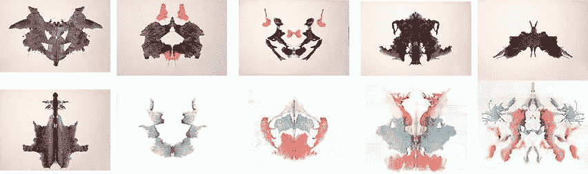
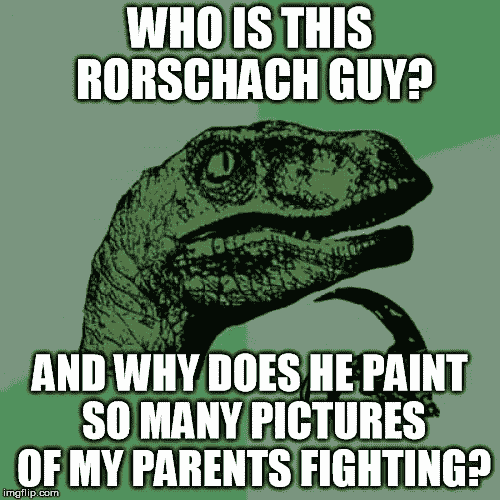
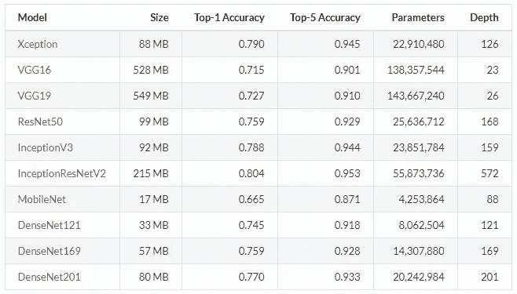
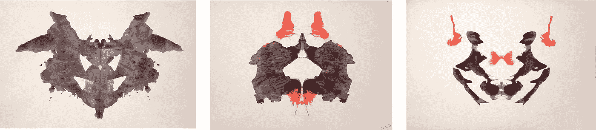
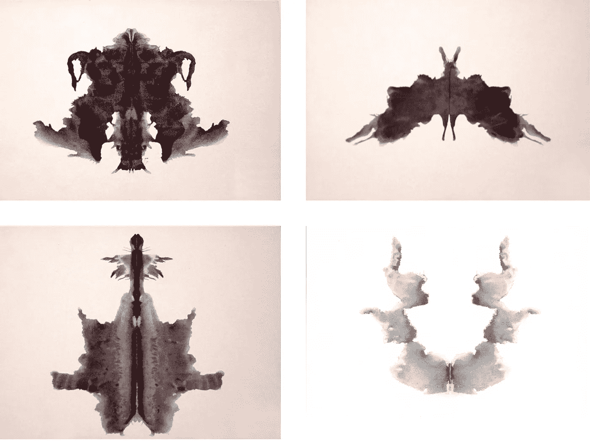
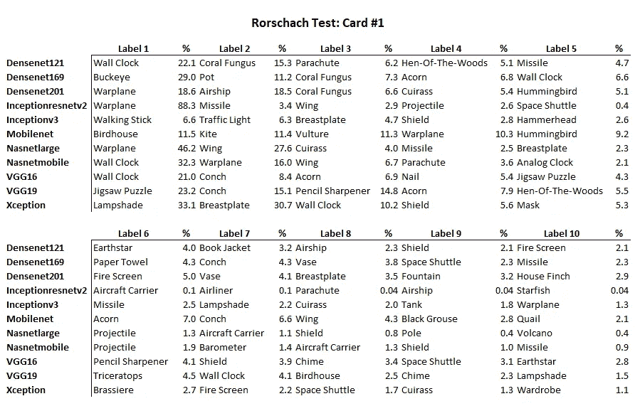
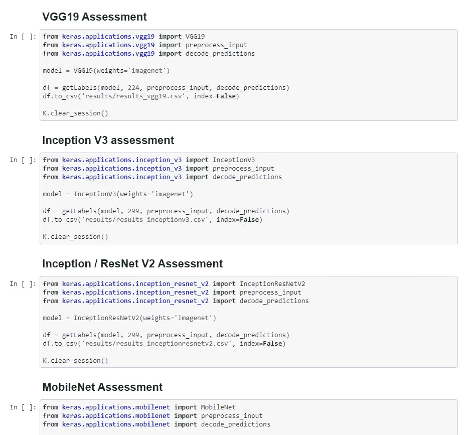

# 深度学习图像分类器的罗夏测验

> 原文：<https://towardsdatascience.com/rorschach-tests-for-deep-learning-image-classifiers-68c019fcc9a9?source=collection_archive---------2----------------------->

当没有东西可看的时候，他们看到了什么？


The inventor of the Rorschach Test, Hermann Rorschach, next to his modern day counterpart, Walter Kovacs.

随着对图像分类和标记的大量探索，我们倾向于使用各种库来快速评估和标记图片。但是除了内存使用和重新训练图层的便利性，当呈现不清楚、有颗粒的图片时，它们会有什么表现呢？

为了在实践中更好地感受每个 ConvNet 的细微差别和趋势，我对罗夏测试中的所有卡片连续运行了最流行的那些。

目标很简单:设定我的期望，理清我对每一个期望的理解，这样我就可以使用正确的工具来推进工作。

# 罗夏测验

由赫曼·罗夏克发明(或者更准确地说，修改)的罗夏测验是最著名的墨迹测验。墨迹测试是与你的治疗师的一个简单的对话开始，那就是“你看到了什么？”在被展示一张纸上挤压的故意抽象的(通常是对称的)墨滴之后。罗夏更进一步，创造了一套标准。这套标准现在可以用于病人和治疗师之间。



All 10 cards from the original Rorschach Test. Note the use of colors, as opposed to some of the inkblot tests used before Mr. Rorschach’s standardized version.

这个测试的目的是唤起对抽象艺术的潜意识反应，用你自己的偏见和最深刻的想法覆盖它，这样你首先看到的就是你正在思考的。尽管它在过去几年中已经失宠(“伪科学”被用来描述它)，但它仍然是描述心理学领域的一个非常有用的比喻。

在这种情况下，我使用它来强制各种库将这个无害的数据集分类到预定义的标签中。



# 分类器

为了对图片进行分类，我查看了以下库:

*   ResNet50
*   VGG16
*   VGG19
*   InceptionV3
*   InceptionResNetV2
*   例外
*   MobileNet
*   MobileNetV2
*   DenseNet
*   纳斯网

(这些都是在 [Keras 2.2.0](https://keras.io/applications/) 中可用的原生应用程序库。)

这些分类器中的每一个都具有特定的结构和与之相关联的权重。



Documentation for each classifier from Keras.

除了内存使用和可训练参数之外，每一个的实现细节都有很大的不同。与其深入挖掘每个结构的特殊性，不如让我们看看他们是如何看待同样令人困惑的数据的。

(如果你想单独了解每个结构的更多信息，如果你想了解更多关于 [ResNet](https://arxiv.org/pdf/1512.03385.pdf) 、 [Inception](https://arxiv.org/pdf/1512.00567.pdf) 、 [DenseNet](https://arxiv.org/pdf/1608.06993.pdf) 、 [NASNet](https://arxiv.org/pdf/1707.07012.pdf) 、 [VGG16/19](https://arxiv.org/pdf/1409.1556.pdf) 和 [MobileNet](https://arxiv.org/pdf/1704.04861.pdf) 的信息，这里有链接。)

# 结果呢

总的来说，我们的目标是快速了解预测和预测背后的信念强度。为了做到这一点，我将前 1 名的预测按名称分组，并将它们的得分加在一起。这给出了每个分类者准备在一张特定的牌上赌多少的感觉。对每个标签都这样做，可以很好地代表每个分类器的可信度，并让我们了解每个卡片的相对预测可信度。

举个例子，InceptionResNetV2、NASNetLarge、DensetNet201 认为卡 1 是战机(得分分别为 88.3%、46.2%、18.6%)。然后我把它加起来，无量纲的分数是 153.1。现在，我可以在分类器之间比较这个分数，看看哪一个表现最好。

## 卡片 1、2 和 3



Cards 1, 2, 3\. Or, according to the classifiers, a fighter jet, a rooster, and a book jacket. Go figure.

```
Card 1:
warplane 153.05
wall_clock 75.41
letter_opener 47.29
lampshade 33.13
buckeye 28.95
jigsaw_puzzle 23.19
paper_towel 22.51
birdhouse 11.50Card 2:
cock 72.84        # <--- Rooster.  They mean rooster.
lampshade 59.99
brassiere 59.47
velvet 43.84
earthstar 41.42
mask 29.46
candle 21.84
tray 19.30
wall_clock 18.41
hair_slide 17.84
vase 11.44Card 3:
**book_jacket 325.35** # <--- No idea what's going on here.
coffee_mug 62.61
chocolate_sauce 45.00
candle 32.68
ant 25.81
matchstick 24.02
jersey 16.94
```

## 卡片 4、5、6 和 7 —错误和爆炸



First row: Card 4 and Card 5\. Second row: Card 6 and Card 7\. Card 5 is without a doubt a picture of some sort of bug.

卡片 4 到 7 引出了更多的烟、飞船和虫子。这让我想起了我的农村童年，玩着有史以来最好的乐高玩具。(我显然指的是 [M-Tron](https://www.google.ca/search?biw=1920&bih=947&tbm=isch&sa=1&ei=EPswW4fyKMS4sgX_85r4Dg&q=mtron+lego&oq=mtron+lego&gs_l=img.3..0j0i8i30k1l4j0i10i24k1.6982.7669.0.7903.5.5.0.0.0.0.130.434.3j2.5.0....0...1c.1.64.img..0.5.433...0i5i30k1j0i30k1j0i24k1.0.hRmsVXP8840) 、邪恶 [BlackTron](https://www.google.ca/search?biw=1920&bih=947&tbm=isch&sa=1&ei=KPswW6j6JoGSsAW5t5KYCw&q=blacktron+lego&oq=blacktron+lego&gs_l=img.3..0i67k1j0j0i8i7i30k1j0i8i30k1l7.2198.2198.0.2496.1.1.0.0.0.0.70.70.1.1.0....0...1c.1.64.img..0.1.69....0.N-W9IqgOJDY) 和 [Ice Planet](https://www.google.ca/search?biw=1920&bih=947&tbm=isch&sa=1&ei=QvswW42zCY-asQWV6aH4Dw&q=ice+planet+lego&oq=ice+planet+lego&gs_l=img.3..0l2j0i8i30k1l8.1395.2098.0.2317.5.5.0.0.0.0.126.425.4j1.5.0....0...1c.1.64.img..0.5.425...0i67k1j0i5i30k1.0.qQh7wsBW64k) 。)

```
Card 4:
volcano 101.76
fountain 72.11
space_shuttle 32.72
hen-of-the-woods 29.40
pitcher 28.28
vase 25.00
king_crab 23.99
wall_clock 18.25
triumphal_arch 11.04Card 5:            # <--- Bugs. Definitely bugs.
isopod 106.54
king_crab 83.67
ant 61.58
long-horned_beetle 32.23
tick 30.05
hip 26.32
rhinoceros_beetle 14.52Card 6:
space_shuttle 174.48
warplane 155.58
conch 104.73
missile 63.71
airship 57.73
fountain 11.57Card 7:
missile 195.66
parachute 52.52
projectile 42.31
space_shuttle 31.18
hip 29.89
geyser 20.92
warplane 17.50
```

## 卡片 8、9 和 10——降落伞、海螺和托盘？


Cards 8, 9, and 10\. How the right one is a “tray” is beyond me.

```
Card 8:
fountain 189.59
parachute 98.27
umbrella 94.61
pencil_sharpener 63.27
spoonbill 51.08
poncho 45.19
coral_fungus 12.05
shovel 10.12Card 9:
missile 238.45
fountain 64.82
parachute 48.21
volcano 44.77
paper_towel 41.59
lampshade 13.48Card 10:
tray 229.22
handkerchief 151.63
conch 77.94
feather_boa 60.34
rapeseed 15.95
```

当然，我们可以更深入地了解每个预测的平均置信度。下面是卡 1 的一些示例数据。所有的结果都可以在该项目的 GitHub 页面上找到。



All of the results available for Card #1.

# 代码

为了标记每张图片，我们首先加载 Pandas、NumPy 和 Keras 图像预处理库:

```
from keras.preprocessing import image
from keras.preprocessing.image import load_img
from keras.preprocessing.image import img_to_array
from keras.models import Model
import keras.backend as K
import numpy as np
import pandas as pd
import json
```

然后，我们创建一个助手函数来返回包含每个库的前 10 个结果的分数的数据帧，以便快速汇集每个图像的分数:

```
def getLabels(model, dims, pi, dp):
"""
Returns the top 10 labels, given a model, image dimensions, 
preprocess_input() function, and the labels inside decode_predictions().
"""df = pd.DataFrame()

    for img_path in images:# Resize image array
        image = load_img(img_path, target_size=(dims, dims))
        image = img_to_array(image)
        image = image.reshape((1, image.shape[0], image.shape[1], image.shape[2]))
        image = pi(image)

        # Predict what is in the image
        yhat = model.predict(image)

        # return the top 10 labels
        labels = dp(yhat, top=10)[0]# create empty list and counter
        labellist = []
        counter = 0

        # get labels for each image
        for label in labels:
            # Display the score of the label
            print('%s (%.2f%%)' % (label[1], label[2]*100))

            # Add image results to list
            labellist.append(
                {"labelnumber":counter, 
                 "labelname"  :label[1], 
                 "pct"        :'%.2f%%' % (label[2]*100), 
                 "image"      :img_path})
            counter = counter + 1

        # Add to dataframe
        df_row = pd.Series()
        df_row = pd.read_json(json.dumps(labellist), typ='frame', orient='records')
        df = df.append(df_row,ignore_index=True)
        print("------------")

    return df
```

现在，我们有了一个快速评估每个图书馆*的方法。*

```
# ...
# ResNet50 Rorschach assessment
from keras.applications.resnet50 import ResNet50
from keras.applications.resnet50 import preprocess_input
from keras.applications.resnet50 import decode_predictionsmodel = ResNet50()df = getLabels(model, 224, preprocess_input, decode_predictions)
df.to_csv('results_resnet50.csv', index=False)# ----------# VGG16 Rorschach assessment
from keras.applications.vgg16 import VGG16
from keras.applications.vgg16 import preprocess_input
from keras.applications.vgg16 import decode_predictionsmodel = VGG16()df = getLabels(model, 224, preprocess_input, decode_predictions)
df.to_csv('results_vgg16.csv', index=False)
# ...
```

…等等。

这种方法的有趣之处在于，当使用不同的图像集时，它是一个非常实用的笔记本:



A snapshot of the notebook from the [repository](https://github.com/elmathioso/rorschach/blob/master/rorschach.ipynb).

这种笔记本结构允许您快速浏览不同的数据集，并查看适合您的产品或项目的最佳分类器。你是否在模糊的图片上寻找一个可靠的顶级精度？如何识别一张图片的所有不同内容？你的里程可能会有所不同，但你现在可以开始自己探索了。

你可以在这里得到[的全部代码。](https://github.com/elmathioso/rorschach/)

# 玩得开心！

马特。
matt @ lemay . ai

LEMAY . AI
1(855)LEMAY-AI

您可能喜欢的其他文章:

*   [傲慢、懒惰和玩玩具:一个创业工程师的成功态度](https://medium.com/@lsci/hubris-laziness-and-playing-with-toys-the-winning-attitudes-of-a-startup-engineer-84c9fc08239d)
*   [为客户提供人工智能原型作为营销策略](/ai-prototypes-for-clients-as-a-marketing-strategy-70de404d27b5)

我的首席技术官丹尼尔·夏皮罗(Daniel Shapiro)的其他文章您可能会喜欢:

*   [人工智能和不良数据](/artificial-intelligence-and-bad-data-fbf2564c541a)
*   [人工智能:超参数](/artificial-intelligence-hyperparameters-48fa29daa516)
*   人工智能:让你的用户给你的数据贴上标签

附注:发音是*吼-肖克。*