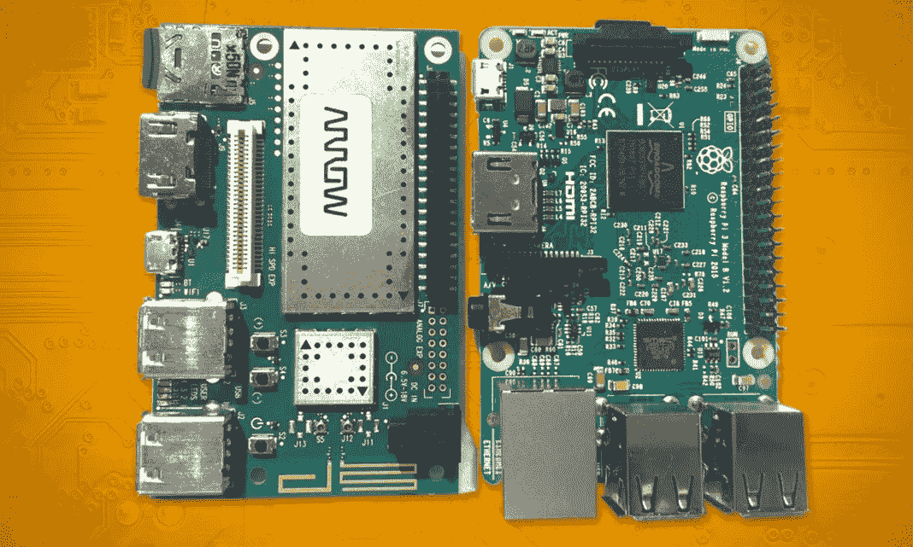
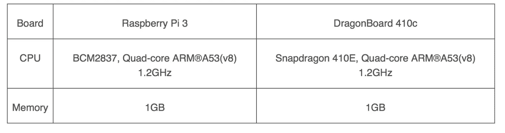
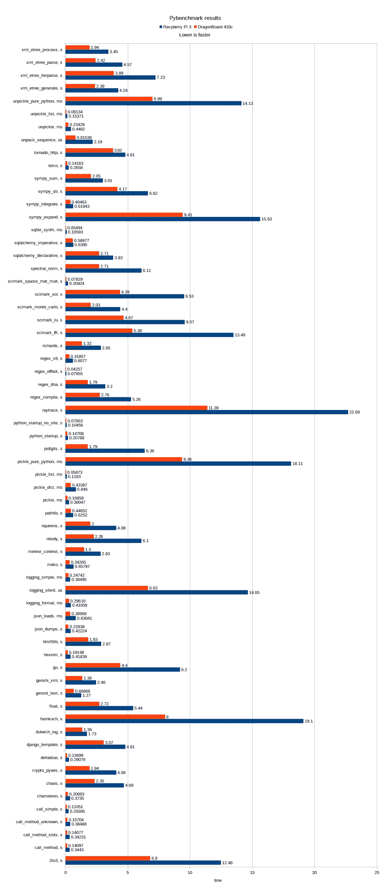
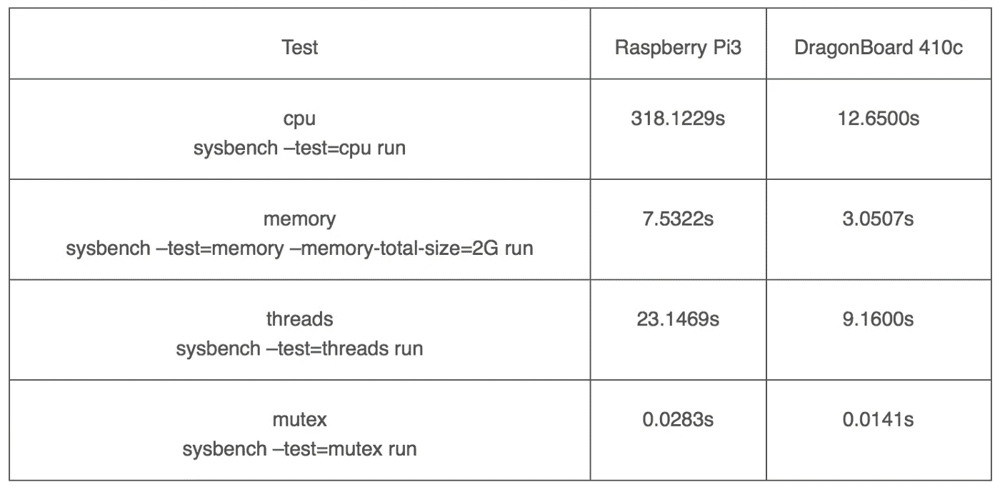

# 树莓 Pi 3 vs 龙板

> 原文：<https://towardsdatascience.com/rpi3-vs-dragonboard-f4dd877b7da9?source=collection_archive---------1----------------------->

## 从 Python 的角度来看

Python 是创建简单 PoC 项目的完美语言。我们不会谈论 Python 优点的完整列表，但最神奇的是 Python 是**跨平台**。这个特性对于构建嵌入式系统应用程序非常有用。无需等待编译器构建二进制文件，无需将应用部署到主板上。同样的代码既可以在 PC 桌面上运行，也可以在基于 Linux 的板上运行，比如 Raspberry Pi。

然而，这种方法有其局限性。它不能用于一些与硬件相关的项目，例如 PC 桌面没有 SPI。显然，基于 ARM 的主板比 PC 要慢。因此，在某些情况下，在桌面上完美运行的算法在嵌入式系统上会出现性能下降。

# **性能对比**

在我们最新的[项目](https://medium.com/iotforall/how-to-add-alexa-to-a-raspberry-pi-6cedfe15662e)中，性能至关重要。我们使用 Dragonboard 410c 作为目标平台之一。我们对董事会的表现感到惊喜。即使没有仪器基准测试，我们也能感觉到与 Raspberry Pi 3 相比，OS 包安装、应用程序启动和整体性能都有显著提升。

Board specs

看起来相当平等，并不能解释 DragonBoard 的优越性能。所以我们执行了一个基准测试来分析它是否真的更快。

# 基准测试

我们决定在这些主板上测量 Python 3 的性能，作为我们最感兴趣的版本。我们使用了 [Python 性能基准测试套件](http://pyperformance.readthedocs.io/)，声称它关注真实世界的基准测试，而不是尽可能使用整个应用程序的合成基准测试。

我们在嵌入式平台上使用了我们最喜欢的操作系统。该操作系统是一致的，并提供事务性更新。最重要的是，它支持两种板进行我们的基准测试。我们在 SD 卡上安装了 Ubuntu Core，并使用“经典”环境进行测试。

以下命令安装 Pyperformance:

`pip3 install pyperformance`

我们用以下方式运行它:

`echo pyperformance run --python=python3 -o result.json | nohup sudo classic &`

我们使用这个棘手的命令只是为了允许测试在没有活动 ssh 连接的情况下在后台运行，因为这需要时间，并避免由于丢失 ssh 连接而导致的任何问题(测试也会被停止)。

Results

# **结果**

结果真的很让人吃惊。DragonBoard 几乎比树莓 Pi 3 快两倍！现在我们明白了为什么我们会感觉到性能提升。当然，Raspberry Pi 3 官方内核使用的是 32 位的 armhf (v7)架构，而 DragonBoard 410c 使用的是 64 位的 amr64(v8)内核。由于 Python 大量使用 64 位算法，这可能解释了差异。

# 最终系统台架测试

为了用本机代码确认这个结果，让我们也运行“sysbench”测试。Sysbench 有一些我们想要运行的测试:cpu、内存、线程、互斥。这些测试更具综合性，但我们还是来比较一下这些板的计算能力吧。

Results

CPU 基准测试快了 25 倍。这是因为 CPU 测试使用显式的 64 位整数。在这种情况下，64 位操作系统具有很大的优势。其他测试大约快两倍，这与 pybenchmark 非常相似。即使线程测试不会受到 64 位内核的影响。

# 结论

当然，总有机会用 C 甚至纯汇编语言开发你的项目，获得更好的性能。但是通常开发时间比板子的价格要贵。使用像 Python 这样的工具来帮助开发质量更好的产品并更快地将其交付给市场，会更便宜、更有效、生产率更高。

Python 导致的性能下降可以通过一个更强大的板来轻松克服。我们真的希望树莓派官方形象会有一个 64 位的 OS。但是现在 DragonBoard 410c 是 Python 应用程序开发的完美选择。

*由* [*DataArt*](https://www.dataart.com/industry/iot-and-m2m-solutions?utm_source=medium&utm_medium=social&utm_campaign=i-spring-2018) *的高级建筑师尼古拉·哈巴罗夫执笔。*