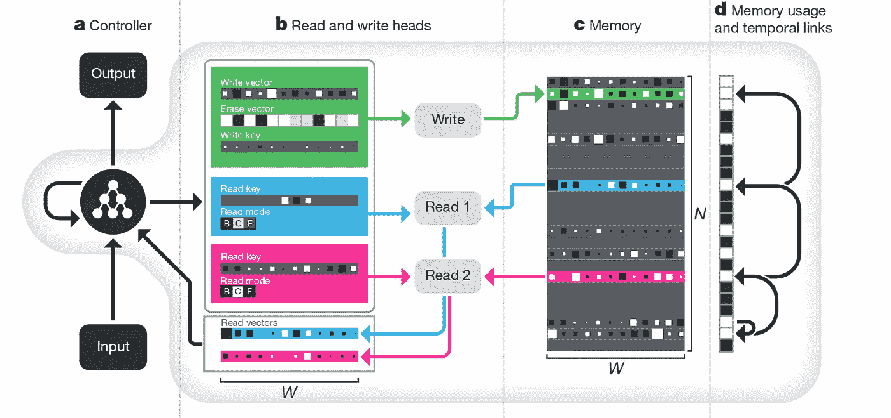

# 可微分神经计算机:综述

> 原文：<https://towardsdatascience.com/rps-intro-to-differentiable-neural-computers-e6640b5aa73a?source=collection_archive---------5----------------------->

**可微分神经计算机**是一种神经网络，它利用了记忆增强，同时也利用了注意力机制。最初的论文是由 Alex Graves、Greg Wayne 等人撰写的使用具有动态外部存储器的神经网络的混合计算(T2)。2016 年 10 月出版。

# 结构

让我们把 DNC 想象成一台带有 **CPU** 和 **RAM** 的机器。
一个神经网络，即**控制器**，将扮演 CPU 的角色。一个**存储器**，它只是一个矩阵，将扮演 RAM 的角色。
存储矩阵的每一行称为位置。矩阵将有 N 个**位置**，它们是 W 维向量。那么，存储器就是一个 N×W 矩阵。

# 记忆增强和注意机制

控制器将从存储器中存储和读取信息，网络将通过一些参数向量来学习如何做到这一点，但我们将对此进行讨论。主要的一点是，网络的内存是在网络本身之外的。
通常，网络的全部知识都存储在其权重中。相反，DNC 是一种叫做“记忆增强神经网络”的东西，这种特性为它提供了一些很好的特性。

**内存增强**并不是本文介绍的新奇事物；事实上，这根本不是什么新鲜事。DNC 中最酷的是在控制器和内存之间起中介作用的向量和操作系统。这被称为**注意机制**，这是过去几年的一个基本概念。

# 权重和人头

注意机制定义了 N 个位置上的一些分布。这些分布是 N 向量，称为**权重**。加权向量的每个第 I 个分量将传达控制器应该给予存储器的第 I 个位置中的内容多少关注。有更多的进程需要观察内存内容，这就是不同权重将采取行动的地方。

在我们的网络图中，每一个涉及操作的过程都是一个功能单元。生产和使用砝码的单位称为**头**。基本上，我们在控制器和存储器之间有两种类型的交互:通过**读取权重**调节的读取过程，以及通过**写入权重**调节的写入过程。发生这种中介作用的功能单元被称为读磁头和写磁头。

## 可微性

正如我们将会看到的，在大脑内部，一种可区分的注意力机制以三种不同的方式被应用。当我说**可微**时，我是说产生读写权重的函数是可微的，然后我们可以对磁头应用梯度下降。

## 权重背后的直觉

当我谈到权重时，我指的是下面的概念:控制器想要做一些涉及内存的事情，而不仅仅是查看内存的每个位置；相反，它将注意力集中在那些包含它正在寻找的信息的位置上。谁把信息放在这些地方的？以前是控制器自己把它写在那里:它现在只想恢复它。

我说过，这个结构中的每个单元和操作都是可微的，也就是说，我们可以通过迭代应用梯度下降来学习一切。所以，脑袋的工作方式也是学来的！

概括一下:DNC 可以学习如何为每个输入产生良好的权重，也就是说，它知道如何根据其相对于给定输入的相对重要性，对其*存储器*进行不同的加权。为输入产生的权重是在特定过程(读或写)中 N 个位置相对重要性的分布。

## 权重是如何确定的？

权重通过控制器发出的向量产生，该向量被称为**接口向量**。接口向量是一组值，这些值对控制器需要和向存储器发出的请求进行编码。

# 注意高贵的三重路径

控制器和存储器之间有三种交互，它们由接口向量来调节:

1.  **内容查找**:将接口向量中的一组特定值与每个位置的内容进行比较，我们将把这些值收集到一个叫做 key vector 的东西中。这种比较是通过相似性度量(在这种情况下，余弦相似性)来进行的。
2.  **临时内存链接**:连续写入位置之间的转换记录在一个 N x N 矩阵中，称为临时链接矩阵 l。控制器写入内存的顺序本身就是一个信息，它是我们想要存储的东西。你可以这样想:如果我不记得我把智能手机放在哪里了，我可以试着回忆一下在到达现在的位置之前我在哪里。
3.  **动态内存分配**:每个位置都有一个使用级别，用 0 到 1 的数字表示。挑选出未使用位置的权重被发送到写磁头，以便它知道在哪里存储新信息。“动态”一词是指控制器重新分配不再需要的内存，擦除其内容的能力。此外，分配机制独立于内存的大小和内容，这意味着我们可以扩展内存，而无需牺牲或重新训练网络。

这是对可微分神经计算机的初步观察。如果你在寻找一个定性的描述，我希望我足够清楚(不要犹豫，在评论中写下任何问题！).