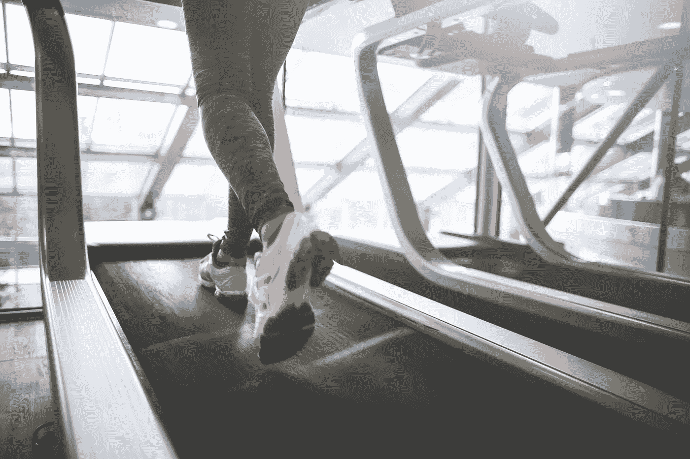
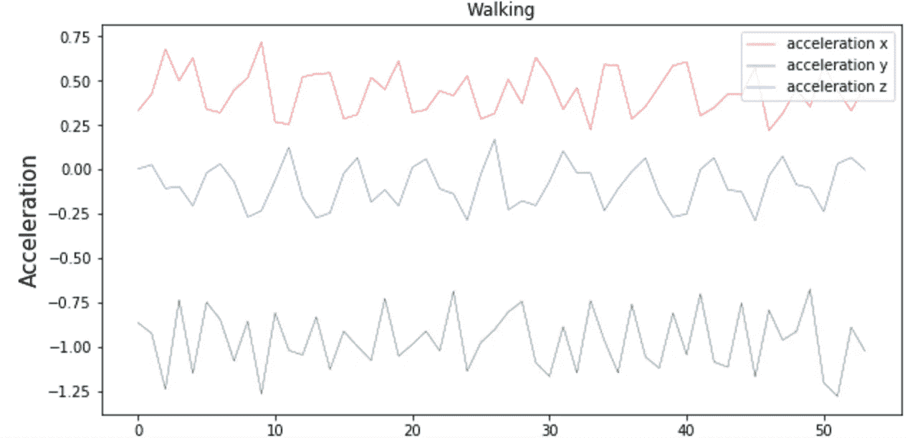
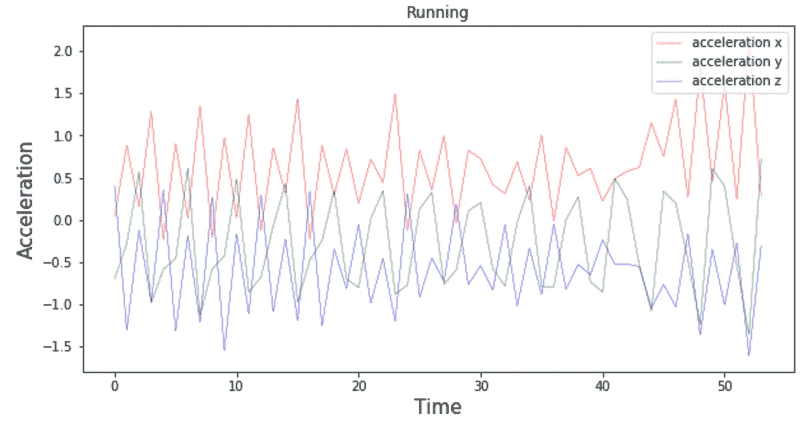

# 跑或走(第 1 部分):用机器学习和核心 ML 检测运动活动

> 原文：<https://towardsdatascience.com/run-or-walk-detecting-user-activity-with-machine-learning-and-core-ml-part-1-9658c0dcdd90?source=collection_archive---------4----------------------->

在最近六月的苹果 WWDC 会议上有很多公告。其中最引人注目的是 [Core ML](https://developer.apple.com/documentation/coreml) 框架的发布，该框架为每个开发者提供了设备上的机器学习能力。这是革命性的。

革命性意味着，在更早的时候，想要在应用程序中使用任何有点现代的机器学习模型的人只有一些不容易配置和实现的选择。核心 ML 成为在您应用程序中以“拖放”方式使用 ML 模型的唯一选择。iOS 做了大部分繁重的工作来生成表示模型本身、其输入和输出的接口。

这为每个人提供了实施端到端解决方案的机会:从收集数据和训练模型，到在 iOS 应用程序中利用该模型。

有了这个前景，我早就有的想法——自动检测体育活动——变成了现实。我决定证明一个假设，即内置于 iOS 应用程序中的预训练机器学习模型可以根据加速度计和陀螺仪的数据来分类这个人是跑步还是走路。当然，还有更多其他体育活动可以用自动化的方式检测，但对于第一次尝试，我选择了那些从人们的角度以及从传感器接收的数据中可以明显区分的活动。

Accelerometer data when the person is walking

Accelerometer data when the person is running

在调查 iOS 上已经有哪些类似的工具可用于此目的时，我发现 CMMotionActivityManager 类的 [CMMotionActivity 对象](https://developer.apple.com/documentation/coremotion/cmmotionactivity)可以检测设备是否在行走或跑步的人身上，或者设备是否在汽车上，甚至是在自行车上。

乍一看，这个问题似乎已经解决了，但在深入研究文档后，我意识到苹果的 Core Motion 使用了来自广泛输入源的数据，包括加速度计、陀螺仪、磁力计和计步器。

**仅仅使用传感器数据的一小部分，我们能预测这个人是在走还是在跑吗？有多准确？任何机器学习模型都能够完成这项任务吗？最后，我以后还能在我的 iOS 应用中使用这种模式吗？**

这些是我将在接下来几周的一系列博客文章中找到答案的主要问题。

请跟随我，看看我在收集训练数据、设计、训练和调整高精度机器学习模型并将其构建到 iOS 应用程序中时面临了哪些挑战。

*阅读下一部分:*

*   [*跑或走(第二部分):以正确的方式收集设备运动数据*](https://medium.com/towards-data-science/run-or-walk-part-2-collecting-device-motion-data-the-right-way-58a277ff2087)
*   [*跑或走(第三部分)>用于检测运动活动性的 99%精度神经网络分类器*](https://medium.com/towards-data-science/run-or-walk-part-3-99-accuracy-neural-network-classifier-for-detecting-motion-activity-675e16af4a7d)
*   [*跑还是走(第四部分):在 iOS 中使用 Keras 神经网络分类器，核心 ML*](/run-or-walk-part-4-using-keras-neural-network-classifier-in-ios-with-core-ml-a29723ab3235)