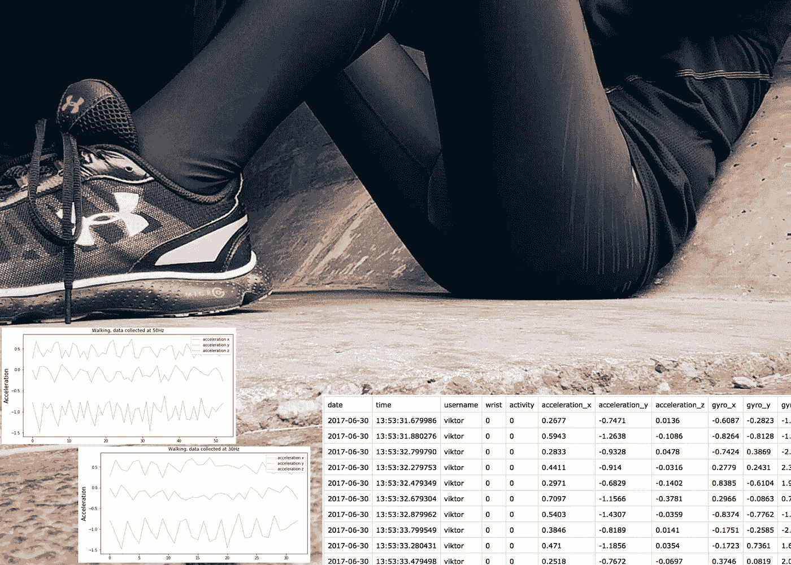
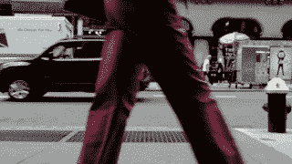
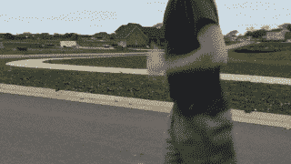
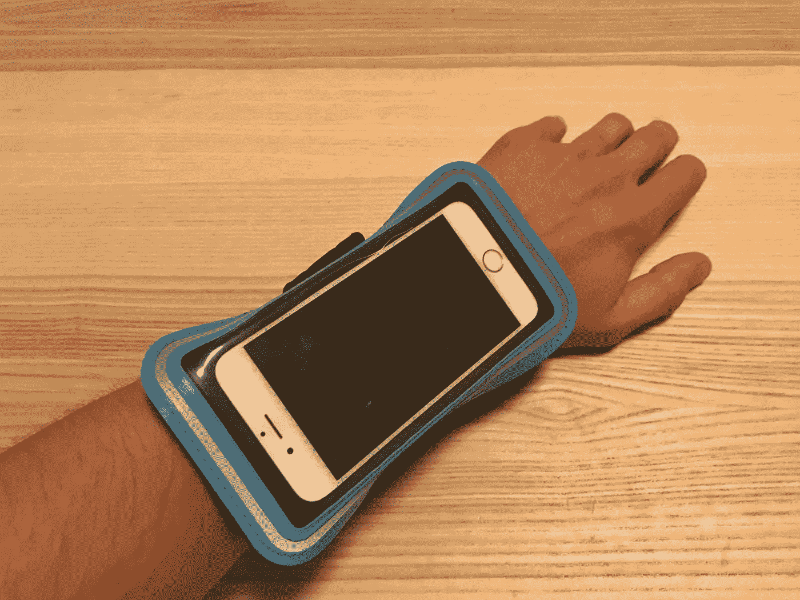
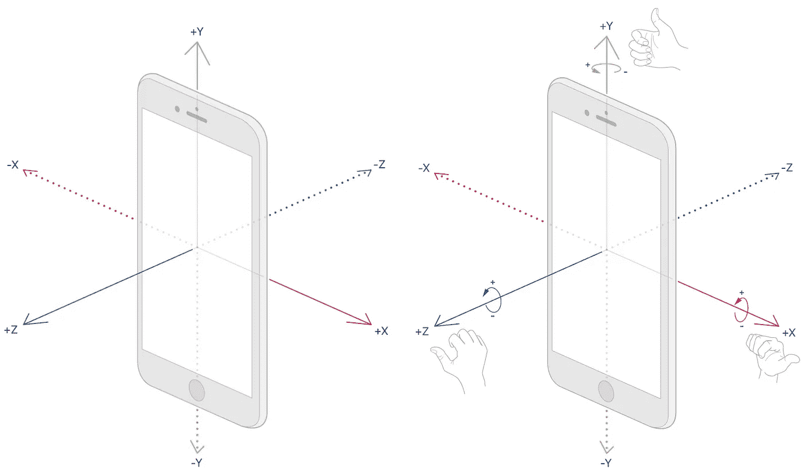
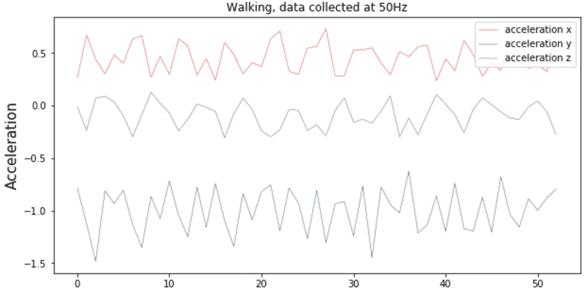
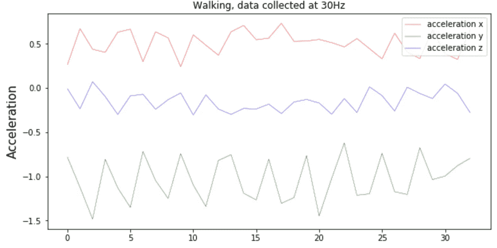
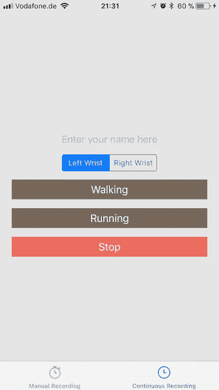
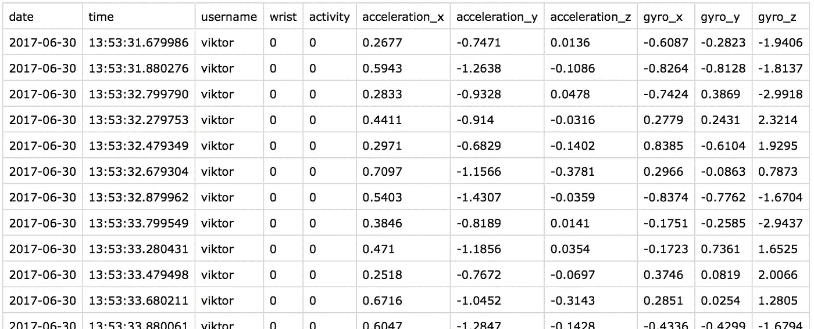

# 跑步或行走(第 2 部分):以正确的方式收集设备运动数据

> 原文：<https://towardsdatascience.com/run-or-walk-part-2-collecting-device-motion-data-the-right-way-58a277ff2087?source=collection_archive---------2----------------------->

*阅读上一部分:* [*“跑还是走(第一部分):用机器学习和 Core ML 检测运动数据活动”*](https://medium.com/towards-data-science/run-or-walk-detecting-user-activity-with-machine-learning-and-core-ml-part-1-9658c0dcdd90)

出于开发一个机器学习模型来准确预测用户是走路还是跑步的动机，我需要数据。快速搜索包含此类活动的公开可用数据集没有得到任何结果。剩下的唯一选择就是自己收集数据。

每个参加过任何数据科学竞赛的人都知道，数据集总是需要经过某种程度的处理，才能馈入机器学习模型。你不能错过这个阶段，否则，你的模型将会遭受缺失、扭曲的数据、异常值和其他一些问题。有时，在完成一项比赛后，回头看看投入的时间，您会意识到将近一半的努力都花在了处理数据集上！原因？数据集是基于现实生活中的数据，而现实生活中的数据在连续性、同质性或统计分布方面并不理想。

# DIY 数据

当你独自负责收集数据时，事情会变得更好。从一方面来说，这是获取数据的最昂贵的方式，但是从另一方面来说，你有一个很好的机会通过以你需要的方式收集数据来节省你未来的努力。仔细思考你试图解决的问题的基础有助于找到收集数据的适当方法。

我从要点开始。如果我想知道这个人是在跑还是在走，我首先需要在人体上找到一个地方，根据传感器数据可以清楚地区分这些活动。简单地将 iPhone 放在口袋里并从那里收集数据并不是一个好的解决方案，因为每次设备可以放在不同的位置。这可能导致传感器的结果差异太大，即使是相同的活动。鉴于我收集数据的时间有限，我宁愿为了简单而牺牲数据的可变性。

收集人的活动数据的最佳选择是手腕。原因如下:

Walking: hand wrist directed to the ground, moves with low to medium velocity

Running: hand wrist directed mostly perpendicular to the ground, moves with medium to high velocity

考虑到大多数人有两个手腕，我的 2 级分类模型的数据应该以下列变化收集:

*   走路，右手腕；
*   走路，左手腕；
*   跑步，右手腕
*   跑步，左手腕；

这里的一个有效问题应该是“等等，当 Apple Watch 是一个更合适的选择时，为什么要在你的手腕上安装 iPhone？!"完全同意，但那时我还没有手机，并认为 iPhone 及其加速度计和陀螺仪将提供相同的传感器数据。

iPhone was always positioned with Home button pointing to the fingers

# 收藏什么？

第一个似乎很容易回答的问题，可能会把你引向错误的方向。在你的 iPhone 中有加速度计、陀螺仪、磁力计、计步器甚至气压计并不意味着从所有这些设备中收集传感器数据是有意义的。

这里一个很好的起点是一个官方的 [文档](https://developer.apple.com/documentation/coremotion/getting_raw_gyroscope_events)，它揭示了每个传感器的能力和局限性。仔细阅读后，我意识到最有价值的数据来自两个传感器:加速度计和陀螺仪。记得吗，我想用尽可能少的数据？限制传感器的数量是这个方向的第一步。

为什么是那两个？加速度计提供了设备沿 3 个轴的速度变化，这是关于一个人如何移动他的手的重要信息。陀螺仪提供设备绕空间轴旋转的速率，这可能对区分跑步和行走活动没有太多帮助，但可能仍然有所帮助。

Sensor axes for accelerometer (left) and gyroscope (right)

# 原始数据还是经过处理的数据？

苹果在为不同场合提供不同格式的运动数据方面做得非常好。如果需要加速度计数据仅限于仅由用户应用于设备*的加速度，在这种情况下，处理后的数据是一个有效的选项。它不包括不同形式的偏差，如重力引起的加速度。*

另一方面，原始加速度计数据由您决定如何处理。这种数据是在我未来的机器学习模型中使用的完美候选。未经处理意味着数据不会因 iOS 中处理算法的实施细节而产生任何形式的偏差。这使得数据有可能在其他平台上重用，并使得在训练模型时出现难以识别的问题的风险降低。

# 传感器更新频率

根据硬件的不同，苹果表示加速度计和陀螺仪的最大传感器更新频率令人印象深刻的“至少 100 Hz”。很明显:你需要的关于设备移动的信息越详细，这个值就应该越高。但是，当你获得足够详细的数据时，总会有一个阈值，即使获得更详细的测量也没有意义。

如何找到一个最佳的传感器更新频率？以最大可能频率收集等效活动数据，然后是该值的 70%，然后是 40%，最后是 10%。绘制您从这些值中的每一个接收到的信号，并找到一个保持信号的重要细节并且同时具有最低传感器更新频率的图。

Data collected at 50Hz

The same data downsampled to 30Hz. Important signal details are lost.

在尝试了几个值之后，我确定 50Hz 是我要记录的活动类型的最佳传感器更新频率。

# 收集间隔

最初，我试图在一个“不受控制”的环境中收集数据。我想我会步行穿过这个城市，无休止地记录步行活动的数据。跑步也是一样——我只是用我的常规慢跑来记录数据。

然而，现实表明，在像城市这样的真实环境中连续记录活动是一个非常糟糕的想法，在那里你的运动经常被十字路口、交通灯和其他人打断。在 30 分钟的步行过程中获得的数据充满了来自干扰的噪音。我尝试应用一些技术来删除无关的数据样本，但是没有一个技术能让我确信我保留了原始数据的特征。

解决方案是大幅缩短数据收集间隔。当我评估仅持续 10 秒钟的记录会话时，我发现其中只有 3–4%包含异常值。与连续记录会话后 45%的数据样本包含噪声相比，这是一个明显的改进，还有很长的路要走。

# 用于数据收集的应用程序

我需要一个应用程序来收集数据，并在将数据上传到处理样本的环境之前临时存储数据。

对应用程序可能的功能保持务实，我避免开发花哨的东西，专注于一个目标——以固定的时间间隔可靠地收集数据，并将其存储在应用程序中。

关于我希望多长时间收集一次数据样本(50Hz)和多长时间(10 秒间隔)的主要问题已经得到了回答。我必须实现一个应用程序来收集数据样本，并向它们提供元信息，如日期和时间戳、用户名和记录发生的手腕。录制的会话存储在*中的数据录制应用程序的容器中。csv 格式，然后从中提取并复制到我的电脑上。

此外，我在固定的时间间隔内实现了触觉反馈，以便通知自己记录仍在发生，并且我不会浪费时间去某个地方而不实际收集数据。

有两种记录模式:手动和连续。我在 95%的时间里使用第二个，它不需要我每 10 秒钟就开始新的录音，而是自动为我做这件事。

Simplest possible UI

根据点击的是“行走”还是“跑步”,收集的数据会相应地标记在结果*中。csv 文件。

# 最终数据集

在总共收集了大约 5 个小时的行走和跑步数据后，我可以得到几乎相同数量的每一类数据，包括左/右手腕的变化。这产生了具有以下结构的 88588 个数据样本:

为了证明我收集的数据集是健壮的，并且不会遭受典型的数据集问题，我[将它上传到 Kaggle](https://www.kaggle.com/vmalyi/run-or-walk) 并让其他人查看和分析它。

我也做了[自己的分析](https://www.kaggle.com/vmalyi/run-or-walk-data-analysis-and-visualization)，以确保在这个数据集上训练机器学习模型时，我不会面临难以分析的问题。

事实上，Kaggle 团队展示了数据集，这让我相信记录这些数据所花费的时间是值得的。当然，最大的收获是，在我收集数据的几周内，我可以减轻一些体重。

请关注我，了解我对这个数据集应用了哪些机器学习技术，以 99%以上的准确率预测用户活动。

*阅读下一部分:*

*   [*跑或走(第三部分):>用于检测运动活动性的 99%精度神经网络分类器*](https://medium.com/towards-data-science/run-or-walk-part-3-99-accuracy-neural-network-classifier-for-detecting-motion-activity-675e16af4a7d)
*   [*跑还是走(第四部分):在 iOS 中使用 Keras 神经网络分类器，核心 ML*](/run-or-walk-part-4-using-keras-neural-network-classifier-in-ios-with-core-ml-a29723ab3235)

*图像/视频演职员表:*

*   *https://docs-assets . developer . apple . com/published/96e 9d 46 b 41/ab 00 c 9d 5-4f3d-475 b-8020-95066068 a18d . png*
*   *https://docs-assets . developer . apple . com/published/96 e9 d 46 b 41/C9 b 606 b 2-9a 52-487 e-8385-e 710 FFA 1 ce 5f . png*
*   *Videezy.com*