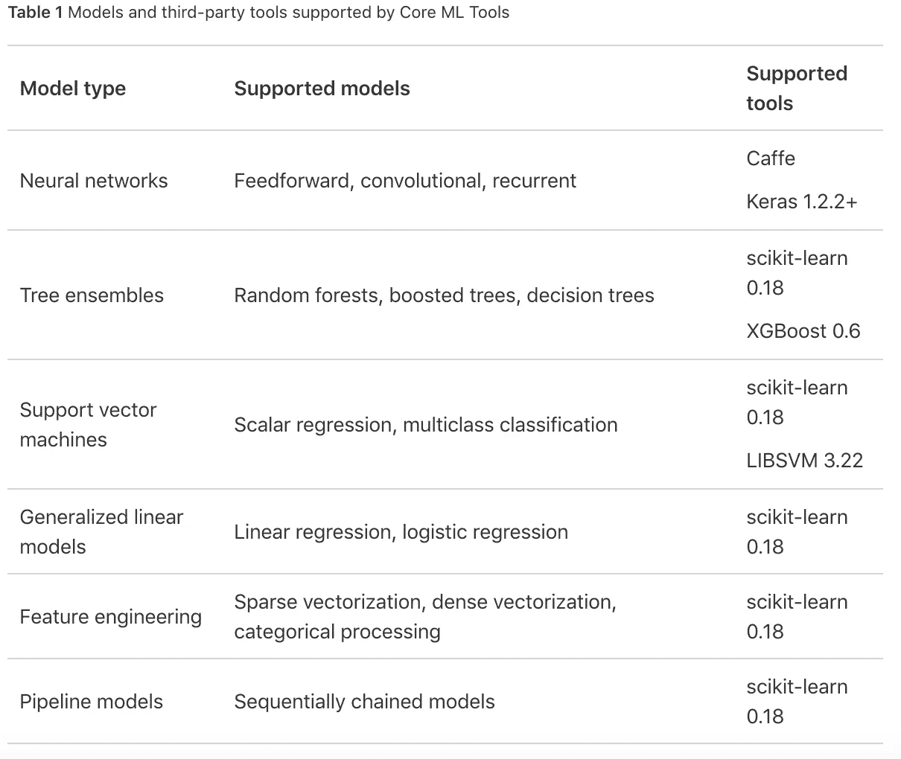
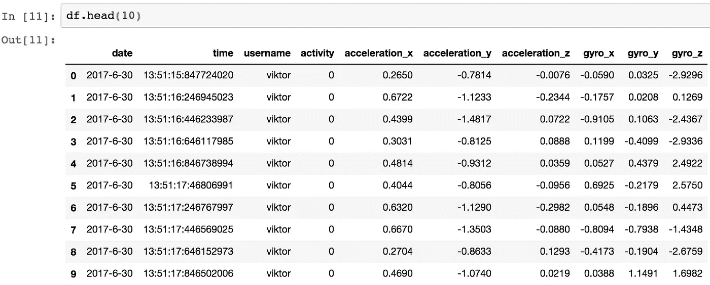
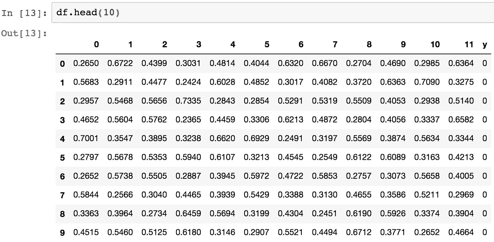

# 跑或走(第 3 部分):用于检测运动活动的准确度> 99%的神经网络分类器

> 原文：<https://towardsdatascience.com/run-or-walk-part-3-99-accuracy-neural-network-classifier-for-detecting-motion-activity-675e16af4a7d?source=collection_archive---------3----------------------->

*阅读前几部分:* [*——跑还是走(第一部分):用机器学习和 Core ML 检测运动数据活动*](https://medium.com/towards-data-science/run-or-walk-detecting-user-activity-with-machine-learning-and-core-ml-part-1-9658c0dcdd90) [*——跑还是走(第二部分):以正确的方式收集设备运动数据*](https://medium.com/towards-data-science/run-or-walk-part-2-collecting-device-motion-data-the-right-way-58a277ff2087)

在[前一部分](https://medium.com/towards-data-science/run-or-walk-part-2-collecting-device-motion-data-the-right-way-58a277ff2087)中收集了大量的行走和跑步数据后，我准备进一步利用这些数据。我的目标是设计和训练一个机器学习模型，根据这些数据准确预测用户活动的类型。

# 框架和模型选择

思考这个任务选择什么机器学习框架，我参考了 Core ML 支持的框架列表。这极大地缩小了候选人的范围，因为只有少数候选人受到本地支持。

每个试图用机器学习解决问题的人都面临着多样性的挑战。可以使用的模型种类繁多。选择最合适的一个是至关重要的，因为通常你有时间和资源去评估其中的几个，而不是全部。

如今，围绕深度学习的宣传是巨大的，当你为你的项目考虑完美的模型时，你不能忽视它。嗯，可能我不需要一个真正深度的神经网络来解决这个问题——我想——但至少这将是朝着正确的方向迈出的一步。“浅层”人工神经网络也因其在解决多类分类问题中的效率而闻名。

考虑到 Core ML 中的前馈神经网络仅受 Keras 框架支持，我的选择很简单。这个框架是为快速实验而设计的，可以在 TensorFlow、CNTK 或 Theano 上使用，因此对我来说是一个完美的选择。我选择了 TensorFlow backend for Keras，因为我已经用它体验过了，并且很容易理解它的概念。

事先说一下我使用这种设置的经历，我可以确认它允许我快速试验，并使我专注于设计而不是模型的实现。

# 模型架构:输入层

在前馈神经网络中，一切都从输入层开始。这是一个休息时间，再次查看我的数据，以便我可以定义输入层中输入神经元的数量。

我的数据集的初始格式如下:

这是一个很好的时间点来思考如何在理论上有可能根据传感器数据预测运动活动的类型？基于单个样本来做是不可行的，但是考虑多个数据样本将使得检测模式成为可能。

一个普通人在走路或跑步时做一次自然的手腕运动需要多少时间？1 到 2 秒之间。考虑到这一点，训练数据是以大约 5Hz 的频率收集的，我只需要为每次学习迭代选择大约 10 个样本。这将给我一个 10 乘 6 的矩阵作为我的神经网络的输入

然而，这是不可接受的，因为前馈神经网络的输入层必须是列矩阵，而不是 *m* 乘 *n* 矩阵。这意味着在一次学习迭代中结合来自所有传感器的数据的想法是不可实现的，因此，我必须使用 6 个模型:2 个传感器*每个传感器 3 个轴。

当使用这些模型来预测运动活动类型时，我可以应用集成技术来评估它们的输出并生成单个预测。

这种方法要求我将初始数据集转换成 6 个独立的数据集，每个数据集代表一个加速度计或陀螺仪轴，包含 12 个传感器样本(约 2 秒。观察时间)。这个“神奇的数字”是从后面几个阶段的大量实验中得出的，我试图在模型的准确性和输入的数量之间找到一个平衡。

The format of one of the final datasets: rows represent continuous sensor measurements equivalent to ~2 sec. of observation. Column ‘y’ represents a label for each row.

# 模型架构:隐藏层

我决定从一个只包含一个隐藏层的神经网络开始，评估它的性能，如果需要的话，进一步增加额外的隐藏层。这种从基本模型开始，然后逐渐增加复杂性的方法保证了我在训练模型时不会出现难以识别的问题。

只有一个隐藏层导致了 92.5%的准确率，再增加一个隐藏层导致了 97.2%的准确率，而具有 3 个隐藏层的神经网络最终产生了 99.2%的准确率。添加 3 个以上的隐藏层对精确度没有影响或者降低了精确度。我在这里和所有进一步的实验中对测试数据进行了 10 重交叉验证，以得出准确的数字。

这是有争议的，是否这样的神经网络可以被认为是一个“深”的，但最重要的是我能够找到一个最佳的隐藏层数。

# 模型架构:其他超参数

我试图借助网格搜索来调整其他一些可用的超参数:隐藏层中神经元的数量及其激活函数。搜索过程表明，预测精度最高的网络在每个隐层有 15 个神经元，并校正线性单元激活函数。

我选择分类交叉熵损失函数是因为它能够独立于定义的学习速率提高网络的学习速度。我选择 ADAM optimizer 作为我的模型，是因为它的计算效率很高，并且能够为我试图解决的问题提供足够的结果。

# 数据量明显减少，但精确度几乎相同

当我准备好我的神经网络的架构时，我想证明关于网络需要精确执行的数据量的下限在哪里的假设。

关于数据量，我理解的是预测单个例子时，馈入网络的数据样本数。还记得吗，我提到过 12 这个数字(~2 秒的观察)？我通过比较使用较低和较高数据量时网络的准确性选择了这个数字:

*   17 个样本:99.32%
*   12 个样本:99.23%
*   6 个样本:97.93%

即使当 12 个样本选项的精度最低低于 17 个样本时，它也会大大减少网络消耗的输入数据量，从而降低训练网络所需的计算能力。令人印象深刻的是，每次预测 6 个样本(约 1 秒。观察)允许神经网络也相当准确地执行！

我决定坚持使用 12 个样本，因为它为模型提供了更多的数据以更好地进行归纳，此外，允许我从每个传感器/轴的总共 37777 个数据样本中获得 7387 个样本的数据集。

# 证明另一个假设

## 不同的手腕，没有训练数据

如果我只在一只手腕上收集我的所有训练数据，在上面训练我的模型，然后询问是否从另一只手腕预测活动类型，会怎么样？一个有趣的问题，我没花多少时间就找到了答案。

事实证明，神经网络只能在 91%的情况下预测正确的活动。嗯，这不是一个惊人的结果，但它仍然显示了一个相对简单的神经网络可以很好地检测数据中的模式，而不管它的符号！

## 陀螺仪 Y 轴的可预测性低

专门根据陀螺仪 Y 轴数据训练的模型“只有”85%的预测精度。这证明了当人们试图预测行走或跑步时，该轴对整体准确性没有太大贡献:人的手腕不会围绕该轴以强烈的模式做出反应。或者至少我移动我的手，这样陀螺仪的 Y 轴就没有机会被用于可靠的预测。

# 其他人的结果

我从 Kaggle 上的贡献者那里获得了有趣的见解，他们[使用了我的全部数据集](https://www.kaggle.com/vmalyi/run-or-walk/kernels):无论他们使用什么模型或方法，准确性总是最高的！

在深入研究了他们的实现后，我意识到他们都是在训练时将数据集“按原样”输入到他们的模型中——一个样本接一个样本，而没有理解时间序列数据中的单个样本在检测整个序列的模式方面毫无价值。

本应使用的数据集可能看起来类似于[这个](https://www.kaggle.com/vmalyi/run-or-walk-reduced)。

这是一个很好的提醒，不要在没有花时间去理解问题的基础之前就去解决它。

# 下一步是什么？

如果你对这篇文章中描述的模型在现实世界中的样子感兴趣，你可以在 Kaggle 上找到它[。](https://www.kaggle.com/vmalyi/run-or-walk-nn-classifier-with-99-accuracy)

请继续关注本系列的最后一篇文章，在这篇文章中，我将展示神经网络是如何在 Core ML 的帮助下导入并用于 iOS 应用程序的。

阅读下一部分:

*   [*跑还是走(第四部分):在 iOS 中使用 Keras 神经网络分类器，核心 ML*](/run-or-walk-part-4-using-keras-neural-network-classifier-in-ios-with-core-ml-a29723ab3235)