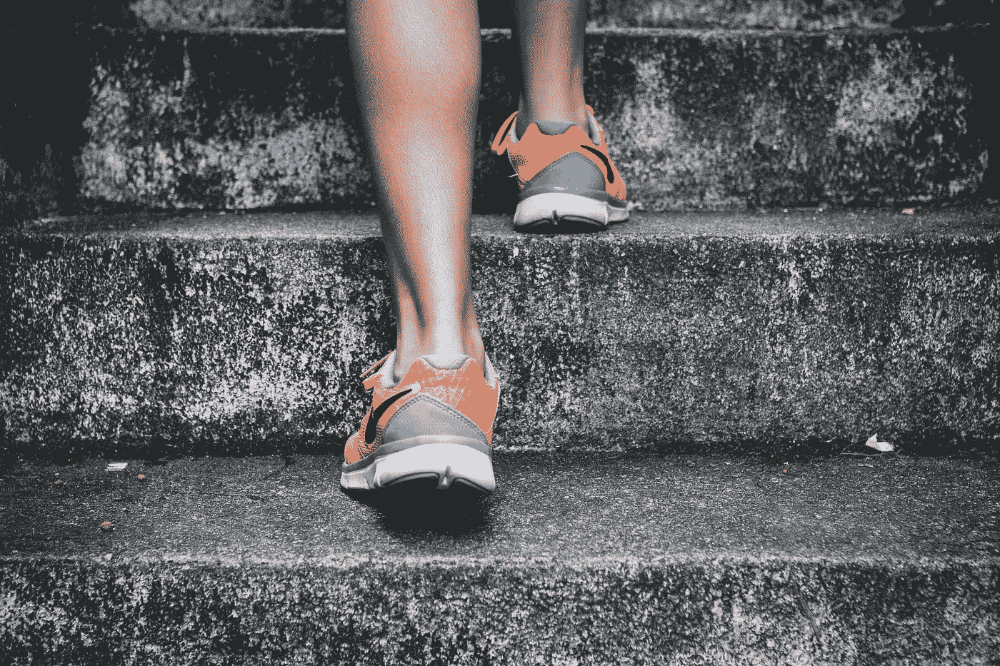
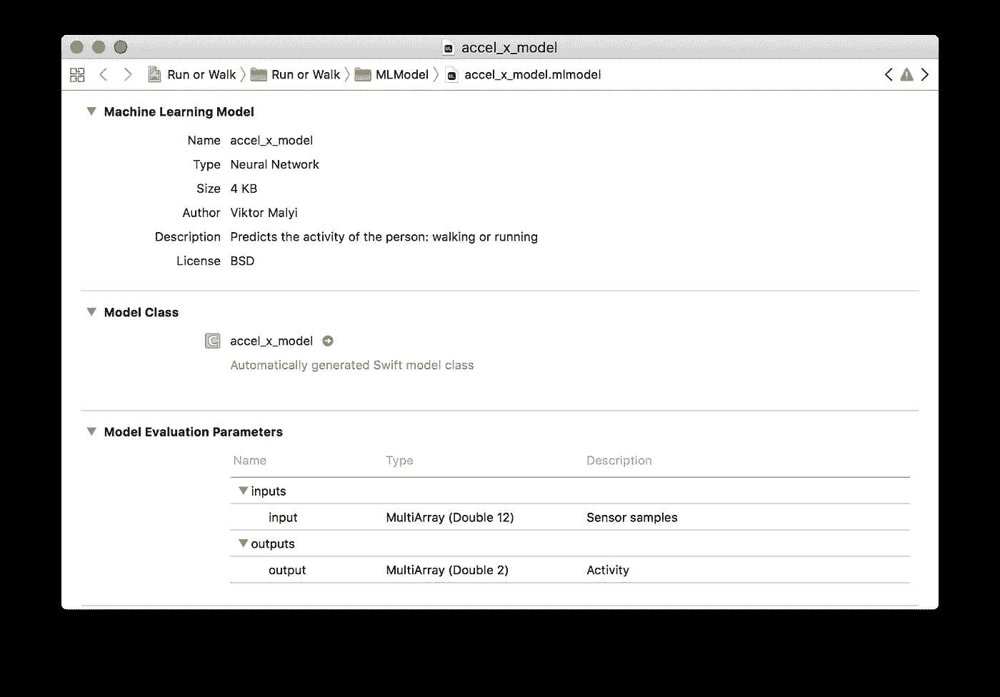
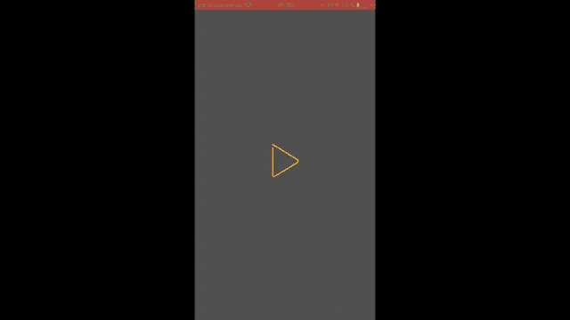

# 跑还是走(第 4 部分):在 iOS 中使用 Keras 神经网络分类器与核心 ML

> 原文：<https://towardsdatascience.com/run-or-walk-part-4-using-keras-neural-network-classifier-in-ios-with-core-ml-a29723ab3235?source=collection_archive---------1----------------------->

*阅读前几部分:* [*-跑或走(第一部分):用机器学习和核心 ML 检测运动数据活动*](https://medium.com/towards-data-science/run-or-walk-detecting-user-activity-with-machine-learning-and-core-ml-part-1-9658c0dcdd90) [*-跑或走(第二部分):以正确的方式收集设备运动数据*](https://medium.com/towards-data-science/run-or-walk-part-2-collecting-device-motion-data-the-right-way-58a277ff2087)[*-跑或走(第三部分):> 99%准确率的神经网络分类器用于检测运动活动*](/run-or-walk-part-3-99-accuracy-neural-network-classifier-for-detecting-motion-activity-675e16af4a7d)

终于，我走到了这段旅程的最后一步。现在是时候利用我们在第三部分[中训练的模型在 iOS 应用中预测用户的运动活动了。](/run-or-walk-part-3-99-accuracy-neural-network-classifier-for-detecting-motion-activity-675e16af4a7d)

# 保存 Keras 模型

首先，我必须将训练好的模型序列化到 JSON 中，并保存它的权重。

Keras 提供了一个简单的 API 来实现这一点:

将模型的权重保存到磁盘上的*.h5 文件的简单方法相同:

# 将 Keras 模型转换为核心 ML

现在是时候将我保存的模型转换成 Core ML 格式了。由于我有一个 Keras 模型神经网络，我可以使用苹果的[核心 ML 工具](https://pypi.python.org/pypi/coremltools) Python 包，它为我完成了转换模型的工作:

# 在 iOS 应用程序中使用转换后的核心 ML 模型

将核心 ML 模型导入到我的 iOS 应用程序就像拖放到 Xcode 项目一样简单。我刚才用于设置模型元数据、输入和输出描述的值现在可以在 Xcode 中的核心 ML 模型窗口中看到。

Core ML model window in Xcode

由于 Xcode 已经为导入的 *accel_x_model* Core ML 模型自动生成了一个自定义 API，我已经准备好为模型提供传感器数据并读取其预测。

# 终点线

看到检测运动数据活动的想法如何演变成这样一个有趣的项目真的很酷，这不仅需要我学习关于机器学习及其在 iOS 中的 Core ML 应用的新知识，还需要我在为模型收集数据时有机会减肥。

iOS app detects motion activity in real time

像苹果的 Core ML 这样一个在移动应用中应用机器学习的简单方法，会有什么新的可能性，这真是令人惊讶！

关注我，了解我在机器学习和 iOS 方面的最新实验！