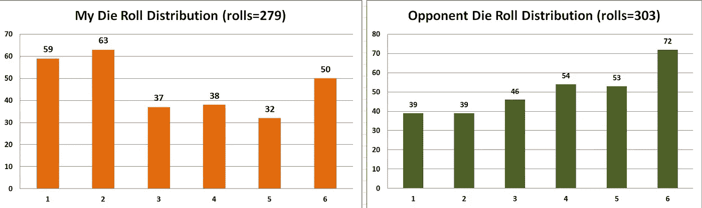
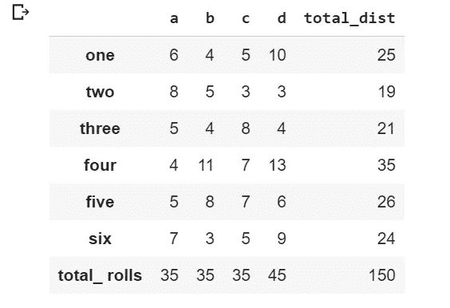
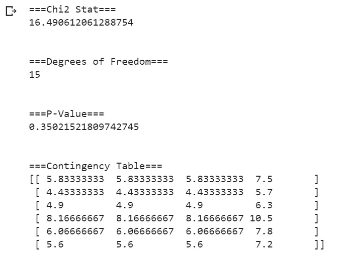
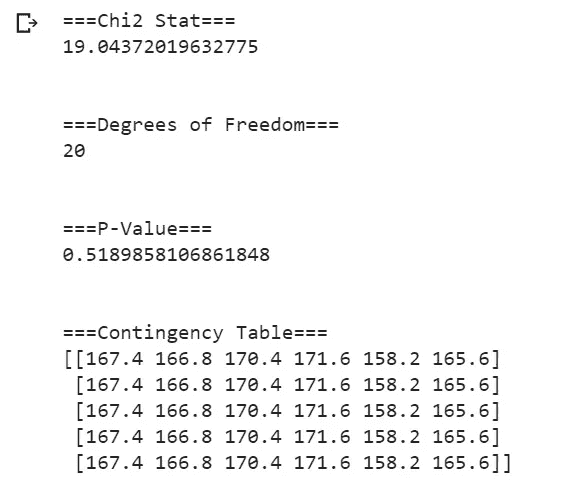
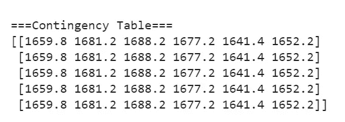
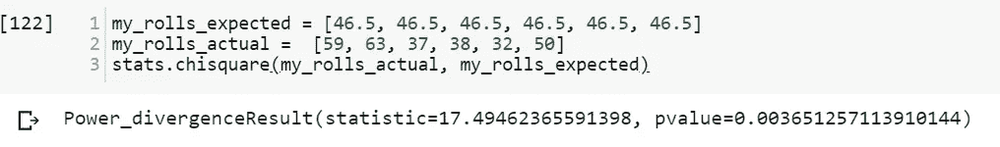
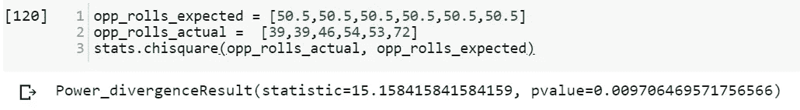

# 使用 Python 中的掷骰子数据运行卡方测试

> 原文：<https://towardsdatascience.com/running-chi-square-tests-in-python-with-die-roll-data-b9903817c51b?source=collection_archive---------2----------------------->

在本世纪初的某个时候，我赶上了棋盘游戏热潮。大约每个月，我都会在 [BoardGameGeek](https://boardgamegeek.com) 、【BGG】、[评分最高的游戏](https://boardgamegeek.com/browse/boardgame?)中搜寻新的桌游来购买。BGG 网站上有成千上万的棋盘游戏，很多都有评论和批评。我最喜欢的策略游戏不是一个不寻常的选择。相反，它目前是 BGG 有史以来排名第四的游戏，之前排名第一。那个游戏是[暮光之城之战](https://boardgamegeek.com/boardgame/12333/twilight-struggle)。


《暮光之城之战》是一款以“冷战”为主题的卡牌驱动 2 人策略游戏。从某些方面来说，这感觉像是国际象棋和扑克的结合。一方扮演美国，一方扮演苏联。这个游戏和真正的冷战有着相同的偏执感，因为你必须不断地猜测你的对手可能有哪些牌，以及他们如何用这些牌来伤害你。


虽然技能在 TS 中非常重要，但运气在结果中也起着重要作用。该游戏包括政变、重组、战争卡和太空竞赛，所有这些都由掷骰子决定。


The Soviets never foresaw The Giant Cat Invasion from the Middle East

几年前，在一次成功的众筹活动之后，一个在线版本的《暮光之城之战》在 PC 和 MAC 上发布了(Steam 上有[)。玩了几百个在线游戏后，我决定尝试创建一个运气测量系统来评估我自己的结果。在这个过程中，我开始收集“政变”和“战争卡”的掷骰结果。这就是事情变得有趣的地方:我的掷骰子样本有令人惊讶的分布。](https://store.steampowered.com/app/406290/Twilight_Struggle/)



279 卷之后，我的平均卷数是 3.254。303 滚之后，我对手的平均分是 3.855。我想知道这个分布有多不寻常，所以我用 Python 进行了一些卡方测试。

**了解卡方检验**

然而，在我们看这些测试之前，我将更详细地解释卡方。

卡方统计检验用于确定预期分布和实际分布之间是否存在显著差异。它通常用于教育程度、肤色或性别等分类数据。

掷骰子是适合卡方检验的数据的一个很好的例子。如果我们掷一个标准的六面骰子一千次，我们知道每个数字出现的概率大约是 1/6(即 16.66667%)。卡方检验有助于确定骰子是否是“公平”的，或者掷骰发生器(如软件中使用的那些)是否产生“随机”结果。

然而，在“预期分布”已知的情况下，掷骰子就是一个变量的例子。情况并非总是如此。有时候，我们的‘预期分布’是通过数据估算出来的。

假设我们不知道掷骰子的预期频率。我们必须通过数据样本来估计预期的频率。让我们做几个样本来确定每次滚动的频率。我决定手动做 4 个骰子滚动的样本(即实际骰子)，前 3 个样本各 35 个，最后一个样本 45 个。这些样本比我们想要的要小，但是我想给我们一些真实的数据。这是我的面包卷分布，四个样品用字母“a”、“b”、“c”和“d”表示。



根据我们对概率的了解，对于 150 次掷骰子，我们应该预计每个数字出现大约 25 次(即 150 次的 1/6)。我们可以看到，1、5 和 6 都出现了这种情况，但 4 出现的次数比预期的多，2 和 3 出现的次数有点少。这可能是由于我们的样本量相对较小(见"[大数定律](https://en.wikipedia.org/wiki/Law_of_large_numbers)")，但我们会处理它。

让我们对这个数据集的列联表中的变量进行独立的[卡方检验](https://docs.scipy.org/doc/scipy-0.15.1/reference/generated/scipy.stats.chi2_contingency.html)。首先我要输入数据。

```
import numpy as npa1 = [6, 4, 5, 10]
a2 = [8, 5, 3, 3]
a3 = [5, 4, 8, 4]
a4 = [4, 11, 7, 13]
a5 = [5, 8, 7, 6]
a6 = [7, 3, 5, 9]dice = np.array([a1, a2, a3, a4, a5, a6])
```

然后，我使用 SciPy Stats 库运行测试

```
from scipy import stats

stats.chi2_contingency(dice)
```

不幸的是，尽管它是一个非常有用的工具，但 SciPy 并没有以最漂亮的方式提供结果。


我会解释这一切意味着什么。第一个值(16.49)是[卡方统计](http://math.hws.edu/javamath/ryan/ChiSquare.html)。跳到输出中的第三个数字；这就是“自由度”这可以通过将行数减 1，然后将该结果乘以列数减 1 来计算。

在这种情况下:

行数= 6[模具辊 1–6]

列= 4[样本]

所以我们用(6–1)乘以(4–1)得到 15 个自由度。

利用卡方统计和自由度，我们可以找到 p 值。p 值是我们用来确定显著性(或本例中的独立性)的值。根据测试的不同，我们通常会在 0.05 或 0.01 处寻找一个阈值。如果我们得到一个低于阈值的 p 值，我们的测试是有意义的(即我们拒绝零假设)。

出于我们的目的，我们将使用 0.01 作为阈值。在这个特殊的例子中，p 值(输出中的第二个数字:0.3502)远为 0.01，因此我们没有达到统计显著性的阈值。

既然我已经解释了每件事的含义，我们可以在 SciPy 中创建更易读的输出代码。

```
chi2_stat, p_val, dof, ex = stats.chi2_contingency(dice2)print("===Chi2 Stat===")
print(chi2_stat)
print("\n")print("===Degrees of Freedom===")
print(dof)
print("\n")print("===P-Value===")
print(p_val)
print("\n")print("===Contingency Table===")
print(ex)
```

这将产生更加一致的输出:



最后，输出末尾的数组是列联表，其中包含基于所有样本的期望值。注意，在这种情况下，我们的列联表产生的值，在某些情况下，与我们所知道的掷骰子的期望值相差甚远。这是因为我们使用的样本太少，无法准确测量总体。

**运行大样本以获得预期的人口分布**

我们可以运行一个更大的样本，看看这种方法如何更好地工作。由于我不愿意手动掷骰子数千次，我们将使用 Python 来做这件事。我们需要 [np.random.randint](https://docs.scipy.org/doc/numpy-1.14.0/reference/generated/numpy.random.randint.html) 和 [np.unique](https://docs.scipy.org/doc/numpy-1.14.0/reference/generated/numpy.unique.html) 。我做了 5 个样本，每个样本 1000 个骰子点数。

```
r1 = np.random.randint(1,7,1000)
r2 = np.random.randint(1,7,1000)
r3 = np.random.randint(1,7,1000)
r4 = np.random.randint(1,7,1000)
r5 = np.random.randint(1,7,1000)
```

然后通过 np.unique 保存结果。

```
unique, counts1 = np.unique(r1, return_counts=True)
unique, counts2 = np.unique(r2, return_counts=True)
unique, counts3 = np.unique(r3, return_counts=True)
unique, counts4 = np.unique(r4, return_counts=True)
unique, counts5 = np.unique(r5, return_counts=True)
```

现在，我们结合我们的数组来运行 stats.chi2_contingency:

```
dice = np.array([counts1, counts2, counts3, counts4, counts5])
```

让我们进行测试。

```
chi2_stat, p_val, dof, ex = stats.chi2_contingency(dice)
```

这是结果。



注意我们的列联表现在产生了一个更均匀的期望分布。它仍然稍有偏差(在 1，000 个掷骰子的样本中，我们预计每个数字会出现大约 166.7 次)，但我们已经非常接近这个分布了。

我决定再运行一次测试，这次使用 10，000 个骰子点数的 5 个样本。



我们可以看到我们的分布更加接近已知的总体分布(每个数字的概率为 16.667%，即样本中 10，000 卷中的 1，666.7)。有趣的是，由于我们知道真实的期望分布，我们可以看到样本如何让我们估计总体分布。

**暮光之城奋斗骰子卡方测试**

现在，让我们进入我们的在线暮光之城奋斗骰子数据。


对于我们的实际测试，我们不需要列联表。我们知道期望分布。对于 6 面骰子，每个数字预计出现的时间约为 1/6。既然我们知道预期分布，我们可以使用 [scipy.stats.chisquare](https://docs.scipy.org/doc/scipy/reference/generated/scipy.stats.chisquare.html) 而不是 chi2_contingency。

对于我的暮光之城奋斗骰子数据，我有两个样本:我自己的掷骰子和我对手的掷骰子。我们的零假设是骰子是随机分布的(因此是均匀分布的)。

我的数据是，我滚了 279 次。我们除以 6，得到期望的分布(每个数字 46.5)。运行 scipy.stats.chisquare 时，要注意确保参数的顺序正确；否则，你会得到不准确的结果。第一个参数(f_obs)是“实际结果”，而第二个参数(f_exp)是“预期结果”。

```
my_rolls_expected = [46.5, 46.5, 46.5, 46.5, 46.5, 46.5]
my_rolls_actual =  [59, 63, 37, 38, 32, 50]stats.chisquare(my_rolls_actual, my_rolls_expected)
```

运行这个测试，我们得出 p 值为 0.0037。



这低于 0.01，具有统计学意义。这意味着如果骰子真的是随机的，我们只有 0.4%的机会看到这个结果。

接下来让我们看看我的对手掷骰子。我的对手掷出了 303 次。我们再一次除以 6，得到 50.5 的期望分布。我们与实际分布进行比较。

```
opp_rolls_expected = [50.5,50.5,50.5,50.5,50.5,50.5]
opp_rolls_actual =  [39,39,46,54,53,72]stats.chisquare(opp_rolls_actual, opp_rolls_expected)
```

我们发现了类似的结果。



我们的 p 值是 0.0097，也低于 0.01，这表明如果掷骰子是真正随机的，我们观察到这种分布的概率略低于 1%。

虽然我已经有趣地注意到了掷骰子中的奇怪模式(我之前已经放弃了“观察偏差”)，但我实际上对这些结果有点惊讶。对于我们 2 个随机样本中的我的掷骰子和对手的掷骰子，我们可以拒绝骰子是真正随机的无效假设。

这很有趣，我决定继续收集数据，看看我是否能在未来复制这些结果。不幸的是，我可能还需要几个月的时间来构建一些更有意义的数据样本。

**结论**

卡方是比较涉及分类数据的结果的一个很好的工具。我们可以看到样本是如何偏离预期分布的。Python 的 SciPy 库为运行卡方测试提供了很好的工具。

**更多资源**

为了更好地了解卡方，我推荐可汗学院的[优秀系列视频](https://www.khanacademy.org/math/statistics-probability/inference-categorical-data-chi-square-tests)。