# 在 15 分钟内在谷歌云平台上运行 Jupyter 笔记本

> 原文：<https://towardsdatascience.com/running-jupyter-notebook-in-google-cloud-platform-in-15-min-61e16da34d52?source=collection_archive---------0----------------------->


最近，当我使用卷积神经网络做计算机视觉的研究项目时，我发现我的 8GB RAM 笔记本电脑毫无用处。我花了一个小时才从一个时代学会。因此，我没有花 1500 美元买一台新的基于 GPU 的笔记本电脑，而是在谷歌云上免费完成了这项工作。(谷歌云提供 300 美元信用，我有 3 个 gmail 账户和 3 张信用卡:D)

所以，让我们不要再浪费时间，直接在 GCP 运行 jupyter 笔记本。

## 第一步:在谷歌云中创建一个 300 美元的免费账户

在这一步，你必须输入你的支付信息并验证你的账户。这是最简单的一步。如果这一步你失败了，合上你的笔记本电脑，想想你的人生将走向何方。

## 步骤 2:创建新项目

点击下图中的三个点，然后点击+号创建一个新项目。

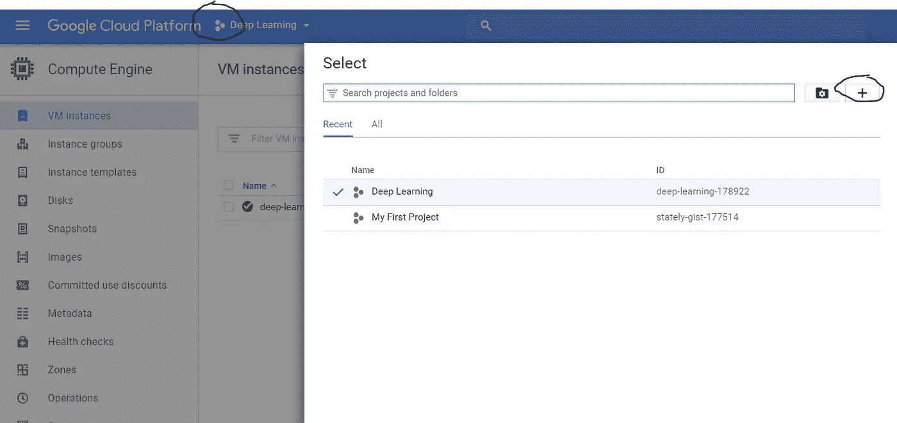

## 步骤 3:创建一个虚拟机实例

单击左上角的三行，然后在计算选项中，单击“计算引擎”

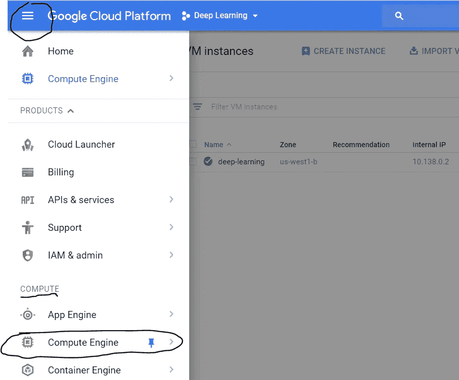

现在，单击“创建新实例”。命名您的实例，选择 zone 为“us-west1-b”。选择您的“机器类型”。(我选的是 8v CPUs)。

选择您的启动磁盘为“Ubuntu 16.04 LTS”。在防火墙选项下勾选“http”和“https”(非常重要)。然后，选择磁盘选项卡，取消选中“删除实例时删除引导磁盘”。

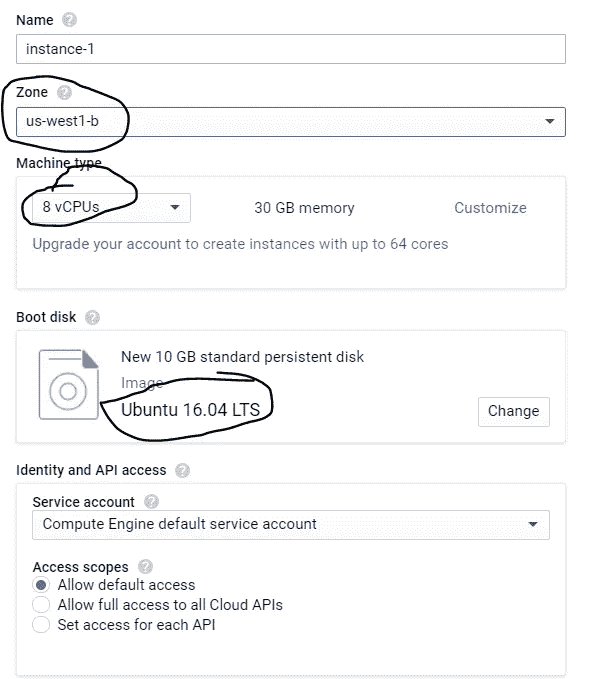

如果您点击“自定义”，您将能够找到使用 GPU 的选项。您可以在 2 个 NVIDIA GPUs 之间进行选择。

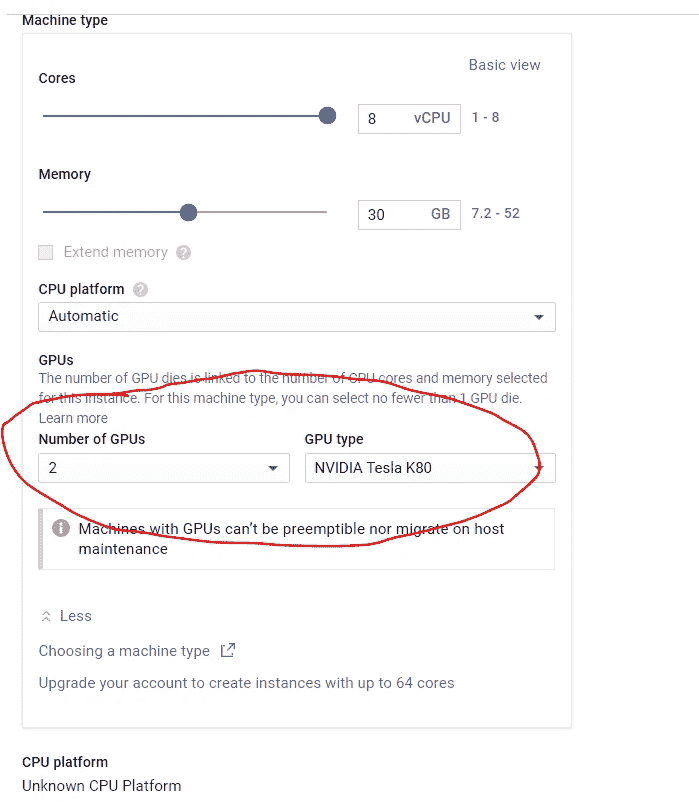

一些防火墙设置:-

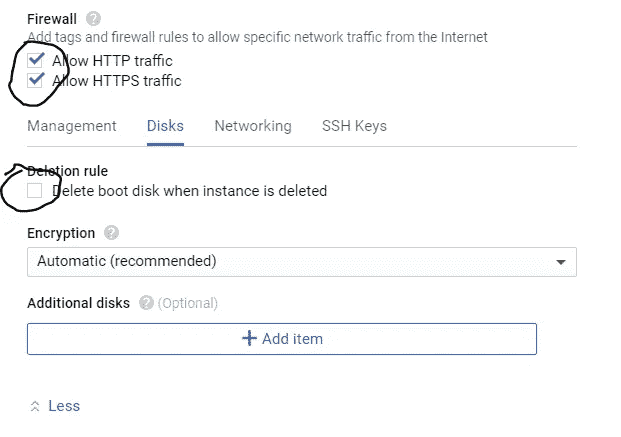

现在点击“创建”,您的实例就准备好了！

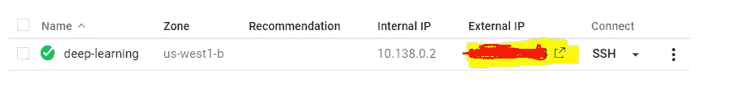

您的新 VM 实例应该看起来像这样。记下外部 IP。

**重要提示:完成后，不要忘记通过点击上图中的三个点并选择停止来停止 GPU 实例。否则 GCP 会继续按小时收费。**

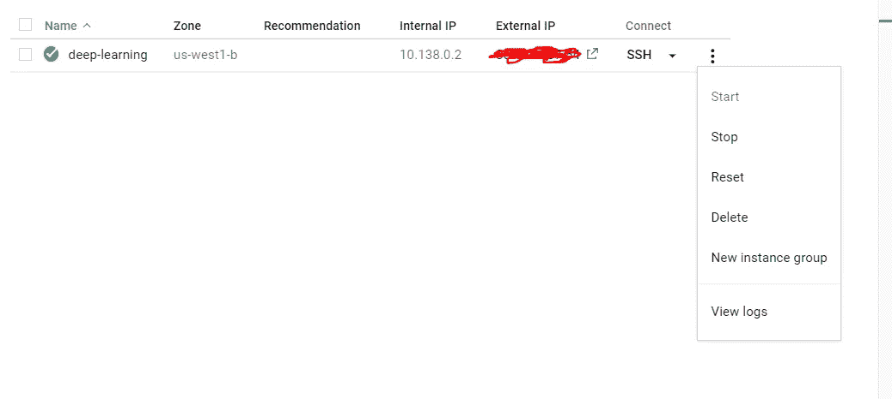

## 步骤 4:将外部 IP 地址设为静态

默认情况下，外部 IP 地址是动态的，我们需要使它成为静态的，以使我们的生活更容易。单击左上方的三条水平线，然后在“网络”下，单击“VPC 网络”,然后单击“外部 IP 地址”。

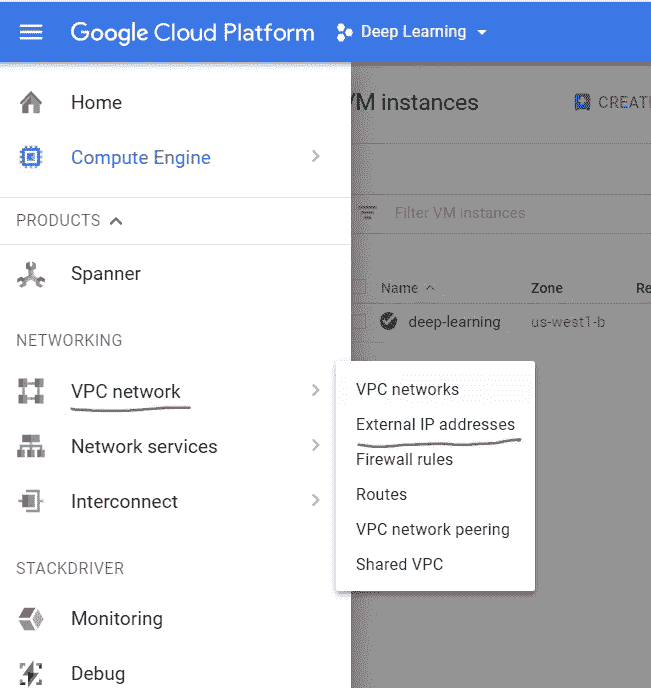

将类型从短暂更改为静态。

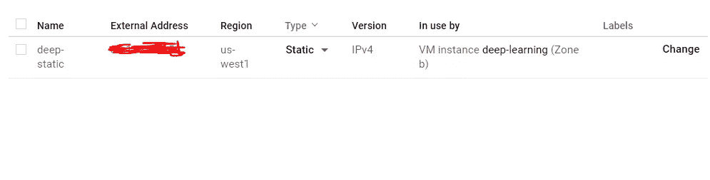

## 步骤 5:更改防火墙设置

现在，点击“网络”下的“防火墙规则”设置。


点击“创建防火墙规则”并参考下图:

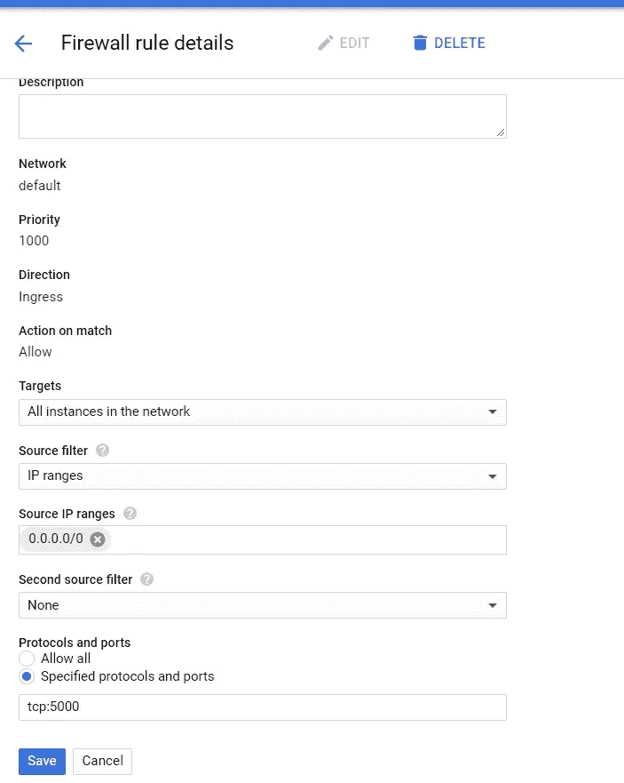

在协议和端口下，您可以选择任何端口。我选择了 tcp:5000 作为我的端口号。现在点击保存按钮。

## 步骤 6:启动您的虚拟机实例

现在启动您的虚拟机实例。当您看到绿色勾号时，单击 SSH。这将打开一个命令窗口，现在你在虚拟机内。

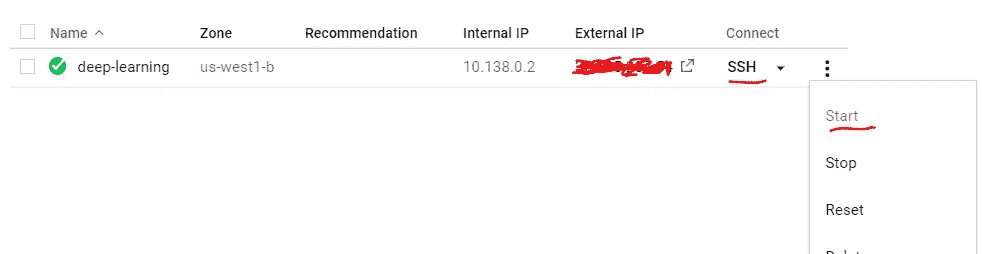

## 第七步:安装 Jupyter 笔记本和其他软件包

在 SSH 终端中，输入:

```
wget [http://repo.continuum.io/archive/Anaconda3-4.0.0-Linux-x86_64.sh](http://repo.continuum.io/archive/Anaconda3-4.0.0-Linux-x86_64.sh)
bash Anaconda3-4.0.0-Linux-x86_64.sh
```

并按照屏幕上的说明进行操作。默认设置通常很好，但是对于最后一个关于将安装位置添加到 PATH 的问题，回答是:

```
Do you wish the installer to prepend the 
Anaconda3 install location to PATH 
in your /home/haroldsoh/.bashrc ? 
[yes|no][no] >>> yes
```

要立即使用 Anaconda，请使用您的 bashrc:

```
source ~/.bashrc
```

现在，安装其他软件:

```
pip install tensorflowpip install keras
```

## 步骤 8:设置虚拟机服务器

打开到您的虚拟机的 SSH 会话。检查您是否有 Jupyter 配置文件:

```
ls ~/.jupyter/jupyter_notebook_config.py
```

如果不存在，请创建一个:

```
jupyter notebook --generate-config
```

我们将在您的 Jupyter 配置文件中添加几行内容；该文件是纯文本的，所以您可以通过您喜欢的编辑器(例如，vim、emacs)来完成。确保将端口号替换为您在步骤 5 中允许防火墙访问的端口号。

```
c = get_config()
c.NotebookApp.ip = '*'
c.NotebookApp.open_browser = False
c.NotebookApp.port = <Port Number>
```

它应该是这样的:

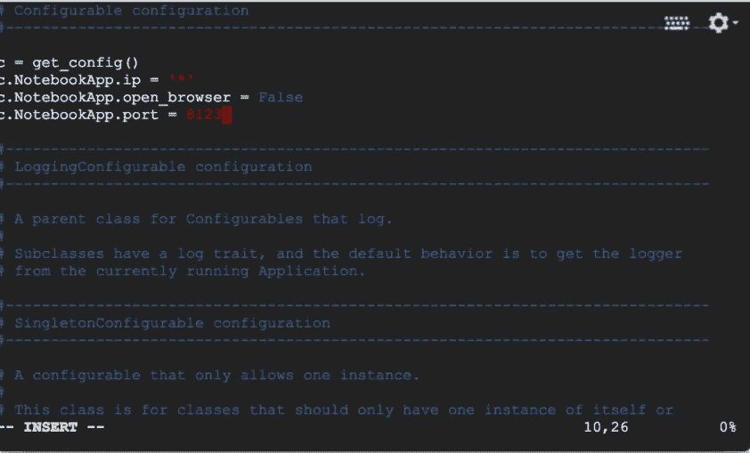

## 步骤 9:启动 Jupyter 笔记本

要运行 jupyter 笔记本，只需在您所在的 ssh 窗口中键入以下命令:

```
jupyter-notebook --no-browser --port=<PORT-NUMBER>
```

一旦运行该命令，它应该会显示如下内容:

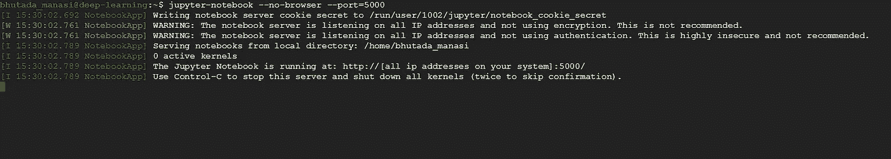

现在，要启动您的 jupyter 笔记本，只需在浏览器中键入以下内容:

```
http://<External Static IP Address>:<Port Number>
```

其中，外部 ip 地址是我们设置为静态的 ip 地址，端口号是我们允许防火墙访问的地址。

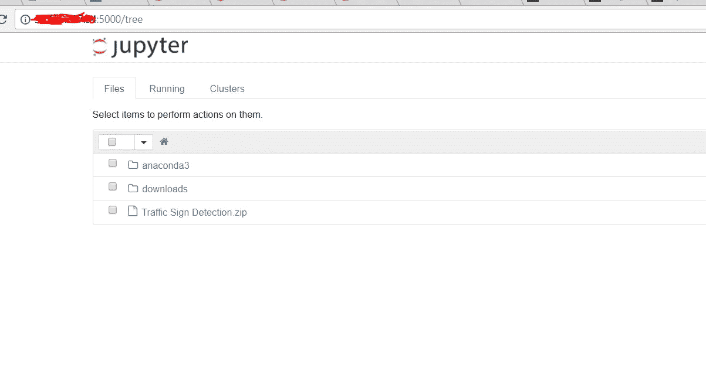

恭喜你！您成功地在 GCP 上安装了 jupyter 笔记本！

我们连线:[https://www.linkedin.com/in/aankul](https://www.linkedin.com/in/aankul)

在媒体上跟随我:【https://medium.com/@aankul.a 

## 注意——看在上帝的份上！不要忘记停止虚拟机实例！！

> **编辑:
> 所有面临'**[**ERR _ CONNECTION _ TIMED _ OUT**](https://medium.com/@krishmahajan/at-the-last-step-after-putting-the-desired-static-ip-and-port-number-i-am-not-able-to-connect-4e31826a6012?source=responses---------6----------------)**'错误的人。请在评论中尝试** [庸碌口才](https://medium.com/@basteloq?source=responses---------8----------------)的解决方案。