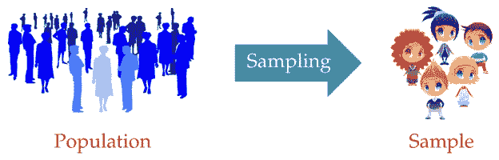
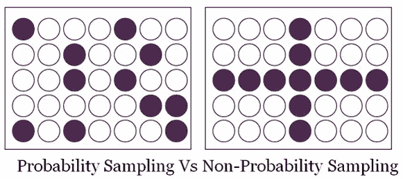
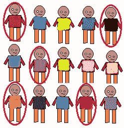
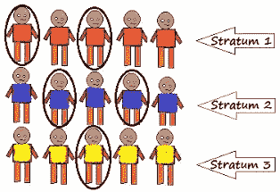
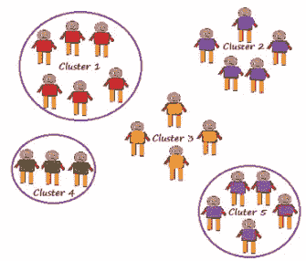
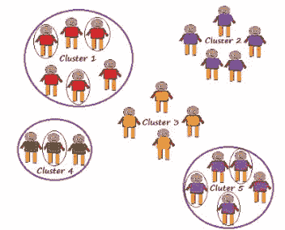
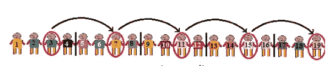
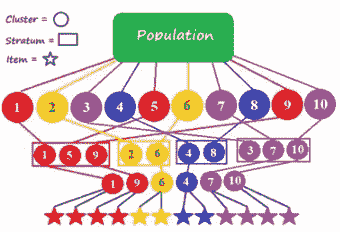
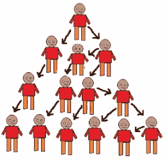

# 抽样技术

> 原文：<https://towardsdatascience.com/sampling-techniques-a4e34111d808?source=collection_archive---------0----------------------->

**采样**对研究有很大帮助。这是决定研究/调查结果准确性的最重要因素之一。如果你的样本出了什么问题，那么它会直接反映在最终的结果中。有很多技术可以帮助我们根据需要和情况收集样本。这篇博客文章试图解释其中的一些技巧。

首先，让我们看一下一些基本术语

> 人口
> 
> 样品
> 
> 抽样

人口是具有某种或其他共同特征的要素的集合。人口中要素的数量就是人口的规模。

样本是总体的子集。选择样本的过程称为抽样。样本中的元素数就是样本大小。

Sampling

有许多抽样技术，分为以下两类

*   概率抽样
*   非概率抽样

两者的区别在于样本选择是否基于随机化。在随机化的情况下，每个元素都有同等的机会被选取并成为研究样本的一部分。

**概率抽样**

这种抽样技术使用随机化来确保总体中的每个元素都有平等的机会成为所选样本的一部分。也就是所谓的随机抽样。

> 简单随机抽样
> 
> 分层抽样
> 
> 系统抽样
> 
> 巢式抽样法
> 
> 多阶段抽样

**简单随机抽样:**每个元素被选为零件样本的机会相等。当我们没有任何关于目标人群的先验信息时，就会用到它。

**例如:**随机抽取 20 名学生组成 50 人的班级。每个学生都有平等的机会被选中。这里选择的概率是 1/50

Single Random Sampling

**分层抽样**

该技术基于相似性将群体的元素划分为小的子组(层)，使得该组内的元素在所形成的其他子组中是均匀和不均匀的。然后从这些层中的每一层随机选择元素。我们需要有关于人口的先验信息来创建子群体。

Stratified Sampling

**整群抽样**

我们的整个人口被分为集群或部分，然后集群是随机选择的。集群的所有元素都用于采样。使用诸如年龄、性别、位置等细节来识别集群。

可以通过以下方式进行集群采样:

**单阶段整群抽样**

整群随机抽样。

Single Stage Cluster Sampling

**两阶段整群抽样**

这里，我们首先随机选择集群，然后从这些选择的集群中随机选择用于采样的元素

Two Stage Cluster Sampling

**系统聚类**

这里，除了第一个元素之外，元素的选择是系统的，而不是随机的。样本中的元素是在群体的规则间隔中选择的。首先将所有元素按顺序放在一起，每个元素都有同等的机会被选中。

对于大小为 N 的样本，我们将大小为 N 的总体分成 k 个元素的子组。

我们从 k 个元素的第一子组中随机选择第一个元素。

要选择样品的其他元素，请执行以下操作:

我们知道每组元素的数量是 k，即 N/n

所以如果我们的第一个元素是 n1，那么

第二个元素是 n1+k，即 n2

第三个元素 n2+k，即 n3，依此类推..

以 N=20 为例，n=5

每个子组中的元素数量是 N/n，即 20/5 =4= k

现在，从第一个子组中随机选择第一个元素。

如果我们选择 n1= 3

n2 = n1+k = 3+4 = 7

n3 = n2+k = 7+4 = 11

Systematic Clustering

**多阶段采样**

它是上述一种或多种方法的组合。

将群体划分为多个聚类，然后基于相似性将这些聚类进一步划分和分组为各种子组(层)。可以从每个层中随机选择一个或多个集群。这个过程一直持续到集群不能再分为止。例如，国家可以分为州、城市、城市和农村，所有具有相似特征的地区可以合并在一起形成一个阶层。

Multi-Stage Sampling

**非概率抽样**

它不依赖于随机化。这项技术更依赖于研究人员为样品选择元素的能力。抽样的结果可能会有偏差，使得所有的人口元素很难平等地成为样本的一部分。这种类型的抽样也称为非随机抽样。

> 方便抽样
> 
> 立意抽样
> 
> 定额抽样
> 
> 转诊/滚雪球抽样

**方便取样**

在这里，样本是根据可用性选择的。这种方法用于样品稀缺且价格昂贵的情况。因此，基于方便选择样本。

**例如**:在调查研究的初始阶段，研究人员更喜欢这种方式，因为这种方式可以快速轻松地提供结果。

**目的性抽样**

这是基于学习的意图或目的。只有那些元素会从最适合我们研究目的的群体中选出。

**例如:**如果我们想了解对攻读硕士学位感兴趣的人的思维过程，那么选择标准应该是“你对……感兴趣吗..?"

所有回答“否”的人将被排除在我们的样本之外。

**配额抽样**

这种类型的采样取决于一些预设的标准。它从总体中选择有代表性的样本。样本中特征/性状的比例应与总体相同。选择元素，直到获得特定类型数据的确切比例或收集到不同类别的足够数据。

例如:如果我们的人口中女性占 45%，男性占 55%，那么我们的样本应该反映相同的男女比例。

**转诊/滚雪球抽样**

这种技术用于人口完全未知和稀少的情况。

因此，我们将从我们为总体选择的第一个元素中获得帮助，并请他推荐符合所需样本描述的其他元素。

所以这种推荐技术继续下去，像滚雪球一样增加人口数量。

Referral /Snowball Sampling

**例如**:它用于高度敏感的话题，如艾滋病，人们不会公开讨论和参与调查来分享有关艾滋病的信息。

并非所有的受害者都会回答问题，因此研究人员可以联系他们认识的人或志愿者，与受害者取得联系并收集信息

在我们无法接触到足够的具有我们所寻求的特征的人的情况下提供帮助。从找人学习开始。

希望现在你们都对取样和它的技术有了很好的了解。

感谢阅读！