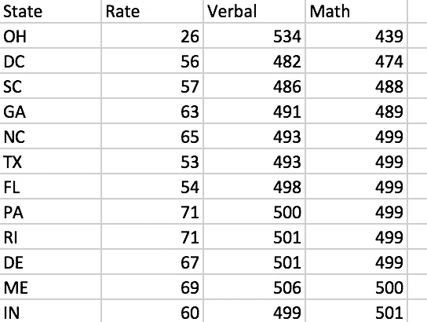
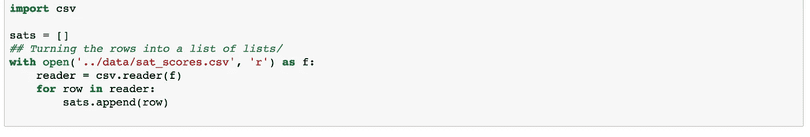
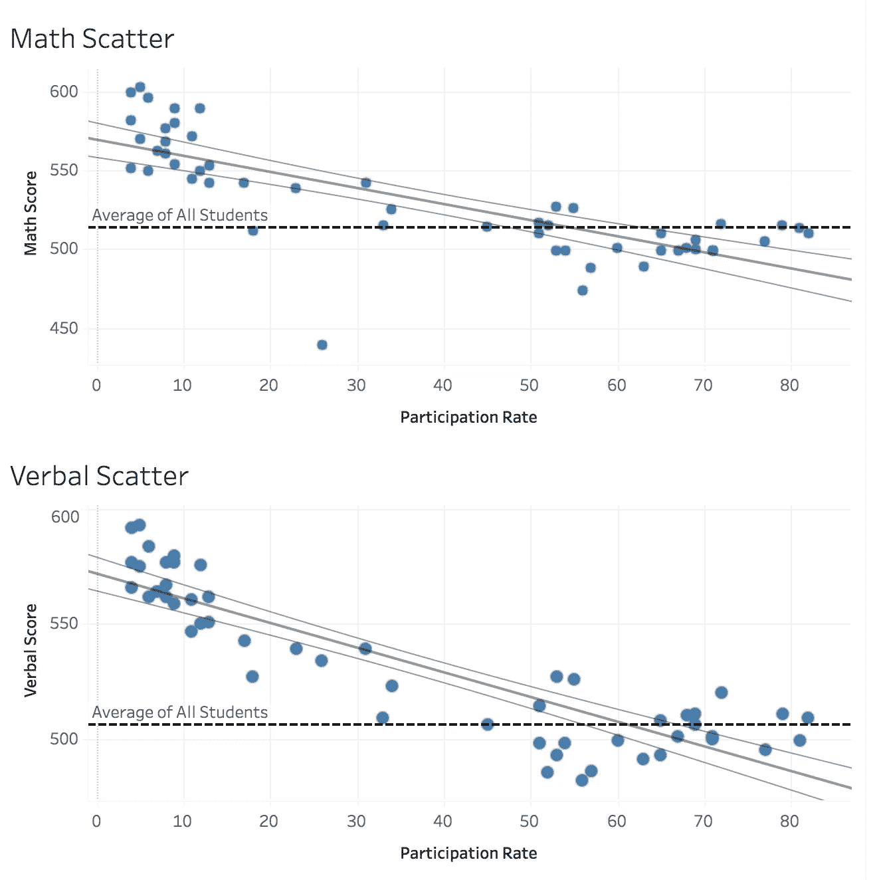
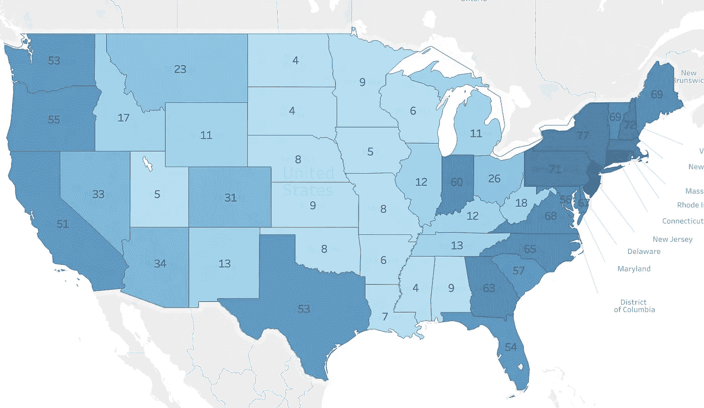
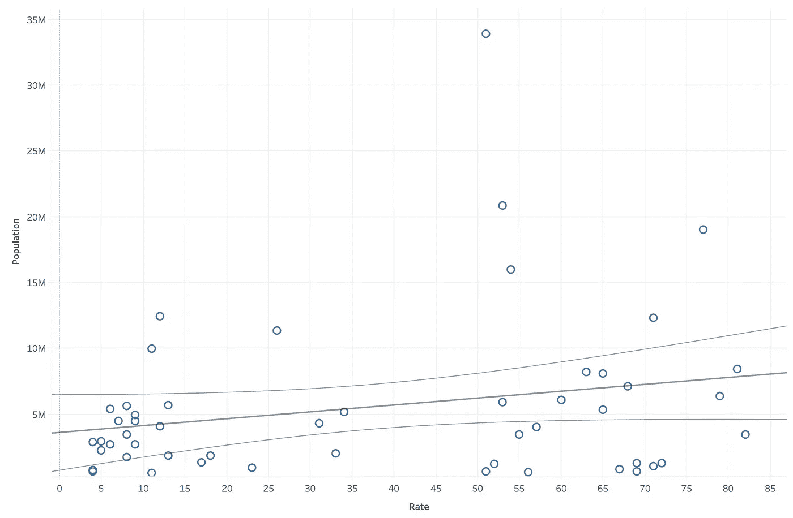
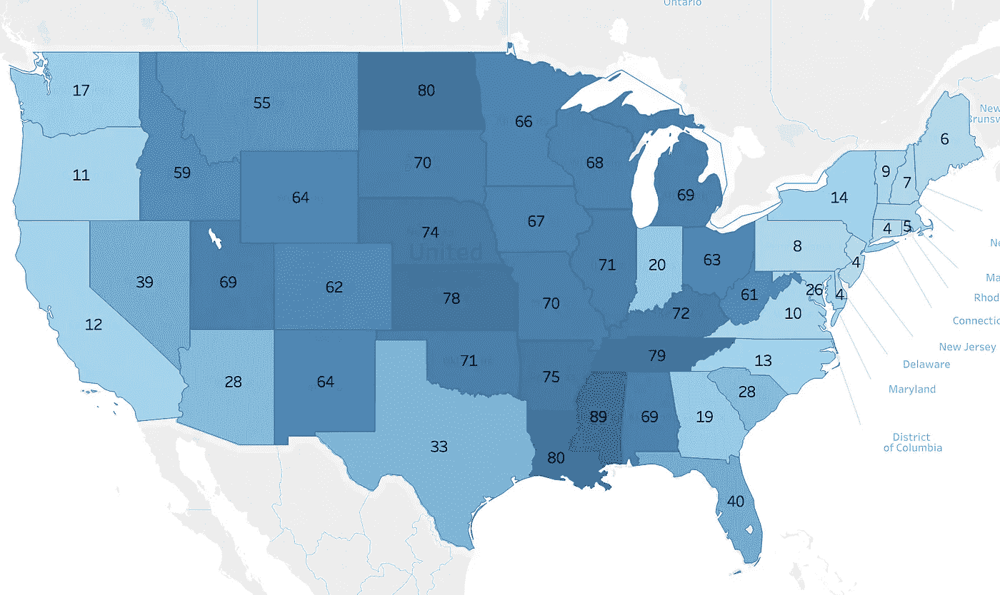

# SAT 数据— 2001 年

> 原文：<https://towardsdatascience.com/sat-data-2001-8e86f1671840?source=collection_archive---------3----------------------->

在我们的第一个大会数据科学沉浸式项目中，该班级获得了一些 2001 年的 SAT 数据。这些数据包括各州的参与率、各州的平均语言成绩以及各州的平均数学成绩。

Sample of the data in excel — (please don’t tell anyone I opened this in excel!)

首先，我在 excel 中打开 csv 文档。excel 表格很有趣，我可以用它对数据进行一些基本的推断——高分和低分，计算一些基本的统计数据，等等。然而，我真的想以一种能给我更多控制的格式来查看这些信息，所以我把所有的东西都导入了一个 jupyter 笔记本。

因为我被告知不要在这个项目中使用 pandas dataframes，所以我将所有内容导入到一个 list 列表中，并使用字典来处理数据。导入过程看起来像这样:

Importing……………..

一旦它成为列表格式的列表，我就可以制作一些图表和可视化效果来真正利用这些数据。第一步是值的直方图。

> 直方图是每个范围内数值数量的条形图。在这种情况下，它显示分数出现在某个范围或“bin”内的州的数量

*(我用 matplotlib 在 jupyter 笔记本上制作了所有这些图表，但为了让它们看起来更漂亮，我在 tableau 中重新制作了它们)*

[https://public.tableau.com/views/DCDSIProject1-HIstograms/Dashboard3?:embed=y&:display_count=yes](https://public.tableau.com/views/DCDSIProject1-HIstograms/Dashboard3?:embed=y&:display_count=yes)

*从这些信息中我们能马上看出什么？* **这些都不是正态分布！**

没有更多的数据很难说，但我猜想整个美国的 SAT 分数可能更接近正态分布。由于各州人口的差异，各州得分的平均值并不能告诉我们太多关于整个人口的直方图是什么样子。

下一步是绘制散点图，直观地显示数据是如何分布的。

[https://public.tableau.com/views/DCDSIProject1-LinePlots/Dashboard2?:embed=y&:display_count=yes](https://public.tableau.com/views/DCDSIProject1-LinePlots/Dashboard2?:embed=y&:display_count=yes)

现在我们可以看到一些有趣的关系。

参加测试的合格学生越多，平均分就越低。这是有道理的:在中西部各州，要求 SAT 的学校较少，只有申请竞争更激烈、通常是沿海学校的学生才会参加 SAT，而不是 ACT。

让我们看看这个假设是否支持沿海和内陆州的划分。幸运的是，tableau 将让我们制作一个热图，以查看地理上哪些州的参与率较高。

是的，沿海各州以及德克萨斯州和伊利诺伊州的参与率较高。

也许还有其他因素在起作用。

德克萨斯州、伊利诺伊州和沿海各州的另一个特点是人口水平高。让我们看看人口(2000 年)如何与参与率相关联。

这是一个很好的尝试，但是这个数据没有太多的人口相关性。至少我验证了我的假设。

那么，非沿海州的学生不参加 SAT 考试，而是在做什么呢？

ACT Participation Rates 2001

采取行动。

我在网上找到了一个 2001 年 ACT 参与率的列表([https://forms . ACT . org/news room/data/2001/States . html https://forms . ACT . org/news room/data/2001/States . html](https://forms.act.org/newsroom/data/2001/states.html))。这些分数的分布图几乎是 SAT 分数分布图的逆分布。

我从现有的数据中获得了一些有趣的见解，但我想用更多的时间和大学委员会的数据来考虑几个问题:

*还有哪些信息可以与每个州的参与率和分数相关联？*

*我们怎样才能把结果按州分开，这样就不会像参与度那样重要了。我们能否将这些分数标准化，以便更好地进行跨州比较？*

那些问题将不得不等待另一天。