# 沙特股票市场分析和预测(Tadawul)——第一部分

> 原文：<https://towardsdatascience.com/saudi-stock-market-analysis-and-forecasting-tadawul-part-i-a22254c7a95b?source=collection_archive---------10----------------------->


这是我在金融行业的第一个项目，尤其是在花了大量时间在医疗保健领域进行机器学习项目(如英国的 [A & E 出勤和急诊](/time-series-analysis-and-forecasting-for-a-e-attendances-and-emergency-admission-in-england-53e41a93be35)，以及[乳腺癌细胞类型分类器](https://www.linkedin.com/pulse/breast-cancer-cell-classifier-ahmed-qassim))之后。所以，我决定在中东最大的股票市场之一——沙特阿拉伯股票市场(Tadawul)发挥我的技能。虽然，数据获取和收集是一个具有挑战性的部分。但是多亏了 Tadawul，这才变得很容易！在那里，我必须浏览所有在他们网站上发布的沙特市场活动年度报告，提取所需的数据，并最终将它们合并到一个 CSV 文件中。最终，我得到了一个从 2006 年 1 月到 2018 年 8 月沙特阿拉伯市场活动的数据集。

关于 [**Tadawul**](https://www.tadawul.com.sa/wps/portal/tadawul/home) 的更多信息:Tadawul 是在沙特阿拉伯王国被授权作为证券交易所(以下简称“交易所”)的唯一实体。它主要进行证券的上市和交易，以及在交易所交易的证券的存管、转让、清算、结算和所有权登记

该项目旨在分析从 2006 年开始到 2018 年 8 月的沙特阿拉伯股票市场数据，并对 12 个月(2018 年 9 月到 2019 年 8 月)进行预测/预报。我将完成这个项目的一系列，其中每一部分将详细讨论不同的主题。

## 第一部分—加载数据集、数据争论、数据分析和探索

***加载数据集***

首先，我们加载所需的库，然后是数据集:

```
library(dplyr)library(urca)library(forecast) library(repr)library(data.table)library(psych)library(dygraphs)require(ggplot2)
```

这是我从 Tadawul reports and publications(4x 152)整合的月度市场活动数据集的截图。所有货币单位均为沙特里亚尔:

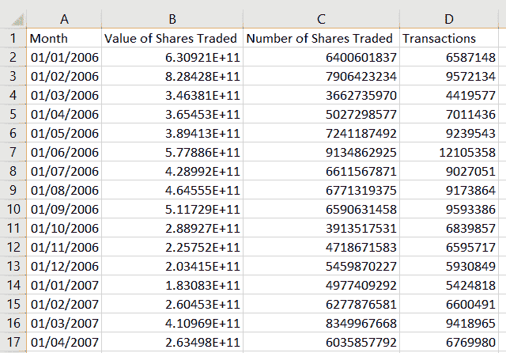

正在加载数据集:

```
df <- read.csv ( file= "… /Tadawul/Datasets/Monthly Market Activity.csv", 
                 header= TRUE )
head(df)
```

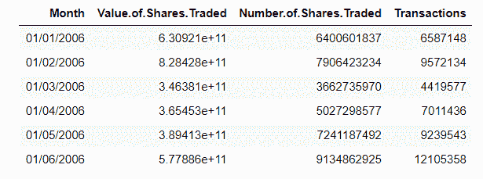

按如下方式更改标题名称:

月:日期

股票交易价值(SAR): VST

股票交易数量:NST

交易:Tra

```
setnames(df, old=c("Month","Value.of.Shares.Traded","Number.of.Shares.Traded", "Transactions"), 
             new=c("Date", "VST", "NST","Tra"))
head(df)
```

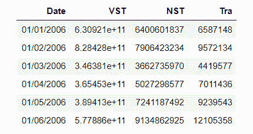

***数据角力***

检查数据类型:

```
class(df$Date)
class(df$VST)
class(df$NST)
class(df$Tra)> 'factor'
> 'numeric'
> 'numeric'
> 'numeric'
```

列“日期”的类别是“因子”。对于时间序列分析，我们应该有日期和时间数据类型。但首先，让我们检查是否有任何缺失的数据存在:

```
summary(is.na(df$Date))
summary(is.na(df$VST))
summary(is.na(df$NST))
summary(is.na(df$Tra))*>   Mode   FALSE* 
*> logical     152*
*>
>   Mode   FALSE*
*> logical     152*
*>
>   Mode   FALSE*
*> logical     152*
*>
>   Mode   FALSE*
*> logical     152*
```

没有丢失数据，将“日期”列类型更改为日期和时间类“POSIX CT”“POSIX t”:

```
to.POSIXct <- function(col){ dateStr <- paste(as.character(col))
  as.POSIXct( strptime(dateStr, "%d/%m/%Y"))
}df$Date <- to.POSIXct(df$Date)
class(df$Date)> 'POSIXct'  'POSIXt'
```

创建“月”列，它有助于数据可视化和探索:

```
df$month = month(df$Date)
df$month = month.abb[df$month]
head(df)
```

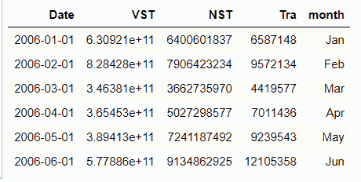

***数据分析、可视化和探索***

让我们首先检查数据帧摘要:

```
summary(df[,2:5])>  VST                 NST                 Tra              month          
> Min.   :3.240e+10   Min.   :1.557e+09   Min.   :    3185   Length:152        
> 1st Qu.:8.006e+10   1st Qu.:3.503e+09   1st Qu.: 1969411   Class :character  
> Median :1.163e+11   Median :4.669e+09   Median : 2707780   Mode  :character  
> Mean   :1.487e+11   Mean   :4.875e+09   Mean   : 3254791                     
> 3rd Qu.:1.731e+11   3rd Qu.:6.125e+09   3rd Qu.: 3787704                     
 Max.   :8.284e+11   Max.   :1.383e+10   Max.   :12105358
```

时间段(2006 年 1 月-2018 年 8 月)内交易股份价值散点图(VST)，用交易股份数量(NST)进行颜色编码:

```
ggplot(df, aes(Date, VST, color = NST)) +
  geom_point(shape = 16, size = 2, show.legend = TRUE) +
  theme_minimal()
```

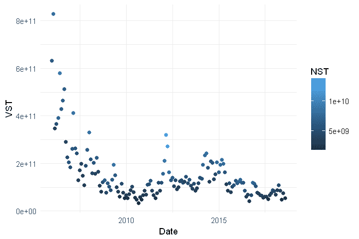

检查数据分布(直方图)以及交易股票价值、交易股票数量和交易数量之间的关系；

```
pairs.panels(df[,1:3], method = "pearson", # correlation method hist.col = "#00AFBB", density = TRUE,  # show density plots ellipses = TRUE # show correlation ellipses)
```

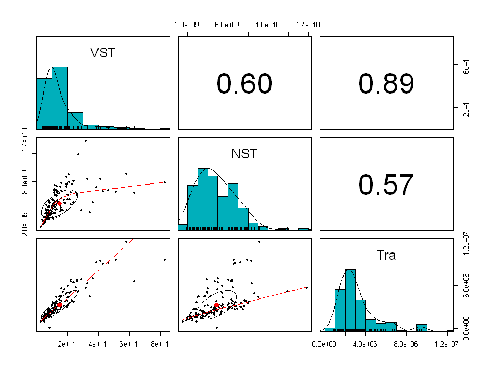

很明显，在 VST、NST 和 Tra 中有异常值或大数据会扭曲分布曲线，大部分是 2006-2008 年的数据。我们将在时间序列绘图和分析中看到这些数字的确切位置。然而，股票交易价值(VST)和交易数量(Tra)之间存在明显的线性关系。因此，更高的交易数量意味着更高的股票交易价值。皮尔逊相关法通过显示 VST 和 Tra 之间的线性关系强度(0.89)可以肯定地证明这一点。

事实上，我有兴趣了解更多关于(2006 年至 2018 年)期间每股交易的平均价值。但是首先，我们必须创建这个功能，并将其命名为(Avg。v)通过将 VST 除以 NST:

```
*# Average value of each share Avg.V*
df$Avg.V <- df$VST/df$NST
summary(df$Avg.V)> Min. 1st Qu.  Median    Mean 3rd Qu.    Max. 
>  13.97   21.25   24.53   29.60   32.39  104.78
```

检查每个份额分布的平均值:

```
ggplot(df, aes(x =Avg.V))  + geom_histogram()
```

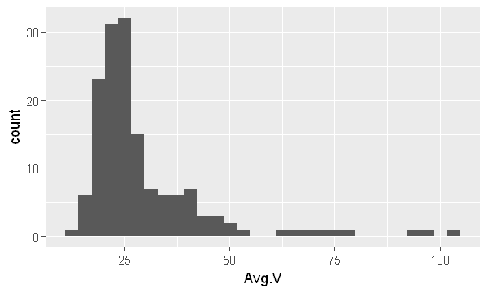

平均散点图。“v”与“日期”相对，带有“nst”颜色编码:

```
ggplot(df, aes(Date, Avg.V, color = NST)) +
  geom_point(shape = 16, size = 2, show.legend = TRUE) +
  theme_minimal()
```


与 VST 类似，每股平均价值在 2007 年前很高，2010 年后波动。看起来股票数量对这些股票的价值没有影响。我将在时间序列分析中验证这一假设。

创建每列的时间序列数据:

```
*# create ts data*
VST.ts <- ts(df[,'VST'], frequency = 12, start=c(2006,1), end= c(2018,8))
NST.ts <- ts(df[,'NST'], frequency = 12, start=c(2006,1), end= c(2018,8))
Tra.ts <- ts(df[,'Tra'], frequency = 12, start=c(2006,1), end= c(2018,8))
```

绘制股票交易价值 VST 时间序列:

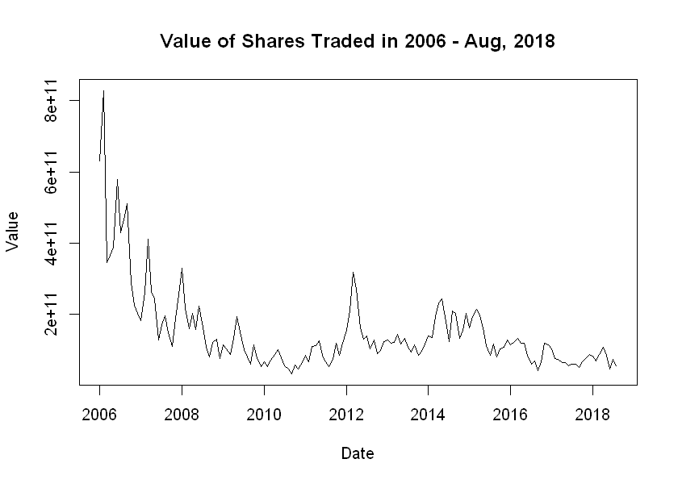

随着时间序列的绘制，我们注意到股票交易的最高价值是在 2006 年初，然后曲线开始呈指数衰减。最高数字超过 8，000 亿沙特阿拉伯里亚尔，最低数字低于 2，000 亿沙特阿拉伯里亚尔。为了更好地了解趋势，让我们按季度和年度累计数据，然后再次绘制时间序列。

绘制每季度交易股票的价值:

```
plot.ts(VST.ts.qtr, main = "Value of Shares Traded - Quarterly", 
         xlab = "Year", ylab = "Value")
```

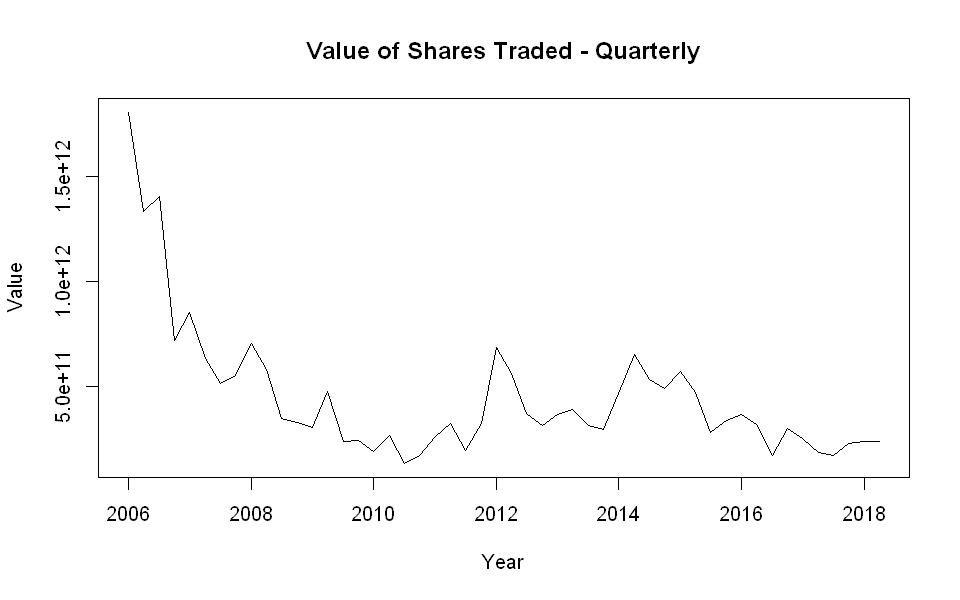

```
plot.ts(VST.ts.yr, main = "Value of Shares Traded - Yearly", 
        xlab = "Year", ylab = "Value")
```

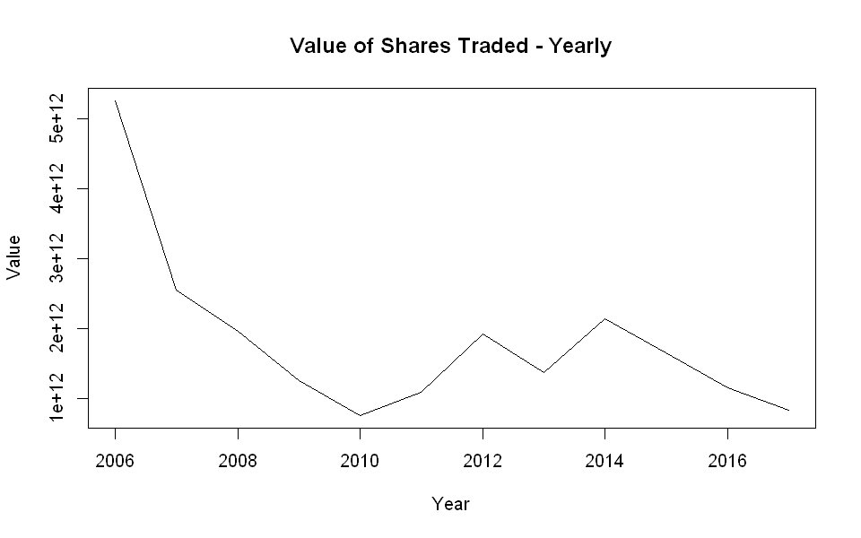

如季度图和年度图所示，沙特股票市场受到了 2007-2008 年全球经济危机的影响。当时，交易股票价值严重缩水，在 2010 年达到最糟糕的水平。

为了同时了解三个特征的行为，为了更好地显示，我将在基本缩放后一起绘制三个时间序列(VST、NST、Tra ):

```
options(repr.plot.width=8, repr.plot.height=6)
plot(VST.ts/10000, col = "red", xlab = "Date", ylab = "Value", 
     main = "Saudi Stock Market Activities 2006 - 2018")
lines(NST.ts/600,col = "blue")
lines(Tra.ts*5, col = "black")
grid() 
legend("topleft",lty=1,col=c("red", "blue", "black"), cex = 0.65,
       legend=c("Value of Shares Traded x10^4", 
       "Number of Shares Traded x10^3", "Transactions /5"))
axis(1, at=1:152, labels= (df$Date))
```

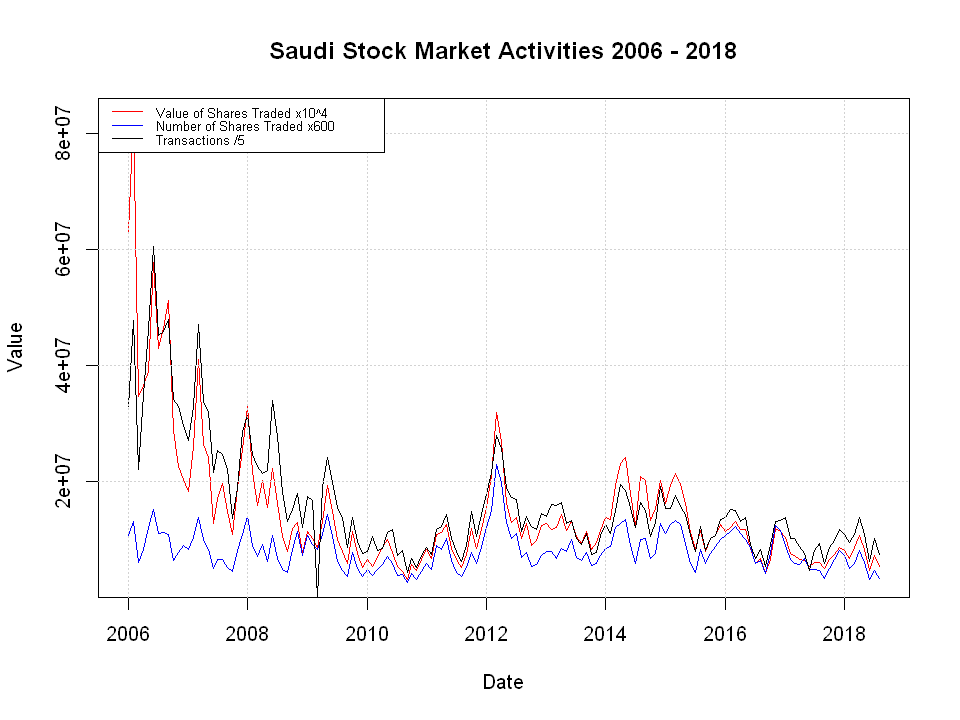

同样，绘制 VST、NST 和 Tra 时间序列—每年:

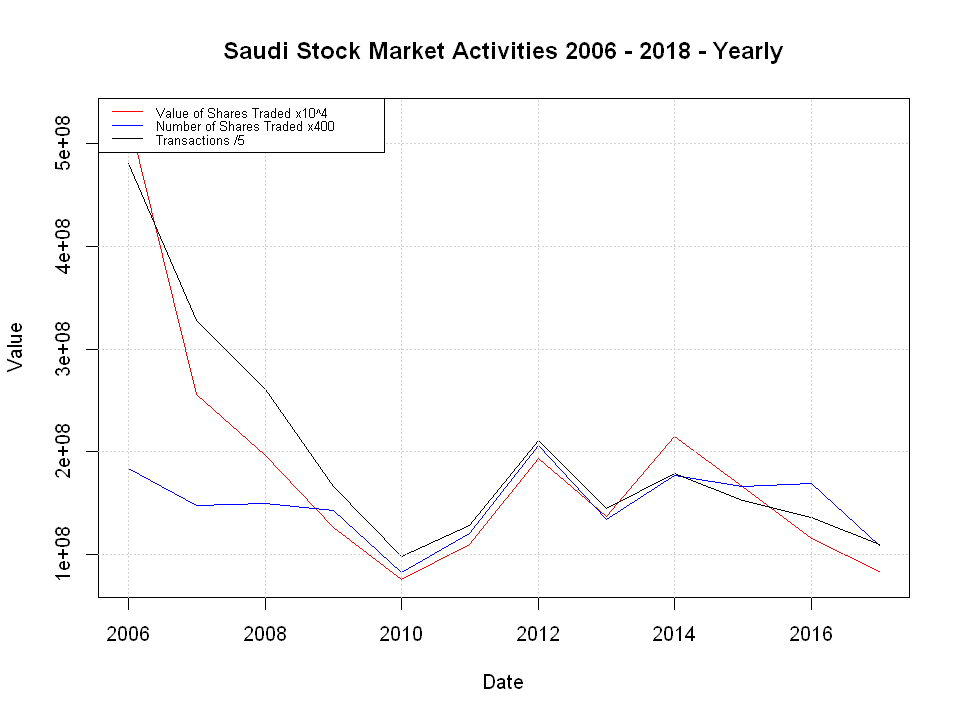

如图所示，2010 年 VST、NST 和 Tra 值最低。然而，三条线基本上是一致的。

交易股票价值柱状图(VST.ts):

```
hist(VST.ts, breaks = 30, 
     main = paste('Value of Shares Traded Distribution'), xlab = "VST")
```

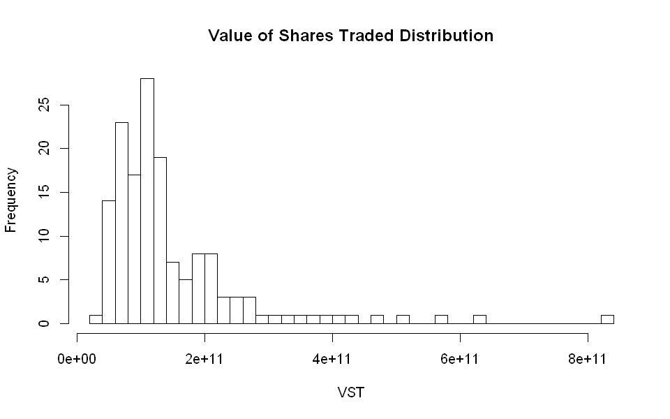

VST 每月箱线图:

```
boxplot(VST.ts ~ cycle(VST.ts), xlab = "Month", ylab = "VST", 
         main = "Monthly Value of Shares Traded - Boxplot")
```

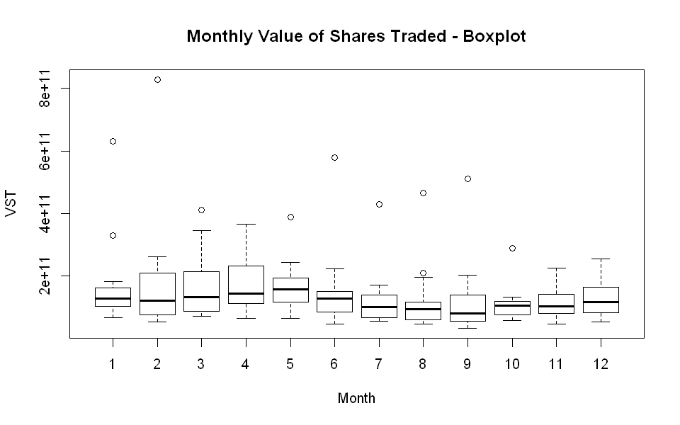

从月度箱线图中，我们可以注意到最低的交易值发生在八月和十月。而交易量最高或最热的月份是二月、三月和四月。

应用移动平均技术对 VST 时间序列 12 年间的概貌。我们将计算 6、12、24 和 36 个月的平均值，以控制趋势平滑度。

```
par(mfrow = c(2,2))
plot(VST.ts, col="gray", main = "Half Year Moving Average Smoothing")
lines(ma(VST.ts, order = 6), col = "red", lwd=3)
plot(VST.ts, col="gray", main = "1 Year Moving Average Smoothing")
lines(ma(VST.ts, order = 12), col = "blue", lwd=3)
plot(VST.ts, col="gray", main = "2 Year Moving Average Smoothing")
lines(ma(VST.ts, order = 24), col = "green", lwd=3)
plot(VST.ts, col="gray", main = "3 Year Moving Average Smoothing")
lines(ma(VST.ts, order = 36), col = "yellow4", lwd=3)
```

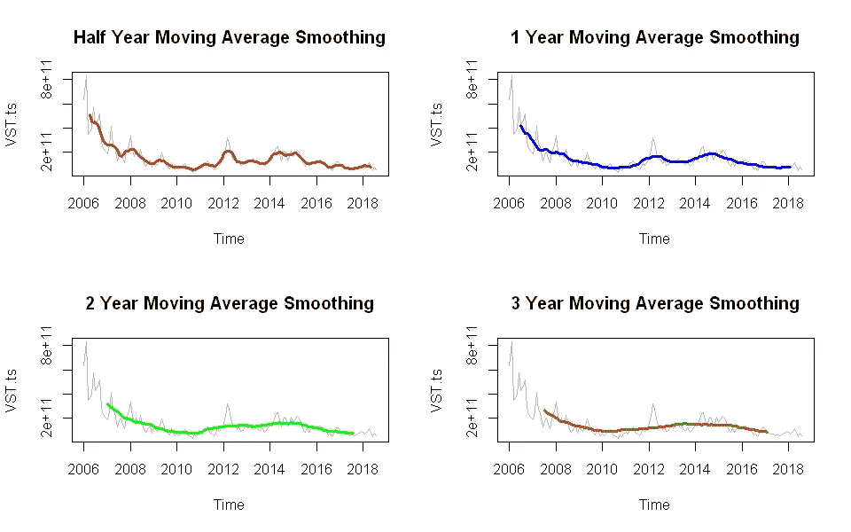