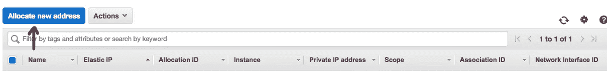
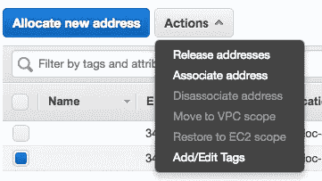
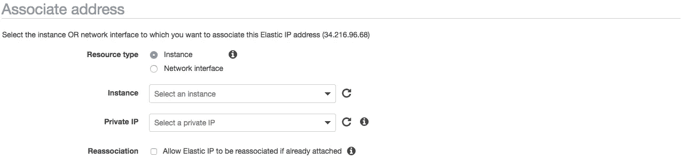
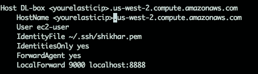
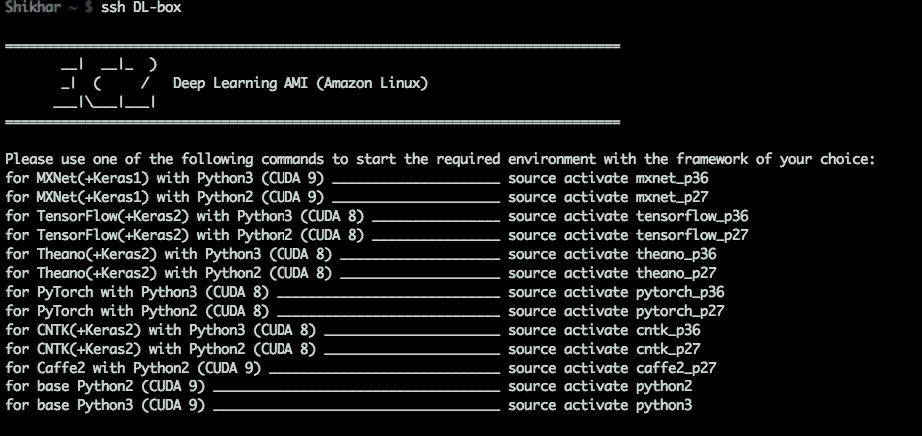

# 在 AWS 上节省一分钟

> 原文：<https://towardsdatascience.com/save-that-one-minute-on-aws-88dab5a37233?source=collection_archive---------7----------------------->

自动化日志记录和到 EC2 实例的隧道


更多的时候，为了不参与我的项目，我不得不求助于 AWS 来满足我的计算需求。有时候是我的 128 GB 本地机器存储不足，有时候是需要 GPU 运行深度学习模型。AWS EC2 实例并不便宜，尤其是如果您使用的是支持 GPU 的实例。我使用每小时 0.9 美元的 p2xlarge，在我完成工作后，我需要停止(而不是终止)它，这样我就不会被收取不必要的费用。除非您使用的是保留的实例，否则每次重新启动实例时，都会为您分配一个新的 IP。然后，您必须经历将 IP 复制到 ssh 命令以登录的枯燥过程。

```
#ssh login
ssh -o ServerAliveInterval=60 -i yourkey.pem [ec2-user@ec2-xx-xxx-xx-xxx.us-west-2.compute.amazonaws.com](mailto:ec2-user@ec2-34-210-18-190.us-west-2.compute.amazonaws.com)
```

然后，如果您想要隧道进入您的实例，您必须为您的隧道命令再重复一次这个过程。

```
#ssh tunneling
ssh -o ServerAliveInterval=60 -i yourkey.pem [ec2-user@ec2-xx-xxx-xx-xxx.us-west-2.compute.amazonaws.com](mailto:ec2-user@ec2-34-210-18-190.us-west-2.compute.amazonaws.com) -L9000:127.0.0.1:8888
```

对于像我这样一天要多次停止和重启实例的人来说，这很快就会变得令人恼火。在这篇文章中，我将谈论一个在某种程度上避免这一过程的巧妙技巧。

# 弹性 IP

拼图的第一块是 AWS 上的[弹性 IP](https://docs.aws.amazon.com/AWSEC2/latest/UserGuide/elastic-ip-addresses-eip.html) 功能。

> 弹性 IP 地址是与您的 AWS 帐户相关联的静态 IPv4 地址

您可以将此 IP 分配给一个实例，然后每次都可以使用此 IP 登录到您的实例。这将解决不断变化的 IP 问题。这方面的成本可以忽略不计。如果 IP 连接到正在运行的实例，则不会产生任何成本。但是，如果 IP 连接到一个停止的实例，这是您所需要的，它将花费您每小时 0.005 美元。如果我们粗略计算一下，50 天内每天 20 小时的停止实例将花费您 5 美元。一点都不差！！

以下是您预订弹性 IP 的方式:

步骤 1: EC2 仪表板→网络和安全→弹性 IP

第二步:点击分配新地址，并按照步骤



步骤 3:选择新 IP →操作→关联地址



步骤 4:选择要将此 IP 附加到的实例



对于选定的实例，公共 IP 将永久更改为弹性 IP，除非您将其释放。现在，您不需要一次又一次地更改日志和隧道命令的 IP 部分。

只是用弹性 IP 会节省你的时间。但是仍然有提高效率的空间，所以继续吧。

# 用于日志和隧道的 SSH 脚本

在这里，我将讨论创建 ssh 脚本的一系列步骤，您可以从您的终端运行该脚本，它不仅可以登录到您的实例，还可以创建从您的本地主机到您的实例的隧道。

**第一步:**输入你的。ssh 目录。


**步骤 2:** 记住，您需要 pem 文件来登录到您的实例。将这个 **pem** 文件复制到 ssh 目录。


步骤 3: 现在使用任何文本编辑器在同一个目录中创建一个 ssh 配置文件。我用纳米来做这个。并在配置文件中定义实例细节。



```
Host <any name you like> <elasticIP>.us-west-2.compute.amazonaws.com
 HostName <elasticIP>.us-west-2.compute.amazonaws.com
 User ec2-user
 IdentityFile <location of pem file>
 IdentitiesOnly yes
 ForwardAgent yes
 LocalForward 9000 localhost:8888
```

**注:**

*   在上面的配置文件中，如果你使用的是 ubuntu 实例，用户将是 **ubuntu**
*   LocalForward 9000 localhost:8888 会将本地主机上的端口 9000 转发到 EC2 实例的本地主机。您也可以使用任何其他端口来代替 9000

完成后，每当您想要重启实例时，只需调用这个命令即可

```
ssh DL-box
```



希望这个小技巧能省下那一分钟。这篇[推文](https://twitter.com/jeremyphoward/status/958092383995944960)和[要旨](https://gist.github.com/matttrent/0fe70211d9b7b93b6b82fc4b91b54e70)启发了我写这篇帖子。