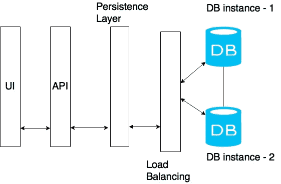
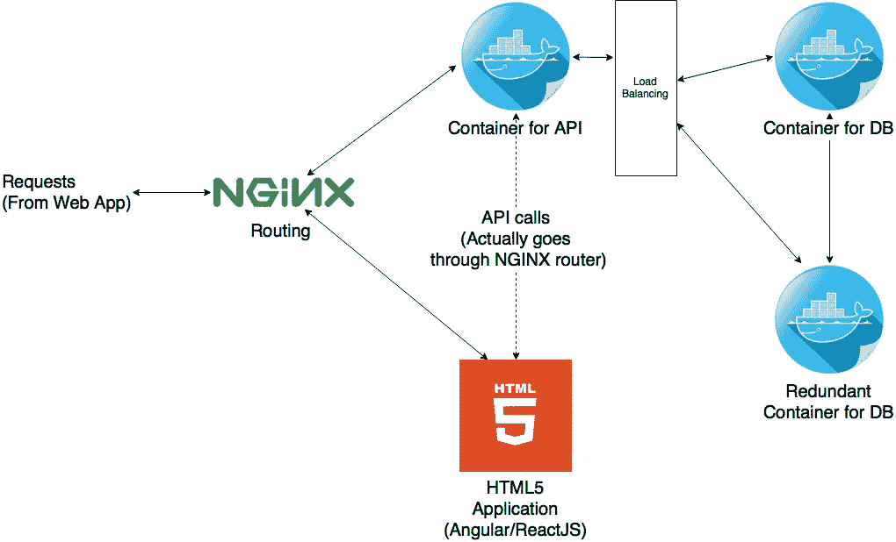
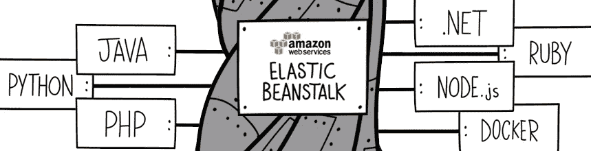

# 可伸缩的 Web 开发

> 原文：<https://towardsdatascience.com/scalable-web-development-d57a46a7f349?source=collection_archive---------1----------------------->

## 开发一个简单的具有可伸缩性的 web 应用程序

如今，随着移动接入的增加和电子商务的发展，web 服务变得越来越流行。任何想出一个网站的人肯定会希望它能吸引越来越多的访问者。

但是，首先，我们是否要使用整个服务器场来预期 100 万用户？，这可能是 5 年后的目标。答案是否定的。但是我们要完全忽略我们真诚的期望，建立一个静态的网页吗？。又一个大不了！！！。让我们看看我们能做些什么。

# 首先要考虑的事项…

简单来说，让我们继续使用 5W 框架，这是一种公认的收集信息和解决问题的方法。让我们在应用框架时考虑到可伸缩性，并在此基础上进行开发。

## 什么？

对于我们的场景，这是一个 web 应用程序。但是首先要问的问题应该是它是一个 web 应用程序吗？可能不是。目前是这样。

## 为什么？

web 应用程序的目的。以下是目前常见的一些常见用例。

*   电子商务—需要安全、SSL 和其他认证。
*   交互式应用—社交网络、教育、博客，其中有大量用户同时访问和流式传输内容。
*   信息显示——只是展示内容，没有太多的严肃计算。
*   分析平台——异步/同步接受请求和服务器。基于发布/订阅的处理(PubSub)。提供接口来执行功能的 API。很少有昂贵的处理会运行更长的时间。

## 什么时候？

我们什么时候部署产品。时间就像 ***【时间就是金钱】*** 一样至关重要。我们花费的时间越多，我们为软件过程支付的费用就越多。随着现代敏捷实践的发展，人们更加关注 ***编码*** 而不是文档。因此，必须遵循清晰的架构，并定期进行沟通。否则会发生这种事。


Failed Design: [source](http://www.veryfunnypics.com/pics/view/name/failed%20bridge/cat/Miscellaneous/sort/recent)

从高度可扩展的解决方案开始，从设计阶段开始，肯定会花费更多的时间。开始太简单会增加返工的额外压力。因此，在实际开发之前，必须达成折衷方案。我们将看到如何…

## 在哪里？

***其中*** 有几种形式。

*   我们的目标市场在哪里？
*   我们在哪里？
*   我们将在哪里部署产品/项目？

这些问题主要通过业务分析来解决。然而，作为工程师，由于延迟、安全性和负载平衡的原因，我们更喜欢将服务部署在离目标客户/用户群更近的地方。

## 谁啊。

我们的目标是谁。他们的访问模式是什么。时区等等，都在这一节中。这是因为，此类信息直接显示了一段时间内工作负载分布的性质。在两个时区工作有时会使发布变得容易，因为我们可以预期在开发中心的工作时间会有较低的工作量。或者，我们可能需要在维护期间提供冗余服务器来满足请求，以获得更好的 QOS(服务质量)。

# 可扩展的解决方案

现在让我们考虑构建可伸缩解决方案的 web 应用程序场景。提前考虑总是好的，但不能超出可预见的未来。

## 可维护性和可扩展性

我们所做的任何事情都必须是可持续的。否则在版本的每个发布中都会有大量的返工。因此，适当的 ***关注点分离*** 必须在整个项目中实施。



Layering

该图显示了两个数据库实例的内容分层。负载平衡用于同时使用两个实例或一次使用一个实例作为故障保护模式。

## 连接组件

它总是有单独的组件，并传递消息进行通信。这将增加沟通，但这可以很好地扩展，也很容易维护。下图显示了实施中组件的组织。这与上图不同。这并没有演示信息的实际流动，而是用技术术语演示了组件的分离。



Arrangement of components in actual implementation

通常使用 [NGINX](http://nginx.com/) (过去使用 [Apache](https://httpd.apache.org) ，微软有 [IIS](https://www.iis.net) 和 [Passenger](https://www.phusionpassenger.com) 用于 Python 和 Ruby)路由请求。容器通常运行在不同的端口，但是我们通常只向外界公开端口 80(出于安全原因)，这样就没有外部的人可以连接到我们的数据库。

## 样品流

*   用户请求`www.mydomain.com`，这个请求将被路由到 HTML 静态内容。
*   静态内容将被加载到用户浏览器中。这主要是一个角度或反应的应用。这是因为，不像过去我们使用 PHP、JSP、JADE、Twig 或 Blade 来制作模板，我们不再那样做了。它使我们的应用程序与 API 和请求控制器保持耦合。
*   一旦内容被加载，所有其他工作通常通过调用 web API 来完成。例如，登录请求如下所示。

```
"method": "POST",
"body": {
    "username": "anuradha",
    "password": "password1234"
},
"headers": {
    "content-type": "application-json"
}
```

*   这些请求作为一个`post`请求被发送到 url `www.mydomain.com/login`。这些将被 NGINX 定向到认证服务器。成功后，将为 web 应用程序提供一个令牌。这些被称为 JWT (JSON Web 令牌)。这些将用于以后验证用户。
*   所有到来的请求都将被发送到`www.mydomain.com/api/somepath.`，NGINX 将把`/api/`请求路由到 API 容器。JWT 必须作为标题以`authorization: bearer <token>`的形式发送。显然，为了防止有人劫持您的令牌，必须使用一个`https`连接。

## 为什么是集装箱

容器是轻量级的虚拟化层，主要运行 linux 内核。使用它们是因为它们可以比虚拟机启动和终止得更快。此外，它们不会像虚拟机那样消耗大量资源。

此外，该容器支持内容的安全部署。举例来说，供应商可以在为特定环境进行配置后为 API 提供 Docker 映像，而不必发送代码库。

> 在某些情况下，NGINX 本身是一个容器，用来处理大量请求并路由到大量其他容器。[点击](https://hub.docker.com/_/nginx/)看看！

## 弹性豆茎一瞥



Elastic Beanstalk

这是一个提供许多 web 服务器的平台，这些服务器可以随着负载的增加而扩展。他们监视资源利用率，并不断自动添加资源，并相应地收费。由于易于部署，这已经变得流行起来。用他们自己的话说就是，

> Elastic Beanstalk 不收取额外费用——您只需为存储和运行应用程序所需的 AWS 资源付费。

> 优势
> *简单
> *自动扩展
> *资源监控
> *提供所需的所有基础架构组件
> *安全