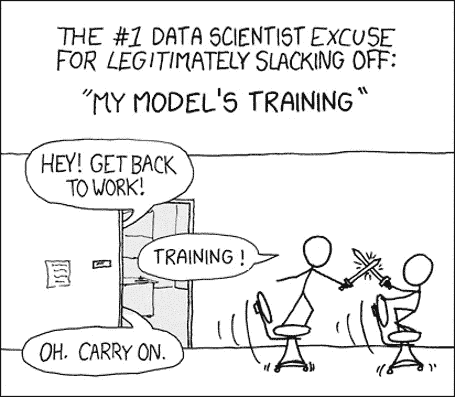
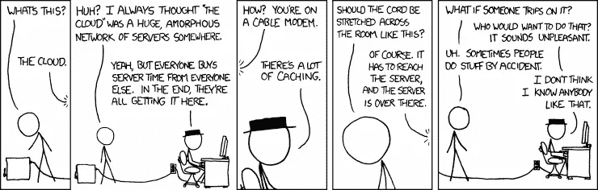

# 他们没告诉你的关于扩展人工智能的事

> 原文：<https://towardsdatascience.com/scaling-ai-2be294368504?source=collection_archive---------10----------------------->

现在有 AI 的*一切*的教程。*如何做物体检测，图像分类，自然语言处理，建立聊天机器人*等。，这样的例子不胜枚举。

但是当我寻找如何恰当地*缩放*人工智能的信息时，我发现内容很少。更令人惊讶的是，确实存在的少数资源似乎重复了相同的几点:

*   使用像 **TensorFlow** 这样的可扩展框架构建您的模型
*   要么打包到你的客户端(TF.js，TF Lite，TF-slim 等。)或者将其部署为带有容器的微服务

我对第二部分更感兴趣，因为我已经开发了一个模型，但令我惊讶的是，几乎没有提供关于如何实际实现这一点的细节，关于每个解决方案的缺点的信息甚至更少。在研究了几天并在 [Crane.ai](http://crane.ai) 上扩展 AI 之后，我收集了一些关于部署的更多信息**，它们的缺点，以及如何在低层次上优化你的 TensorFlow 模型。**

# 把它打包到你的客户身上——糟透了！

最常用的技术之一是使用 TensorFlow.js、TF Lite 或 TensorFlow Slim 等工具将 AI 打包到您选择的客户端中。关于这些框架是如何运作的，我不会讲太多细节，而是集中讨论它们的缺点。

*   **计算能力。**部署这些型号的问题在于，它们需要**巨大的内存**(我指的是移动应用或浏览器的限制，即>1–2GB 内存)。许多手机没有这种能力，桌面浏览器会延迟 UI 线程，同时也会降低用户计算机的速度，加热计算机，打开风扇等等。
*   **推断时间。**当你在一个计算能力未知的设备上运行模型时，推理时间通常也是未知的；然而，这些不是 GPU 驱动的高 RAM 高 CPU 机器，而是运行在普通计算机上的手机、浏览器和桌面应用程序。用一些更大的模型进行推理可以轻松地**占用一分钟**，从用户体验的角度来看这是一个巨大的**不**。

Stolen from a [Reddit parody](https://www.reddit.com/r/ProgrammerHumor/comments/9cu51a/shamelessly_stolen_from_xkcd_credit_where_is_due/) of [XKCD 303](https://xkcd.com/303/)

*   **大文件。**不幸的是**大多数模型都存储在相当大的文件中**(我们说的是几十、几百 MB)。因此，这将是缓慢和内存密集型加载，并增加了你的应用捆绑包的大小很大一部分。
*   **没有安全感。**除非您使用开源模型，否则您会希望将您的 AI 和预训练检查点相对保密。不幸的是，当你把你的模型和你的应用打包在一起时，不仅你的推理代码容易被反编译，而且**你的预训练检查点也会在包里面，很容易被窃取**。
*   **更难更新。**如果您更新您的模型，您在客户端有两种选择。要么通过集中式管理器(即，Play Store、App Store 等)向用户发布更新。这导致**频繁的大规模更新**(对于用户来说非常烦人，并且根据他们的设置，进程可能会被中断或永远不会启动)，或者应用程序本身运行新模型检查点和元数据的获取。后者听起来好得多，但这也意味着**你必须通过用户可能不稳定的连接下载 100MB 以上的文件**；这将需要一段时间，因此你的应用程序必须至少在后台打开才能完成这个过程，而且你会产生相当大的互联网成本(这取决于你的云)。

*   **缺乏可训练性。**针对新用户数据的训练模型提供了一定程度的个性化，同时提高了其准确性，并建立了一个核心的高信号数据集。**不幸的是，大多数设备缺乏训练模型的计算能力**，即使它们有，也不可能将训练的效果传播到您的服务器或运行应用程序的其他设备。

这些缺点使得在客户端上部署和维护大型神经网络几乎是不可能的，因此我们将排除这个作为扩展模型的选项。

# 将其部署为云端点

[XKCD 908](https://xkcd.com/908/), and [1117](https://xkcd.com/1117/) is also relevant

**云**是大规模部署模型的强大工具。您可以启动完全根据您的需求定制的环境，将您的应用程序容器化，并立即进行水平扩展，同时提供可与大公司媲美的 SLA 和正常运行时间。

对于大多数 TensorFlow 模型，**部署周期**是相同的:

*   将您的图形冻结成 Protobuf 二进制文件
*   调整您的推理代码以处理冻结的图形
*   容器化您的应用程序
*   在顶部添加一个 API 层

第一块比较简单。“冻结”您的图需要创建一个 protobuf 二进制文件，其中包含与您的检查点相关的所有命名节点、权重、架构和元数据。这可以通过各种各样的工具来完成，最流行的是 TF 自己的工具来冻结任何给定了输出节点名称的图。你可以在这里找到更多关于这个技巧以及如何完成它的信息。

调整您的推理代码也不难；在大多数情况下，您的`feed_dict`将保持不变，主要的区别将是添加代码来加载模型，可能还有输出节点的规范。

**容器化也很简单——只需在 Dockerfile 中设置你的环境(** [**你可以使用一个 TF docker 镜像作为你的基础**](https://www.tensorflow.org/install/docker) **)。**当我们开始添加 API 层时，事情开始变得混乱。通常有两种方法可以做到这一点:

*   **部署运行推理脚本的缩放容器。**这些容器针对输入运行一个脚本，该脚本启动一个会话并运行推理，然后输出一些东西，结果通过管道返回给您。**这是极有问题的；**对于大多数云提供商来说，添加一个操纵容器和管道进出的 API 层**并不容易或简单**(例如，AWS 有 API Gateway，但它远没有你想象的那么方便)，这是你可以使用的**效率最低的**方法。这里的问题是您在**容器启动、硬件分配、会话启动和推理**中损失了宝贵的时间。如果您让`stdin`保持打开并保持管道输出，您将加速您的脚本，但是**会失去可伸缩性**(您现在被连接到这个容器的 STDIN，并且它也不能接受多个请求)。
*   **部署运行 API 层的扩展容器。尽管在体系结构上相似，但出于几个原因，这要高效得多；通过**将 API 层放在容器**中，您可以缓解之前提出的大部分问题。虽然这需要更多的资源，但这是最小的，并不意味着垂直扩展；它**允许每个容器保持运行，**并且因为在这种情况下 API 是分散的，所以将特定的`stdin` / `stdout`挂接到主请求路由器没有问题。这意味着您**摆脱了启动时间**，并且**可以在服务多个请求**的同时，轻松保持速度和水平缩放**。您可以使用**负载平衡器、**集中您的容器，并使用 [Kubernetes](https://kubernetes.io/) 来保证几乎 100%的正常运行时间并管理您的设备。简单有效！

Deploy your fleet!

通过集装箱船队分散 API 的主要缺点是成本会相对较快地增加到一个大数目。不幸的是，这是人工智能不可避免的，尽管有一些方法可以减轻这一点。

*   **重用你的会话。**您的车队随着负载成比例地增长和收缩，因此您的目标是最小化运行推理所需的时间，以便容器可以释放空间来处理另一个请求。一种方法是**重用** `**tf.Session**` **和** `**tf.Graph**` **，一旦初始化就存储它们并作为全局变量**传递它们；这将消除 TF 启动一个会话和构建图所花费的时间，这将大大加快您的推理任务。这种方法即使在单个容器上也是有效的，并且作为一种技术被广泛使用，以最小化资源重新分配和最大化效率。
*   **缓存输入，如果可能，缓存输出。**动态编程范式在 AI 中最为重要；通过缓存输入，可以节省预处理输入或从远程获取输入所需的时间，通过缓存输出，可以节省运行推理所需的时间。这在 Python 中可以很容易地完成， ***尽管你应该问问自己这对于你的用例是否正确！*** 通常情况下，你的模型会随着时间变得更好，这将极大地影响你的输出缓存机制。在我自己的系统中，我喜欢使用我所谓的“80-20”法则。当一个模型的准确率低于 80%时，我**不缓存任何输出。**一旦达到 80%，我就开始缓存，并且**将缓存设置为在某个精确度到期**(而不是说，在某个时间点)。这样，输出会随着模型变得更加精确而变化，但在这种 80–20*减轻的*高速缓存中，性能和速度之间的权衡较少。

*   使用任务队列。经常有较大和较小的推理任务需要运行(在我们的例子中，较大和较小，复杂和简单的图像)。对于 UX 来说，在这里使用堆队列可能更好，并且**处理优先级为**的较小的任务，这样运行小步骤的用户只需等待该步骤，而不是等待另一个用户的较大推断先完成。(如果你在想，*为什么我不在这里只是水平缩放呢？，*你可以**但是会增加成本**
*   **在带有任务队列的专用 GPU 上训练您的模型。**培训是一项漫长而艰巨的任务，需要大量的资源使用，并使模型在其持续时间内不可用。如果你将每个交互反馈到你的模型中进行训练，**考虑在一个单独的服务器上运行这个，**也许用一个 GPU。一旦训练完成，您就可以将模型部署到您的容器中(在 AWS 中，您可以将您的模型库集中在 S3)。

# 结论

经过深思熟虑，我们提出了一个大规模部署人工智能的有效工作流程:

*   **冻结图形**并在一个 **API** 下包装推理
*   **重用**会话和图形，并**缓存**输入和输出
*   **使用 Docker 封装**应用程序(**包括 API 层**
*   **使用 Kubernetes 在您选择的云上大规模部署**应用
*   **从推理中分离出**训练
*   开发一个任务队列来优先处理较小的任务

使用这些技术，您应该能够以最小的成本和开销进行部署，同时最大限度地提高速度和效率！

**关于我**:我是 [Crane.ai](https://crane.ai) (我们用 ai 做 app)的 AI 研究员。在过去的几年里，我一直在研究人工智能，今年花了几个月的时间研究如何扩展人工智能！我希望这是信息，如果你有任何问题，请随时询问。