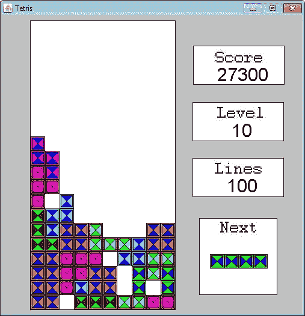
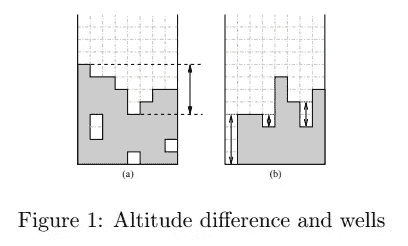
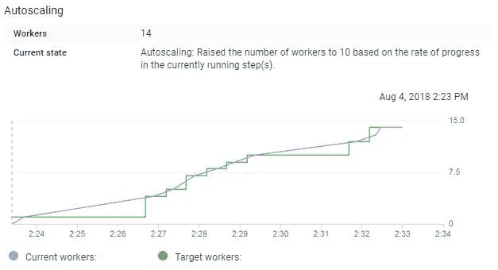
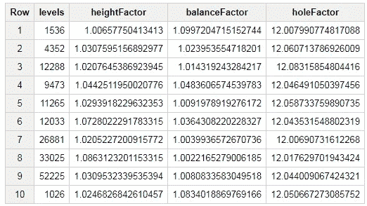
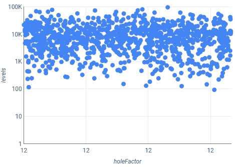

# 用数据流扩展游戏模拟

> 原文：<https://towardsdatascience.com/scaling-game-simulations-with-dataflow-172926612d50?source=collection_archive---------9----------------------->



The GUI version of the Game Simulation

数据流是构建可扩展数据管道的一个很好的工具，但它也可以用于不同的领域，如科学计算。我最近使用谷歌[云数据流](https://cloud.google.com/dataflow/)工具的方法之一是模拟不同自动化玩家的游戏。

几年前，我制作了一个自动俄罗斯方块播放器，作为加州理工学院人工智能课程的一部分。我使用了元启发式搜索方法，这需要大量的训练时间来学习超参数的最佳值。我能够编写系统的分布式版本来扩展这种方法，但是在实验室的 20 台机器上部署它需要很大的努力。使用现代工具，将这些代码扩展到几十台机器上运行是很容易的。

出于多种原因，在游戏中模拟自动玩家是很有用的。最常见的原因之一是测试游戏中的 bug。你可以让机器人不停地敲打游戏，直到有东西坏掉。模拟游戏性的另一个原因是为了建立可以高水平学习和玩的机器人。通常有三种模拟游戏的方式:

*   **实时:**你用正常设置运行游戏，但是一个机器人模拟鼠标点击和键盘输入。
*   **Turbo:** 你禁用渲染组件和其他游戏系统，以尽可能快地运行游戏。如果你的游戏逻辑从渲染逻辑中分离出来，这将会带来数量级的加速。
*   运行模拟最快的方法是禁用游戏中的所有图形和渲染组件。使用这种方法，游戏可以作为函数调用，运行模拟的结果由函数返回。

对于人工智能课程，我使用了涡轮模式，每个人工智能代理独立运行。如果我要重复这个实验，我会使用像 Dataflow 这样的工具，在一个托管环境中扩展系统。这篇文章讨论了如何使用谷歌的数据流工具来实现这个逻辑。它非常适合可以独立运行的长时间运行的任务。

如果你对构建自己的俄罗斯方块游戏代理感兴趣，[Bohm 等人的这篇文章](https://www2.informatik.uni-erlangen.de/EN/publication/download/mic.pdf)介绍了一种创建强大玩家的有趣方法。他们定义了许多用于确定如何采取最佳行动的指标，如下面所示的海拔高度和油井差异。



Heuristics used by Bohm et al.

对于俄罗斯方块来说，这已经不是最先进的了，但是这是一个很好的起点。俄罗斯方块也是编写人工智能的一个好问题，因为从头开始编写一个俄罗斯方块游戏并不太复杂，然后可以用来模拟人工智能玩家。GitHub 上提供了该模拟器的完整代码:

[](https://github.com/bgweber/Simulator/tree/master) [## BG Weber/模拟器

### GitHub 是人们构建软件的地方。超过 2800 万人使用 GitHub 来发现、分享和贡献超过…

github.com](https://github.com/bgweber/Simulator/tree/master) 

俄罗斯方块代码来自我 10 年前写的一个课程项目，我不建议以此为起点。回顾我的一些旧代码很有趣，我必须对它进行一些修改，以便让它在数据流的无头模式下运行。我已经为游戏解耦了游戏逻辑和图形线程，但是我删除了许多在分布式环境中无法工作的静态对象引用。

**设置数据流** 如果你熟悉 Java 和 Maven，启动并运行云数据流应该不是什么难事。第一步是在 pom.xml 中定义依赖关系:

```
<dependencies>          
  <dependency>      
    <groupId>com.google.cloud.dataflow</groupId>      
    <artifactId>google-cloud-dataflow-java-sdk-all</artifactId> 
    <version>2.2.0</version>     
  </dependency>     
</dependencies>
```

一旦您将这个依赖项添加到项目中，您就能够构建和部署数据流作业。我在这个项目中使用了 Eclipse，但是 intelliJ 是另一个很好的用 Java 创作数据流任务的 IDE。关于设置数据流的更多细节可以在我以前关于扩展预测模型的文章中找到:

[](/productizing-ml-models-with-dataflow-99a224ce9f19) [## 用数据流生产 ML 模型

### 我在数据科学职业生涯中面临的主要挑战之一是将探索性分析的结果转化为…

towardsdatascience.com](/productizing-ml-models-with-dataflow-99a224ce9f19) 

**用数据流** 模拟游戏在修改了我的旧代码后，我现在有了一个游戏模拟，我可以用它作为一个函数(*方法*)以无头模式运行，并在完成时返回游戏统计数据。一旦你以这种方式建立了一个游戏，就可以直接使用数据流来运行数千次模拟。我用以下操作定义了一个 DAG:

1.  创建种子值集合以用作输入
2.  对每个种子进行模拟
3.  将游戏结果保存到 BigQuery

第一步是创建一个种子集合，作为游戏模拟器的输入。拥有一个具有可重复结果的游戏模拟是很好的，以便 QA 和测量不同游戏代理的性能。我用这一步来指定要完成多少工作。如果实例化了少量的种子，那么将执行少量的模拟，如果你使它更大，将执行更多的模拟。

```
Random rand = new Random();
ArrayList<Integer> seeds = new ArrayList<>();
for (int i=0; i<10; i++) {
    seeds.add(rand.nextInt());
}
```

我使用下面的代码来设置数据流管道，并将种子作为输入传递给管道流程。

```
Simulator.Options options = PipelineOptionsFactory.
        fromArgs(args).withValidation().as(Simulator.Options.class);Pipeline pipeline = Pipeline.create(options);
pipeline.apply(Create.of(seeds))
```

下一步是使用传入的种子作为游戏模拟的输入。这个应用步骤的结果是，输入的种子值用于创建一个 TableRow 对象，该对象捕获游戏的汇总统计数据。种子被传递给游戏对象，结果是代理完成的行数。我还记录了代理在决定采取哪一步行动时使用的超参数。

```
.apply("Simulate Games", ParDo.of(new DoFn<Integer, TableRow>() { @ProcessElement
  public void processElement(ProcessContext c) throws Exception {
    Integer seed = c.element(); // play the game
    Game game = new Game(seed);
    int levels = game.runSimulation(); // save the results
    TableRow results = new TableRow();
    results.set("levels", levels);
    results.set("heightFactor", game.getHeightFactor());
    results.set("balanceFactor", game.getBalanceFactor());
    results.set("holeFactor", game.getHoleFactor()); // pass the stats to the next step in the pipeline
    c.output(results);
  }
}))
```

最后一步是将结果保存到 BigQuery。这是在数据流中执行的一个简单步骤，但是您需要首先为目标表定义一个模式。下面的代码显示了如何执行这一步。

```
.apply(BigQueryIO.writeTableRows() 
    .to(String.format("%s:%s.%s", PROJECT_ID, dataset, table))
    .withCreateDisposition(BigQueryIO.Write.
                 CreateDisposition.CREATE_IF_NEEDED)
    .withWriteDisposition(BigQueryIO.Write.
                 WriteDisposition.WRITE_TRUNCATE)
    .withSchema(schema));
```

我们现在有了一个数据流图，可以在本地运行进行测试，或者部署在完全托管的云环境中进行大规模运行。运行这个 DAG 的结果是，将在 BigQuery 中创建一个表，其中包含每个游戏模拟的汇总统计数据。

## 运行模拟

你可以在本地或云中运行数据流。最简单的方法是先在本地测试，然后再扩大规模。通过将模拟数量设置为一个较小的数字(如 3)，然后运行管道，可以测试整个管道。因为我们将结果保存到 BigQuery，所以我们需要为管道指定一个临时位置。为此，您可以为 java 应用程序提供一个运行时参数，例如:

```
--tempLocation=gs://ben-df-test/scratch
```

运行管道后，您应该会看到在 BigQuery 中创建了一个包含模拟结果的新表。下一步是扩大模拟的数量。


The operations in our Dataflow DAG

要在云上运行模拟，您需要指定更多的运行时参数。我将机器的最大数量设置为 20，以便从缺省值 3 开始加速这个过程。请记住，对于长时间运行的操作，使用更多的机器会变得昂贵。

```
--jobName=level-sim
--project=your_project_ID
--tempLocation=gs://ben-df-test/scratch
--runner=org.apache.beam.runners.dataflow.DataflowRunner
--maxNumWorkers=20
```

对 1，000 个种子运行此模拟会产生如下所示的自动缩放图表。在完成所有的模拟和保存结果之前，我的工作扩展到 14 个工作。



Autoscaling to meet the simulation demand

一旦完成，我就有了我的俄罗斯方块游戏代理的 1000 次迭代的游戏统计数据。

## 模拟结果

结果现在可以在 BigQuery 中获得。对于每个模拟，我都对超参数值进行了微小的更改，如下表所示:



Simulation results in BigQuery

我们现在可以在数据中寻找相关性，例如确定某些因素是否对清除的行数有影响:

```
select corr(holeFactor, levels) as Correlation
      ,corr(holeFactor, log(levels)) as logCorrelation
FROM [tetris.sim_results]
```

然而，结果中没有信号，对数相关的 R = 0.04。由于数据在 BigQuery 中可用，我们还可以使用 Google Data Studio 来可视化结果:



可视化证实了数据中没有相关性，但是我也为因子使用了小范围的值。

## 结论

数据流是扩大计算的一个很好的工具。它是为数据管道设计的，但可以应用于几乎任何任务，包括模拟游戏。

本·韦伯是 Zynga 的首席数据科学家。我们正在[招聘](https://www.zynga.com/careers/positions/categories/data-analytics-user-research)！