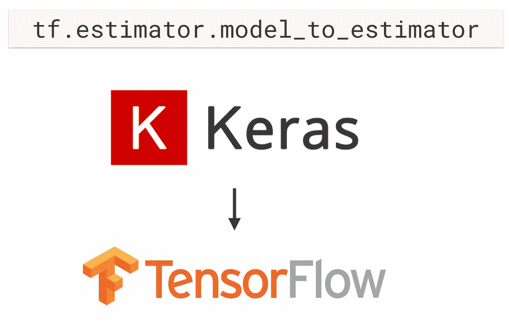

# 使用估计器扩大 Keras

> 原文：<https://towardsdatascience.com/scaling-up-keras-with-estimators-2e1f3f759d9f?source=collection_archive---------12----------------------->

Keras can’t scale up Mt. Hood, but TensorFlow can!

你知道你可以把一个 [Keras 模型](https://www.tensorflow.org/api_docs/python/tf/keras/Model)转换成一个张量流[估算器](https://www.tensorflow.org/api_docs/python/tf/estimator/Estimator)吗？围绕分布式培训和扩展，它将为您提供一整套选项。我们将准备一个 Keras 模型，通过将其转换为张量流估计量来进行大规模运行。

# Keras 模型，符合估计量

所以我们有一个 Keras 模型。易于定义，易于阅读，易于维护。但是我们在扩展到更大的数据集或跨多台机器运行方面做得不太好。

> 幸运的是，Keras 和 TensorFlow 有一些很棒的互操作性特性。

我们想要做的是将我们的 Keras *模型*转换为 TensorFlow *估算器*，它内置了分布式训练。这是我们解决扩展挑战的入场券。

另外，一旦我们的培训结束，做[模型服务](/deploying-scikit-learn-models-at-scale-f632f86477b8)也变得很容易。

 [## 大规模部署 scikit-learn 模型

### Scikit-learn 非常适合组装一个快速模型来测试数据集。但是如果你想运行它…

towardsdatascience.com](/deploying-scikit-learn-models-at-scale-f632f86477b8) 

# 事实真相

我们感兴趣的函数叫做`model_to_estimator`。“模型”部分指的是 Keras *模型*，而“估算器”指的是 TensorFlow *估算器。*

我已经拿了我们在[上一集](/getting-started-with-keras-e9fc04f7ea6a)中从开始的[笔记本，并用新代码更新了它，以将我们的 Keras 模型转换为张量流估计器。培训完成后，我们还将了解如何导出 Keras 模型和 TensorFlow 模型。](https://www.kaggle.com/yufengg/fashion-mnist-with-keras-model-to-tf-estimator)

 [## 演练:Keras 入门，使用 Kaggle

### 这是一个简短的帖子——真正的内容在下面的截屏中，我在这里浏览代码！

towardsdatascience.com](/getting-started-with-keras-e9fc04f7ea6a) 

我用我的 Kaggle 内核录制了一段视频来帮助说明这一切是如何进行的细节:

# 包扎

使用张量流估值器获得分布式训练是对 Keras 模型的简单调整。因此，现在您拥有了两个世界的精华:易于阅读的 Keras 模型创建语法，以及通过 TensorFlow 估值器进行的分布式训练。

请记住，使用 Keras 模型获得分布式培训只需使用`model_to_estimator`。

感谢阅读这一集的[云人工智能冒险](http://yt.be/AIAdventures)。如果你喜欢这个系列，请为这篇文章鼓掌让我知道。如果你想要更多的机器学习动作，一定要关注媒体上的[me](https://medium.com/@yufengg)或[订阅 YouTube 频道](http://yt.be/AIAdventures)以观看未来的剧集。更多剧集即将推出！