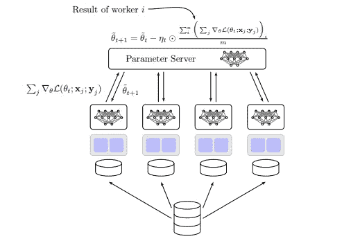
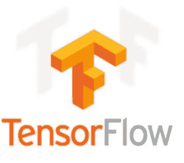
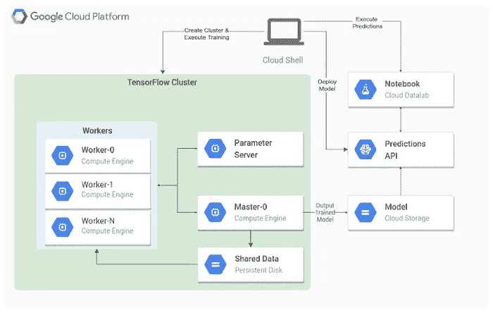

# Spark 上分布张量流的放大

> 原文：<https://towardsdatascience.com/scaling-up-with-distributed-tensorflow-on-spark-afc3655d8f95?source=collection_archive---------7----------------------->

[https://unsplash.com/photos/ZiQkhI7417A](https://unsplash.com/photos/ZiQkhI7417A)

您可能在过去经历过，或者可能在某个时候会经历，内存不足是数据科学中一个非常常见的问题。

由于业务涉及面广，创建包含超过 10，000 个或更多要素的数据集并不罕见。我们可以选择用树算法来处理这样的数据集。然而，Deeplearning 可以更容易地自动设计功能，并将它们处理成你选择的模型。

一个经常出现的问题是，在处理如此大量的数据时，如何在适当的数量内训练您最喜欢的模型。

结合 Tensorflow 和 Spark 的分布式深度学习为这个问题提供了一套便捷的解决方案。

# ***1。简而言之分布式深度学习***

分布式深度学习的关键成分包括中央 ***参数服务器*** 和 ***工人*** 。

Fig 1: Illustration of Distributed Deeplearning from [Joeri Hermans’thesis](http://joerihermans.com/ramblings/distributed-deep-learning-part-1-an-introduction/)

每个 Worker 被分配一个数据集的分区，也称为 ***shard、*** 和一个 ***局部模型副本*** 。在数据集的这一部分上，每个工人应用常规的深度学习优化，例如 mini-batch，并计算梯度。在计算梯度时，工人 ***将其结果*** 提交给中央 ***参数服务器*** 。

在接收到来自所有工作者的所有提交之后，梯度被平均并且模型被更新。接下来 ***允许工人拉动*** 模型的新参数化。

从这个框架中，出现了许多令人兴奋的数学问题，例如想知道这个过程是否可以异步进行？这将避免让工人等待来自参数服务器的每个新的更新。这种技术的缺点是工人可能用过时的模型参数处理数据。我推荐阅读[游里·赫曼的论文](http://joerihermans.com/ramblings/distributed-deep-learning-part-1-an-introduction/)来了解更多关于这个话题的细节。

# 2.分布式张量流来了

Tensorflow 使用数据流图来表示各个操作之间的计算依赖关系。分布式张量流允许我们在不同的进程中计算图的部分，因此在不同的服务器上。

图 2 示出了分布式张量流设置，即张量流集群。

在该集群中，可以找到多个组件，如第一部分所述。

Fig 2\. Illustration of a distributed Tensorflow set-up on Google Cloud Platform ([https://cloud.google.com/architecture/running-distributed-tensorflow-on-compute-engine](https://cloud.google.com/architecture/running-distributed-tensorflow-on-compute-engine))

Tensorflow 提供集装箱管理器 Kubernetes 作为服务不同工作的主要选项。容器可以通过 Tensorflow 的协议缓冲区 **tf.train.Example** 从输入管道接收数据。

就我个人而言，我已经开始喜欢 Tensorflow 的 dara 格式和数据集类 **tf.data.Dataset** ，并开始喜欢上它。遗憾的是，Tensorflow 的数据预处理库还处于起步阶段。如果你像我一样，喜欢在通过任何神经架构之前创建大量的功能，你会寻找另一个专门从事 ETL 的分布式计算框架，比如 Spark。

火花来了…

# 3.火花拯救我们！

Spark 的优化能力在于使用弹性分布式数据集，即 **rdd** 。

Yahoo 提供了一个开源存储库，它为您管理 workers 和 parameters 服务器，同时为您提供来自 rdd 的流数据的可能性。

为此，我们需要使用包装器 **TFCluster** 定义一个集群，如图所示

如果您计划传递一个 rdd 来训练或生成预测，您需要将 input_mode 设置为 **TFCluster。输入模式。火花。**

使用以下代码应用训练或推理:

一切都很好，现在仍然有两个关键问题需要回答:

*   我们应该在哪里传递我们的计算图，包含我们的神经网络？
*   您应该从哪里提取数据批次？

所有这些都是在一个 map-function 中定义的，您需要将它作为一个参数传递。

包含主要成分的示例如下所示:

如本文第一部分所述，集群中有两种类型的作业，参数服务器和 worker。

如前所述，您需要您的参数服务器不断地监听来自作品的可能的 ***提交*** 。这是使用***server . join()***方法完成的。这个方法告诉 TensorFlow 阻塞并监听请求，直到服务器关闭。

在 worker 中，可以在由**TF . device(TF . train . replica _ device _ set(…))处理的上下文管理器中定义自己喜欢的计算图。**

这一行确保参数服务器知道您的工人正在计算任何 **tf 的梯度。你可能已经定义了变量**。因此，它将聚合这些梯度，并在每次提交后发回更新。

如果你像我一样懒惰，你可能也使用**TF . train . monitored training session**来处理回调，比如保存/恢复你的模型，并最终计算训练的摘要。

您需要确保不是所有的员工都在处理这些子任务。建议定义一个所谓的**首席工人**，例如任务指数为 0 的工人。

rdd 上的**流用 **ctx.get_data_feed(…)** 调用。Spark 和 Tensorflow 的组合不是 100%最佳的。您可以根据**TF . train . monitored training session**中定义的一些条件，基于步骤或指标，选择终止应用程序。然而，Spark 不能提前终止 RDD 操作，所以多余的分区仍然会被发送给执行器。 **tf_feed.terminated()** 是为了表示这些多余的分区被忽略。**

# 4.结论

在这篇博客中，我们学习了如何将 Spark 和 Tensorflow 结合起来，将弹性分布式数据帧分布在不同的作品上。我们还理解了参数服务器如何在每次提交 workers 之后不断更新变量。

我们希望这个博客对你有用，因为它对我们来说是一次很好的学习经历！

# 关于作者

[庞欣](https://www.linkedin.com/in/xin-pang/)是一名高级数据科学家，专攻 Spark，目前在一家最大的物流跨国公司应用她的技能。

[Benoit Descamps](https://www.linkedin.com/in/benoit-descamps-phd/) 是一名独立的人工智能顾问，对数学和软件工程充满热情。如果您对集成最新的机器学习解决方案有任何疑问，请直说！

# 更多精彩内容！

@ [Spark 研究笔记:核心概念可视化](https://medium.com/@pang.xin/spark-study-notes-core-concepts-visualized-5256c44e4090)

@ [调整超参数(第一部分):成功减半](https://medium.com/machine-learning-rambling/tuning-hyperparameters-part-i-successivehalving-c6c602865619)

@[tensor flow 中的自定义优化器](https://www.kdnuggets.com/2018/01/custom-optimizer-tensorflow.html)

@[XG boost 回归预测区间](https://medium.com/bigdatarepublic/regression-prediction-intervals-with-xgboost-428e0a018b)

# 参考

[1] [关于分布式深度学习的来龙去脉的有见地的技术讨论](http://joerihermans.com/ramblings/distributed-deep-learning-part-1-an-introduction/) [n/](http://joerihermans.com/ramblings/distributed-deep-learning-part-1-an-introduction/)

[2] [分布式张量流导](https://github.com/tmulc18/Distributed-TensorFlow-Guide)

[3] [分布式张量流简介](http://amid.fish/distributed-tensorflow-a-gentle-introduction)

[4] [分布式 Tenforflow @ Tensorflow 发展峰会(2017)](http://TensorFlow Dev Summit 2017)

[5] [雅虎在 Spark 上的分布式张量流](https://github.com/yahoo/TensorFlowOnSpark)