# 基于 k-近邻的扫描数字识别

> 原文：<https://towardsdatascience.com/scanned-digits-recognition-using-k-nearest-neighbor-k-nn-d1a1528f0dea?source=collection_archive---------3----------------------->

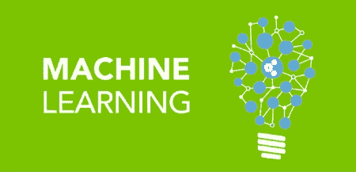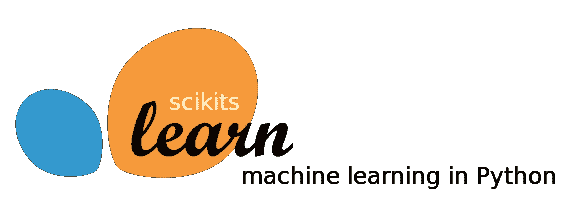

***标签*** *: Python、scikit-image、scikit-learn、机器学习、OpenCV、ImageMagick、梯度方向直方图(HOG)。*

如何在 **2 分钟**内将 500 张背景嘈杂的扫描图像上打印的数字(如下图)提取成 **100%** 准确率的 excel 文件？

简单的答案是:你不可能在 2 分钟内达到 100%的准确率，这需要 8 分钟。

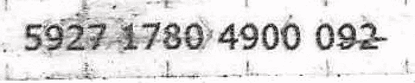

Figure 1\. Original image

预处理图像需要 **2 分钟**，机器学习模型正确预测 98%的数字需要 **6 分钟**，人工修复 2%的不准确预测，尽管只需很少的努力。通过向用户呈现模型无法以 100%的置信度分类的数字，6 分钟成为可能，如本博客结尾的“呈现”部分所示。

# 不成功的方法

在解释 k-NN 解决方案之前，我将简要回顾一下我探索过的一些不成功的提取数字的方法。

## 1-宇宙魔方——谷歌的光学字符识别(OCR)

尽管使用了 Tesseract 的选项将图像识别为单个文本行，并且仅识别数字，但是应用 Google 的 Tesseract 导致了低精度的数字识别。请注意，在应用 Tesseract 之前，图像的背景噪声已被去除(在本博客后面的去噪步骤中有更多内容)。

## 2-图像模板匹配

第二种方法是为 9 个数字中的每一个生成模板图像，然后检测图像中的每一个数字，并使用 openCV 的 *matchTemplate* 函数将其与 0 到 9 个模板中的每一个进行比较

```
**import** cv2result = cv2.matchTemplate(roi, digitROI, cv2.TM_CCOEFF)
(_, score, _, _) = cv2.minMaxLoc(result)
```

由于噪音，这种方法对我们的问题不起作用。然而，这篇博客[https://www . pyimagesearch . com/2017/07/17/credit-card-ocr-with-opencv-and-python/](https://www.pyimagesearch.com/2017/07/17/credit-card-ocr-with-opencv-and-python/)成功演示了使用模板匹配来识别信用卡上的印刷数字。

# 成功的方法:使用机器学习进行训练和预测

最后一种方法是训练我自己的机器学习模型。该解决方案需要满足以下要求:

*   从图像中挑出每个数字
*   选择适当的特征提取应用于每个数字
*   选择多类分类器

输入/数据预处理、特征工程和数据准备是任何基于机器学习的解决方案的核心。选择使用哪种机器学习分类器是一个重要的步骤，然而，它的成功在于上面提到的。

## 大纲:

1.  图像预处理
2.  数字提取和训练/测试数据准备
3.  特征抽出
4.  培养
5.  预测
6.  介绍会；展示会

# 1.图像预处理

弗莱德·魏因豪斯([http://www.fmwconcepts.com/imagemagick/textcleaner/](http://www.fmwconcepts.com/imagemagick/textcleaner/))的 TextCleaner 脚本已经被用于去除图像背景噪声，随后是图像锐化步骤。这两个步骤都需要 ImageMagick 库(【https://www.imagemagick.org】T2)。或者，我推荐使用 python 的库，如 **OpenCV** 或 **scikit-image** 来预处理图像。

```
# text cleaner
./textcleaner -g -e stretch -f 25 -o 10 -u -s 1 -T -p 10 **input.jpg** **output_clean.jpg**# image sharpening
convert **output_clean.jpg** -sharpen 0x10 **output_sharp.jpg**
```

上面的代码产生了下面的图像

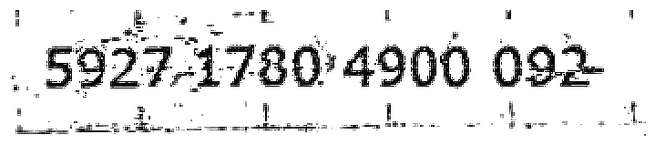

Image 2\. De-noised image

## 2.数字提取和数据准备

由于噪声，使用 OpenCV 的 **findContour** 操作从图像中挑选出每个数字不会产生可靠的结果。对于这个特定的问题，检测数字周围的“边界框”(图像裁剪),然后从裁剪的图像中“挑出”每个数字，这是更健壮的。找到边界框后，后一步很容易，因为每个数字相对于裁剪图像的左上角都有一个固定的坐标。

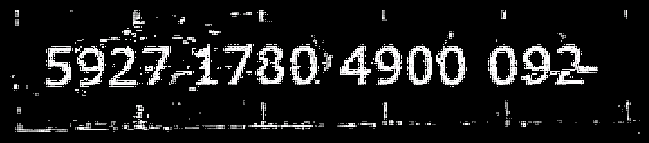

Figure 3\. De-noised inverted image

*注意:使用梯度方向直方图(HOG)进行特征提取需要反转黑/白像素。*

## 2.1 检测包围盒

使用第三方工具来裁剪图像的边界并不能在所有图像上很好地工作。相反，我创建了一个简单的方法来确定性地裁剪图像，并以 100%的准确度检测边界框。

该方法从计算矩形的白色像素开始，如图 4 所示。如果白色像素的计数超过经验设定值，则矩形的坐标是数字的上边界，并将用于裁剪图像。

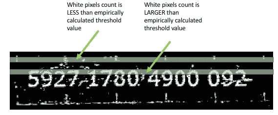

Figure 4\. Top image cropping

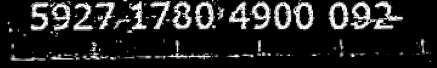

Figure 5\. Top image cropping

同样的技术可以用来左裁剪图像，如图 6 所示。

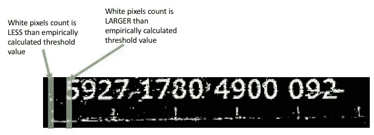

Figure 6\. Left image cropping

上述操作的输出产生了以下图像:

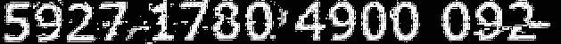

Figure 7\. Cropped image

## 2.2 数字提取

既然检测到了边界框，应该很容易挑出每个数字，因为每个数字都有相对于裁剪图像左上角的预先固定的坐标。

我将上面的代码应用于一组图像，并手动将每个数字的图像分类到标记为 0 到 9 的单独文件夹中，如下所示，以创建我的训练/测试数据集。

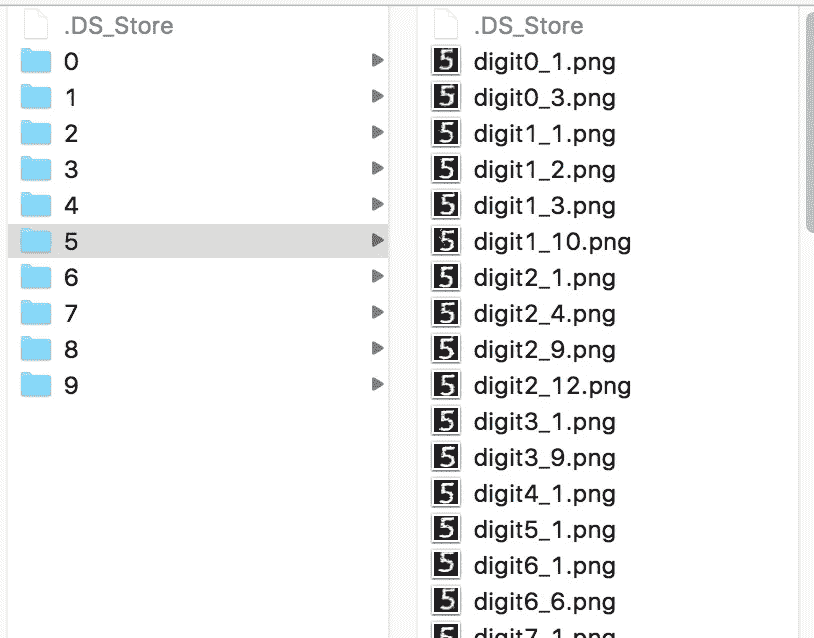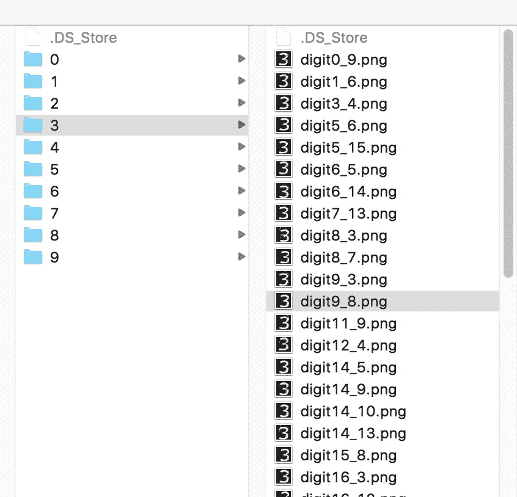

Figure 8\. Manually labeling datasets

## 3.特征抽出

特征提取或特征工程是识别输入(在我们的情况下是数字)的独特特征的过程，以使机器学习算法能够工作(在我们的情况下是聚类相似的数字)。特别令人感兴趣的是**梯度方向直方图(HOG)** ，它已经在许多 OCR 应用中成功用于提取手写文本。下面的代码演示了使用 skimage 的 ***hog*** 函数从图像中提取 HOG。

```
**from** skimage.feature **import** hogdf= hog(training_digit_image, orientations=8, pixels_per_cell=(10,10), cells_per_block=(5, 5))
```

在我的例子中，图像是 50x50 像素，hog 的输入参数(即 ***像素 _ 每单元*** 和 ***单元 _ 每块*** )是凭经验设置的。下图说明了如何在图像上应用 HOG，生成一个包含 200 个值(即特征)的矢量。

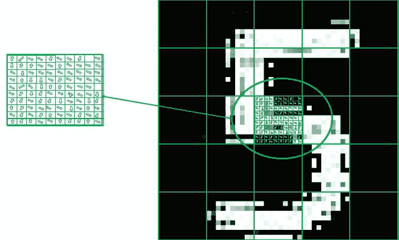

Figure 9\. Illustration of Histogram of Oriented Gradients (HOG)

## 4.培养

在前面的步骤中，我们将相似的数字提取到文件夹中，以构建我们的训练数据集。下面的代码演示了如何构建我们的训练/测试数据集。

既然我们已经创建了训练数据集并将其存储到了 **features** 和 **features_label** 数组中，那么我们就使用 sklearn 的函数 **train_test_split** 将训练集划分为训练集和测试集，并使用结果来训练 k-NN 分类器，最后保存模型，如下面的代码所示。

```
*# store features array into a numpy array* features  = np.array(features_list, **'float64'**)*# split the labled dataset into training / test sets* X_train, X_test, y_train, y_test = train_test_split(features, features_label)*# train using K-NN* knn = KNeighborsClassifier(n_neighbors=3)
knn.fit(X_train, y_train)# get the model accuracy
model_score = knn.score(X_test, y_test)

*# save trained model* joblib.dump(knn, '**/models/knn_model.pkl**')
```

## 5.预测

预测新图像上的数字的过程遵循相同的步骤，即挑选出上述训练步骤中所示的数字，然后简单地应用 k-NN 的 ***预测*** 函数，如下所示。

```
knn = joblib.load(**'/models/knn_model.pkl'**)**def** feature_extraction(image):
    **return** hog(color.rgb2gray(image), orientations=8, pixels_per_cell=(10, 10), cells_per_block=(5, 5))**def** predict(df):
    predict = knn.predict(df.reshape(1,-1))[0]
    predict_proba = knn.predict_proba(df.reshape(1,-1))
    **return** predict, predict_proba[0][predict]digits = []# load your image from file# extract featuress
hogs = list(map(**lambda** x: feature_extraction(x), digits))# apply k-NN model created in previous
predictions = list(map(**lambda** x: predict(x), hogs))
```

k-NN 的 ***预测*** 函数返回一个介于 0 和 9 之间的单个数字值，以表示输入图像的*预测类别*。K-NN 的***predict _ proba****函数返回每个预测类关联的精度。*

*例如，假设我们对包含数字“5”的图像应用了预测。输出的一个例子是`prediction=5 and predict_proba =[[0 0 0 0 0 .8 0 0 .2 0]]`。这意味着 k-NN 以 80%的置信度将图像分类为“5”，以 20%的置信度将图像分类为“8”。*

*最后，`predictions = list(map(lambda x: predict(x), hogs))`产生以下元组向量，其中每个元组表示图像上每个数字的预测类别及其相关预测置信度。任何未以 100%置信度对输入进行分类的预测都将呈现给用户进行手动校正，如下一节所示。*

```
*[
(5, 1.0), (1, 1.0), (9, 1.0), (2, 1.0), (1, 1.0), (2, 1.0), (4,1.0), (7, 1.0), (2, 1.0), (3, 1.0), (4, 1.0), (3, 1.0), (4, 1.0), 
**(4, 0.8)**, (0, 1.0)
]*
```

***6。演示文稿***

*最后一步是在 excel 文件中呈现机器学习模型的结果，如下所示。对于没有 100%准确预测的数字，我在实际预测的下面嵌入了预期数字的图像。这个微小的显示调整减少了用户 80%的时间来修正不准确的预测。此外，这项活动并不令人畏惧，因为它不需要大量的脑力劳动。用户可以在几分钟内滚动文件，并在视觉上将实际结果与预期结果相匹配。许多预测实际上是假阴性的，因此用户不需要做很多修正。*

*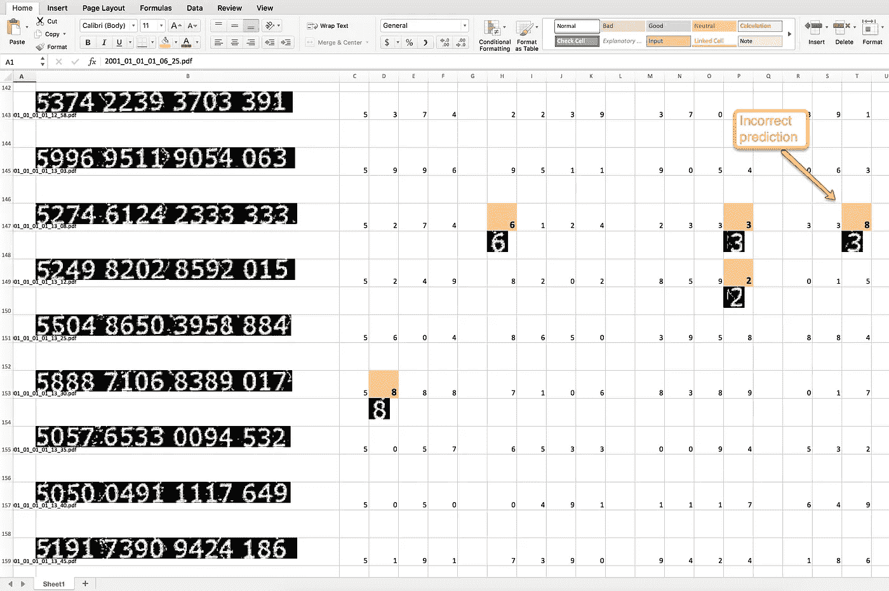*

# *参考书目*

**哈米德，不适用，& Sjarif，不适用(2017)。基于 SVM、KNN 和神经网络的手写识别。arXiv 预印本 arXiv:1702.00723。**

*阿德里安·罗斯布鲁克的博客和书籍(【https://www.pyimagesearch.com】T2)。伟大的计算机视觉资源和许多关于数字识别的文章。*

**帕特尔，I .，贾格塔普，v .，&卡莱，O. (2014)* 。手写数字识别的特征提取方法综述。*国际计算机应用杂志*， *107 期* (12)。*