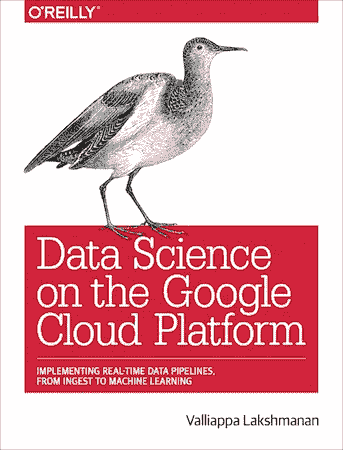
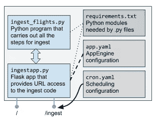

# 使用云功能和云调度程序安排数据接收

> 原文：<https://towardsdatascience.com/scheduling-data-ingest-using-cloud-functions-and-cloud-scheduler-b24c8b0ec0a5?source=collection_archive---------11----------------------->

随着谷歌云的不断发展，我在《谷歌云平台上的数据科学》一书中提出的一些解决方案被取代了，因为更简单、更强大的解决方案变得可用。



There is now a better way to do periodic ingest than the method I suggested in Chapter 2 of this book.

例如，几个月前，我展示了如何仅使用 SQL 构建回归和分类模型。无需移动数据即可实现高度可扩展的机器学习，这意味着我们可以非常轻松地探索机器学习的价值。如果我今天写这本书，我会在第 5 章(交互式数据探索)中插入一个关于 BigQuery ML 的[部分。](/how-to-train-and-predict-regression-and-classification-ml-models-using-only-sql-using-bigquery-ml-f219b180b947)

在本文中，我将讨论第二个更新:一个比我在第 2 章最后一节中介绍的更好的定期数据接收方法。

## 老办法:使用 AppEngine Cron 每月更新

在本书第二章的最后一节，我提出了一个安排每月下载的解决方案。这包括五个步骤:

1.  在 Python 中摄取
2.  Flask webapp
3.  在 AppEngine 上运行
4.  保护 URL
5.  调度 Cron 任务



The solution for periodic ingest presented in the book can be greatly simplified now.

第一步已经在书中完成了，我可以简单地重用那个 Python 程序。剩下的步骤变得更容易了。简单多了。

## 使用云功能摄取

有一种更简单的方法来创建可通过 Http 访问的 web 端点，而不是构建 Flask web 应用程序并在 AppEngine 中运行它。新的方法是使用[云功能](https://cloud.google.com/functions/?utm_source=google&utm_medium=cpc&utm_campaign=na-US-all-en-dr-skws-all-all-trial-e-dr-1003905&utm_content=text-ad-none-any-DEV_c-CRE_311551739239-ADGP_Hybrid%20%7C%20AW%20SEM%20%7C%20SKWS%20%7C%20US%20%7C%20en%20%7C%20EXA%20~%20Compute%20~%20Cloud%20Functions%20~%20cloud%20functions-KWID_43700037004320779-kwd-66359843554&utm_term=KW_cloud%20functions-ST_cloud%20functions&gclid=CNmWx8nB4d4CFR2IxQIdjAoFdw)。我可以使用用于摄取的相同 Python 代码，但是将它包装在一个名为 main.py 的文件中(本文中的所有[代码都在 GitHub](https://github.com/GoogleCloudPlatform/data-science-on-gcp/tree/master/updates/scheduler) 上):

```
import logging
from flask import escape
from ingest_flights import *

def ingest_flights(request):
   try:
      logging.basicConfig(format='%(levelname)s: %(message)s', level=logging.INFO)
      json = request.get_json()
      year = escape(json['year']) if 'year' in json else None
      month = escape(json['month']) if 'month' in json else None
      bucket = escape(json['bucket'])  # requiredif year is None or month is None or len(year) == 0 or len(month) == 0:
         year, month = next_month(bucket)
      logging.debug('Ingesting year={} month={}'.format(year, month))
      gcsfile = ingest(year, month, bucket)
      logging.info('Success ... ingested to {}'.format(gcsfile))
   except DataUnavailable as e:
      logging.info('Try again later: {}'.format(e.message))To create
```

本质上，我的 main.py 有一个接收 Flask 请求对象的函数，从中我可以提取 HTTP Post 的 JSON 有效负载，云函数将通过它被触发。

我通过查看桶中已经有哪些月份，然后使用 ingest_flights.py 中的现有代码获取必要的数据，从而获得下一个月。

一旦我写好了 main.py，就可以通过 gcloud 部署云功能了:

```
gcloud functions deploy ingest_flights \
       --runtime python37 --trigger-http --timeout 480s
```

我们可以通过向 Cloud 函数发送 curl 请求来测试它:

```
REGION='us-central1'
PROJECT=$(gcloud config get-value project)
BUCKET=cloud-training-demos-mlecho {\"year\":\"2015\"\,\"month\":\"03\"\,\"bucket\":\"${BUCKET}\"} > /tmp/message curl -X POST "[https://${REGION}-${PROJECT}.cloudfunctions.net/ingest_flights](https://${REGION}-${PROJECT}.cloudfunctions.net/ingest_flights)" -H "Content-Type:application/json" --data-binary @/tmp/message
```

## 保护云功能

正如上面的代码所示，云函数的 URL 是完全开放的。为了在某种程度上保护 URL 免受拒绝服务攻击，我们应该将 URL 改为不可访问的。

要使 URL 不可访问，请使用 openssl 库生成一个 48 个字符的字符串，删除非字母数字字符，并将结果精简为 32 个字符:

```
URL=ingest_flights_$(openssl rand -base64 48 | tr -d /=+ | cut -c -32)
echo $URLgcloud functions deploy $URL --runtime python37 --trigger-http --timeout 480s
```

这本身是不够的。我们还应该坚持让合法的调用者向我们提供一个令牌作为有效负载的一部分。同样，我们可以使用 openssl 程序生成一个令牌，并将支票添加到 main.py:

```
if escape(json['token']) != 'DI8TWPzTedNF0b3B8meFPxXSWw6m3bKG':
         logging.info('Ignoring request without valid token')
         return
```

做这两件事——一个不可访问的 URL 和检查云函数中的令牌——有助于保护云函数。

## 使用云调度程序调度摄取

现在，云功能提供了一个启动接收作业的 http 端点，我们可以使用云调度程序每月访问该端点一次:

```
gcloud beta scheduler jobs create http monthlyupdate \
       --schedule="8 of month 10:00" \
       --uri=$URL \
       --max-backoff=7d \
       --max-retry-attempts=5 \
       --max-retry-duration=3h \
       --min-backoff=1h \
       --time-zone="US/Eastern" \
       --message-body-from-file=/tmp/message
```

调度器采用多种格式，包括 Unix 的 crontab 格式，但是我发现 AppEngine 的 cron 支持的简单语言格式可读性最好。因此，我们的端点将在每月 8 日美国东部时间上午 10 点被访问。

## 使它不那么单一

如果你看看 ingest_flights.py，ingest 方法做了相当多的事情。它下载文件，解压缩文件，清理文件，转换文件，然后将清理后的文件上传到云存储。

既然我们正在使用云函数，那么重新设计使其不那么单一可能会更好。除了通过 http 调用触发之外，云功能还可以通过向桶中添加文件来触发。

因此，我们可以让第一个云函数简单地将解压缩后的文件上传到云存储，然后让第二个云函数执行提取-转换-加载(ETL)部分。这可能更容易维护，尤其是如果事实证明我们在 ETL 部分有一个 bug。原始数据可用于重新运行 ETL 作业。

## 后续步骤

*   查看 GitHub 上的代码
*   看书:[谷歌云平台上的数据科学](http://shop.oreilly.com/product/0636920057628.do)