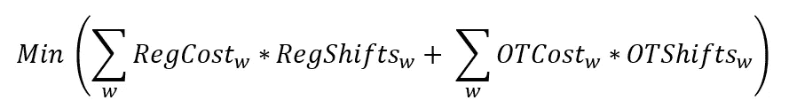
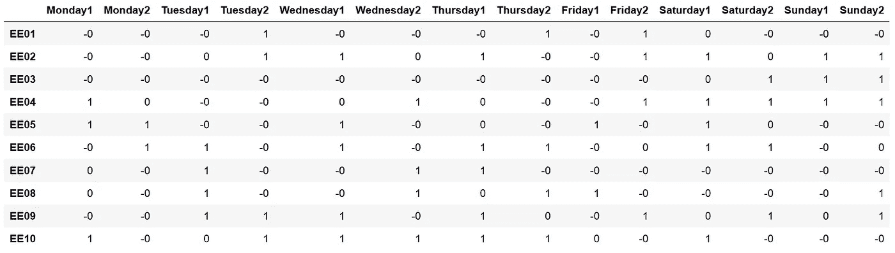
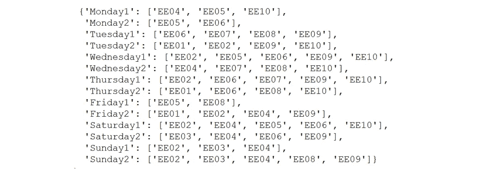

# 轻松调度:Python 成本优化教程

> 原文：<https://towardsdatascience.com/scheduling-with-ease-cost-optimization-tutorial-for-python-c05a5910ee0d?source=collection_archive---------2----------------------->

## 了解如何使用 Python 中的线性编程快速解决优化问题

# 介绍

## 语境

恭喜你！你是镇上最酷商店的骄傲的新主人。为了保持运营，您需要确保为每个班次安排了正确数量的工人。在本教程中，我们将为即将到来的一周设计最低成本的时间表。

## 考虑

在接下来的一周里，每天有两次 8 小时的轮班。您目前有十名员工，其中四名被视为经理。对于一周内超过 40 小时的任何班次(总共 5 个班次)，您都要向员工支付加班费。为了对你的员工公平，你决定每个人至少要工作 3 班，但不能超过 7 班。而且为了保证店铺顺利运转，每个班次至少需要一个经理。


# 构建问题

在深入研究代码之前，让我们通过定义目标、变量和约束来为我们的任务添加结构。

## 目标函数

简而言之，我们要设计最低成本的时间表，既考虑常规时间，也考虑加班时间。我们可以从数学上将其定义为:



其中 *w* 是我们的工人列表，`RegCost`和`OTCost`分别是每个工人正常和加班班次的美元成本，`RegShifts`和`OTShifts`分别是每个工人正常和加班班次的总数。

## 变量

我们将为每个工人/班次组合创建一个变量列表(例如['雇员 1 '，'星期一 1']，['雇员 2 '，'星期一 1']，等等)。).这些变量中的每一个都将是一个二进制值，以表示一个工人是否被调度(1)或不被调度(0)。我们还需要处理常规时间和加班时间的划分，我们将把它作为变量和约束的混合来处理。

## 限制

从上面的问题陈述中，我们知道我们需要遵循一些特殊的注意事项。为了确保我们的优化计划是可接受的，我们将创建特定的约束条件:

*   配备的工人总数等于每班所需的工人总数
*   员工必须保持在全球最小和最大轮班数之间
*   只能在工作人员可用时安排他们(在决策变量“x”中处理)
*   每班至少配备一名经理

# 用 Python 创建我们的模型

## 准备数据

在进入优化模型之前，我们需要一些(说明性的)数据来处理。由于将数据加载到 Python 超出了本教程的范围，我们将快速浏览这一部分。

以下是我们现在所掌握的情况:

*   我们的 14 个班次(一周内每天两班)和 10 名员工的列表(第 7-9 行)
*   每班需要的工人数量(第 12-13 行)
*   每个班次每个工人的可用性(第 17-23 行)
*   一个是经理的列表和一个不是经理的列表(第 26-27 行)
*   每个工人的轮班成本，包括正式工和加班工(第 31-36 行)
*   一些关于最小和最大班次以及在触发加班之前允许多少班次的全局假设(第 40-43 行)

## 初始化模型

*注:从上面的代码可以看出，我们使用的是一个名为*[*guro bi*](http://www.gurobi.com/)*的包。Gurobi 是一个优化求解器，可用于许多编程语言。虽然 Gurobi 的完整版本需要商业许可证，但您可以获得学术或在线课程许可证来免费运行有限版本。*

我们首先需要创建模型的外壳。我们使用以下代码来实现这一点:

```
model = Model(“Workers Scheduling”)
```

## 添加决策变量

让我们将结构化变量转化为代码:

首先，我们需要为每个工人/班次组合创建二进制变量。我们可以用 Gurobi 的`addVars`函数来做到这一点(*注:如果只添加一个变量，用* `addVar` *代替*)。我们指定变量是二进制的，我们还读入了之前创建的作为`ub`(“上限”)的`avail`字典。每个古罗比变量都有一个上限和下限。因为我们使用二进制变量，自然我们的变量必须等于 0 或 1。通过将上限设置为等于`avail`中的值，我们能够嵌入特定工人/班次组合必须等于 0 的约束(即当该工人不可用时)。

接下来，我们必须创建变量来处理正常工作时间和加班时间。如前所述，我们将把这种分割作为变量和约束的组合来处理。现在，我们只是为每个工人创建变量，没有进一步的说明。一个例外是，我们将`overtimeTrigger`设置为一个二进制变量(当给定的工人本周没有加班时为 0，当有加班时为 1)。

## 添加约束

类似地，让我们使用`addConstrs`(一次添加多个约束)和`addConstr`(一次添加一个约束)函数，将上面概述的每个约束转化为代码。

首先，我们指定每个班次分配的工人总数(每个计划工人 1，每个非计划工人 0)等于总班次需求:

接下来，我们处理正常时间和加班时间的划分。为了准确地捕捉到这一点，我们采取了保守的方法。首先，我们指定常规班次的数量加上加班班次的数量等于每个工人的总班次数量。然后，我们确保常规班次的数量小于或等于指定为加班触发器的班次数量。我们这样做是为了确保在加班之前考虑常规班次。为了更进一步，我们添加了最后一个约束条件，即如果一个工人的正常轮班次数小于 5 ( `OTTrigger`)，那么加班的二进制触发器将被设置为 0。

有了这个，我们就可以完成最后的约束了。与上面类似，我们计算每个工人分配的总班次数。我们指定这必须大于或等于最小班次的全局输入，并且小于或等于全局最大班次。最后，我们处理每个班次至少需要一名经理的需求。

## 定义目标函数

我们的目标是最小化计划工人的总成本。我们可以很简单地通过定义一个成本函数来处理这个问题，该函数将正常班次总数乘以每个工人正常班次的成本，以及加班班次总数乘以每个工人加班班次的成本相加。我们告诉 Gurobi，目标是使用`ModelSense`来最小化这种情况。最后，我们使用`setObjective`来指定`Cost`是目标函数。

## 运行优化

在运行优化之前，检查模型可能会有所帮助。一个很好的方法是:

有了这段代码，你将能够看到目标函数、变量、约束等。列为公式，这对于确保代码产生您想要的功能特别有帮助。

在您对模型满意之后，我们可以用一行简单的代码来解决优化问题:

```
model.optimize()
```

## 输出

`optimize`函数产生了一个非常有用的输出，但是并没有给我们太多的工作。在接下来的步骤中，我们将从模型中提取更有意义的信息。

首先，我们想知道计划的总成本。通过运行以下命令，我们发现成本为 7535 美元:

```
print('Total cost = $' + str(model.ObjVal))
```

现在，让我们使用以下内容来查看时间表的控制面板:



Output of the dashboard

最后，让我们创建仪表板的另一个视图，只需打印出分配到每个班次的每个员工的姓名:



Output of the shift assignments

# 结论

通过本教程，我们使用 Python 制作了一个优化问题的端到端解决方案。如果这激起了你的兴趣，你可以自己举个例子。尝试处理连续决策变量、多目标问题、二次优化、不可行模型——可能性是无限的。如果你对创建自己的优化算法感兴趣，可以看看我的关于使用 Python 构建遗传算法的教程。

## 结束注释

你可以在这里找到一个合并的笔记本[。](https://github.com/ezstoltz/optimization)

## 参考资料:

*   【https://en.wikipedia.org/wiki/Gurobi 
*   [https://www . science direct . com/science/article/pii/s 111001681730282 x](https://www.sciencedirect.com/science/article/pii/S111001681730282X)
*   [http://www . guro bi . com/documentation/8.0/examples/work force 5 _ py . html](http://www.gurobi.com/documentation/8.0/examples/workforce5_py.html)