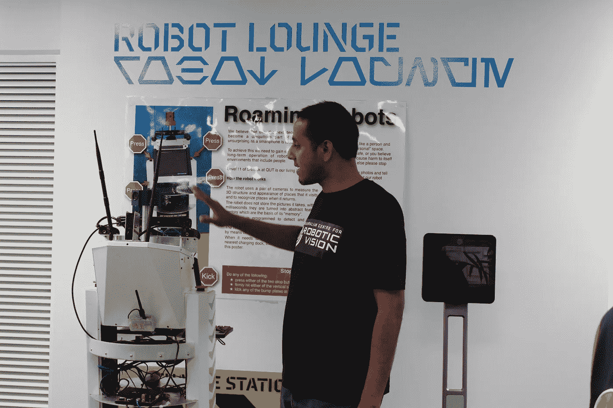
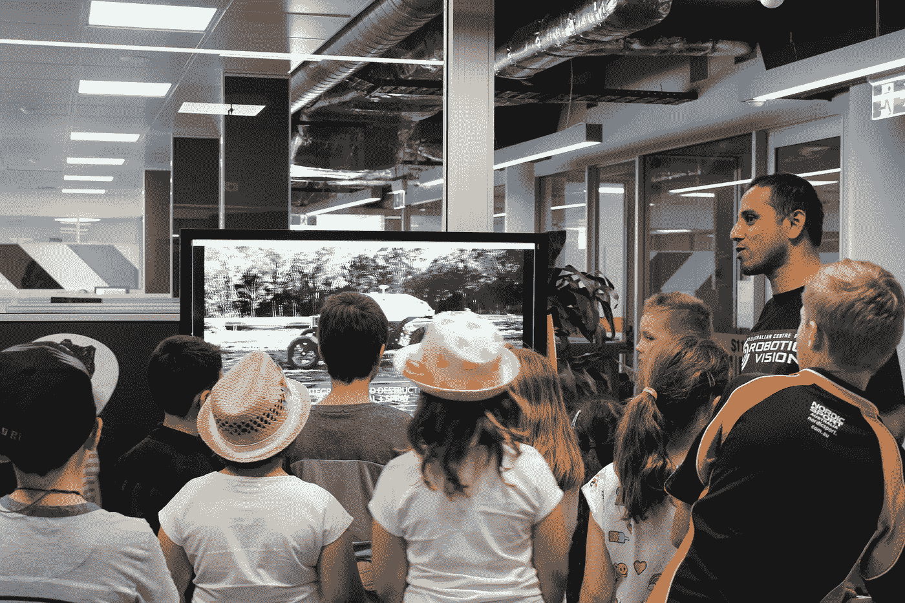
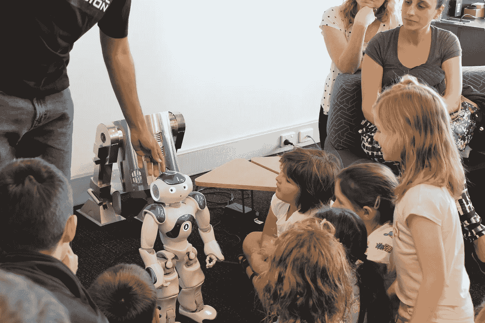

# 学校假期、机器学习和正在学习“看”的机器人

> 原文：<https://towardsdatascience.com/school-holidays-machine-learning-and-robots-that-are-learning-to-see-c5ab183090f6?source=collection_archive---------12----------------------->

去年九月学校放假时，Coding Kids 带着一群学生参观了位于布里斯班花园点校区 QUT 的澳大利亚机器人视觉中心。该中心专门研究和开发学习“看”的机器人。他们的视觉能力是机器人在社会中无处不在部署的剩余技术障碍…

澳大利亚机器人视觉中心在克服这一障碍方面发挥着关键作用。该中心正在开发基础科学和技术，使机器人能够看到、理解它们的环境，并在我们生活和工作的复杂、无组织和动态变化的环境中执行有用的任务。

在参观研究设施的过程中，我们了解到机器人很难像人类一样“看到”和识别图像，并且在这一领域正在进行大量研究，以便改进我们使用技术的方式。如果机器人能学会像人类一样看东西，机器人帮助我们和我们社区的潜力是无穷无尽的。机器人和机器只懂 1 和 0，那么机器人学家和科学家是如何教和训练机器人看图像的呢？

正在开发的机器人原型之一是 Guiabot，这是一种正在学习“看到”周围环境的自动驾驶汽车。与人类不同，机器人更难确定两幅略有不同的图像是否位于同一位置。学生们和一个机器人玩了一个游戏，以测试他们在识别两个图像是否在同一位置上的能力。一个学生试着做了这个游戏，得到了 10/10 的分数。机器人同一场比赛的得分只有 9/10。这表明，对于人类来说，识别两张照片是否属于同一地点要容易得多。尽管技术在进步，但机器人仍然不能像人类一样通过视觉识别自己的位置。

我们了解到机器人正在使用一种叫做机器学习的过程来学习“看”。1959 年，阿瑟·塞缪尔(Arthur Samuel)将机器学习定义为“在没有明确编程的情况下，赋予计算机学习能力的研究领域”。

这是机器人视觉公司的三个机器人，它们正在使用机器学习来学习“看”:

1.  COTSbot 是一个正在学习“看见”和识别大堡礁棘冠海星(COTS)的机器人。COTSbot 的设计是为了控制 COTS 的过剩，这是破坏大堡礁。
2.  QUT 的 Harvey the harvester(基于 UR5 手臂)是一个辣椒采摘机器人。它是学习“看见”和识别成熟的辣椒，准备采摘。澳大利亚 30%的作物都被浪费了，原因是在一年中需要收割作物的确切时间缺少工人。
3.  QUT 的 AgBot 是一个 3 米宽的杂草清除机器人，可以识别需要清除的棉花和杂草。

这三个机器人正在学习识别一个特定的物体，以便它能为我们做有用的工作。学习和训练机器人的方法被称为机器学习。机器学习基于一套复杂的算法，计算机，或者在这种情况下，机器人，使用已知数据进行学习和预测。

机器人首先通过学习识别图像中的目标物体，如棉花、辣椒和杂草，开始它们的学习之旅。然后，机器人开始学习识别目标物体的 3D 打印版本。在成功完成这一级别的训练后，机器人开始训练识别现实生活中的物体，例如大堡礁中的帆布床、果园中成熟的辣椒和土壤中的杂草。在这个级别的训练中，机器人学会区分 3D 打印版本和真实的目标对象。

澳大利亚机器人视觉卓越中心专注于机器人“看”的研究和开发，并在克服机器人在社会中无处不在部署的最后一个技术障碍方面发挥了关键作用。机器人改善我们生活和环境的潜力是无限的。这是一个有趣的研究领域，我们学校团体对该中心的访问是一个让孩子们接触科技奇迹的好机会。正如孩子们在学习一样，机器人也在学习。

[点击我们的脸书页面](http://www.facebook.com/codingkidstutoring/)了解我们最新的儿童免费科技活动。

在下面的视频中观看机器人 Nao 跳江南 style:

文章最初发表在[这里](https://www.codingkids.com.au/blog/2016/10/3/robotic-vision-free-holiday-tech-event-for-children)。