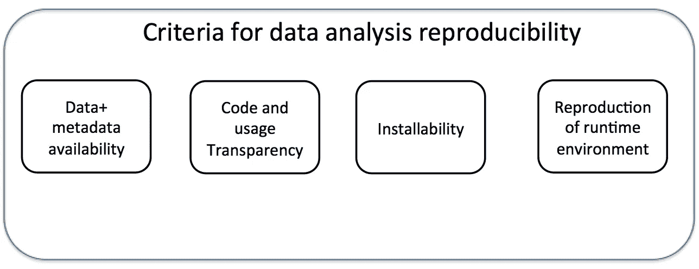
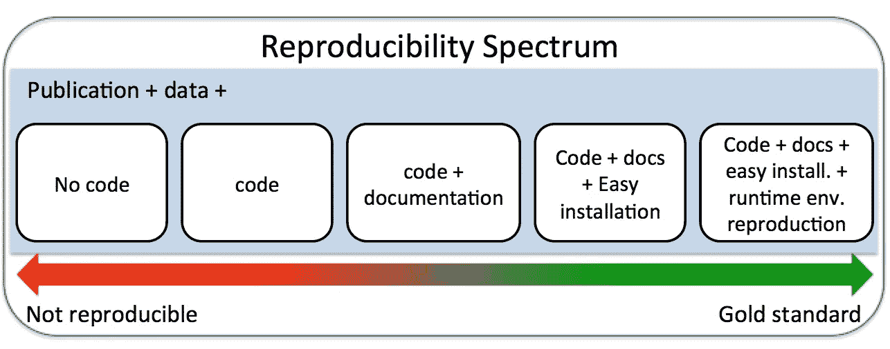
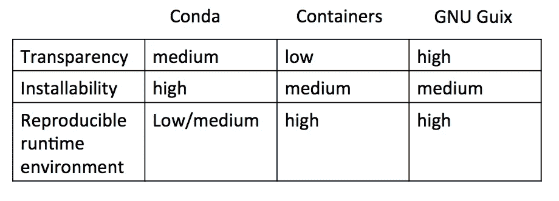

# 科学数据分析管道和再现性

> 原文：<https://towardsdatascience.com/scientific-data-analysis-pipelines-and-reproducibility-75ff9df5b4c5?source=collection_archive---------13----------------------->

Photo by [Campaign Creators](https://unsplash.com/@campaign_creators?utm_source=medium&utm_medium=referral) on [Unsplash](https://unsplash.com?utm_source=medium&utm_medium=referral)

## 管道是做什么的？我们为什么需要它们？

管道是方便的计算工具。数据分析通常需要数据采集、质量检查、清理、探索性分析和假设驱动分析。管道可以自动完成这些步骤。他们将原始数据处理成合适的格式，并以简化的方式用统计工具或机器学习模型进行分析。实际上，数据分析管道执行一系列命令行工具和定制脚本。这通常提供经过处理的数据集和人类可读的报告，涵盖诸如数据质量、探索性分析等主题。

在我们的领域中，原始数据是包含测序读数的文本文件。读数有一个 4 个字母的代码(ACGT ),它们来自基因组的特定位置。我们需要对读数进行质量检查，将它们与基因组对齐，量化它们，并对它们运行统计/机器学习模型。不同的命令行工具和定制脚本必须按顺序运行才能完成这些任务。如果质量检查或校准出现问题，部分或所有步骤需要使用不同的参数重新运行，具体取决于使用数据观察到的问题的性质。我们可能需要运行数百次，因此通过管道至少自动化部分任务是有益的。

## 什么是再现性？为什么重要？

当您不得不重复处理一个带有一些参数变化的数据集或处理多个数据集时，管道会有很大帮助。由于基本的数据处理和分析任务可能需要大量的实际操作时间，因此自动化这些任务的某些部分可以节省时间。然后，研究人员可以将更多时间花在可视化、结果交流或定制的统计/机器学习分析上。由于这种便利，许多研究人员正在创建管道，并通过[出版物](https://www.ncbi.nlm.nih.gov/pubmed/?term=data+analysis+pipeline)与社区共享。通常，当您共享管道时，您会希望确保在为其他用户提供相同的输入数据时，您的管道会产生相同的输出。如何使用创建者使用的完全相同的依赖项安装完全相同的管道，并确保它产生相同的输出？虽然这听起来是一个微不足道的问题，但关于“[科学中的再现性危机](https://en.wikipedia.org/wiki/Replication_crisis)的报道表明，实现这一点并不容易。其他研究人员一再未能重现已发表的实验。这种“再现性危机”并不局限于生物学或心理学等领域。计算领域[也遭受这种](http://science.sciencemag.org/content/334/6060/1226.full)。

对于可再现的数据分析，有几个标准。

***数据和元数据可用性:*** 数据和元数据应该毫无疑问地可用。没有这些，就没有办法重现一个分析。在我们的研究领域，数据和元数据通常在发布后存放在公共数据库中。

***透明:*** 你所使用的代码以及运行代码所需的依赖关系应该是完全透明的。这也延伸到依赖项的源代码可用性。不希望有一个工具的行为主要依赖于专有的二进制 blob /黑盒。此外，您需要知道依赖项的确切版本和配置，以便有机会重现数据分析管道。优选地，安装过程跟踪不同的依赖结构并安装你需要的所有东西，参见下面的要点。

***易于安装(可安装性):*** 计算分析工具和管道应该努力做到易于安装。我认为，如果管道有许多必须单独安装的依赖项，我们中的许多人都会望而却步。即使我们得到承诺，在我们努力完成每个依赖项的安装后，会得到一个可以复制作者版本的工作管道，这种情况仍然会存在。管道的依赖项越多，就越有可能至少有一个在安装过程中出现问题。很多已发布的科学软件无法安装。研究声称至少有 50%的已发布软件是不可安装的【参见[这里](http://cs.brown.edu/~sk/Memos/Examining-Reproducibility/) & [这里](http://reproducibility.cs.arizona.edu/tr.pdf)】。我怀疑对于管道来说，情况更糟，因为许多管道都有更复杂的依赖关系。浏览过糟糕的自述文件并试图安装所有依赖项的人非常清楚为什么“易于安装”很重要。

***运行时环境再现性:*** 安装的软件应该在每台机器上表现相同，也就是说我们需要在每台机器上安装完全相同的软件。实现这一点并不简单，因为软件依赖于许多不同的东西，从编译器到系统库，再到第三方软件和所需的库。如果您想在不同的机器上以完全相同的方式构建软件并获得相同的软件，您需要控制这个复杂的依赖系统。依赖项的版本及其构建方式会对您尝试安装的软件产生影响。例如，如果您尝试安装的软件需要 Boost C++库，则 Boost 1.68 版与 1.38 版相比可能会有所不同。可能会有错误修复或改进，可能会改变我们试图安装的软件的行为。因此，由于依赖关系的差异，即使在两台不同的计算机上安装了相同的版本，该软件也会有不同的行为。

如果您可以安装完全相同的软件，以完全相同的方式构建，并对编译器有完全相同的依赖关系，您就有很好的机会在不同的机器上重现运行时环境，从而使用相同的输入数据进行分析。唯一的例外是，如果软件有一些你不能控制的随机成分，那么就不可能重现分析。例如，k-means 聚类算法可能根据随机初始化过程每次产生不同的聚类结果。如果我们不能通过设置随机种子来控制这种行为，我们就无法重现结果。

Essential ingredients of data analysis reproducibility. Reproducibility requires availability of data and being able to use the same exact software.

## 计算分析的再现性光谱

科学家们的主要目标是尽可能快速准确地分析数据，因此任何为我们自己或其他潜在用户的未来版本做好事的努力似乎都是错误的。对于许多科学期刊来说，把你的代码放在 github 上就足够了，这只是最近一些期刊的要求。我们和许多其他人认为这并不总是足够的。

实际上，当我们想使用一个已发布的数据分析工具时，我们许多人的想法是:1)“我能安装已发布的软件并得到类似的结果吗？2)“我也可以在我的研究中使用这个吗？".在这一点上，我们只是想使用软件，不会试图在出版物中重现分析，除非它是测试用例或例子的一部分。因此，许多研究人员对再现性的理解是与可安装性联系在一起的。

然而，如果我们真的关心可重复性，正确的问题应该是“如果我可以安装它，我可以用相同的输入数据得到与发表的论文相同的结果吗？”。更普遍但相关的问题是“当我在不同的系统上安装软件时，我可以用相同的输入数据得到相同的结果吗？”。我认为正面回答这些问题需要严格控制数据分析管道的依赖性。提供管道的人应该复制他们的软件环境，并以虚拟机或容器的形式提供。或者，他们应该确保当用户安装管道时，他们获得了相同版本的依赖项。每个依赖项都应该以相同的方式构建，并且在您的机器和用户的机器上安装的软件应该是完全相同的。不严格控制依赖关系将导致软件行为不同。这些行为差异可能会改变分析结果。

所有这些不同的观点或对再现性的无知造成了从“不可再现”到“黄金标准”的再现性范围。虽然许多人认为在线提供源代码就足够了，但其他人需要满足以上提到的更多标准。

Reproducibility spectrum observed in publications. Sharing data and code is seen as enough to reproduce the data analysis by many. However, this is not enough.

## **拯救集装箱**

处理运行时环境的可安装性和可复制性的最流行的方法之一是使用容器，这是一种轻量级的虚拟机。我们领域中最流行的容器是 [docker](https://www.docker.com/) 和最近的 [singularity](https://singularity.lbl.gov/) 容器。使用这种方法，管道和管道本身的复杂依赖关系可以被“容器化”。这意味着，如果您能够设法在这个轻量级虚拟机中安装您的管道和依赖项，您就可以运送容器，并确保使用该容器的任何人都能够复制您的软件环境。不同操作系统的结果应该是相同的。另一种方法是以容器的形式提供管道的依赖关系。在此设置中，您在管道中使用的每个工具都将是一个容器。有一些管道框架可以利用这一点，但我发现这种方法有些不切实际。

安装和运行时复制的便利性是以降低透明度和安全性为代价的。很难确切核实集装箱里装的是什么。Docker 建议使用 docker 文件，但是它们不一定具有容器中的软件版本。它主要是从软件包管理器安装软件的命令集合。如果不专门在 dockerized 环境中分析数据和开发代码，容器也更难维护。如果没有，在创建管道后，您必须将其容器化，并检查是否有相同的结果，这是额外的工作。人们努力使容器更加安全、透明和易于使用，但是它们没有被社区广泛采用。

## **包装经理和再现性**

提供可安装性和依赖性管理的另一种方式是使用包管理器。您可以使用软件包管理器将您的管道构建为真正的软件和软件包，或者从软件包管理器提供要安装的软件包列表。

不管你选择哪种途径，一个非常流行的方法是使用 [Conda](https://conda.io/docs/) 包管理器。它非常容易使用，不需要 root 访问权限，你可以获得预编译的二进制文件，这大大减少了安装时间，并且可以在 windows、mac OS 和 linux 上工作(大部分时间)。给康达打包软件也相对容易一些。此外，康达还有大量的贡献者和维护者。这些功能旨在最大化可安装性。然而，Conda 包根本不可复制。您可以在不同的时间获得相同名称+版本查询的不同二进制文件，并且没有办法跟踪哪些依赖项的源文件生成了该二进制文件。构建软件的系统环境不是孤立的。在构建期间，进程可以访问不在软件包配方中的其他库，并且 conda 还假设某些低级软件包在所有环境中都可用。它们的存在或它们的版本会影响构建，并在不同的系统上创建不同的软件。Bioconda 试图通过在容器中建造来规避这些问题。

虽然包管理器通常提供可安装性，但是很少有人关心构建的可重复性。如果您可以确保安装的软件在不同的系统上是完全相同的，那么您就可以获得运行时再现性，并在相同的输入数据下获得相同的结果(减去“*运行时环境再现性*”小节中提到的警告)。 [GNU Guix 包管理器](https://www.gnu.org/software/guix/manual/en/html_node/Package-Management.html)通过严格管理和跟踪要构建的软件的完整依赖图来实现这一点。它减少了对构建和安装软件的系统环境的假设。因为它知道所有的依赖项，所以它可以在一个隔离的环境中构建它们。这个过程的结果通常是在不同的机器上安装后逐位相同的文件(见[此处](https://academic.oup.com/gigascience/advance-article/doi/10.1093/gigascience/giy123/5114263)对不同机器上构建的各种生物信息学软件逐位相同性的评估)。它还提供开箱即用的容器化。您可以为您的管道及其所有依赖项制作 docker 和 singularity 容器。Guix 构建的容器包含了管道所需要的依赖——不多也不少。考虑到它提供的可再现性和健壮性，我们选择使用 Guix 来管理我们的管道的[依赖性。](http://bioinformatics.mdc-berlin.de/pigx)

然而，Guix 本身只适用于 linux，并且需要一个根 dameon 来进行构建隔离。打包软件不像 conda 那么容易，尽管 R 和 Python 的导入程序为来自那些框架的包做了几乎所有的工作。对于其他软件，可能会更复杂。此外，用户可能会发现很难管理 Guix 的灵活性。你可以拥有同一个软件的不同版本，你可以回滚到旧版本，但是[管理那个](https://www.gnu.org/software/guix/blog/2018/multi-dimensional-transactions-and-rollbacks-oh-my/)可能会令人困惑。

## **管道框架对再现性的影响**

管道框架对再现性几乎没有影响。再现性的主要挑战是提供运行时环境的可安装性和再现性。管道框架提供了一种结构化的方式来将工具/脚本管道化在一起，并提供了额外的功能，例如简单的并行化。snakeMake、Rufus、nextflow 等管道框架在此回顾[不同的优缺点。](https://www.ncbi.nlm.nih.gov/pmc/articles/PMC5429012/)

重申一下，框架的选择不是重现分析管道的主要问题。对于[我们自己的目的](http://bioinformatics.mdc-berlin.de/pigx)由于 snakeMake 在生物信息学社区的广泛使用，我们选择了它，但是我们可以很容易地切换到其他东西，并且仍然是可复制的。

## **离别的思念**

如果科学家们希望他们的工具或方法被更广泛的受众使用，那么让数据分析管道具有可重复性应该是他们的目标。快速和肮脏的方法是使用容器。然而，这对于维护或未来升级来说并不容易。Needles 说，部署分析管道不是一种透明的方式，研究需要最大的透明度。更明智的方法是将管道打包到包管理器中。Conda 软件包管理器易于使用，但永远无法完全重现。但是它的易用性和对生物信息学的大量社区支持使它成为许多人的首选工具。通过 Guix 包管理器，可以获得更多的可复制性，这是其他包管理器所不能提供的。它通过设计和源代码到二进制代码的透明性提供了软件构建的可再现性。像其他一些包管理器一样，Guix 附带了项目/用户特定的软件概要文件，其中您可以拥有相同软件的不同版本，而不会有任何冲突。您还可以毫不费力地构建 docker 和 singularity 容器。共享一个 Guix 清单文件和你的脚本就足以重现你的分析的软件方面。

实际上，所有选项(Conda、containers 和 Guix)都比仅仅共享代码和文档要好得多。但在我看来，Guix 更接近再现性的黄金标准，包括透明性、易于安装和运行时环境再现性。

Comparison of different ways of deploying pipelines with respect to criteria for reproducibility. Containers and Guix have medium installability because they require a framework to be installed first before users can use it, this first step most often needs root access. Conda does not keep track of full dependency graphs and makes assumptions about your system that’s why it doesn’t have high transparency or reproducible runtime environment. Containers have low transparency because it is hard to tell what is exactly in them even with dockerfiles present.