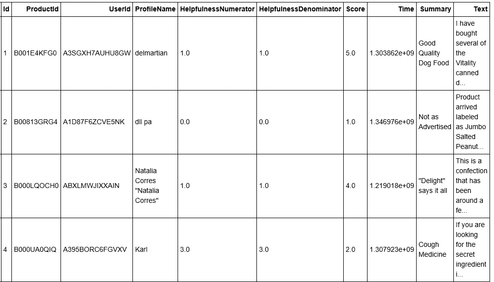
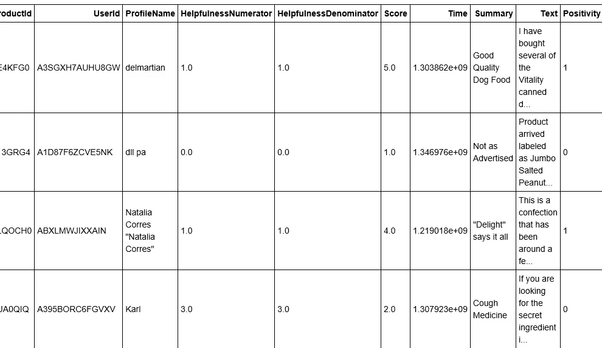

# sci kit-了解亚马逊美食评论的文本分析

> 原文：<https://towardsdatascience.com/scikit-learn-for-text-analysis-of-amazon-fine-food-reviews-ea3b232c2c1b?source=collection_archive---------1----------------------->


Photo credit: Pixabay

(本文首发于 [DataScience+](https://datascienceplus.com/scikit-learn-for-text-analysis-of-amazon-fine-food-reviews/) )

我们知道[亚马逊产品评论对商家很重要](https://www.entrepreneur.com/article/253361#)，因为这些评论对我们如何做出购买决定有着巨大的影响。所以，我从 [Kaggle](https://www.kaggle.com/snap/amazon-fine-food-reviews) 下载了一个亚马逊美食评论数据集，这个数据集最初来自 [SNAP](http://snap.stanford.edu/data/web-FineFoods.html) ，看看我能从这个庞大的数据集里学到什么。

我们在这里的目的不是掌握 Scikit-Learn，而是探索单个 csv 文件上的一些主要 Scikit-Learn 工具:通过分析截至 2012 年 10 月(包括 10 月)的一组文本文档(568，454 篇食品评论)。让我们开始吧。

## 数据

查看数据帧的头部，我们可以看到它包含以下信息:

1.  产品 Id
2.  用户标识
3.  ProfileName
4.  帮助分子
5.  有用性分母
6.  得分
7.  时间
8.  摘要
9.  文本

```
import pandas as pd
import numpy as np

df = pd.read_csv('Reviews.csv')
df.head()
```



Figure 1

就我们今天的目的而言，我们将重点关注分数和文本列。

让我们从清理数据框开始，删除任何缺少值的行。

分数列的范围是从 1 到 5，我们将删除所有等于 3 的分数，因为我们假设这些分数是中性的，没有为我们提供任何有用的信息。然后，我们添加了一个名为“积极性”的新列，其中任何高于 3 的分数都被编码为 1，表明它得到了积极的评价。否则，它将被编码为 0，表明它是负面评价。

```
df.dropna(inplace=True)
df[df['Score'] != 3]
df['Positivity'] = np.where(df['Score'] > 3, 1, 0)
df.head()
```



Figure 2

看起来不错。

现在，让我们使用“Text”和“Positivity”列将数据分成随机的训练和测试子集，然后打印出第一个条目和训练集的形状。

```
from sklearn.model_selection import train_test_splitX_train, X_test, y_train, y_test = train_test_split(df['Text'], df['Positivity'], random_state = 0)print('X_train first entry: \n\n', X_train[0])
print('\n\nX_train shape: ', X_train.shape)from sklearn.model_selection import train_test_splitX_train, X_test, y_train, y_test = train_test_split(df['Text'], df['Positivity'], random_state = 0)print('X_train first entry: \n\n', X_train[0])
print('\n\nX_train shape: ', X_train.shape)
```

***X_train 第一条目:***

***我买过几款活力狗粮罐头，发现质量都很好。这种产品看起来更像炖肉，而不是加工过的肉，而且闻起来更香。我的拉布拉多是挑剔的，她比大多数人更欣赏这个产品。***

***X_train 形状:(26377，)***

查看 X_train，我们可以看到我们收集了超过 26000 条评论或文档。为了对文本文档执行机器学习，我们首先需要将这些文本内容转换为 Scikit-Learn 可以使用的数字特征向量。

## 词汇袋

最简单和最直观的方法是“单词袋”表示法，它忽略了结构，只计算每个单词出现的频率。CountVectorizer 允许我们使用单词袋方法，将一组文本文档转换成一个令牌计数矩阵。

我们实例化 CountVectorizer 并使其适合我们的训练数据，将我们的文本文档集合转换为令牌计数矩阵。

```
from sklearn.feature_extraction.text import CountVectorizervect = CountVectorizer().fit(X_train)
vect
```

***count vectorizer(analyzer = ' word '，binary=False，decode_error='strict '，dtype =<class ' numpy . int 64 '>，encoding='utf-8 '，input='content '，lowercase=True，max_df=1.0，max_features=None，min_df=1，ngram_range=(1，1)，preprocessor=None，stop_words=None，strip_accents=None，token_pattern= '(？u)\\b\\w\\w+\\b '，tokenizer=None，vocabulary = None)***

这个模型有许多参数，但是默认值对于我们的目的来说是相当合理的。

默认配置通过提取至少两个字母或数字的单词(由单词边界分隔)来标记字符串，然后将所有内容转换为小写，并使用这些标记构建词汇表。我们可以通过使用 *get_feature_names* 方法来获取一些词汇表，如下所示:

```
vect.get_feature_names()[::2000]
```

***['00 '，' anyonr '，'漂白'，'矮胖'，'战败'，' er '，'贾尼尼'，'印象'，'小'，'项链'，'宠物'，'缩减'，'衬衫'，'夜宵']***

看着这些词汇，我们可以对它们的内容有一个小小的了解。通过检查 *get_feature_names* 的长度，我们可以看到我们正在处理 29990 个特性。

```
len(vect.get_feature_names())
```

***29990***

接下来，我们将 X_train 中的文档转换成一个文档术语矩阵，它给出了 X_train 的单词包表示。结果存储在一个 SciPy 稀疏矩阵中，其中每一行对应一个文档，每一列是来自我们训练词汇表的一个单词。

```
X_train_vectorized = vect.transform(X_train)
X_train_vectorized
```

***< 26377x29990 以压缩稀疏行格式存储了 1406227 个元素的“<类“numpy . int 64”>”稀疏矩阵>***

列的这种解释可以按如下方式检索:

```
X_train_vectorized.toarray()
array([[0, 0, 0, ..., 0, 0, 0],
       [0, 0, 0, ..., 0, 0, 0],
       [0, 0, 0, ..., 0, 0, 0],
       ..., 
       [0, 0, 0, ..., 0, 0, 0],
       [0, 0, 0, ..., 0, 0, 0],
       [0, 0, 0, ..., 0, 0, 0]], dtype=int64)
```

该矩阵中的条目是每个单词在每个文档中出现的次数。因为词汇表中的单词数量比单个文本中可能出现的单词数量大得多，所以这个矩阵的大多数条目都是零。

## 逻辑回归

现在，我们将基于这个特征矩阵 *X_ train_ vectorized，*来训练逻辑回归分类器，因为逻辑回归对于高维稀疏数据工作得很好。

```
from sklearn.linear_model import LogisticRegressionmodel = LogisticRegression()
model.fit(X_train_vectorized, y_train)
```

*LogisticRegression(C=1.0，class_weight=None，dual=False，fit_intercept=True，intercept_scaling=1，max_iter=100，multi_class='ovr '，n_jobs=1，penalty='l2 '，random_state=None，solver='liblinear '，tol=0.0001，verbose=0，warm_start=False)*

接下来，我们将使用 X_test 进行预测，并计算曲线得分下的面积。

```
from sklearn.metrics import roc_auc_scorepredictions = model.predict(vect.transform(X_test))print('AUC: ', roc_auc_score(y_test, predictions))
```

***AUC:0.797745838184***

成绩还不错。为了更好地理解我们的模型是如何做出这些预测的，我们可以使用每个特征(一个词)的系数来确定它在积极和消极方面的权重。

```
feature_names = np.array(vect.get_feature_names())sorted_coef_index = model.coef_[0].argsort()print('Smallest Coefs: **\n{}\n**'.format(feature_names[sorted_coef_index[:10]]))
print('Largest Coefs: **\n{}\n**'.format(feature_names[sorted_coef_index[:-11:-1]]))
```

***最小系数:['最差' '失望' '可怕' '糟糕' '还行' '都不是' '耻辱' '不幸' '失望' '恶心']***

***最大系数:['上钩' '光明' '美味' '惊艳' '怀疑' '担忧' '好吃' '极好' '再订购' '好吃']***

对十个最小和十个最大的系数进行排序，我们可以看到该模型预测了像“最差”、“令人失望”和“可怕”这样的负面评论，以及像“着迷”、“明亮”和“美味”这样的正面评论。

但是，我们的模型可以改进。

## TF–IDF 术语权重

在大型文本语料库中，一些单词会经常出现，但很少携带关于文档实际内容的有意义的信息(例如“the”、“a”和“is”)。如果我们将计数数据直接输入到分类器中，那些非常频繁的词将会掩盖那些更罕见但更有趣的词的频率。Tf-idf 允许我们根据术语对文档的重要性来衡量它们。

因此，我们将实例化 TF–IDF 矢量器，并使其适合我们的训练数据。我们指定 *min_df* = 5，这将从我们的词汇表中删除出现在少于五个文档中的任何单词。

```
from sklearn.feature_extraction.text import TfidfVectorizervect = TfidfVectorizer(min_df = 5).fit(X_train)
len(vect.get_feature_names())
```

***9680***

```
X_train_vectorized = vect.transform(X_train)model = LogisticRegression()
model.fit(X_train_vectorized, y_train)
predictions = model.predict(vect.transform(X_test))
print('AUC: ', roc_auc_score(y_test, predictions))
```

***AUC:0.759768072872***

因此，尽管我们能够将特征的数量从 29990 减少到仅仅 9680，我们的 AUC 分数下降了几乎 4%。

使用下面的代码，我们能够获得一个具有最小 tf-idf 的功能列表，这些功能通常出现在所有评论中，或者很少出现在很长的评论中，以及一个具有最大 TF-IDF 的功能列表，这些功能包含经常出现在评论中，但通常不会出现在所有评论中的单词。

```
feature_names = np.array(vect.get_feature_names())sorted_tfidf_index = X_train_vectorized.max(0).toarray()[0].argsort()print('Smallest Tfidf: \n{}\n'.format(feature_names[sorted_tfidf_index[:10]]))
print('Largest Tfidf: \n{}\n'.format(feature_names[sorted_tfidf_index[:-11:-1]]))
```

***最小 tfi df:[' blazin ' ' 4 thd ' ' nations ' ' Committee ' ' 300 MGS ' ' 350 MGS ' ' sciences ' ' biochemical ' ' nas ' ' fnb ']***

***最大 Tfidf: ['芥末' ' br ' '挺举' '唐' '辣椒' '伤口' '鱼子酱' '莎莎' '垃圾' ' el']***

让我们测试我们的模型:

```
print(model.predict(vect.transform(['The candy is not good, I will never buy them again','The candy is not bad, I will buy them again'])))
```

***【1 0】***

我们当前的模型将“糖果不好吃，我再也不会买它们”的文档错误分类为正面评论，也将“糖果不好吃，我会再买它们”的文档错误分类为负面评论。

## n-grams

解决这种错误分类的一种方法是添加 n 元语法。例如，二元模型计算相邻单词对的数量，并且可以给我们一些特征，比如坏和不错。因此，我们正在重新调整我们的训练集，指定最小文档频率为 5，并提取 1-grams 和 2-grams。

```
vect = CountVectorizer(min_df = 5, ngram_range = (1,2)).fit(X_train)
X_train_vectorized = vect.transform(X_train)
len(vect.get_feature_names())
```

***61958***

现在我们有了更多的功能，但是我们的 AUC 分数增加了:

```
model = LogisticRegression()
model.fit(X_train_vectorized, y_train)predictions = model.predict(vect.transform(X_test))
print('AUC: ', roc_auc_score(y_test, predictions))
```

**T5 AUC:0.838772959029**

使用系数来检查每个特征，我们可以看到

```
feature_names = np.array(vect.get_feature_names())
sorted_coef_index = model.coef_[0].argsort()print('Smallest Coef: \n{}\n'.format(feature_names[sorted_coef_index][:10]))
print('Largest Coef: \n{}\n'.format(feature_names[sorted_coef_index][:-11:-1]))
```

***最小系数:['最差' '还行' '不推荐' '不值得' '糟糕' '最好' '不幸' '糟糕' '非常失望' '失望']***

***最大系数:['好吃' '惊艳' '不太' '优秀' '失望' '不苦' '好吃' '上瘾' '很棒' '喜欢这个]]***

我们的新模型已经正确地预测了负面评论的“不推荐”、“不值得”等二元模型，以及正面评论的“不苦”、“不太”等二元模型。

让我们测试我们的新模型:

```
print(model.predict(vect.transform(['The candy is not good, I would never buy them again','The candy is not bad, I will buy them again'])))
```

[0 1]

我们的最新模型现在可以正确地将它们分别识别为负面和正面评论。

## 自己试试

我希望你喜欢这篇文章，并享受在文本数据上练习机器学习技能的乐趣！请随意留下反馈或问题。

参考资料:

[Scikit-learn](http://scikit-learn.org/stable/modules/feature_extraction.html#text-feature-extraction)