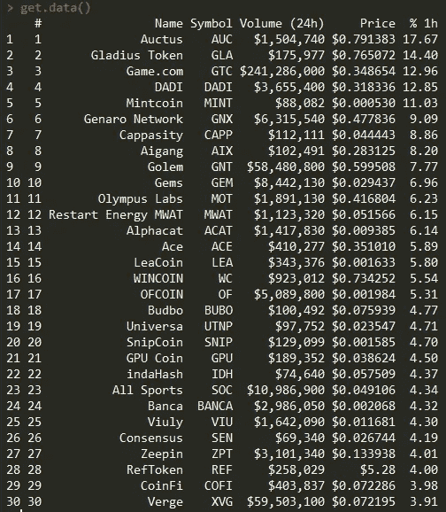
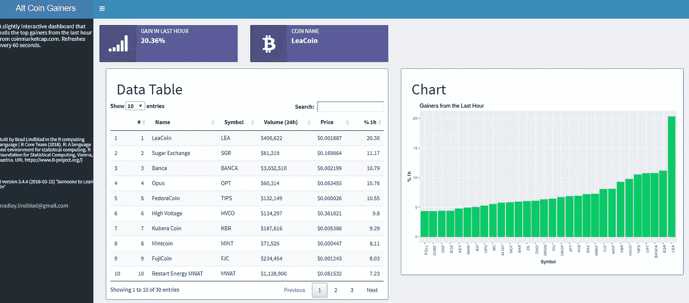
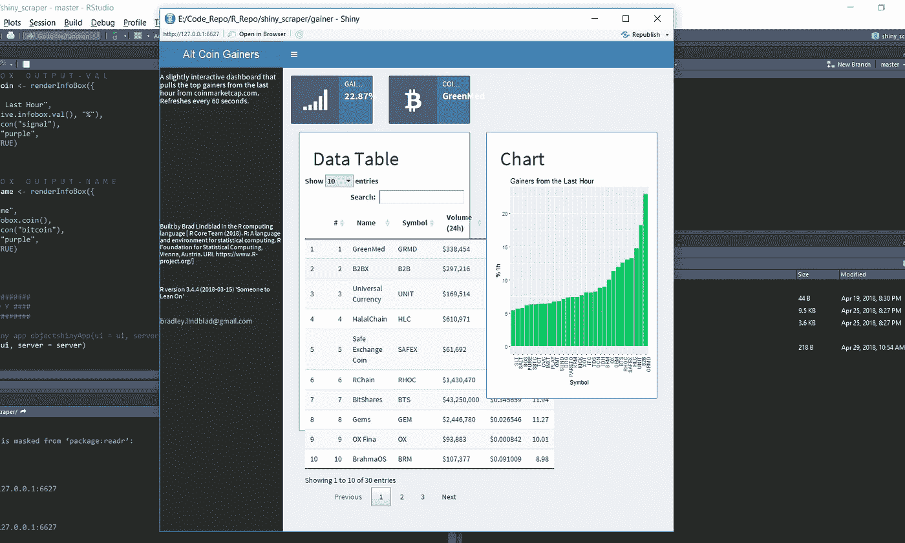
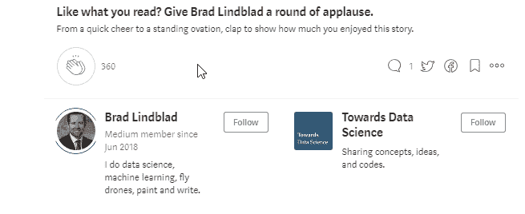

# 使用 Rvest 和 Shiny 在 R 中抓取数据并构建一个 Webapp

> 原文：<https://towardsdatascience.com/scrape-data-and-build-a-webapp-in-r-using-rvest-and-shiny-f20d84dd1b74?source=collection_archive---------3----------------------->


Photo by [Patrick Fore](https://unsplash.com/@patrickian4?utm_source=medium&utm_medium=referral) on [Unsplash](https://unsplash.com?utm_source=medium&utm_medium=referral)

通过传统方法分享你的分析和数据科学发现很酷，但是如果你想和更多的人分享呢？如果您想要实时共享某个数据集的分析，该怎么办？通过几十行代码，您可以在一个下午创建这样一个工具。

我将分享我如何使用 R 计算语言和几个关键包构建了一个几乎实时的 webapp。您将学习如何抓取网站、解析数据，以及创建任何拥有浏览器的人都可以访问的 webapp。

## 问题陈述

> 我需要显示来自 https://coinmarketcap.com/gainers-losers/[的数据，以便让我轻松地看到当天哪些硬币在真正的加热器上。](https://coinmarketcap.com/gainers-losers/)

## 工具

我们将利用 [Rvest 包](https://github.com/hadley/rvest)、 [shiny](https://github.com/rstudio/shiny) 、 [shinydashboard](https://github.com/rstudio/shinydashboard) 以及各种 [tidyverse](https://github.com/tidyverse/tidyverse) 工具，都在 [Rstudio IDE](https://www.rstudio.com/) 中。

虽然 RSelenium 是一个流行且可行的 web 抓取工具(通过解析 HTML 从网站收集数据)，但 Rvest 包无疑是一个更整洁、更干净的工具。

该脚本的基本工作流程如下:

1.  创建新的 Rstudio 项目
2.  创建一个“应用程序。r "闪亮的文件
3.  调用库
4.  构建函数
5.  构建用户界面
6.  构建服务器
7.  部署

所以让我们开始吧。

## 调用库

我们将调用上面“工具”一节中讨论的库:

```
library(shiny)
library(tidyverse)
library(shinydashboard)
library(rvest)
```

## 构建函数

始终认识到编码的枯燥(不要重复自己)准则，我们将构建简单的函数来收集和整理我们的数据，因此我们不必重复代码。

```
#####################
####### F N S #######
#####################get.data <- function(x){myurl <- read_html("[https://coinmarketcap.com/gainers-losers/](https://coinmarketcap.com/gainers-losers/)") # read our webpage as htmlmyurl <- html_table(myurl)  # convert to an html table for ease of use

  to.parse <- myurl[[1]]  # pull the first item in the list
  to.parse$`% 1h` <- gsub("%","",to.parse$`% 1h`) # cleanup - remove non-characters
  to.parse$`% 1h`<- as.numeric(to.parse$`% 1h`) #cleanup - convert percentages column to numeric so we can sort
  to.parse$Symbol <- as.factor(to.parse$Symbol) # cleanup - convert coin symbol to factor

  to.parse$Symbol <- factor(to.parse$Symbol,
                            levels = to.parse$Symbol[order(to.parse$'% 1h')])  # sort by gain value
  to.parse  # return the finished data.frame
}
```

**get.data** 函数抓取我们的网站，返回一个对我们有用的数据框。

我们使用 **Rvest** 包中的 **read_html** 和 **html_table** 函数读入网页数据，并对其进行格式化，以便于处理。接下来，我们从该网页中取出许多表格中的第一个，并用基本的 R 函数清理它。最后，我们根据百分比增益值对新数据帧进行排序。

如果您要在 R 控制台中用

```
get.data()
```

您将返回如下所示的数据框:



get.data() returns this data.frame

如你所见，这显示了哪些硬币在过去的一个小时里收益最大，按收益百分比排序。这些数据是整个仪表板的基础。

我们将构建的下一个函数叫做 **get.infobox.val.** 它只是从上面的数据框中提取最高值。

```
get.infobox.val <- function(x){

  df1 <- get.data() # run the scraping function above and assign that data.frame to a variable
  df1 <- df1$`% 1h`[1]  # assign the first value of the % gain column to same variable
  df1   # return value

}
```

最后一个函数叫做 **get.infobox.coin** ，返回最高硬币的名称。

```
get.infobox.val <- function(x){

  df1 <- get.data() # run the scraping function above and assign that data.frame to a variable
  df1 <- df1$`% 1h`[1]  # assign the first value of the % gain column to same variable
  df1   # return value

}
```

现在我们已经构建了我们的函数，是时候构建闪亮的仪表板，向全世界显示我们的数据了。

## 进入闪亮的 Webapps

一个闪亮的 webapp 将允许我们建立一个交互式仪表板，我们将让 Rstudio 通过他们的服务器为我们托管。他们有一个免费的计划，所以任何人都可以很容易地开始使用它。来自 [Rstudio 文档](https://shiny.rstudio.com/articles/basics.html):

> 闪亮的应用程序有两个组件，一个用户界面对象和一个服务器函数，它们作为参数传递给`shinyApp` 函数，该函数从这个 UI/服务器对创建一个闪亮的应用程序对象。

在这一点上，我强烈推荐浏览上面引用的官方文档，让自己熟悉基本的**闪亮的**概念。

为了避免过多赘述，让我们从构建 **UI** 对象开始。

# 用户界面

在 UI 对象中，我们将展示我们的仪表板。当我做这个的时候，我用了一个铅笔线框草图。为了帮助您直观地看到最终结果，这里是成品的截图:



Our finished dashboard for reference

shinydashboard 结构允许我们有一个侧边栏和一个仪表板区域，我们可以在那里添加行和列中的框。上面的黑色区域是侧边栏，右边的是主体。现在来看一下 **UI** 代码。

```
ui <- dashboardPage(

  # H E A D E R

  dashboardHeader(title = "Alt Coin Gainers"), 
```

接下来，我们将 **dashboardPage** 函数分配给 UI，然后添加我们需要的部分。

```
# S I D E B A R

  dashboardSidebar(

    h5("A slightly interactive dashboard that pulls the top gainers from the last hour from
       coinmarketcap.com. Refreshes every 60 seconds."),

    br(),
    br(),
    br(),
    br(),
    br(),
    br(),
    br(),
    br(),
    br(),
    br(),

    h6("Built by Brad Lindblad in the R computing language 
      [  R Core Team (2018). R: A language and environment for statistical computing. R Foundation for Statistical Computing,
  Vienna, Austria. URL [https://www.R-project.org/](https://www.R-project.org/)]"),
    br(),
    h6("R version 3.4.4 (2018-03-15) 'Someone to Lean On'"),
    br(),
    a("[bradley.lindblad@gmail.com](mailto:bradley.lindblad@gmail.com)", href="[bradley.lindblad@gmail.com](mailto:bradley.lindblad@gmail.com)")

  ),
```

侧边栏是放置文档或过滤器的好地方(这在本教程中没有涉及)。您会注意到，您可以将某些 html 标签和类传递给文本。 **H5** 只是一个标签，它将文本定义为文档中的第五层标题，通常是第五大文本。

```
# B O D Y
  dashboardBody(

  fluidRow(

    # InfoBox
    infoBoxOutput("top.coin",
                  width = 3),

    # InfoBox
    infoBoxOutput("top.name",
                  width = 3)

  ),

  fluidRow(column(
    # Datatable
      box(
        status = "primary",
        headerPanel("Data Table"),
        solidHeader = T,
        br(),
        DT::dataTableOutput("table", height = "350px"),
        width = 6,
        height = "560px"
      ),

      # Chart
      box(
        status = "primary",
        headerPanel("Chart"),
        solidHeader = T,
        br(),
        plotOutput("plot", height = "400px"),
        width = 6,
        height = "500px"
      ),
      width = 12
    )

  )
  )

)
```

在**主体**部分，我们构建仪表板中的主要项目。**主体**部分有几个关键部分实际输出数据。

## 信息盒

```
# InfoBox
    infoBoxOutput("top.coin",
                  width = 3),

    # InfoBox
    infoBoxOutput("top.name",
                  width = 3)
```

这两个代码块输出了仪表板顶部的两个紫色框。两个输出 ID“top . coin”和“top.name”引用了在**服务器**函数中输出的数据，我们将在后面介绍。

## 数据表和图

```
# Datatable
      box(
        status = "primary",
        headerPanel("Data Table"),
        solidHeader = T,
        br(),
        DT::dataTableOutput("table", height = "350px"),
        width = 6,
        height = "560px"
      ),# Chart
      box(
        status = "primary",
        headerPanel("Chart"),
        solidHeader = T,
        br(),
        plotOutput("plot", height = "400px"),
        width = 6,
        height = "500px"
      ),
```

数据表和曲线图也是如此。**表**是将绑定到下面的**服务器**函数的输出 ID，并且**图**也绑定到**服务器**。

# 计算机网络服务器

下一个议程是定义我们的**服务器功能**。服务器函数是通过 **UI** **函数**计算、读取、绘制或显示数值的地方。

```
#####################
#### S E R V E R ####
#####################server <- function(input, output) {# R E A C T I V E 
  liveish_data <- reactive({
    invalidateLater(60000)    # refresh the report every 60k milliseconds (60 seconds)
    get.data()                # call our function from above
  })

  live.infobox.val <- reactive({
    invalidateLater(60000)    # refresh the report every 60k milliseconds (60 seconds)
    get.infobox.val()         # call our function from above
  })

  live.infobox.coin <- reactive({
    invalidateLater(60000)    # refresh the report every 60k milliseconds (60 seconds)
    get.infobox.coin()        # call our function from above
  })
```

还记得我们一开始定义的函数吗？我们现在就要使用它们。我们还将添加另一个概念:**反应式表达**。这些允许我们闪亮的仪表板定期更新或基于用户输入。对于这个仪表板，我们要求程序每 60 秒运行一次我们的函数，用我们抓取的网站的最新值更新仪表板。

## 数据表

```
# D A T A   T A B L E   O U T P U T
  output$table <- DT::renderDataTable(DT::datatable({
    data <- liveish_data()}))
```

还记得我们上面定义的输出 ID **表**吗？我们将在上面的函数中引用它。注意，我们从一开始就使用了 **liveish_data** 反应函数，而不是我们的原始函数。

## 情节

```
# P L O T   O U T P U T
  output$plot <- renderPlot({ (ggplot(data=liveish_data(),       aes(x=Symbol, y=`% 1h`)) +
          geom_bar(stat="identity", fill = "springgreen3") +
          theme(axis.text.x = element_text(angle = 90, hjust = 1)) +
          ggtitle("Gainers from the Last Hour"))
  })
```

接下来，我们使用 ggplot2 绘制一个简单的柱状图。

## 信息盒

```
# I N F O B O X   O U T P U T - V A L
  output$top.coin <- renderInfoBox({
    infoBox(
      "Gain in Last Hour",
      paste0(live.infobox.val(), "%"),
      icon = icon("signal"),
      color = "purple",
      fill = TRUE)
  })

  # I N F O B O X   O U T P U T - N A M E
  output$top.name <- renderInfoBox({
    infoBox(
      "Coin Name",
      live.infobox.coin(),
      icon = icon("bitcoin"),
      color = "purple",
      fill = TRUE)
  })

}
```

最后，我们使用服务器函数开头定义的反应表达式绘制两个信息框。

# 部署

脚本的最后一部分将我们的 UI 与服务器结合起来，并部署应用程序。

```
#####################
#### D E P L O Y ####
###################### Return a Shiny app objectshinyApp(ui = ui, server = server)
shinyApp(ui = ui, server = server)
```

此时，您应该有一个正在运行的应用程序出现在 Rstudio 的一个窗口中。



点击**在浏览器中打开**按钮，查看应用程序的非混乱版本；部署后您将看到的实际版本。

# 收尾工作

至此，所有的重担都完成了；我们构建了一个从网站下载并解析 html 的刮刀，然后我们使用 shinydashboard 框架构建了一个闪亮的应用程序，向全世界展示我们的分析。

在这一点上，所有剩下的是部署应用程序，这让我们非常容易。只需点击 Rstudio 预览中出现的**部署**按钮，然后按照说明进行操作。总的来说，从这一点开始部署应该不到 10 分钟。

我希望这篇小教程能在你的 R 之旅中帮助你，并给你一些关于用这种强大的开源语言可以构建什么样的东西的想法。

如果你有任何问题或者只是想聊聊 R，请发邮件到[bradley.lindblad@gmail.com 给我。](http://bradley.lindblad@gmail.com)



# 附录

这是完整的脚本，你也可以从我的 Github 页面上为这个项目克隆。

```
library(shiny)
library(tidyverse)
library(shinydashboard)
library(rvest)#####################
####### F N S #######
#####################get.data <- function(x){myurl <- read_html("[https://coinmarketcap.com/gainers-losers/](https://coinmarketcap.com/gainers-losers/)") # read our webpage as html
  myurl <- html_table(myurl)  # convert to an html table for ease of use

  to.parse <- myurl[[1]]  # pull the first item in the list
  to.parse$`% 1h` <- gsub("%","",to.parse$`% 1h`) # cleanup - remove non-characters
  to.parse$`% 1h`<- as.numeric(to.parse$`% 1h`) #cleanup - convert percentages column to numeric
  to.parse$Symbol <- as.factor(to.parse$Symbol) # cleanup - convert coin symbol to factor

  to.parse$Symbol <- factor(to.parse$Symbol,
                            levels = to.parse$Symbol[order(to.parse$'% 1h')])  # sort by gain value
  to.parse  # return the finished data.frame
}get.infobox.val <- function(x){

  df1 <- get.data() # run the scraping function above and assign that data.frame to a variable
  df1 <- df1$`% 1h`[1]  # assign the first value of the % gain column to same variable
  df1   # return value

}get.infobox.coin <- function(x){

  df <- get.data()  # run the scraping function above and assign that data.frame to a variable
  df <- df$Name[1]  # assign the first value of the name column to same variable
  df   # return value

}#####################
####### U I #########
#####################ui <- dashboardPage(

  # H E A D E R

  dashboardHeader(title = "Alt Coin Gainers"),

  # S I D E B A R

  dashboardSidebar(

    h5("A slightly interactive dashboard that pulls the top gainers from the last hour from
       coinmarketcap.com. Refreshes every 60 seconds."),

    br(),
    br(),
    br(),
    br(),
    br(),
    br(),
    br(),
    br(),
    br(),
    br(),

    h6("Built by Brad Lindblad in the R computing language 
      [  R Core Team (2018). R: A language and environment for statistical computing. R Foundation for Statistical Computing,
  Vienna, Austria. URL [https://www.R-project.org/](https://www.R-project.org/)]"),
    br(),
    h6("R version 3.4.4 (2018-03-15) 'Someone to Lean On'"),
    br(),
    a("[bradley.lindblad@gmail.com](mailto:bradley.lindblad@gmail.com)", href="[bradley.lindblad@gmail.com](mailto:bradley.lindblad@gmail.com)")

  ),

  # B O D Y
  dashboardBody(

  fluidRow(

    # InfoBox
    infoBoxOutput("top.coin",
                  width = 3),

    # InfoBox
    infoBoxOutput("top.name",
                  width = 3)

  ),

  fluidRow(column(
    # Datatable
      box(
        status = "primary",
        headerPanel("Data Table"),
        solidHeader = T,
        br(),
        DT::dataTableOutput("table", height = "350px"),
        width = 6,
        height = "560px"
      ),

      # Chart
      box(
        status = "primary",
        headerPanel("Chart"),
        solidHeader = T,
        br(),
        plotOutput("plot", height = "400px"),
        width = 6,
        height = "500px"
      ),
      width = 12
    )

  )
  )

)#####################
#### S E R V E R ####
#####################server <- function(input, output) {# R E A C T I V E 
  liveish_data <- reactive({
    invalidateLater(60000)    # refresh the report every 60k milliseconds (60 seconds)
    get.data()                # call our function from above
  })

  live.infobox.val <- reactive({
    invalidateLater(60000)    # refresh the report every 60k milliseconds (60 seconds)
    get.infobox.val()         # call our function from above
  })

  live.infobox.coin <- reactive({
    invalidateLater(60000)    # refresh the report every 60k milliseconds (60 seconds)
    get.infobox.coin()        # call our function from above
  })

  # D A T A   T A B L E   O U T P U T
  output$table <- DT::renderDataTable(DT::datatable({
    data <- liveish_data()}))

  # P L O T   O U T P U T
  output$plot <- renderPlot({ (ggplot(data=liveish_data(), aes(x=Symbol, y=`% 1h`)) +
                                 geom_bar(stat="identity", fill = "springgreen3") +
                                 theme(axis.text.x = element_text(angle = 90, hjust = 1)) +
                                 ggtitle("Gainers from the Last Hour"))
  })

  # I N F O B O X   O U T P U T - V A L
  output$top.coin <- renderInfoBox({
    infoBox(
      "Gain in Last Hour",
      paste0(live.infobox.val(), "%"),
      icon = icon("signal"),
      color = "purple",
      fill = TRUE)
  })

  # I N F O B O X   O U T P U T - N A M E
  output$top.name <- renderInfoBox({
    infoBox(
      "Coin Name",
      live.infobox.coin(),
      icon = icon("bitcoin"),
      color = "purple",
      fill = TRUE)
  })

}#####################
#### D E P L O Y ####
###################### Return a Shiny app objectshinyApp(ui = ui, server = server)
shinyApp(ui = ui, server = server)
```