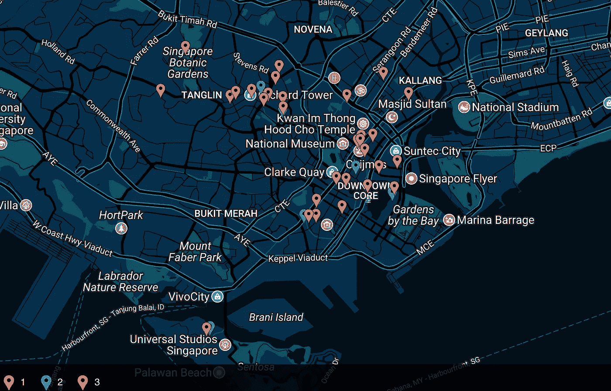
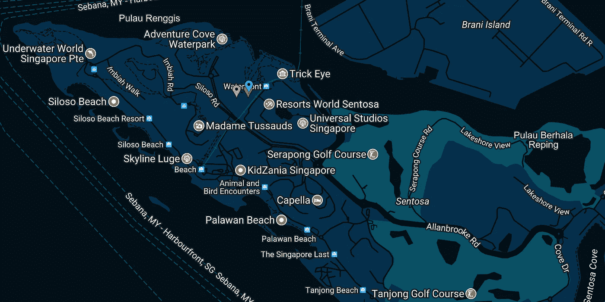
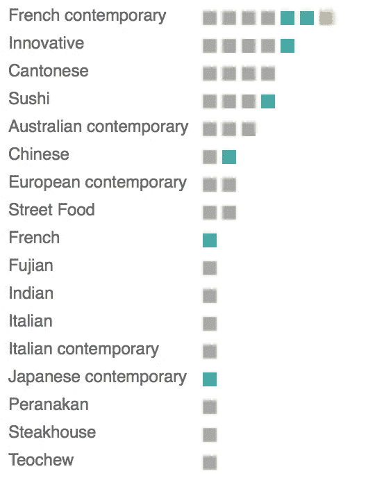

# 抓取新加坡米其林星级餐厅名单

> 原文：<https://towardsdatascience.com/scraping-a-list-of-singapore-michelin-star-restaurants-b0f3829e3c14?source=collection_archive---------9----------------------->

今天，我想通过提取新加坡米其林星级餐厅的名称、地址、星级和菜肴类型来练习网络抓取，以了解其地理位置和菜肴类型分布。

没有一个网站能同时包含这两种信息，所以我找到了一个包含地址的新闻网站和包含 T2 美食种类的米其林官方网站。我使用了 [selectorgadget](http://selectorgadget.com/) 和 rvest 来收集数据，做了一些清理工作，因为一些地址在帧中用不同的 CSS ids 进行了编码，而且菜肴类型包括英语和汉语单词。

然后我使用 [BatchGeo](https://batchgeo.com) 通过地址查找地理编码，这相当准确，也方便地提供了地图，只是它是否在输出中提供纬度/经度数据并不明显。

click for interactive version

它们似乎主要集中在 3 个集群周围:

*   从丹戎巴葛一直到市政厅(市中心)
*   位于果园/植物园区域(购物/旅游区)
*   3 在圣淘沙，1 星(Osia)/2 星(L'Atelier de Joel Robuchon)/3 星(Joel Robuchon)(旅游/富裕住宅区)各一个

Click for interactive version

下一步，我们可以模糊匹配来自两个来源的餐馆名称(不同的拼写)以获得菜肴类型，按照地理区域对它们进行分组，并确定到不同住宅区的距离。

看看菜肴类型，当代和创新的食物是一件大事。法国菜和广东菜分别在西方和本地食物排行榜上名列前茅。今年有两家小贩/街头小吃被评为一星级。

cuisine types by star rating

这是我关于数据科学和视觉故事的[# 100 日项目](https://medium.com/@yanhann10)的第 57 天。报废数据可以在[这里](https://github.com/yanhann10/opendata_viz/blob/master/michelin_restaurants/michelin_star_restaurant.xlsx)找到。感谢阅读。欢迎新主题的建议和反馈。