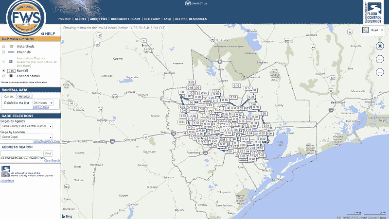
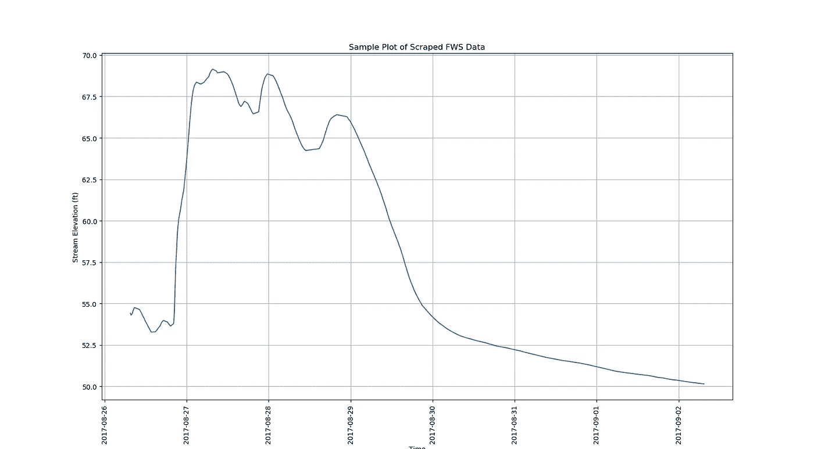
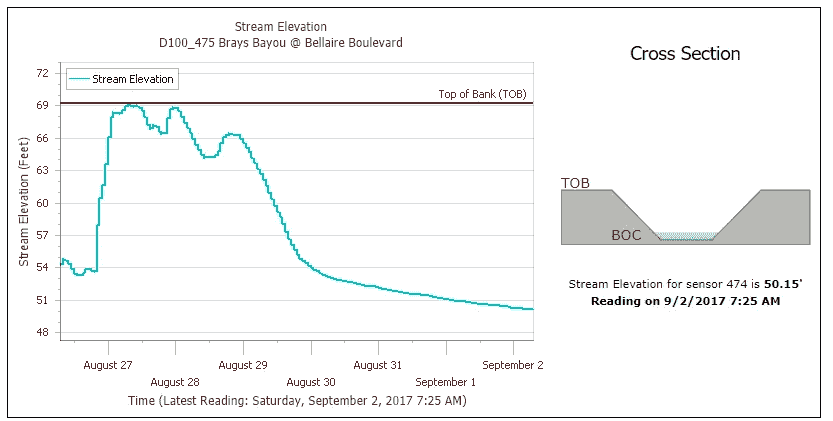

# 使用 Python 抓取哈维飓风洪水数据

> 原文：<https://towardsdatascience.com/scraping-hurricane-harvey-flood-data-using-python-4e406d024f5f?source=collection_archive---------12----------------------->


正如数据科学中常说的那样，80%的工作是不那么迷人的数据获取和数据争论任务，剩下的 20%留给“性感”的分析和机器学习任务。通常，即使是这些数字也很慷慨——就我个人而言，我在这些乏味的数据争论任务上花费了过多的时间。如果你从事数据科学工作，你可能会感受到同样的痛苦。

在最近的一个项目中，我需要收集我的家乡德克萨斯州休斯顿的洪水数据，所以我建立了一个网络抓取器来从哈里斯县洪水预警系统获取数据。为了帮助缓解上面提到的一些乏味的数据科学困境，我在 Github 上为其他对洪水研究感兴趣的人发布了我的代码。您可以在下面的链接中找到该回购的链接。这篇文章的其余部分将展示几个使用代码的快速例子。

****** [**Github 洪水数据网页抓取器**](https://github.com/dcbark01/HouFloodScraper) ******

**项目背景
当地县应急管理部门开发了 [*【哈里斯县洪水预警系统(FWS)】*](https://www.harriscountyfws.org/)。**



Stream Gage Locations on the Harris County Flood Warning System (FWS) Website

FWS 从美国地质调查局(USGS)维护的流量表中获取数据。虽然每个 stream gauge 网站都提供了以 Excel 文件形式下载数据的功能，但我需要更多的数据，所以我构建了一个 webs scraper。你可以从[这个回购](https://github.com/dcbark01/HouFloodScraper)中克隆刮刀。

**使用
T21【Scraper】克隆 repo 后，安装' requirements.txt '文件中列出的需求。使用刮刀很简单:**

Code snippet for querying stream gauge data from the FWS website

数据也可以下载到 JSON 文件中:

“高程”字段包含溪流底部上方水深的记录。“深度”字段是一个计算字段，记录了高出堤岸顶部的水的高度(TOB)。如果
水的深度高于 TOB，则‘above bank’键保存值‘True ’,否则为‘False’。有关更多详细信息，请参见自述文件。

```
{
    "sensorMetaData": {
        "sensorId": "519",
        "sensorType": "USGS Radar",
        "installedDate": "3/27/1984",
        "topOfBankFt": 32.0
    },
    "sensorData": [
        {
            "timestamp": "8/26/2017 7:31 AM",
            "elevation": {
                "value": 21.69,
                "units": "ft"
            },
            "depth": {
                "value": 0,
                "units": "ft"
            },
            "aboveBank": false
        },
        {
            "timestamp": "8/27/2017 5:43 AM",
            "elevation": {
                "value": 39.49,
                "units": "ft"
            },
            "depth": {
                "value": 7.490000000000002,
                "units": "ft"
            },
            "aboveBank": true
        }
    ]
}
```

**查询和绘图示例** 下面是从 475 号流量计获取数据并绘制数据的一小段代码:

这就产生了下面的情节…



Plotting the data using matplotlib

…正如我们所料，这符合 FWS 的情节:



Data as shown at [https://www.harriscountyfws.org](https://www.harriscountyfws.org)

**最后总结** 希望这个刮刀对其他有抱负的洪水研究者有用。如果您在使用代码时有任何疑问或问题，请随时联系我们！