# 用于酒店评论的网页抓取猫途鹰、文本挖掘和情感分析

> 原文：<https://towardsdatascience.com/scraping-tripadvisor-text-mining-and-sentiment-analysis-for-hotel-reviews-cc4e20aef333?source=collection_archive---------0----------------------->


Phone credit: pexels

## 如何应用自然语言处理对酒店评论进行分类

一项又一项研究表明，猫途鹰在旅行者的决策过程中变得极其重要。然而，理解猫途鹰泡沫评分与数以千计的猫途鹰评论文本之间的细微差别可能具有挑战性。为了更彻底地了解酒店客人的评论是否会影响酒店的加班表现，我从猫途鹰搜集了一家酒店的所有英文评论——[希尔顿夏威夷村](http://www.hiltonhawaiianvillage.com/)。我不会讨论网页抓取的细节，这个过程的 Python 代码可以在[这里](https://github.com/susanli2016/NLP-with-Python/blob/master/Web%20scraping%20Hilton%20Hawaiian%20Village%20TripAdvisor%20Reviews.py)找到。感谢 [Furas](https://github.com/furas) 的提示。

# 加载库

```
library(dplyr)
library(readr)
library(lubridate)
library(ggplot2)
library(tidytext)
library(tidyverse)
library(stringr)
library(tidyr)
library(scales)
library(broom)
library(purrr)
library(widyr)
library(igraph)
library(ggraph)
library(SnowballC)
library(wordcloud)
library(reshape2)
theme_set(theme_minimal())
```

# 数据

```
df <- read_csv("Hilton_Hawaiian_Village_Waikiki_Beach_Resort-Honolulu_Oahu_Hawaii__en.csv")
df <- df[complete.cases(df), ]
df$review_date <- as.Date(df$review_date, format = "%d-%B-%y")dim(df); min(df$review_date); max(df$review_date)
```

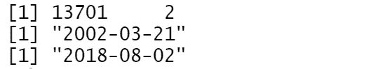

Figure 1

希尔顿夏威夷村在猫途鹰上有 13，701 条英文评论，评论日期从 2002 年 3 月 21 日到 2018 年 8 月 2 日。

```
df %>%
  count(Week = round_date(review_date, "week")) %>%
  ggplot(aes(Week, n)) +
  geom_line() + 
  ggtitle('The Number of Reviews Per Week')
```

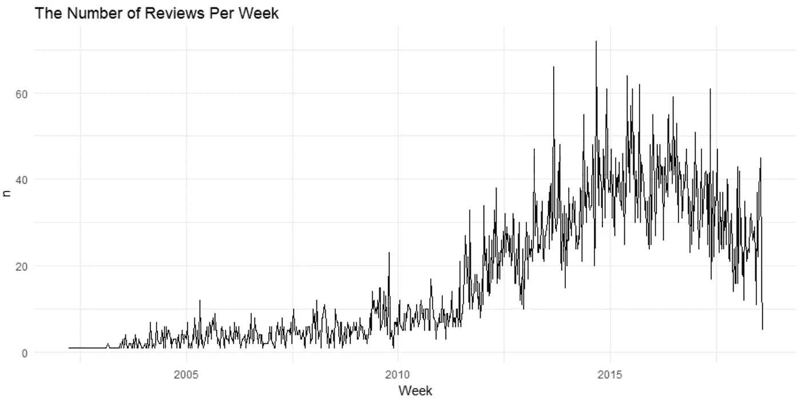

Figure 2

2014 年底收到的每周评论数量最多。该酒店在那一周收到了 70 多条评论。

# 评论文本的文本挖掘

```
df <- tibble::rowid_to_column(df, "ID")
df <- df %>%
  mutate(review_date = as.POSIXct(review_date, origin = "1970-01-01"),month = round_date(review_date, "month"))review_words <- df %>%
  distinct(review_body, .keep_all = TRUE) %>%
  unnest_tokens(word, review_body, drop = FALSE) %>%
  distinct(ID, word, .keep_all = TRUE) %>%
  anti_join(stop_words, by = "word") %>%
  filter(str_detect(word, "[^\\d]")) %>%
  group_by(word) %>%
  mutate(word_total = n()) %>%
  ungroup()word_counts <- review_words %>%
  count(word, sort = TRUE)word_counts %>%
  head(25) %>%
  mutate(word = reorder(word, n)) %>%
  ggplot(aes(word, n)) +
  geom_col(fill = "lightblue") +
  scale_y_continuous(labels = comma_format()) +
  coord_flip() +
  labs(title = "Most common words in review text 2002 to date",
       subtitle = "Among 13,701 reviews; stop words removed",
       y = "# of uses")
```

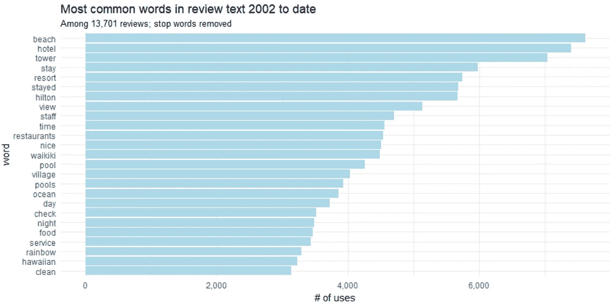

Figure 3

我们肯定可以做得更好一点，把“留下来”和“留下来”，把“游泳池”和“游泳池”结合起来。所谓的词干化，词干化是将屈折词(或有时是派生词)简化为词干、词根或词根格式的过程。

```
word_counts %>%
  head(25) %>%
  mutate(word = wordStem(word)) %>% 
  mutate(word = reorder(word, n)) %>%
  ggplot(aes(word, n)) +
  geom_col(fill = "lightblue") +
  scale_y_continuous(labels = comma_format()) +
  coord_flip() +
  labs(title = "Most common words in review text 2002 to date",
       subtitle = "Among 13,701 reviews; stop words removed and stemmed",
       y = "# of uses")
```

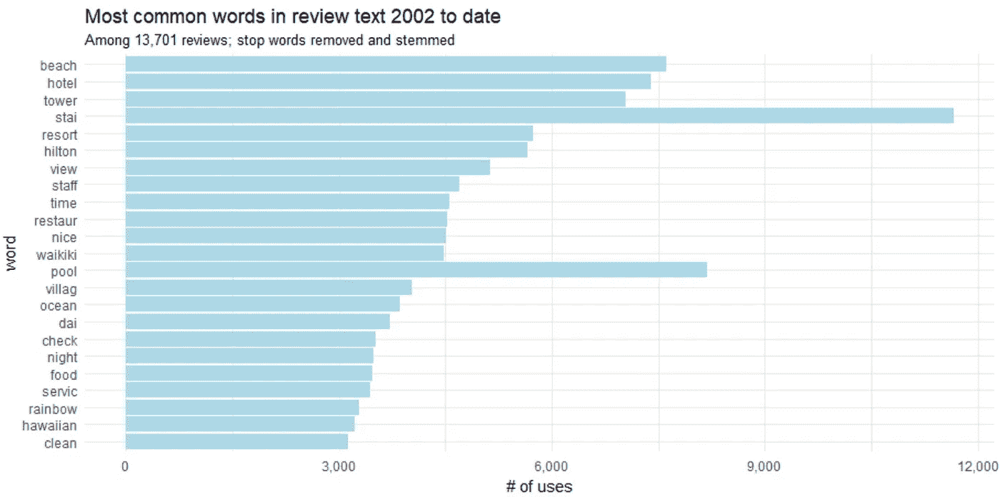

Figure 4

## 二元模型

我们经常想了解一篇复习中单词之间的关系。评论文章中有哪些常见的单词序列？给定一个单词序列，接下来最有可能是哪个单词？哪些词之间的关系最强？因此，许多有趣的文本分析都是基于这些关系。当我们检查两个连续单词对时，这被称为“二元模型”。

那么，希尔顿夏威夷村对猫途鹰最常见的评论是什么呢？

```
review_bigrams <- df %>%
  unnest_tokens(bigram, review_body, token = "ngrams", n = 2)bigrams_separated <- review_bigrams %>%
  separate(bigram, c("word1", "word2"), sep = " ")bigrams_filtered <- bigrams_separated %>%
  filter(!word1 %in% stop_words$word) %>%
  filter(!word2 %in% stop_words$word)bigram_counts <- bigrams_filtered %>% 
  count(word1, word2, sort = TRUE)bigrams_united <- bigrams_filtered %>%
  unite(bigram, word1, word2, sep = " ")bigrams_united %>%
  count(bigram, sort = TRUE)
```

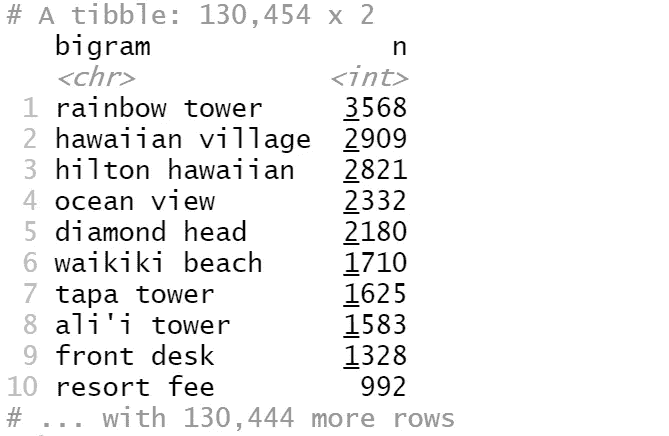

Figure 5

最常见的重名是“彩虹塔”，其次是“夏威夷村”。

我们可以想象单词网络中的二元模型:

```
review_subject <- df %>% 
  unnest_tokens(word, review_body) %>% 
  anti_join(stop_words)my_stopwords <- data_frame(word = c(as.character(1:10)))
review_subject <- review_subject %>% 
  anti_join(my_stopwords)title_word_pairs <- review_subject %>% 
  pairwise_count(word, ID, sort = TRUE, upper = FALSE)set.seed(1234)
title_word_pairs %>%
  filter(n >= 1000) %>%
  graph_from_data_frame() %>%
  ggraph(layout = "fr") +
  geom_edge_link(aes(edge_alpha = n, edge_width = n), edge_colour = "cyan4") +
  geom_node_point(size = 5) +
  geom_node_text(aes(label = name), repel = TRUE, 
                 point.padding = unit(0.2, "lines")) +
  ggtitle('Word network in TripAdvisor reviews')
  theme_void()
```

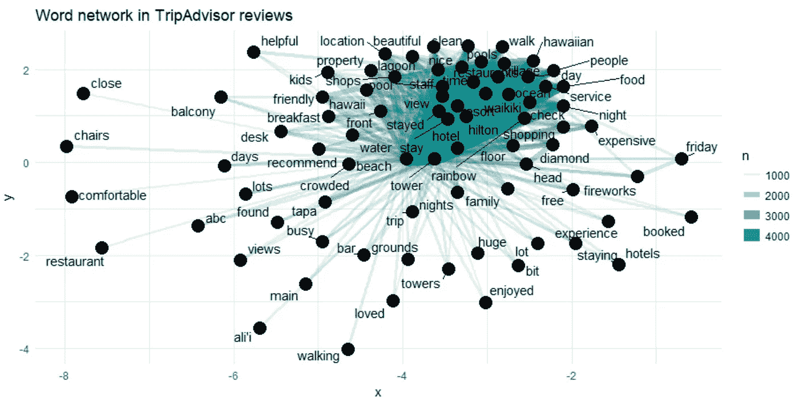

Figure 6

以上可视化了猫途鹰评论中常见的二元词，显示了那些至少出现了 1000 次并且没有一个词是停用词的词。

网络图显示了顶部几个单词(“夏威夷”、“村庄”、“海洋”和“景色”)之间的强连接。然而，我们在网络中看不到清晰的聚类结构。

## 三元模型

二元模型有时是不够的，让我们看看希尔顿夏威夷村的猫途鹰评论中最常见的三元模型是什么？

```
review_trigrams <- df %>%
  unnest_tokens(trigram, review_body, token = "ngrams", n = 3)

trigrams_separated <- review_trigrams %>%
  separate(trigram, c("word1", "word2", "word3"), sep = " ")

trigrams_filtered <- trigrams_separated %>%
  filter(!word1 %in% stop_words$word) %>%
  filter(!word2 %in% stop_words$word) %>%
  filter(!word3 %in% stop_words$word)

trigram_counts <- trigrams_filtered %>% 
  count(word1, word2, word3, sort = TRUE)

trigrams_united <- trigrams_filtered %>%
  unite(trigram, word1, word2, word3, sep = " ")

trigrams_united %>%
  count(trigram, sort = TRUE)
```

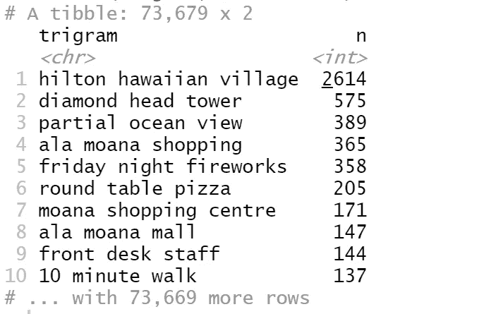

Figure 7

最常见的三元组是“希尔顿夏威夷村”，其次是“钻石头塔”，等等。

## 评论中的关键词趋势

随着时间的推移，哪些词和话题变得越来越频繁或越来越不频繁？这些可以让我们了解酒店生态系统的变化，如服务、翻新、问题解决，并让我们预测哪些主题将继续增长。

我们想问这样的问题:随着时间的推移，哪些词在猫途鹰评论中出现的频率越来越高？

```
reviews_per_month <- df %>%
  group_by(month) %>%
  summarize(month_total = n())word_month_counts <- review_words %>%
  filter(word_total >= 1000) %>%
  count(word, month) %>%
  complete(word, month, fill = list(n = 0)) %>%
  inner_join(reviews_per_month, by = "month") %>%
  mutate(percent = n / month_total) %>%
  mutate(year = year(month) + yday(month) / 365)mod <- ~ glm(cbind(n, month_total - n) ~ year, ., family = "binomial")slopes <- word_month_counts %>%
  nest(-word) %>%
  mutate(model = map(data, mod)) %>%
  unnest(map(model, tidy)) %>%
  filter(term == "year") %>%
  arrange(desc(estimate))slopes %>%
  head(9) %>%
  inner_join(word_month_counts, by = "word") %>%
  mutate(word = reorder(word, -estimate)) %>%
  ggplot(aes(month, n / month_total, color = word)) +
  geom_line(show.legend = FALSE) +
  scale_y_continuous(labels = percent_format()) +
  facet_wrap(~ word, scales = "free_y") +
  expand_limits(y = 0) +
  labs(x = "Year",
       y = "Percentage of reviews containing this word",
       title = "9 fastest growing words in TripAdvisor reviews",
       subtitle = "Judged by growth rate over 15 years")
```

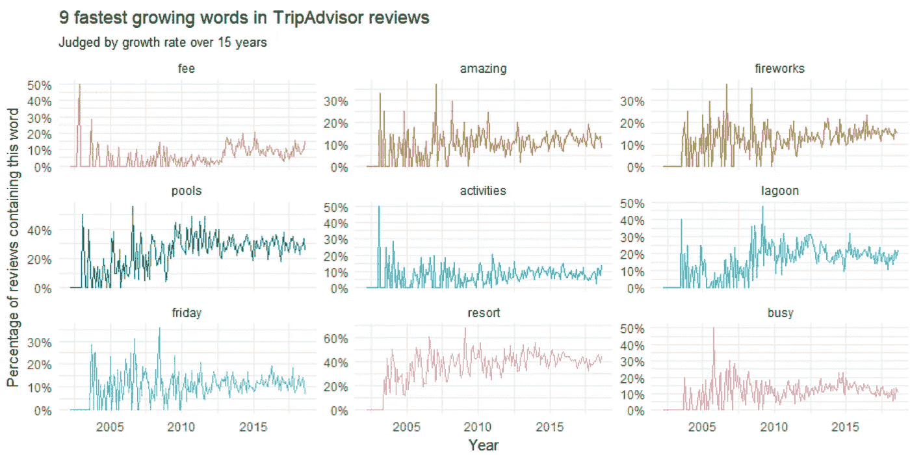

Figure 8

在 2010 年之前，我们可以看到一个围绕“星期五焰火”和“泻湖”的讨论高峰。像“度假费用”和“忙碌”这样词在 2005 年之前增长最快。

哪些词在评论中出现的频率越来越低？

```
slopes %>%
  tail(9) %>%
  inner_join(word_month_counts, by = "word") %>%
  mutate(word = reorder(word, estimate)) %>%
  ggplot(aes(month, n / month_total, color = word)) +
  geom_line(show.legend = FALSE) +
  scale_y_continuous(labels = percent_format()) +
  facet_wrap(~ word, scales = "free_y") +
  expand_limits(y = 0) +
  labs(x = "Year",
       y = "Percentage of reviews containing this term",
       title = "9 fastest shrinking words in TripAdvisor reviews",
       subtitle = "Judged by growth rate over 4 years")
```

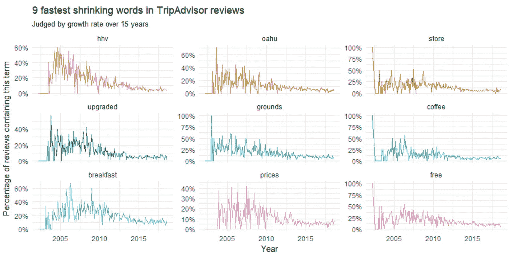

Figure 9

这显示了几个自 2010 年以来兴趣逐渐消失的话题，包括“hhv”(我相信是希尔顿夏威夷村的简称)、“早餐”、“升级版”、“价格”和“免费”。

让我们比较几个精选的单词。

```
word_month_counts %>%
  filter(word %in% c("service", "food")) %>%
  ggplot(aes(month, n / month_total, color = word)) +
  geom_line(size = 1, alpha = .8) +
  scale_y_continuous(labels = percent_format()) +
  expand_limits(y = 0) +
  labs(x = "Year",
       y = "Percentage of reviews containing this term", title = "service vs food in terms of reviewers interest")
```

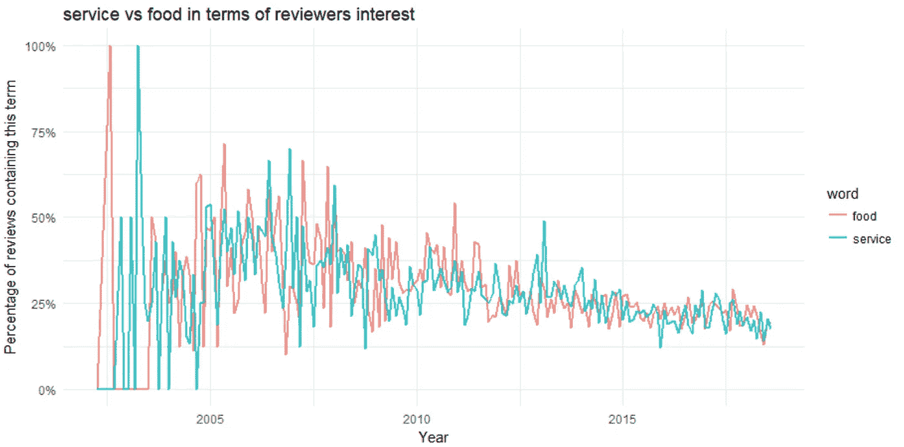

Figure 10

服务和食物都是 2010 年之前的热门话题。关于服务和食物的对话在 2003 年左右的数据开始时达到高峰，在 2005 年后一直处于下降趋势，偶尔出现高峰。

# 情感分析

情感分析广泛应用于客户意见材料，如评论和调查回复、在线和社交媒体，应用范围从营销到客户服务再到临床医学。

在我们的案例中，我们旨在确定评论者(即酒店客人)对其过去的经历或对酒店的情绪反应的态度。态度可能是一种判断或评价。

评论中最常见的正面和负面词汇。

```
reviews <- df %>% 
  filter(!is.na(review_body)) %>% 
  select(ID, review_body) %>% 
  group_by(row_number()) %>% 
  ungroup()
tidy_reviews <- reviews %>%
  unnest_tokens(word, review_body)
tidy_reviews <- tidy_reviews %>%
  anti_join(stop_words)

bing_word_counts <- tidy_reviews %>%
  inner_join(get_sentiments("bing")) %>%
  count(word, sentiment, sort = TRUE) %>%
  ungroup()

bing_word_counts %>%
  group_by(sentiment) %>%
  top_n(10) %>%
  ungroup() %>%
  mutate(word = reorder(word, n)) %>%
  ggplot(aes(word, n, fill = sentiment)) +
  geom_col(show.legend = FALSE) +
  facet_wrap(~sentiment, scales = "free") +
  labs(y = "Contribution to sentiment", x = NULL) +
  coord_flip() + 
  ggtitle('Words that contribute to positive and negative sentiment in the reviews')
```

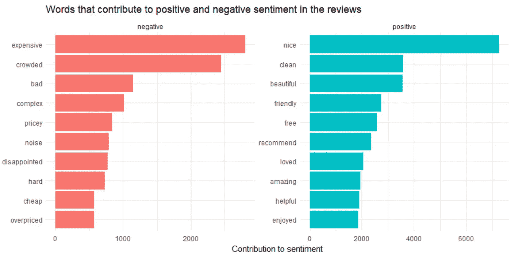

Figure 11

让我们试试另一个情感库，看看结果是否相同。

```
contributions <- tidy_reviews %>%
  inner_join(get_sentiments("afinn"), by = "word") %>%
  group_by(word) %>%
  summarize(occurences = n(),
            contribution = sum(score))
contributions %>%
  top_n(25, abs(contribution)) %>%
  mutate(word = reorder(word, contribution)) %>%
  ggplot(aes(word, contribution, fill = contribution > 0)) +
  ggtitle('Words with the greatest contributions to positive/negative 
          sentiment in reviews') +
  geom_col(show.legend = FALSE) +
  coord_flip()
```

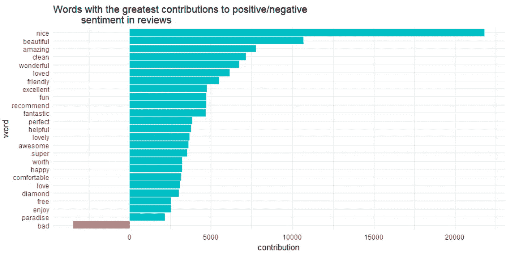

Figure 12

有趣的是，“钻石”(如钻石头)被归类为积极情绪。

这里有一个潜在的问题，例如，“干净”，取决于上下文，如果前面有“不是”这个词，就有一种消极的情绪。事实上，在大多数情况下，unigrams 都有否定的问题。这就把我们带到了下一个话题:

# 在情感分析中使用二元模型提供上下文

我们想知道单词前面有多少个像“不是”这样的单词。

```
bigrams_separated %>%
  filter(word1 == "not") %>%
  count(word1, word2, sort = TRUE)
```

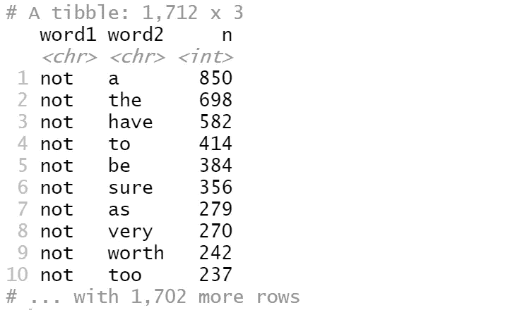

Figure 13

在数据中有 850 次单词“a”在单词“not”之前，在日期中有 698 次单词“the”在单词“not”之前。但是，这些信息没有意义。

```
AFINN <- get_sentiments("afinn")
not_words <- bigrams_separated %>%
  filter(word1 == "not") %>%
  inner_join(AFINN, by = c(word2 = "word")) %>%
  count(word2, score, sort = TRUE) %>%
  ungroup()

not_words
```

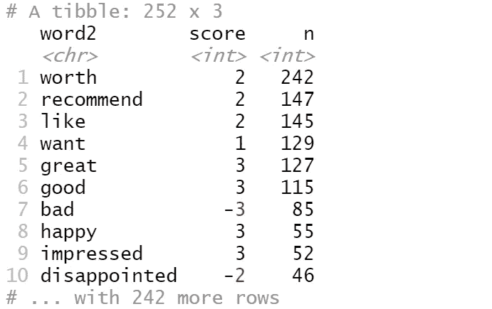

Figure 14

这告诉我们，在数据中，跟在“not”后面的最常见的情感关联词是“worth”，跟在“not”后面的第二个常见的情感关联词是“recommend”，它通常具有 2 的(正)分数。

**那么，在我们的数据中，哪些词在错误的方向上贡献最大？**

```
not_words %>%
  mutate(contribution = n * score) %>%
  arrange(desc(abs(contribution))) %>%
  head(20) %>%
  mutate(word2 = reorder(word2, contribution)) %>%
  ggplot(aes(word2, n * score, fill = n * score > 0)) +
  geom_col(show.legend = FALSE) +
  xlab("Words preceded by \"not\"") +
  ylab("Sentiment score * number of occurrences") +
  ggtitle('The 20 words preceded by "not" that had the greatest contribution to 
          sentiment scores, positive or negative direction') +
  coord_flip()
```

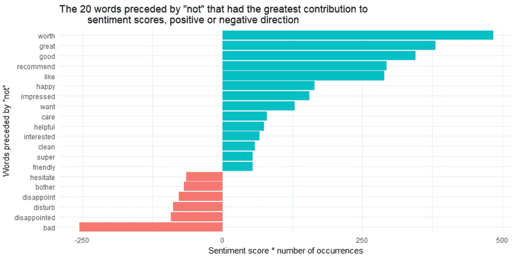

Figure 15

“不值得”、“不太好”、“不好”、“不推荐”和“不喜欢”这几个词是错误识别的主要原因，这使得文本看起来比实际情况积极得多。

除了“不”之外，还有其他否定后项的词，如“没有”、“从来没有”、“没有”。我们去看看。

```
negation_words <- c("not", "no", "never", "without")

negated_words <- bigrams_separated %>%
  filter(word1 %in% negation_words) %>%
  inner_join(AFINN, by = c(word2 = "word")) %>%
  count(word1, word2, score, sort = TRUE) %>%
  ungroup()

negated_words %>%
  mutate(contribution = n * score,
         word2 = reorder(paste(word2, word1, sep = "__"), contribution)) %>%
  group_by(word1) %>%
  top_n(12, abs(contribution)) %>%
  ggplot(aes(word2, contribution, fill = n * score > 0)) +
  geom_col(show.legend = FALSE) +
  facet_wrap(~ word1, scales = "free") +
  scale_x_discrete(labels = function(x) gsub("__.+$", "", x)) +
  xlab("Words preceded by negation term") +
  ylab("Sentiment score * # of occurrences") +
  ggtitle('The most common positive or negative words to follow negations 
          such as "no", "not", "never" and "without"') +
  coord_flip()
```

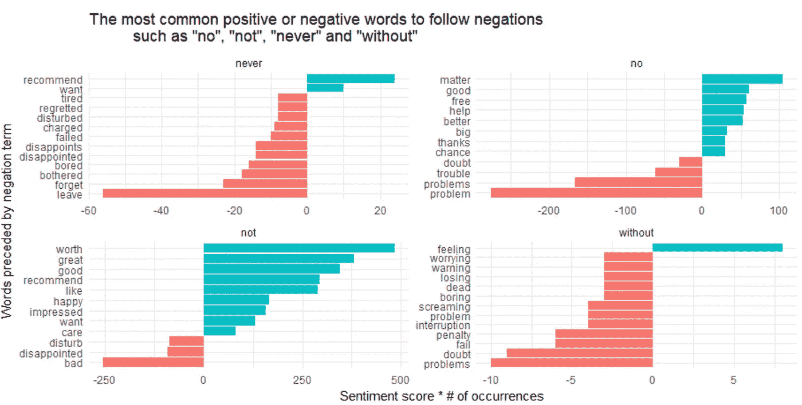

Figure 16

看起来，将一个词误认为积极的最大来源是“不值得/很棒/很好/推荐”，而被错误分类的消极情绪的最大来源是“不坏”和“没问题”。

最后，让我们找出最正面和最负面的评论。

```
sentiment_messages <- tidy_reviews %>%
  inner_join(get_sentiments("afinn"), by = "word") %>%
  group_by(ID) %>%
  summarize(sentiment = mean(score),
            words = n()) %>%
  ungroup() %>%
  filter(words >= 5)sentiment_messages %>%
  arrange(desc(sentiment))
```

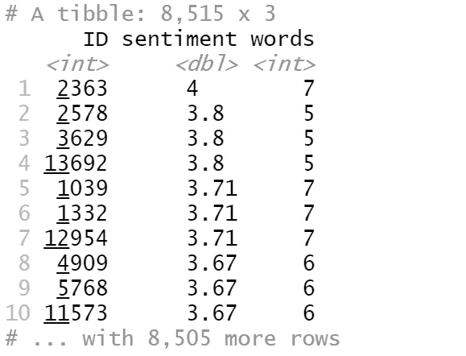

Figure 17

最正面评论的 ID 是 2363:

```
df[ which(df$ID==2363), ]$review_body[1]
```

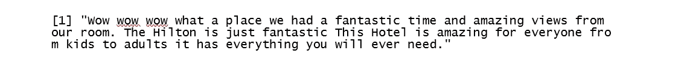

Figure 18

```
sentiment_messages %>%
  arrange(sentiment)
```

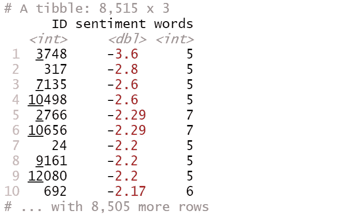

Figure 19

最负面评论的 ID 是 3748:

```
df[ which(df$ID==3748), ]$review_body[1]
```

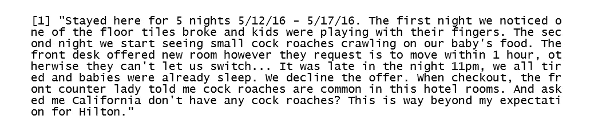

Figure 20

很有趣！源代码可以在 [Github](https://github.com/susanli2016/Data-Analysis-with-R/blob/master/Text%20Mining%20Hilton%20Hawaiian%20Village%20TripAdvisor%20Reviews.Rmd) 上找到。祝你一周愉快！

参考:[文本挖掘用 R](https://www.tidytextmining.com/)