# SD-WAN 链路交换机作为深度 Q 学习的强化学习实验

> 原文：<https://towardsdatascience.com/sd-wan-link-switch-as-reinforcement-learning-experiment-with-deep-q-learning-7a39cd1e8722?source=collection_archive---------15----------------------->

Credit — [https://usblogs.pwc.com/emerging-technology/deep-learning-ai/](https://usblogs.pwc.com/emerging-technology/deep-learning-ai/)

Deep Q '或 [Deep Q-Learning](https://en.wikipedia.org/wiki/Q-learning#Deep_Q-learning) 是强化学习中众所周知的算法，它用深度神经网络逼近 [MDP](https://en.wikipedia.org/wiki/Markov_decision_process) 系统的 Q 值。在本文中，我探索了解决 SD-WAN 网络中链路切换问题的相同算法，为此我已经开发了一个基于 [Mininet](http://mininet.org/) 的 AI-gym(参见我以前的文章-[Open-AI gym for SD-WAN Link Selection](/open-ai-gym-for-sd-wan-link-selection-fe7dac671172))。在应用 Deep-Q 算法时，我发现基于 [Mininet](http://mininet.org/) 的 gym 通过发送真实的 TCP/UDP 流量来执行测量，花费了相当多的时间。这让我想到了另一个使用纯统计后端的想法，它通过生成具有特定均值和方差的[高斯](https://en.wikipedia.org/wiki/Normal_distribution)随机数来模拟流量测量。然后，该算法会根据数千集进行调整，并在最后与实际的 [Mininet](http://mininet.org/) 后端进行交叉检查。本实验为 SD-WAN 链路切换问题可以通过强化学习得到有效解决提供了合理的证据。

## 关于深度 Q 学习实现的一些话

[深度 Q-Learning](https://en.wikipedia.org/wiki/Q-learning#Deep_Q-learning) 出自 [DeepMind](https://deepmind.com/) *的*研究团队(见开创性论文 *—* [用深度强化学习玩雅达利(Atari)Mnih et 的](https://arxiv.org/pdf/1312.5602v1.pdf)。艾尔。).实现这种算法有几种选择。我可以实现“双 Q 网络”或“单 Q 网络”以及“经验回放”。我也可以使用决斗架构(王等人的[深度强化学习决斗网络架构](https://arxiv.org/pdf/1511.06581.pdf))。艾尔。).围绕着*(*[open-ai](https://github.com/openai/baselines/tree/master/baselines/deepq)*，* [Denny Britz](https://github.com/dennybritz/reinforcement-learning/tree/master/DQN) *，* [Keon](https://github.com/keon/deep-q-learning) *)* 我从[Greg](https://github.com/gsurma/cartpole/blob/master/cartpole.py) *中汲取了灵感。*这是一个简单的实施，只有经验回放和单一网络。这是解决[翻转](https://gym.openai.com/envs/CartPole-v0/) 问题的基线。**跟我的问题类似，有离散的动作和无限连续的状态空间。这类似于我在两条链路中的一条上发送流量并观察吞吐量的问题。代理部分非常相似，只是 Cartpole AI-gym 将被替换为我之前已经开发的 SD-WAN 专用 AI-gym(参见我以前的[文章](/open-ai-gym-for-sd-wan-link-selection-fe7dac671172))。**

**用于近似 Q 值的深度神经网络模型具有两个密集层，随后是线性激活**

**观察空间是由三个参数组成的元组——**

**(动作 _ 选择，当前 _ 带宽，可用 _ 带宽)**

**动作空间有两个值——0 和 1，用于选择 MPLS 或 INTERNET 链接。**

**[深度 Q 学习](https://en.wikipedia.org/wiki/Q-learning#Deep_Q-learning)的参数如下**

**伽马= 0.95**

**学习率= 0.001**

**内存大小= 1000000**

**批处理大小= 20**

**EXPLORATION_MAX = 1.0**

**EXPLORATION_MIN = 0.01**

**探索 _ 衰退= 0.995**

## **回顾—剧集评分的下降趋势**

**正如我在之前的[文章](/open-ai-gym-for-sd-wan-link-selection-fe7dac671172)中提到的，单集的累积奖励呈下降趋势，如下图所示**

**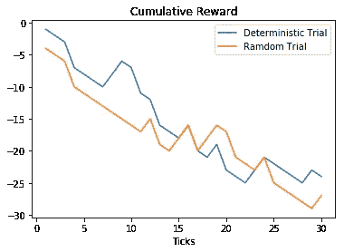**

**从多次试验中也可以明显看出，随机试验的平均回报并没有显示出任何改善。**

**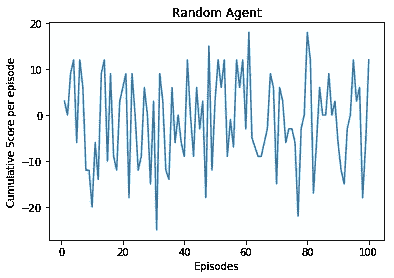**

**正如这里看到的，分数在零附近波动。没有任何学习就没有上升趋势(因为我们还没有应用[深度 Q 学习](https://en.wikipedia.org/wiki/Q-learning#Deep_Q-learning))。然而，这一次在应用深度 Q 学习算法时，我遇到了一种新的障碍。在进行多集实验时，仅完成一集就存在时间跨度大的问题。这一次我使用 [Mininet](http://mininet.org/) 来模拟 SD-WAN 环境，完成一集最多 30 个“时间刻度”真的很漫长。**

## **基于 [Mininet](http://mininet.org/) 的剧集执行时间过长**

**有了 Mininet 的后端，即使只有 30 个时间刻度，每集也要花相当多的时间。随着每个“时间滴答”流量在互联网链路上发送，然后进行测量。一个 100 集的实验在云虚拟机上轻松进行了 12 个多小时，并且在[深度 Q 学习](https://en.wikipedia.org/wiki/Q-learning#Deep_Q-learning)的性能上没有明显的趋势**

**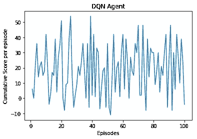**

**[深度 Q-Learning](https://en.wikipedia.org/wiki/Q-learning#Deep_Q-learning) 众所周知需要大量的训练，只有 100 集，还不能确定训练进展如何。**

## **统计后端**

**这个想法很简单。由于通过 [Mininet](http://mininet.org/) 的实际流量需要时间，为什么我不根据某种统计分布来生成测量值呢？在 [Mininet](http://mininet.org/) 实验中，我生成了一些分布式流量。为什么不在不实际发送流量的情况下，在生成测量时应用相同的分布呢？有了这个想法，我创建了一个健身房的统计后端，它基于[正态分布](https://en.wikipedia.org/wiki/Normal_distribution)生成测量值，具有一定的均值( )和标准差(σ)，但没有流量通过链接。**

**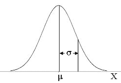**

**以前，我们实际上是以一定的平均值( )和标准差(σ)生成互联网链接流量，然后将它发送到 [Mininet](http://mininet.org/) 链接。现在，我们没有生成任何实际流量，而是将测量结果直接输出为由具有相同σ的[正态分布](https://en.wikipedia.org/wiki/Normal_distribution)生成的数字。这表示占用链路的外部互联网流量。由于链路容量固定在某个值，我们通过从链路容量中减去外部流量带宽来获得流量吞吐量。我在测量“达到的带宽”时也加入了一些随机性。这是通过生成一个具有窄[正态分布](https://en.wikipedia.org/wiki/Normal_distribution)的数字来实现的，该数字具有“实现的带宽”和低σ值(0.5 Mbps)。**

## **具有统计后端的较短剧集**

**我用 deep Q agent 和随机试验进行了相同的训练测量。现在这几集的时间缩短了很多，但是学习并不明显。**

**下面是《随机特工》超过 100 集的评分。你可以看到平均分数是负的-**

**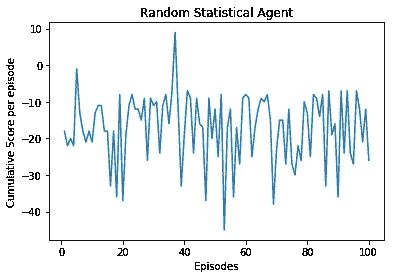**

**以下是用深 Q 网训练 100 集的结果-**

**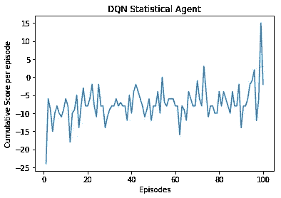**

**你可以看到平均分数远低于零。**

**1000 集(见下)很明显训练失败了。没有上升趋势。这几集的累积分数都很低-**

****

## **奖励设计中的修正**

**很明显，这个问题对代理人来说太难训练和解决了。据我所知，有多种因素导致代理人的报酬较低**

## **1)严格的带宽分配**

**我将链路容量设置为 10 Mbps，并通过它发送了 5 Mbps 的 UDP 流量(偏差为 2 Mbps)。这为我们的预期流量留下了大约 5 Mbps。然而，我将 SLA 限制设置为 6 Mbps。这意味着，如果“实现的带宽”小于 6 Mbps，我们应该进行链路切换。由于这种紧密的安排没有太多的空间，代理别无选择，只能不时地进行链接切换，最终导致较低的累积分数。所以解决方案是公平分配带宽。我再次将 SLA 保持在 6 Mbps，但这次给了其他一般流量 4 Mbps。这为我们留下了大约 6 Mbps 的“预期流量”,以满足现在更频繁的 SLA。**

## **2)奖励设计因失败而倾斜**

**以前的设计是增加+1 以在“时间滴答”中存活。每当“实现的带宽”不能满足 SLA 限制时，惩罚为-5。同样，对于采用 MPLS 链路，惩罚是-2。然而，对于采取正确的行动，即在带宽可用时使用互联网链接，只给予+1 奖励。因此，在默认奖励为+1 的情况下，如果它采取了正确的行动，总奖励为 2，而对于错误的行动，总奖励为-1。此外，每当错过 SLA 时，该“时间刻度”的总奖励为-4。由于紧张的带宽预算，代理经常无法达到 SLA 目标，总体得分迅速下降。**

**还有一条规则可以提前结束一集。如果一个情节连续两次没有达到 SLA 指导原则，则该情节会被突然终止。然而，这并没有体现在奖励上。这也在新的逻辑中被修正了。**

## **新逻辑**

**新的设计原则基于以下几点**

**鼓励在“时间滴答”中生存**

**鼓励正确的链接选择，这次奖励更多**

**阻止错误的链接选择，但不要像以前那样惩罚**

**阻止 SLA 违约，但不作为最高处罚**

**因结束这一集而受到重罚**

**下面是新逻辑的实现(参见下面的代码)**

**因此，这一次我们在选择 MPLS 链路时扣除 1，而不是 2。此外，只要选择了正确的链接，奖励就会增加+2。“SLA 失误”被罚了-2 分，而不是之前的-5 分。每多活一个滴答+1 的奖励仍然存在。然而，我们因为提前结束这一集而扣除了最大值(-5)。这一次，没有提前结束这一集的目标变成了奖励设计。**

## **3)短插曲长度**

**每集长度会影响奖励结果，从而影响学习过程。以前一集只有 30 分钟。考虑到实际的 [Mininet](http://mininet.org/) 后端的实验速度很慢，这个值保持得很低。以每集 30 个“时间刻度”计算，总共 100 集在云虚拟机中需要大约 12 个小时。这是将情节重复数千次的主要障碍。众所周知，深度 Q-learning 最初需要许多片段来预热，因此不知道学习是否正在进行。有了统计后端，我能够保持 300 集的长度(因为 30 集对于一集来说是很低的数字),并且剧集完成得更快。我这次做了几千次实验，以获得学习的真实情况。只有当我切换到统计后端时，这种扭曲的奖励设计才变得明显。**

## **培养**

**在修改了奖励设计和应用了统计后端之后，我又开始训练代理人。统计后端上的随机代理没有显示任何预期的学习。然而这一次每集的平均分数是正的。**

**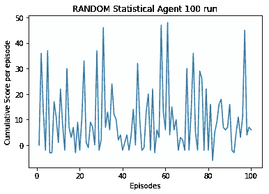**

**然而，深度 Q 代理在很早的时候就显示出轻微的上升趋势事件，甚至有 100 集。**

**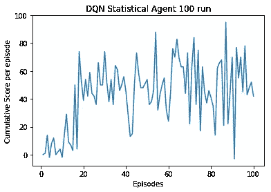**

**预热发生在大约 500 集的时候，如下图所示**

**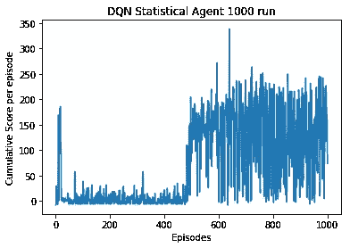**

**当我们放大到 400-600 的范围时，这种突然的跳跃是很明显的**

**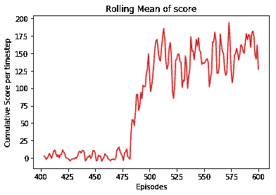**

## **确认**

**在我用统计后端运行了 1000 集的训练后，很明显代理人在每一集上都有持续的进步。现在是在 [Mininet](http://mininet.org/) 后端验证这种学习的时候了。关于统计后端的学习对于 [Mininet](http://mininet.org/) 是否仍然有效，在这里我们实际发送流量以确定吞吐量？**

**我使用[Mininet](http://mininet.org/) 后端运行 deep Q agent，但这次使用的是通过使用统计后端学习 1000 集训练获得的相同神经网络权重。细看单集 *-* ，评分的涨幅非常明显**

**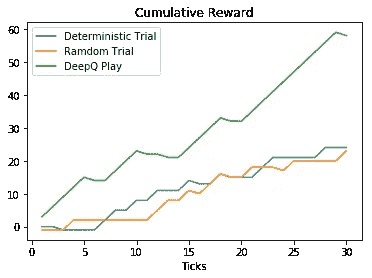**

**Single Episode comparison after training**

**与随机和确定性代理相比，可以看到 deep Q 代理的明显增益。**

**从下面两个图中也可以清楚地看出，与随机代理相比，deep Q 代理进行的链路切换非常少**

**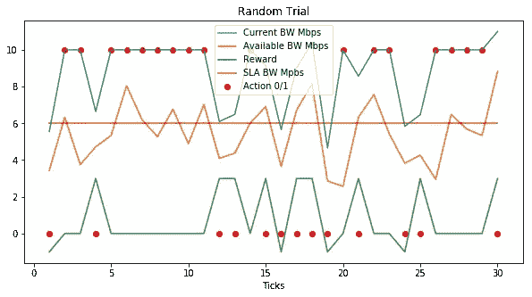**

**Random agent one episode details**

**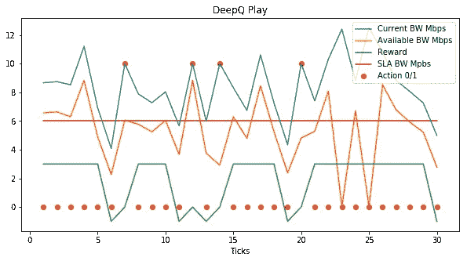**

**Deep Q agent play for one episode**

**最后，对 100 集的情节进行了比较，很明显，deep Q 代理的平均回报远远高于具有 [Mininet](http://mininet.org/) 后端的相同设置的随机代理**

****

**100 episode play random vs deep Q agent**

## **结论**

**很明显，deep Q 代理知道何时为 SD-WAN 设置切换链路，并实际解决了链路切换问题。这是一个非常简单的代理，只有单 Q 网络与经验重播。结果可以通过更复杂的方法来改善，如[双 Q 网络](https://arxiv.org/abs/1509.06461)或[决斗双 Q 网络](https://arxiv.org/pdf/1511.06581.pdf)，甚至通过政策梯度方法，如演员-评论家(见[萨顿和巴尔托](http://incompleteideas.net/book/the-book-2nd.html))或 [A3C](http://proceedings.mlr.press/v48/mniha16.pdf) 。本实验的目标不是实现最大可能的回报，而是表明强化学习在应用于 SD-WAN 链路切换问题时，实际上可以以合理的效率解决问题。人们可以通过增加 QOS 参数，如抖动、延迟等，用更先进的算法和更真实的观察空间来改进这一点。**

## **密码**

**上述实验的代码已经被签入 github([https://github.com/amitnilams/sdwan-gym](https://github.com/amitnilams/sdwan-gym)、[https://github.com/amitnilams/sdwan-gym](https://github.com/amitnilams/sdwan-gym)-stat、[https://github.com/amitnilams/sdwan-](https://github.com/amitnilams/sdwan-gym)rl)**

## **参考**

**1)我之前的文章— [Open-AI gym for SD-WAN 链接选择](/open-ai-gym-for-sd-wan-link-selection-fe7dac671172)**

**2 *)* [玩深度强化学习的雅达利](https://arxiv.org/pdf/1312.5602v1.pdf)由 Mnih et。铝**

**3) [深度强化学习的决斗网络架构](https://arxiv.org/pdf/1511.06581.pdf)王等。**

**4) [open-ai](https://github.com/openai/baselines/tree/master/baselines/deepq) 基线**

**5) DQN 实施由[丹尼·布里兹](https://github.com/dennybritz/reinforcement-learning/tree/master/DQN)**

**6)深度 Q 由 [Keon](https://github.com/keon/deep-q-learning) 实现**

**7) [翻筋斗](https://gym.openai.com/envs/CartPole-v0/) 由[格雷格](https://github.com/gsurma/cartpole/blob/master/cartpole.py) *实现。***

**8)[Richard s . Sutton 等人提出的利用函数逼近进行强化学习的策略梯度方法](http://papers.nips.cc/paper/1713-policy-gradient-methods-for-reinforcement-learning-with-function-approximation.pdf)。艾尔。**

**9) [深度强化学习的异步方法](http://proceedings.mlr.press/v48/mniha16.pdf)Mnih et。艾尔。**

**10) [萨顿和巴尔托著《强化学习:导论》第二版](http://incompleteideas.net/book/bookdraft2017nov5.pdf)**

**11)[David Silver 等人的利用双 Q 学习的深度强化学习](https://arxiv.org/abs/1509.06461)。艾尔。**