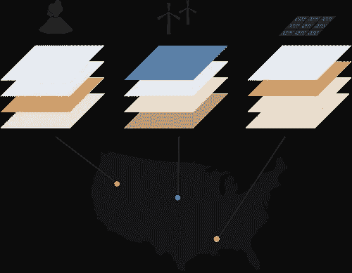
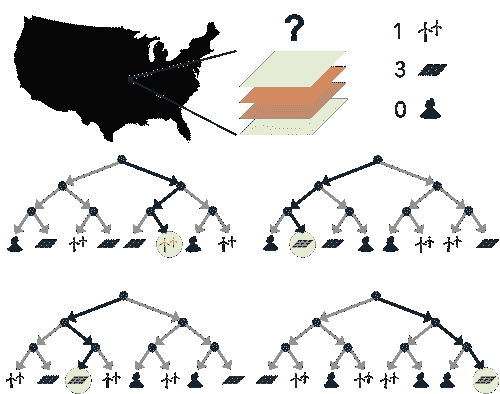
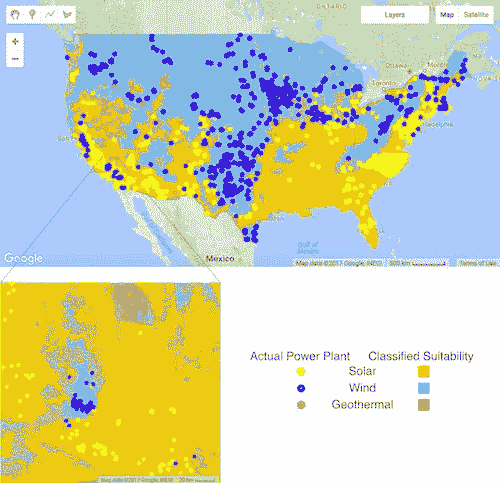

# 在随机森林中寻找能量

> 原文：<https://towardsdatascience.com/searching-for-energy-in-a-random-forest-1eab9be15d53?source=collection_archive---------2----------------------->

我们需要覆盖多少地球表面的太阳能电池板来满足整个人口的能源需求？不多，根据土地艺术发电机倡议组织，他们在 2009 年计算出我们需要在世界上大约 496，805 平方公里的土地上铺设太阳能电池板来满足人类 2030 年的能源需求。这听起来很多，但事实上只有 0.35%的土地没有被水覆盖。

这太不可思议了，看起来是一个完全可以实现的目标，尽管这有点简单化。我们不能只把那些面板放在一个地方，很多地区可能更适合不同的清洁能源。事实上，在一次更新中，原始文章指出需要考虑可再生能源生产的多样性和分布。然而，这种“容易”的想法是诱人的，100%可再生能源的想法正在被一些组织如[解决方案项目](http://thesolutionsproject.org/)认真推动。

那么，我们如何着手弄清楚哪种类型的可再生能源应该去哪里呢？这实际上是一个极其复杂的决定，需要我们考虑地球物理因素，包括天气、气候、土地类型、海拔、坡度，以及人口密度、基础设施、电网特征、能源市场等人为因素。如果你是决定在哪里建下一个发电厂的人，那要考虑很多。因此，围绕这个问题有一个完整的行业，它依赖于大量的人类专业知识。

对我来说，这似乎是一个绝佳的机会，看看我们是否能够利用机器学习做出更好、更快的决策。有成千上万个现有的可再生能源网站，我们可以训练计算机从中学习。为什么不尝试教一种算法来理解每个地点的什么特征使这些地点成为建设可再生能源的好地方，将该公式应用于我们剩余的可用土地，并查看全球最佳的能源生产地点在哪里？

在华盛顿大学的 2016 年地理黑客周上，我提出了这个想法，并成立了一个项目来测试它。在几天黑客攻击的时间限制内，目标是获取美国各地带有少量地理特征的可再生能源站点的位置，并使用这些信息来训练计算机，以决定应该在整个国家放置哪些类型的可再生能源。为了让事情变得简单一点，我们把自己限制在只关注大规模的太阳能、风能和地热发电。

我们选择的机器学习方法是随机森林分类器。分类器是一种学习预测类别(从有限的选项中选择)的算法。随机森林技术通过构建一系列决策树来实现这一点。在我们的例子中，我们告诉它每个有清洁能源的地方的特点，以及那里有什么类型的可再生能源。然后，它会生成多个不同的决策树，这些决策树都可以用来计算哪些特征会导致每一个可更新。这是我们的森林。当我们给它一个未知类别的新数据点(在我们的例子中，是关于我们想要知道最佳可再生能源适用性的特定位置的数据)时，它会遍历所有决策树，并从他们的选择中获得多数票，以决定哪种可再生能源最适合该位置。

可再生能源所在地的数据来自[EIA]([http://www.eia.gov/maps/layer_info-m.php](http://www.eia.gov/maps/layer_info-m.php))，我们收集了海拔、坡度、坡向、太阳辐照度、风速、温度梯度和人口数据。我们为地理空间机器学习问题选择的平台是谷歌地球引擎。它利用谷歌的硬件资源以非常高的速度完成巨大的地理空间计算，并内置了机器学习功能。我们部署了他们的随机森林算法，来制作一张地图，以令人难以置信的 4 公里分辨率，在全国范围内预测风能、太阳能和地热能生产的适宜性。我们也将某些地点设为禁区，例如城市、森林和水体。

最终的地图显示了现有的两个可再生能源网站，以及整个美国在 4 公里网格上的每个点上从三个可再生能源中选择最佳的颜色编码。即使只是考虑几个变量，我们也能看到有意义的东西；中西部大多被归类为最适合风能的地区，而南部有更多适合太阳能的地区，该算法预测地热的最佳地点集中在山脉和火山周围。从放大的地图部分，我们还可以看到，在局部水平上，为每种类型的能源生产选择的区域之间有高分辨率的区别。

这只是一个原型黑客，但它仍然很酷，看看如何可能确定整个国家的可再生能源的适用性，在高空间分辨率的几个点击。它非常符合能够为全世界提出可再生能源计划的愿景，同时赋予决策者在地方层面制定优化能源战略的权力。在现实世界中，情况肯定更复杂。我们没有包括许多相关的功能，没有考虑现有可再生能源站点的建设时间，也没有考虑复杂的因素，如经济、地方政策或电力分配。

至于分类机器学习方法是否是这个问题的最佳方法，我可以想到一些优点和局限性。首先，任何机器学习技术都是从过去关于在哪里建电厂的决策中建立理解。一方面，这是好的，因为我们在没有明确定义它们的情况下，自动将人类的专业知识和关注点构建到我们的模型中，但是不能保证以前的决策适用于未来的场景。现代电网、政治、能源市场和可再生技术本身都处于进化状态，但也许通过精心选择的特征，这些都可以得到解释。

还有一个问题是，分类模型的最终结果只能告诉我们哪种可再生能源最适合某个地方。它没有告诉我们不同类型在每个地点的比较，或者一个地点是否比另一个地点更适合某种类型。仅仅知道你的国家哪里比其他可再生能源更适合太阳能，而不知道哪里是建造太阳能发电厂的最佳地点，这并没有多大用处。我们简要地看了一下实现这一点的回归算法(产生一个数量，而不是一个简单的选择)，设想创建一个相对场地适宜性的热图，进一步探索肯定会很有趣。另一种选择可能是使用人类专家定义的公式，并应用全局优化方法来生成相对场地适宜性图。

这个项目在未来肯定会有一些有趣的方向，希望我能找到时间回到这个话题上来！关于 hack week 项目的更多技术细节、数据和代码可以在它的 [GitHub 库](https://github.com/rhwhite/geohack2016renew)上看到。非常感谢我的团队成员，[劳拉·辛克曼](http://jisao.washington.edu/researchers/bios/hinkelman)，[山姆·胡珀](http://geotrendr.ceoas.oregonstate.edu/people/)，[茱莉亚·金](https://www.linkedin.com/in/julia-king-25709733/)和[瑞秋·怀特](http://www.atmos.washington.edu/~rachel/)同意继续这个想法，并感谢[凯瑟琳·库恩](http://www.thebutmanlab.com/catherine-kuhn/)的所有协助。也感谢 Anthony Arendt 和 GeoHackWeek 团队的其他成员举办了一场精彩的活动！

**相关链接**

这里有一个其他可再生能源测绘项目和组织的列表，它们是这个项目的灵感来源。

*   [可再生能源忍者](http://renewables.ninja/)——模拟全球风能和太阳能输出。
*   谷歌的[项目天窗](https://www.google.com/get/sunroof#p=0)——告诉你你的屋顶有多适合太阳能。
*   爱荷华州风力涡轮机场地适用性的机器学习——一篇学术论文证明我不是唯一一个愚蠢到认为这可能是一个好主意的人。
*   [NREL 可再生能源潜力](http://www.nrel.gov/gis/re_potential.html) —报道美国可再生能源的技术和经济潜力。

这篇文章的副本也可以在[georgerichardon.net](http://georgerichardson.net/2017/04/10/searching-for-energy-in-a-random-forest/)上找到