# 深度学习之美背后的秘密酱:激活函数初学者指南

> 原文：<https://towardsdatascience.com/secret-sauce-behind-the-beauty-of-deep-learning-beginners-guide-to-activation-functions-a8e23a57d046?source=collection_archive---------1----------------------->

激活功能是获取输入信号并将其转换为输出信号的功能。激活函数将非线性引入网络，这就是为什么我们称之为非线性。神经网络是通用函数逼近器，深度神经网络使用反向传播来训练，反向传播需要[可微分的](https://en.wikipedia.org/wiki/Differentiable_function)激活函数。反向传播在这个函数上使用梯度下降来更新网络权重。理解激活函数非常重要，因为它们在深度神经网络的质量中起着至关重要的作用。在这篇文章中，我列出并描述了不同的激活功能。

*   **恒等式或线性激活函数—** 恒等式或线性激活函数是所有激活函数中最简单的。它对你的数据进行恒等运算，输出数据与输入数据成正比。线性激活函数的问题是，它的导数是一个常数，它的梯度也是一个常数，下降将是一个常数梯度。

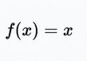

Equation for Identity or Linear activation function

范围:(-∞，+∞)

例如:f(2) = 2 或 f(-4) = -4

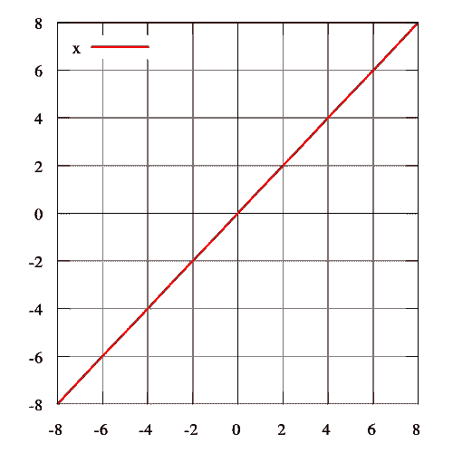

*   **Heaviside(二进制步长，0 或 1，高或低)步长函数**通常只在单层感知器中有用，这是一种早期的神经网络，可用于输入数据可线性分离的情况下的分类。这些函数对于二元分类任务非常有用。如果输入和高于某个阈值，则输出为某个值 A1，如果输入和低于某个阈值，则输出为 A0。感知器使用的值是 A1 = 1 和 A0 = 0

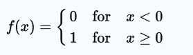

Equation for Heaveside/Binary Step Function (0 or 1, high or low)

范围:{0 或 1 }或 1

例子:f(2) = 1，f(-4) = 0，f(0) = 0，f(1) = 1

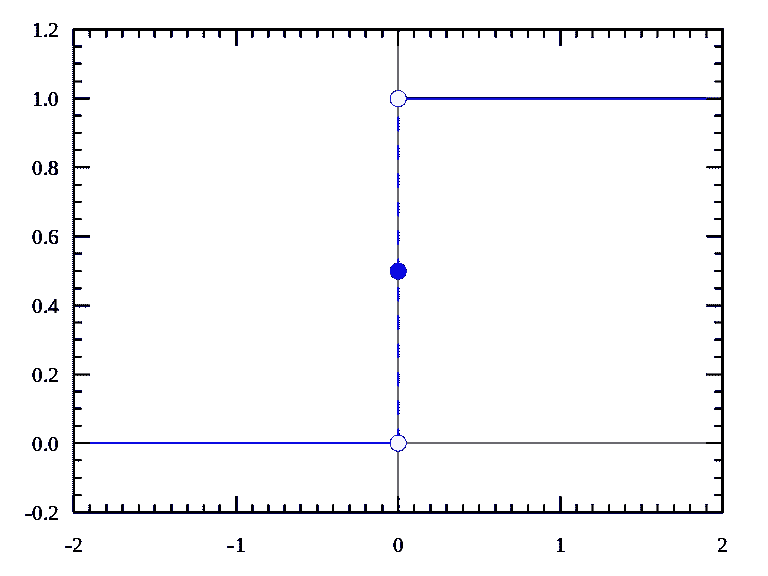

Source — [https://en.wikipedia.org/wiki/Heaviside_step_function](https://en.wikipedia.org/wiki/Heaviside_step_function)

*   **Sigmoid 或逻辑激活函数(软步骤)-** 主要用于二元分类问题(即输出范围为 0-1 的值)。它有渐变消失的问题。由于输入(X)在输出(Y)中引起非常小的变化，网络在某些时期后拒绝学习或学习非常慢。它是一个广泛用于分类问题的激活函数，但最近。这个函数更容易使后面的层饱和，使得训练更加困难。计算 Sigmoid 函数的导数非常容易。

对于神经网络中的反向传播过程，你的误差将在每一层被压缩(至少)四分之一。所以，你的关系网越深，从数据中获得的知识就会越多。我们从输出层获得的一些“大”错误可能不会对相对较浅的层中的神经元的突触权重产生太大影响(“浅”意味着它接近输入层)——来源[https://github . com/kul bear/deep-learning-nano-foundation/wiki/ReLU-and-soft max-Activation-Functions](https://github.com/Kulbear/deep-learning-nano-foundation/wiki/ReLU-and-Softmax-Activation-Functions)

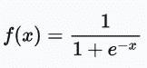

Sigmoid or Logistic activation function

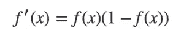

Derivative of the sigmoid function

范围:(0，1)

例如:f(4) = 0.982，f(-3) = 0.0474，f(-5) = 0.0067

Source — [https://en.wikipedia.org/wiki/Logistic_function](https://en.wikipedia.org/wiki/Logistic_function)

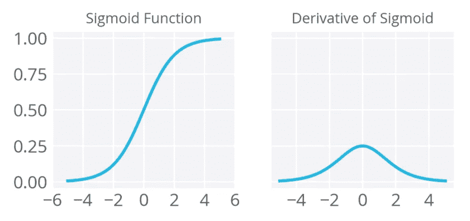

Source — [https://github.com/Kulbear/deep-learning-nano-foundation/wiki/ReLU-and-Softmax-Activation-Functions](https://github.com/Kulbear/deep-learning-nano-foundation/wiki/ReLU-and-Softmax-Activation-Functions)

*   **双曲正切(TanH)——**它看起来像一个缩放的 sigmoid 函数。数据以零为中心，所以导数会更高。Tanh 比 sigmoid 和 logistic 激活函数收敛更快

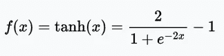

Equation for Hyperbolic Tangent(TanH) activation function

范围:(-1，1)

示例:tanh(2) = 0.9640，tanh(-0.567) = -0.5131，tanh(0) = 0

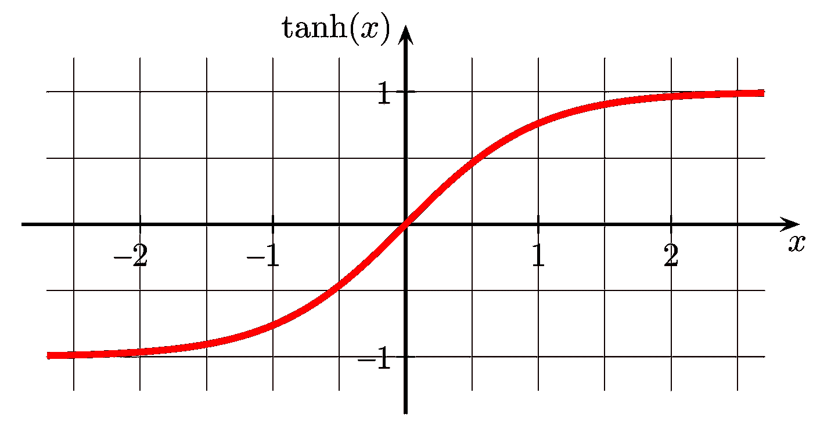

Source — [https://commons.wikimedia.org/wiki/File:Hyperbolic_Tangent.svg](https://commons.wikimedia.org/wiki/File:Hyperbolic_Tangent.svg)

*   **整流线性单元(ReLU)——**训练速度比 tanh 快 6 倍。当输入值小于零时，输出值将为零。如果输入大于或等于零，则输出等于输入。当输入值为正值时，导数为 1，因此不会出现在 sigmoid 函数反向传播误差的情况下出现的压缩效应。

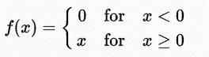

Equation for Rectified Linear Unit(ReLU) activation function

范围:[0，x]

例如:f(-5) = 0，f(0) = 0 & f(5) = 5

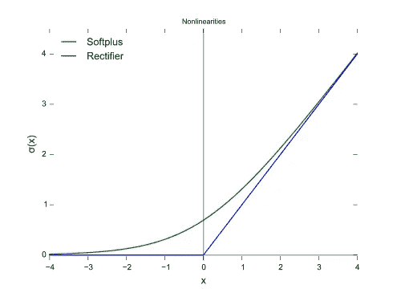

Source — [https://en.wikipedia.org/wiki/Rectifier_(neural_networks)](https://en.wikipedia.org/wiki/Rectifier_(neural_networks))

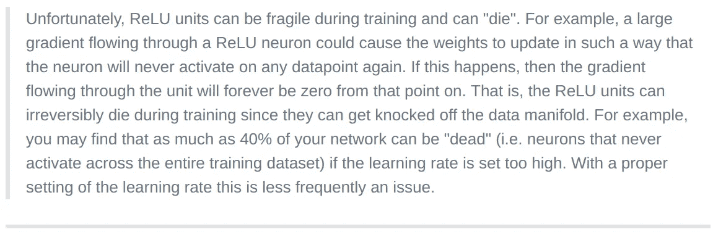

From Andrej Karpathy’s CS231n course

*   **泄漏整流线性单元(泄漏 ReLU) —** 当单元不工作时，泄漏 ReLU 允许一个小的非零梯度。0.01 是小的非零梯度 qhere。

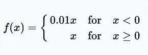

Equation for Leaky Rectified Linear Unit (Leaky ReLU) activation function

范围:(-∞，+∞)

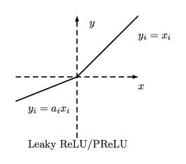

Leaky Rectified Linear Unit(Leaky ReLU)

*   **参数校正线性单元(PReLU)——**它使泄漏系数成为一个参数，该参数与其他神经网络参数一起学习。α(α)是这里的泄漏系数。

对于α ≤ 1 f(x) = max(x，αx)

范围:(-∞，+∞)

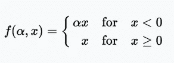

Equation for Parametric Rectified Linear Unit(PReLU)

*   **随机泄漏整流线性单元(RReLU)**

范围:(-∞，+∞)

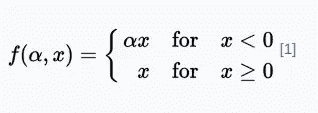

Randomized Leaky Rectified Linear Unit(RReLU)

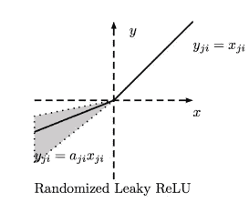

*   **指数线性单元(ELU)——**指数线性单元试图使平均激活接近零，从而加快学习速度。研究表明，ELUs 比 ReLUs 具有更高的分类精度。这里，α是一个超参数，需要调整，约束条件是α ≥ 0(零)。

范围:(-α，+∞)

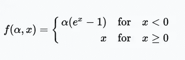

Exponential Linear Unit (ELU)

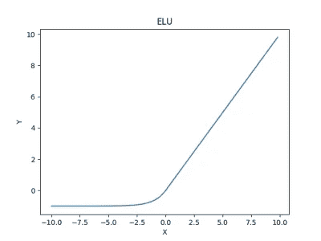

*   **比例指数线性单位(SELU)**

范围:(-λα，+∞)

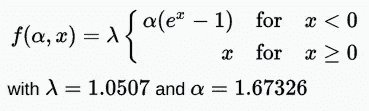

Scaled Exponential Linear Unit(SELU)

*   **S 形整流线性激活单元(SReLU)**

范围:(-∞，+∞)

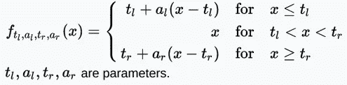

S-shaped Rectified Linear Activation Unit

*   **自适应分段线性(APL)**

范围:(-∞，+∞)

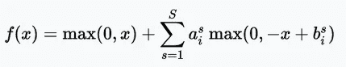

*   **soft plus—**soft plus 函数的导数是逻辑函数。ReLU 和 Softplus 在很大程度上是相似的，除了在 0(零)附近，softplus 非常平滑且可微分。计算 ReLU 及其导数比使用 log(.)和 exp(。)的提法。

范围:(0，∞)

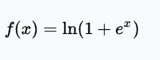

Softplus

softplus 函数的导数是逻辑函数。

Derivative of the softplus function

Source — [https://en.wikipedia.org/wiki/Rectifier_(neural_networks)](https://en.wikipedia.org/wiki/Rectifier_(neural_networks))

*   **本特的身份**

范围:(-∞，+∞)

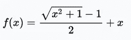

Bent Identity

*   **Softmax-** Softmax 函数将原始值转换成后验概率。这提供了一定程度的确定性。它将每个单元的输出压缩到 0 和 1 之间，就像一个 sigmoid 函数一样。但是它也划分每个输出，使得输出的总和等于 1。

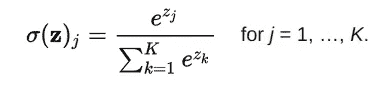

Equation for Softmax function

softmax 函数的输出相当于分类概率分布，它告诉您任何类为真的概率

结论:ReLU 及其变体应优先于乙状结肠或 tanh 激活功能。以及 ReLUs 训练起来更快。如果 ReLU 导致神经元死亡，使用 Leaky ReLUs 或它的其他变体。Sigmoid 和 tanh 遭受消失梯度问题，不应用于隐藏层。ReLUs 最适合隐藏层。应该使用易于微分和易于训练的激活函数。

参考资料:

1.  [https://en.wikipedia.org/wiki/Activation_function](https://en.wikipedia.org/wiki/Activation_function)
2.  [https://github . com/kul bear/deep-learning-nano-foundation/wiki/ReLU-and-soft max-Activation-Functions](https://github.com/Kulbear/deep-learning-nano-foundation/wiki/ReLU-and-Softmax-Activation-Functions)
3.  [https://en . Wikipedia . org/wiki/Rectifier _(neural _ networks)](https://en.wikipedia.org/wiki/Rectifier_(neural_networks))

# 关于

> 在[*Mate Labs*](http://matelabs.in/)*我们*已经构建了 [Mateverse](https://www.mateverse.com/) ，一个全自动的机器学习平台，在这里你可以构建**定制的 ML 模型，比** **快 10 倍，而无需编写一行代码**。我们利用专有技术、复杂管道、大数据支持、自动化数据预处理(使用 ML 模型的缺失值插补、异常值检测和格式化)、自动化超参数优化和[等等，让分析师和数据科学家的工作变得更加轻松。](http://bit.ly/2UKMO2J)
> 
> 为了帮助您的企业采用机器学习，而不会浪费您的团队在数据清理和创建有效数据模型方面的时间，请填写[**类型表**](https://matelabs.typeform.com/to/LIAau1) [**此处**](http://bit.ly/formcontactus) ，我们将与您联系。

# 让我们携起手来。

> 在 [**Twitter**](https://twitter.com/matelabs_ai) **、LinkedIn** 上与我们分享您的想法
> 
> 如果你有新的建议，请告诉我们。我们的耳朵和眼睛总是为真正令人兴奋的事情而张开。

# 之前我们分享过。

1.  [如何在 5 分钟内训练出一个机器学习模型。](https://medium.com/@matelabs_ai/how-to-train-a-machine-learning-model-in-5-minutes-c599fa20e7d5)
2.  [公共数据集:用这些在 Mateverse 上训练机器学习模型。](https://medium.com/@matelabs_ai/public-data-sets-use-these-to-train-machine-learning-models-on-mateverse-4dda18a27851)
3.  [Mateverse 公测公告。](https://medium.com/@matelabs_ai/big-announcement-mateverse-is-in-public-beta-a968e727cfdc)
4.  [为什么我们需要机器学习民主化？](https://medium.com/startup-grind/why-do-we-need-the-democratization-of-machine-learning-80104e43c76f)
5.  一个非常清晰的解释全有线电视新闻网的实施。[这些研究人员如何尝试一些非常规的东西来实现更小但更好的图像识别。](https://medium.com/@matelabs_ai/how-these-researchers-tried-something-unconventional-to-came-out-with-a-smaller-yet-better-image-544327f30e72)
6.  我们的愿景。[关于人工智能大家都没告诉你的事情](https://medium.com/startup-grind/what-everyone-is-not-telling-you-about-artificial-intelligence-36c8552f3f53)