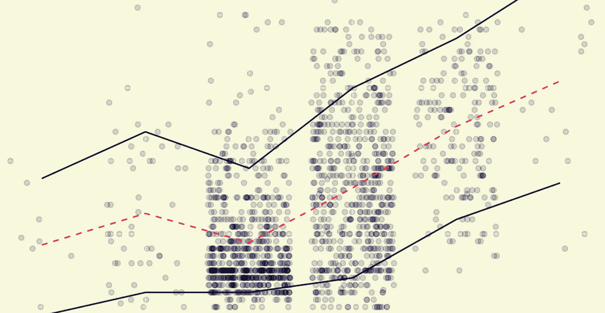
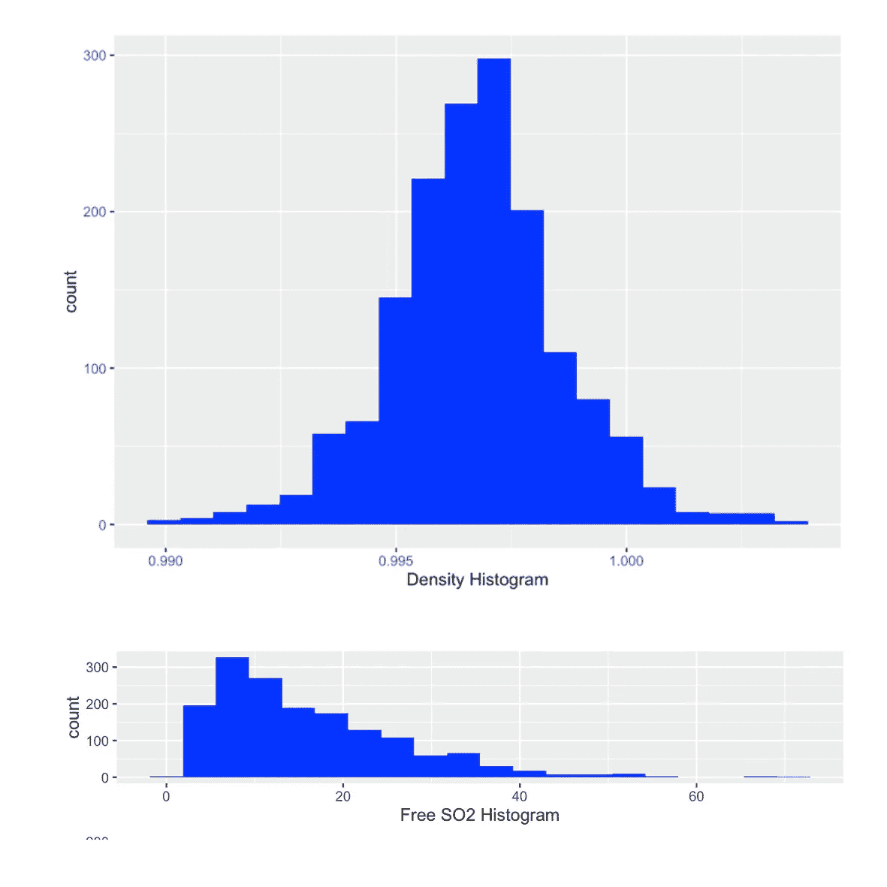
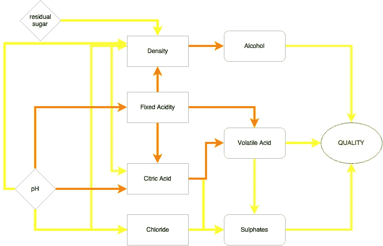
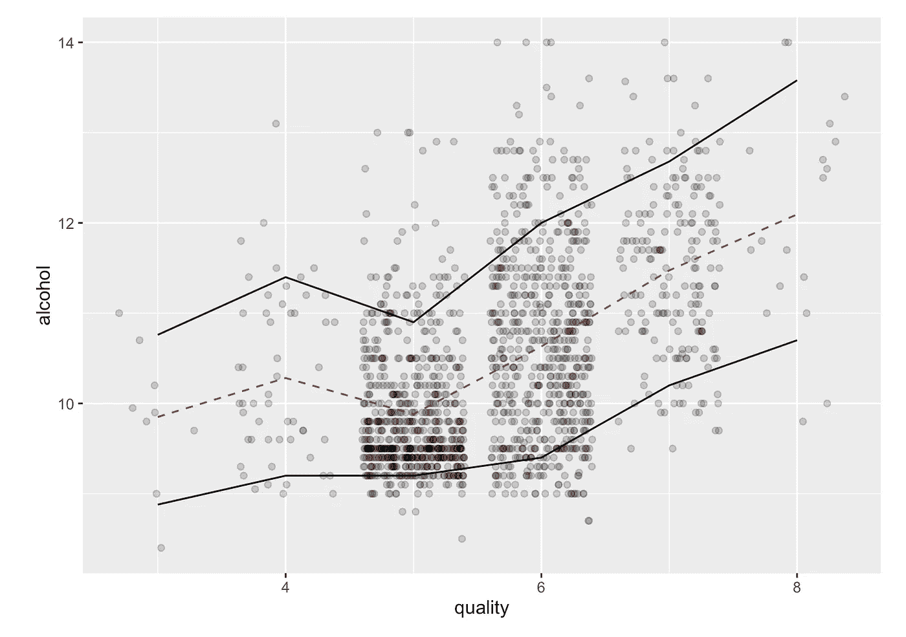
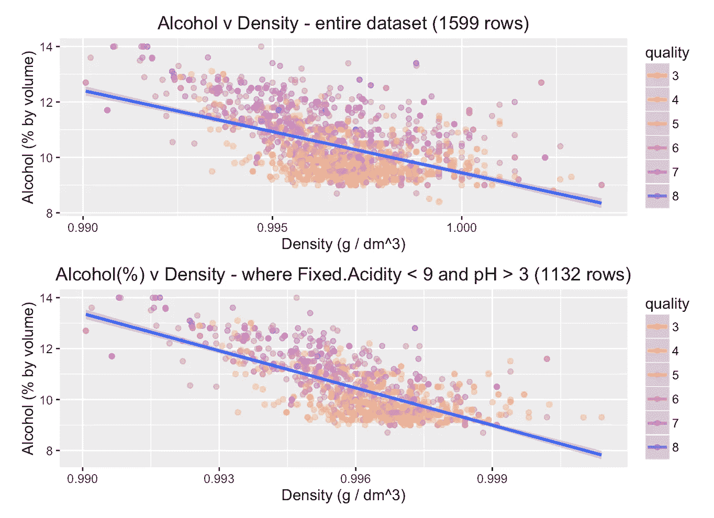
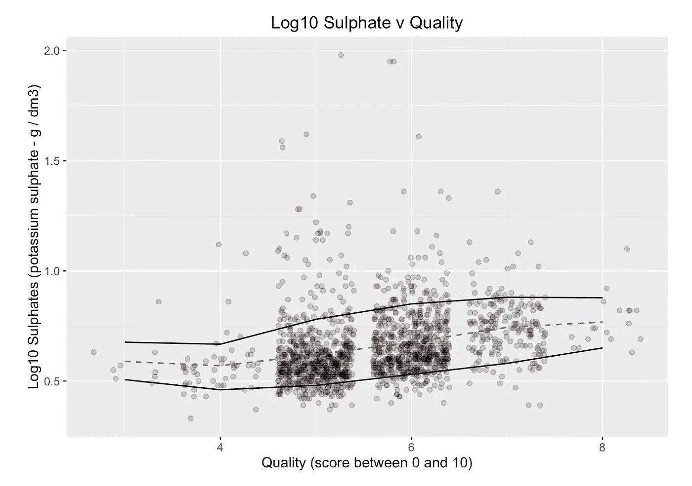
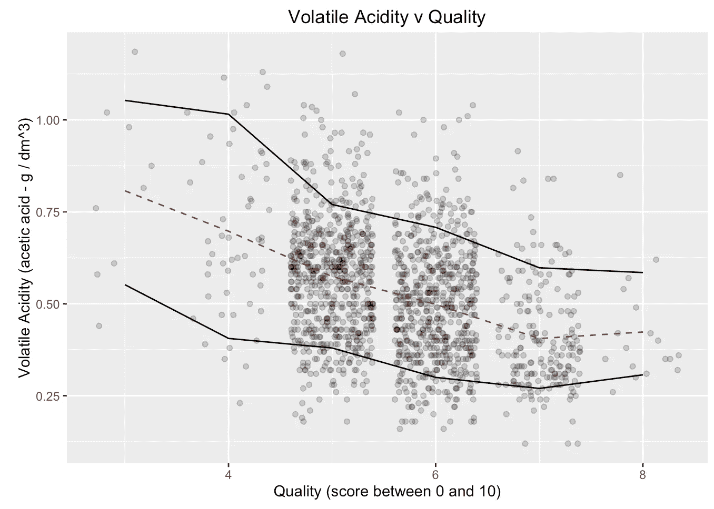

# Vinho Verde 的秘密

> 原文：<https://towardsdatascience.com/secrets-of-vinho-verde-36a248193d83?source=collection_archive---------4----------------------->

本周的挑战是利用研究的力量来确定哪些 T2 因素促成了一杯上好的红酒。

至少有 3 名葡萄酒专家对 1599 款葡萄酒进行了测试，并给出了从 **0** (糟糕)到 **10** (优秀)的质量等级。

测量了 **11 个因子**:固定酸度*，柠檬酸，残糖，氯化物，游离和总二氧化硫，密度，pH，硫酸盐*和*酒精*。

Example of Normal (density) and Skewed (Free SO2) distributions.

# 单变量分析

查看每个**因子**并检查**空值**和**异常值** ( *异常高或低条目*)并做出相应的决策。

分布*(即密度)*越“正常”，比较结果越好。对于具有偏斜分布的**因子***(即游离 SO2)* ，我测试了 log10 或平方根转换是否会改善这种情况，并相应地做出了决定。

# 双变量分析

现在使用 GGPairs 来寻找**因素**之间的**相关性**。

显著的 **Pearson 的 R** 结果以黄色(0.3-0.5 的小意思)或橙色(0.5-0.7 的中等意思)突出显示。我还在流程图上追踪了这个。

这导致了 3 个观察结果:

1.游离 SO2 和总 SO2 高度相关，但与其他变量不相关。
2。**残糖**与密度有很小的相关性，但与其他无关。
**3。三个关键因素:**酒精、挥发酸、硫酸盐。

# 关键因素 1:酒精

酒精含量越高，似乎意味着葡萄酒质量越好。

没什么**10<为**顶**的质量。
没事**没事> 12** 为**降低**质量。多数**中间范围** (5/6) = 10。**

高于**质量= 5** 有一个明显的积极趋势。

其他变量呢？

随着**密度**的降低**酒精**的含量会略微增加(这并不奇怪，因为它们是相互关联的)。

当**固定酸度**较低而 **pH** 较高时，这种趋势更加明显。

统计结果还表明，这种关系可能是显著的。

# 关键因素 2:硫酸盐

图表显示**硫酸盐**和**品质**之间存在轻微的正相关关系，即**品质**越高的葡萄酒**硫酸盐**含量越高。

然而，统计结果并不支持这一点，所以我们对这种关系的信心要少得多。

# 关键因素 3:挥发性酸度

这里的图表显示了明显的负面趋势。高质量的葡萄酒往往具有较低的挥发酸含量。因为高挥发性酸度会导致酸味，所以这并不奇怪。

不幸的是，统计结果并不确定，所以我们也不能确定这两者之间的相关性。

# 结论

结果表明，以下因素可能有助于高品质的葡萄酒:

*   高**酒精**水平(超过 10)
*   低**密度**(低于 0.998)
*   ●固定酸度**(低于 9)**
*   **ph 值更高(超过 3)**

**它们还表明了到之间的可能联系**

*   **低**挥发酸度**(低于 0.75)**
*   **更高的**硫酸盐**(超过 0.5)**

**但是对于这个数据集，它看起来并不重要。理想的后续行动是对随后几年进行匹配分析。该数据集记录于 2009 年。如果在过去的六年里收集了类似的数据，那将使我们得出更可靠、更有力的结论。**