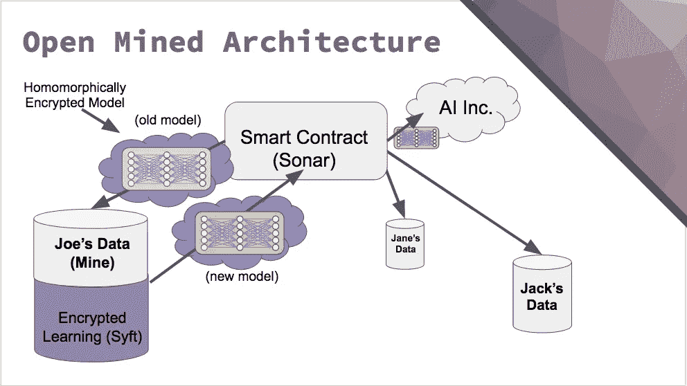

# 安全数据市场和分布式深度学习

> 原文：<https://towardsdatascience.com/secure-data-marketplace-and-distributed-deep-learning-76c2c7505ba?source=collection_archive---------19----------------------->

单个项目中的人工智能和区块链听起来可能非常自大，但这不仅仅是营销废话，所以不要太早逃跑。深度学习可以做很酷的事情，但它通常需要大量的数据。此外，在许多情况下，这些数据是敏感的，人们不想分享这些数据。然而，有一种方法可以根据来自许多矿工的数据训练神经网络，同时保持其私密性。每个矿工将训练模型，但不能做出任何有意义的预测。模型的所有者将能够使用它，但不会获得任何数据。双赢。OpenMined 旨在为此开发开源工具包。

Mine, Syft and Sonar are the names of corresponding services

通用组件:

联合深度学习-计算每个用户的梯度并在通用模型中总结它们的方法。事实上它只是分布式随机梯度下降。它既有很好的理论属性，也在一些大型产品(如 Android)中得到了验证。

同态加密保护这些梯度到主服务器的安全过渡。he 的主要特点是可以对加密数据进行数学运算，解密后效果相同。由于计算成本高，它没有被广泛使用，但在过去几年中，一些有效的整数和浮点数类型得到了发展。

通过基于区块链的智能合约，所有的梯度和金融交易对矿商和公司来说都将是透明和安全的。

## 循序渐进

1.  AI Inc .创建了一个模型，并将其发布给矿工
2.  Miner 下载该模型，并根据他的数据计算该模型的梯度
3.  Miner 对渐变进行编码，并发送给 AI Inc .
4.  AI Inc .评估这些梯度如何改进验证集上的模型
5.  AI Inc .根据矿工的坡度值按比例支付报酬
6.  重复 2-5 次，直到模型达到所需的精度

很酷，不是吗？OpenMined 团队将不得不应对许多挑战，如培训速度、评估质量、支付策略、安全性等。总之，整个想法看起来很有希望。你可以在[本帖](http://iamtrask.github.io/2017/03/17/safe-ai/)中找到加密分布式 DL 的技术细节。

公司可能会用它来训练医疗记录、个人资料、驾驶模式等敏感数据的模型。或者，他们可以合作创建一个通用模型，而不互相泄露他们的数据。或者，你可以挖掘和出售数据来获利。这些工具肯定会有很多用例。

如果您对更多细节感兴趣，请查看他们的 github、[推介资料](https://docs.google.com/presentation/d/1Tm7jh3pChks0ObJNb7x2ZZhhVOJhmCVN2KDPWyZohQU/edit#slide=id.p)中的 Docs 文件夹以及公开会议的录音:

*最初发表于* [*认知混乱*](http://cognitivechaos.com/secure-data-marketplace-distributed-deep-learning/) *。*