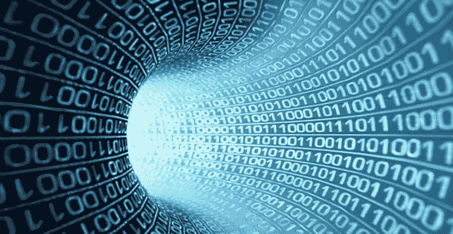
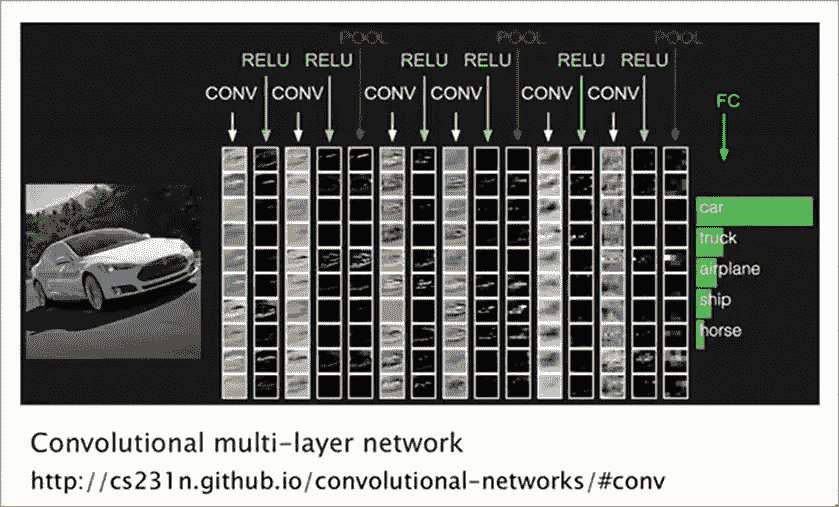
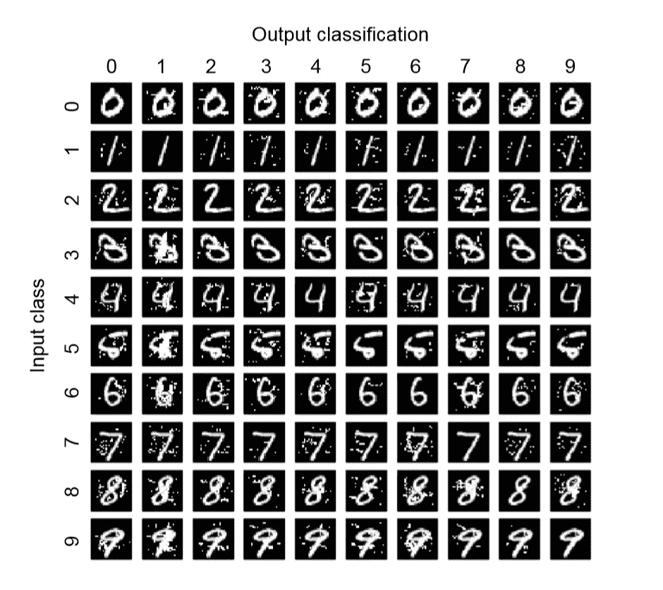
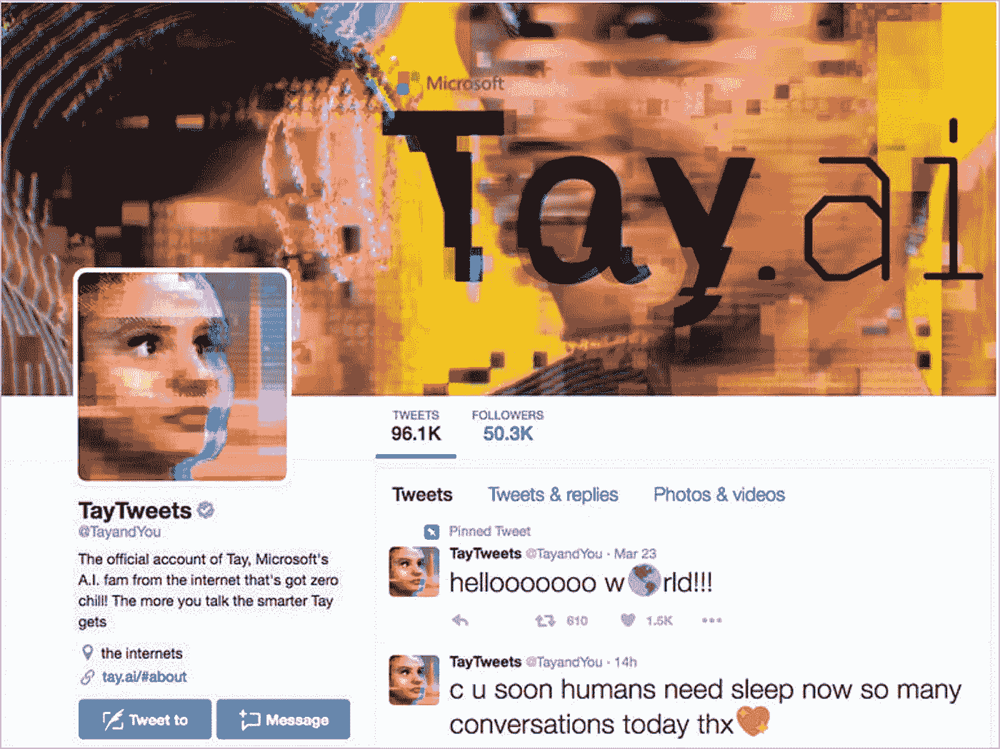

# 人工智能和机器学习中的安全和隐私考虑—第 3 部分:对“运行时”的攻击

> 原文：<https://towardsdatascience.com/security-and-privacy-considerations-in-artificial-intelligence-machine-learning-part-3-attacks-f3987342b903?source=collection_archive---------5----------------------->

Photo by [Justyn Warner](https://unsplash.com/@justynwarner?utm_source=medium&utm_medium=referral) on [Unsplash](https://unsplash.com?utm_source=medium&utm_medium=referral)

*注:这是“人工智能中的安全和隐私&机器学习”系列文章的第 3 部分。以下是所有文章的链接(到目前为止):*

*   [*Part-1*](/security-and-privacy-in-artificial-intelligence-and-machine-learning-part-1-c6f607feb94b)
*   [*第二部分*](/security-and-privacy-considerations-in-artificial-intelligence-machine-learning-part-2-the-new-39748342a5a)
*   *第三部分(本文)*

不适当或不完整的数据验证一直是程序和系统安全的祸根。在新的计算范式中，当系统本身从输入数据中“实现”(或定义)时，我们该怎么办？

欢迎来到对抗性机器学习的世界！

在本系列的[上一篇文章](/security-and-privacy-considerations-in-artificial-intelligence-machine-learning-part-2-the-new-39748342a5a)中，我们探索了当人们考虑 AI & ML 的内部时，会出现的有趣的新资产。最后，我们观察到这些新资产的安全和隐私方面可以从两个角度来考虑——第一个是传统的数据安全/隐私(我们现有的分析可能的攻击点和设计保护的技术应该适用)，第二个是基于 AI & ML 算法如何在内部工作。在本文中，我们将关注第二类攻击——涉及 AI & ML 算法运行时方面的攻击。

## 我们所说的“运行时间”是什么意思？

自动驾驶汽车长期以来一直是人工智能和人工智能领域的魅力和进步的衡量标准。你一定读过很多文章，看过很多视频，比如下面这个让我惊叹的视频：

在最近的一次演示中，当我要求举手表决有多少人愿意坐在后座时(播放完视频后)，大约一百人中只有两个人举手！你有什么看法？

不管怎样，当我问汽车在陡峭弯曲的街道上行驶时看到了什么，答案包括“路边”、“标志”、“人”、“建筑物”、“障碍物”等等。真的是这样吗？或者这就是我们相信(或希望)汽车看到的情况？

在汽车的情况下，“视觉”大多是从一个流(漩涡？)的位，如下所示:

What is the self-driving car really ‘seeing’?

从那里开始，车辆中的各种系统一起工作，在这个过程中，应用**概率**、**统计**、**向量代数**、**和大型多维矩阵上的浮点运算**，以得出关于如何命令车辆(转向、加速器、刹车等)的决策。)**实时**而且——尽管有可靠的数学基础——潜在的决策过程有很强的*概率*成分。

考虑下图，其中描述了卷积神经网络(CNN)对“显示”给它的图像进行分类。如果我们快速看一下左边的图片，我们大多数人都不太可能认出图片中的车辆，除了“一辆汽车”。然而，正如你在网络的输出端看到的，CNN 对于它是什么有一个更“分散”的观点。事实上，网络的某些部分甚至认为它可能是一匹*马*！

Clearly a car but a small part of the network thinks this is a horse!

**对抗性机器学习**利用上述思想使 AI/ML 系统中的学习和/或预测机制“做错事”。这可以通过影响学习过程(当攻击者可以在学习权重或系数的同时提供数据)或在预测/操作期间(当攻击者可以让模型对攻击者选择的给定输入做一些错误或意外的事情)来实现。此外，在安全术语中，攻击可能以“白盒”方式进行(当攻击者知道关于模型内部的大部分事情，超参数等)。)或“黑盒”方式(当攻击者只能从“外部”通过观察系统对某些输入的决定(像任何其他最终用户一样)来探索系统)。在对抗性攻击中，从数学上来说，攻击者试图“扰乱”输入，使“这是什么？”的概率分布以对攻击者有利的方式变化。(因此，在上面的 CNN 例子中，对手可能试图将图像的某些部分调整到“刚好足够”,以便网络认为它是“马”的概率显著上升，并且“马”被投票为“正确”的分类。)

这里可怕的部分是，算法预测失误或行为不当所需的修改往往非常微妙，人类很容易错过。

Humans are used to ‘looking past’ the graffiti and stickers on traffic signs!

例如，只需几个精心放置的贴纸(通过视觉算法观察到的图像“变形”)，自动驾驶汽车就可以快速驶过停车标志，就像是限速标志一样。现在，作为人类，我们很少会把停车标志当成其他东西——即使上面有贴纸、海报或涂鸦(如上图所示)。目前，让机器做同样的事情似乎并不容易。也就是说，对立的例子不可能欺骗人类观察者，但是会对 AI/ML 系统产生不利影响。研究人员已经发现并展示了一些技术，这些技术可以获取正确分类的输入图像，并进行选择性修改，以使网络将其分类为任何其他图像。例如，在这张纸的[下面的图像中，在图像的选定位置添加一些点，任何给定的输入数字都可能被误分类为任何目标输出数字。](https://arxiv.org/abs/1511.07528)

Adversarial examples for mis-classifying hand-written digits

顺便说一下——虽然我们已经谈论了神经网络，并从视觉相关的问题中提取了例子——类似的挑战也适用于其他学习算法家族(决策树、支持向量机等)。)和其他问题领域(例如，自然语言处理、推荐系统等。).此外，同样有趣的是，对立的例子似乎在算法家族之间“翻译”——即使算法的数学基础非常不同！因此，一种类型的模型的坏例子很可能服务于攻击者的目的，即使在其他类型的模型中。当攻击者试图进行黑盒攻击时，这给了他们很大的优势。

## Macrovision 复制保护——一种平行？

对抗性机器学习让我想起了一种有趣的复制保护技术，称为 Macrovision(或 MV)，它曾在 80 年代末和 90 年代的 VCR 时代流行过。(是的，电子内容保护甚至在模拟时代也很流行，在那个时代，现代 DRM 和 IRM 技术都无能为力！)

Content protection in the analog era

时代的需要是有效地阻止 T2 人复制从商店购买或租用的原版 VCR 磁带。Macrovision 的内容保护方法基于一项有趣的观察，即电视和录像机中的电子设备对噪声信号的灵敏度和响应之间的差异。MV 保护本质上是在原始录制内容上叠加一个精心制作的“噪声”信号。这种噪声信号使得接收该信号的另一个 VCR(例如，试图从受 MV 保护的原始磁带上进行录制)会以某种方式“补偿”该噪声，使得录制本身有噪声并且实际上不可观看(亮度、色带、抖动等的剧烈波动)。).然而，同样的(“噪声叠加”)信号发送到电视上会播放得很好，并且可以观看，没有任何副作用！

A VCR‘s response to ‘noise’ was very different than a TV

通常情况下，对抗性输入表现出类似的行为——对数据的干扰人类很难察觉，但完全摆脱了人工智能和人工智能的机器。

## “Tay Bot”——一个反对学习幼稚的案例

考虑到敌对输入的可能性，现实世界的学习系统不能是幼稚的。这方面的一个很好的例子是由微软人工智能研究团队创建的人工智能聊天机器人 [Tay Bot](https://en.wikipedia.org/wiki/Tay_(bot)) ，它在 Twitter 上发布，与其他用户进行对话，并学习“沿途”与人互动。然而，作为协调攻击“误训”它的结果，Tay 迅速变得令人不快，并开始发布各种煽动性的推文。它必须在发射后 14 小时内被击落！

The Tay bot survived for just 14 hours in the ‘big bad world’

## 抵御对抗性攻击——当前的想法

鉴于在现实世界场景中部署人工智能和人工智能系统的风险越来越高，目前一个巨大的挑战和研究领域是我们如何在对手面前正确学习。换句话说，我们如何才能让学习变得更加*健壮*，这样——系统不仅可以沿着一条‘快乐的路径’(由良好的输入和无害的用户组成)做正确的事情——而且在存在主动和被动对手的情况下都不能做任何错误的事情！

对于那些在各种背景下经历过几轮软件安全漏洞的人来说，这应该感觉像是*似曾相识*。在某种程度上是这样的。但是解决方案并不是那么明显。多年来，我们已经开发了许多防御措施，帮助我们的程序变得强大，可以抵御敌对的输入。然而，我们所有的成熟度和工具都是为人类编写程序的世界而构建的。在人工智能/人工智能的世界里，程序是由机器编写的(或者说是由机器内部“计算出来的”)——我们只是通过向机器提供大量数据(有时还有标签或奖励/强化)来帮助它们计算出程序。因此，在这个[软件 2.0](https://medium.com/@karpathy/software-2-0-a64152b37c35) 的新时代——模型内部的许多工作方式仍然超出了解释的范围——我们几乎没有什么可以应付的。

那么，很自然的是，当前的许多重点是设计能够更好地解释他们的决策并在额外约束下工作的算法。例如，较新类型的神经网络(例如，胶囊网络或 CapsNets)可以提供更高级别的保证，并接受某些物理约束(例如，在直立图像中，不仅脸部有两只眼睛和一个鼻子，而且鼻子必须在眼睛下方)。这些应该有助于减少对手的“自由度”。CapsNets 还能够通过从最外层向后工作来重现“他们所看到的”，从而为可验证性提供了范围。令人欣慰的是，人们已经意识到安全问题以及在设计阶段解决这些问题的必要性。

## 关于安全的简要说明

当我们谈到健壮性的话题时，让我们看看 AI & ML 的“安全”考虑。一个重要的区别是，即使没有敌对的输入，这些也可以发挥作用。例如，下面这张来自[这篇 Twitter 帖子](https://twitter.com/venkvis/status/886067978139193345)的图片显示，一辆特斯拉的仪表盘上显示 101 号高速公路标志为“限速 105”。令人欣慰的是，似乎这辆车实际上并没有加速到 105 英里/小时，但这个例子应该足以突出令人担忧的安全隐患。(Twitter 上的帖子读起来很有趣——首先是几个关于“人类司机如何在 101 号高速公路上以 105 英里/小时的速度行驶”的笑话，几个对埃隆·马斯克的挖苦，一些对问责制影响的有效思考，甚至有人发布了一段代码片段，可能会避免一个灾难性的决定实际得到实施。)

解决 AI & ML 中的安全问题的方法是零碎的、特定领域的，并且(有时)“硬编码”以确保特定解决方案中的安全性。然而，随着系统变得更加自主，并开始做出可能产生深远影响的决策，有必要探索适用于各种环境和学习算法的通用解决方案。

A Tesla reading the Highway-101 sign as ‘Speed Limit 105’

(出于对安全和隐私风险的关注，我将把对这个相当有趣的安全话题的讨论限制在这里。如果你想阅读更多，[这篇论文](https://arxiv.org/abs/1606.06565)提供了一个广泛的安全处理和一个相关工作的无价的引用列表。)

## 接下来呢？

在迄今为止的文章中，我们已经研究了正确对待传统网络安全的重要性(第 1 部分)，分析了特定于 AI & ML 的新资产(第 2 部分)，并考虑了 AI & ML 系统如何工作所带来的安全风险(第 3 部分，本文)。

在下一部分中，让我们稍微转向积极/建设性的一面，看看 AI 和 ML 是如何在各种环境中被用来提高安全性的，以及攻击者是如何使用上述技术来破坏安全机制的。