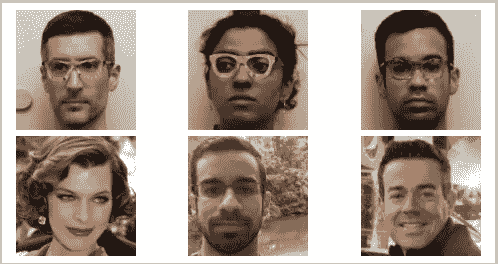

# 人工智能和机器学习中的安全和隐私考虑—第 4 部分:安全用例

> 原文：<https://towardsdatascience.com/security-and-privacy-considerations-in-artificial-intelligence-machine-learning-part-4-the-d02a2fa3f665?source=collection_archive---------7----------------------->

Photo by [Enrique Alarcon](https://unsplash.com/@qikealarcon?utm_source=medium&utm_medium=referral) on [Unsplash](https://unsplash.com?utm_source=medium&utm_medium=referral)

*注:这是“人工智能中的安全和隐私&机器学习”系列文章的第 4 部分。以下是所有文章的链接(到目前为止):*

*   [*Part-1*](/security-and-privacy-in-artificial-intelligence-and-machine-learning-part-1-c6f607feb94b) *—地形*
*   [*第二部分*](/security-and-privacy-considerations-in-artificial-intelligence-machine-learning-part-2-the-new-39748342a5a) *—新增资产*
*   [*Part-3*](/security-and-privacy-considerations-in-artificial-intelligence-machine-learning-part-3-attacks-f3987342b903)*—对运行时的攻击*
*   *第四部分(本文)*

AI & ML — use cases for security

在这篇文章中，我们将仔细研究 AI&ML 在各种与安全相关的用例中的使用。我们不仅会讨论网络安全，还会讨论一些一般的安全场景，以及基于人工智能和人工智能的解决方案是如何在所有这些领域变得越来越流行的。最后，我们还将探索攻击者可能规避这些安全技术的方法。

因此，让我们从一些有趣的领域开始，在这些领域中，安全特性受益于 ML&AI。

## 监控和响应

当我们考虑网络安全时，AI&ML 最常被提及的领域之一是解决大规模环境安全中的“大海捞针”问题。当你看到一个大的生态系统时，人类几乎不可能在噪音的海洋中发现真正的积极因素。多年来，我们一直试图通过制定越来越复杂的试探法来应对这一挑战，这些试探法依赖于基于规则的过滤，试图发现可能的可疑事件。然而，最终，基于规则的方法被限制在规则设计者已知或构想的模式范围内。也就是说，任何基于规则的方法只能从规则覆盖的有限空间中发现问题。最后，当基于规则的系统*确实*发现了可能的可疑活动时，在传统的安全运营中心(SOC)环境中，我们仍然面临着由于人的疲劳而遗漏它的风险。

Suspcious activity is far more challenging to identify in large systems

基于 ML 的系统可以毫不费力地解决以上三个问题！也就是说，它可以扩展到来自不同层的不同传感器的数十亿个事件，它可以“识别”新的、迄今为止未见过的攻击模式，并且它可以随时做出正确的判断，而不像疲惫的 SOC 工程师那样。基于 ML 的系统在 0 天攻击(基于签名的方法根本不起作用)和高级持续威胁(APTs)的环境中具有进一步的优势，在高级持续威胁中，攻击者在很长一段时间内秘密地取得进展，并明确试图保持在可能触发警报的阈值以下。

## 在线欺诈—金融和其他

另一个基于 AI/ML 的安全特性产生影响的有趣领域是欺诈检测和欺诈预防领域。在这里，早期的方法也是“基于规则”的，并提出了自己的挑战。例如，使用现有技术的企业发现，由于“假阳性”(来自好客户的交易被拒绝)，他们损失的钱比系统标记的“真阳性”(实际欺诈案例)节省的钱多。因此，较低的“假阳性”率对他们来说非常重要。在这种背景下，基于人工智能和人工智能的技术显示出了更好的“精度”和“召回”指标的前景——更不用说能够检测到以前没有看到的异常。

Minimizing false positives is critical in fraud detection techniques

除了金融欺诈，还有许多其他欺诈检测领域采用了基于 ML 的技术。例如，风格测定领域采用基于 ML 的技术来识别写作和音乐中的作者身份欺诈(或者甚至基于对编码风格的分析来识别恶意软件的作者)。

Stylometry — not only for writing but also music (and code!)

## 高级身份验证

传统上，用户认证是在系统的入口点进行的单一的“一刀切”式的检查。在跨站点请求伪造(CSRF)等基于 web 的攻击盛行之后，当用户将要执行更具特权的操作(例如，转账，而不仅仅是浏览帐户余额)时，一些更敏感的场景开始通过额外的挑战(非常熟悉的 OTP)得到保护。然而，这些大多是增强身份验证的静态方法。随着 AI&ML 进入游戏，游戏场将会变得更好，而且是显著的改变。

Learning individual keystroke patterns

就在几年前，在一个网上银行的场景中，银行不能做出任何假设，除了线路另一端的人知道密码(如果是*你的*密码，那么一定是*你的*！).随着“多模态生物特征识别”(使用一种以上的生物特征识别)和“行为生物特征识别”(通过个人的打字模式或鼠标移动来识别个人等功能)的出现，身份认证的可信度开始大幅提高。

此外，在 AI&ML 的支持下，身份验证在本质上变得真正“自适应”,因为系统可以根据大量信号和环境条件(关于用户、正在使用的设备、地理位置、网络层指标、一天中的时间、活动性质等)做出决定。)在一系列互动的任何阶段，用什么因素来挑战一个人。这些自适应认证机制很可能成为未来大多数在线系统的规范。

## 乘客筛查

这些年来，机场的安全检查越来越严格。缓慢移动的队列和不得不把你的电子产品包翻过来(然后把所有东西都装回去)的痛苦是任何地方的每个人都一致感受到的……这甚至没有涉及到侵犯隐私和侧写等敏感问题。

“black DSLR camera near sunglasses and bag” by [Anete Lūsiņa](https://unsplash.com/@anete_lusina?utm_source=medium&utm_medium=referral) on [Unsplash](https://unsplash.com?utm_source=medium&utm_medium=referral)

这一切可能很快会变得更好。基于人工智能和人工智能的人脸识别系统(FRS)已经可以大规模部署，并与其他识别属性(如某人的行走风格(步态分析))结合使用。人们也在努力从实时 X 射线扫描中更好地识别可疑物体。例如，在 2017 年期间，TSA 赞助了[一场数据科学家之间的全球竞赛](https://techcrunch.com/2017/06/22/the-kaggle-data-science-community-is-competing-to-improve-airport-security-with-ai/)，以帮助提高其乘客筛查系统的预测准确性，奖金为 150 万美元！

鉴于这一切，我们可能离一个愿景不远了，当你要赶飞机时，你只需进入机场，径直走向登机口，进入飞机，按照你的座位号就座。那不是常旅客(以及其他人)的乌托邦吗？

Can we fly like it is our own private plane?

## 大规模监视

说到人脸识别和物理安全，在监控和人群安全领域有很多有趣的场景。人群监控系统现在可以识别和跟踪大量人群中的个人——这在寻找和监视潜在的麻烦制造者方面非常方便。即使潜在的麻烦制造者以前并不为人所知，人群中的异常行为也可以用来更好地进行有针对性的管理。

AI&ML are making crowd surveillance tractable

在要覆盖的区域非常大的监控场景中，基于人工智能和人工智能的技术与它们在网络安全 SOC 场景中的表现非常相似——它们可以识别大量传入流中的异常，并且不太可能因疲劳而错过一些东西。

Surveillance of a large area

# 这些新功能有多简单？

寻找安全特性中的缺陷和弱点一直是攻击者感兴趣的领域。自然，在我们上面提到的许多基于 AI & ML 的安全特性的上下文中，同样的故事也在上演。

例如，人脸识别系统(FRS)已经被证明容易受到对人脸巧妙修改的影响。研究人员用这个展示了一些惊人的结果。在这篇有趣的论文中，作者展示了通过佩戴定制印刷的护目镜(见论文下面的图片)，他们可以伪装成一个看起来完全不同的目标人物，骗过最先进的 FRS 系统。

Researchers wore custom-printed goggles to impersonate to an FRS system

这与我们之前在第 3 部分中看到的问题是相反的，当时我们考虑了一个稍加修改的停车标志的例子。在这种情况下，我们观察到人类绝不会将带有涂鸦的停车标志误认为除了停车标志之外的任何东西——然而机器却将其解释为完全不同的东西。相反，在下面描述的攻击中，人类不可能把上面的人误认为下面的人。然而，FRS 系统很容易被说服。不过，这两种攻击的基本技术是相似的。定制印刷的护目镜用于充分地改变输入矩阵(或向其添加扰动),使得其余的计算产生关于该人是谁的完全不同的结论。

类似的攻击也适用于基于语音的认证系统。在这种情况下，声音样本被组合或者使用声音变形技术来欺骗声音识别技术。此外，已经证明只有音素足以制作攻击样本。也就是说，不用等着偷偷录下你说'*嘿，Siri* '即使攻击者可以听到你说单个单词'*'*，*坐'*， *rim'* '，来自那里的音素可以组合成'*嘿，Siri* '！现在想一想，如果您是语音模仿攻击的目标，有多少种不同的方法可以收集您的语音样本？

## 安全性仍然是系统设计关注的问题！

有时，攻击者可以通过不特别需要击败系统的 AI/ML 组件来绕过基于 AI/ML 的安全特性。这里有一个很好的例子:

在一项名为[海豚攻击](https://youtu.be/21HjF4A3WE4)的巧妙攻击中，研究人员能够向几乎所有的个人助理(Alexa、Siri 等)发送“听不见的”命令。)做各种事情，从“*打开后门*”或“*订购此项*”。这种攻击包括产生高于人类听觉范围的声音，然后解决问题，使其仍能被个人助理“听到”(因此得名“海豚攻击”)。

Dolphins communicate at frequencies above human audible range

一对巧妙的观察被用于策划实际的攻击。首先，个人助理设备中的麦克风通常响应声音信号而产生“谐波”,其次，这些设备中的下游电子设备被设计成滤除或忽略人类可听范围以上的频率(在期望人类执行命令的合理假设下)。因此，攻击将人类频率命令(*h*’)调制到一个听不见音高的载波信号(*c*’)上，产生一个组合(人类听不见)信号(*c+h*’)。当设备中的麦克风接收到该信号时，它会产生谐波(原始信号中分量频率的各种倍数/组合，即 *2*(c+h)* 、 *2*c+h* 、 *c-h* 等)。).你猜怎么着？其中一个产生的谐波恰好是' *h* '！现在，低通滤波器负责消除人类不可能产生(或听不到)的一切，下游(设备更深处)记录的只是“ *h* ”。也就是系统的反应就像听到了主人的命令一样！

The Dolphin Attack uses harmonics

这次攻击很好地提醒了我们，归根结底，安全性是一个系统设计问题。仅仅集成一个复杂的基于 ML 的安全特性实际上并不能使系统更加安全。攻击者可能会到处寻找，为了真正提高安全级别，设计人员必须进行端到端的考虑，确保不仅新功能被安全集成，而且支持机制是在考虑安全性的基础上从头设计的。因此，基于 ML 的安全特性本身可能并不是系统中最薄弱的环节。但是攻击者在乎吗？

# 接下来呢？

我们从 AI&ML 被用于构建网络安全和物理安全领域的各种类型的安全特性的领域开始了这一部分。我们还研究了对这些功能的攻击是如何同时发展的。在本系列的下一部分，我们将看看攻击者如何通过对各种类型的攻击使用 AI&ML 技术而受益，以及攻击者如何能够“武器化”AI 带来一些可怕的可能性。

***来自《走向数据科学》编辑的提示:*** *虽然我们允许独立作者根据我们的* [*规则和指导方针*](/questions-96667b06af5) *发表文章，但我们并不认可每个作者的贡献。你不应该在没有寻求专业建议的情况下依赖一个作者的作品。详见我们的* [*读者术语*](/readers-terms-b5d780a700a4) *。*