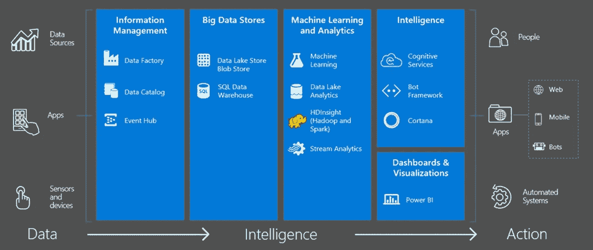
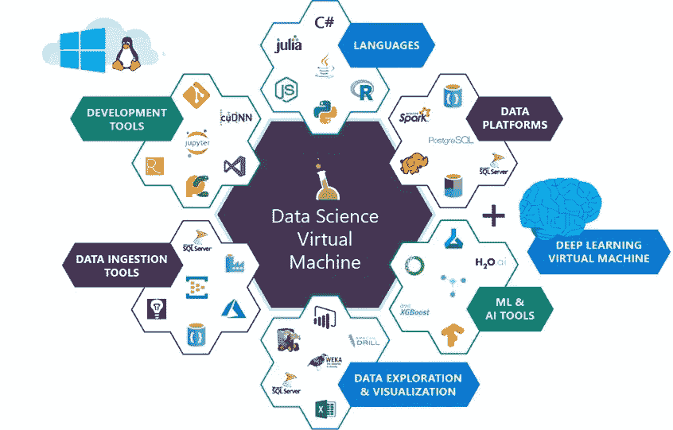
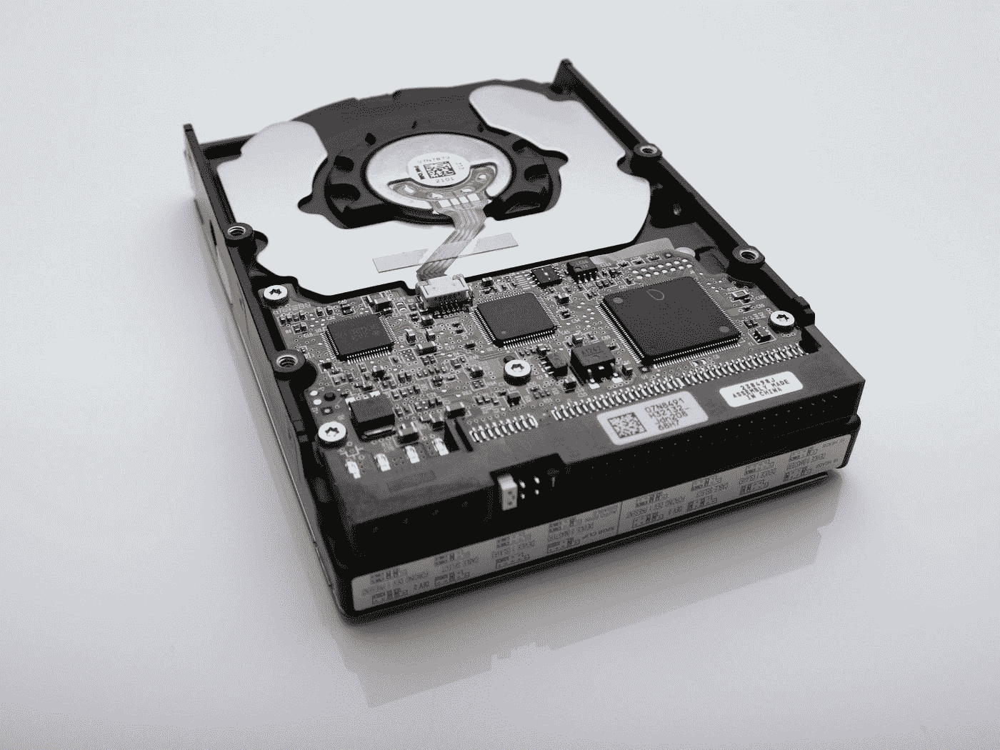

# 人工智能和机器学习中的安全和隐私—第 1 部分:现状

> 原文：<https://towardsdatascience.com/security-and-privacy-in-artificial-intelligence-and-machine-learning-part-1-c6f607feb94b?source=collection_archive---------3----------------------->

如今，关于机器学习(ML)和人工智能(AI)以及它们为几乎各行各业带来的用例，人们兴奋不已，议论纷纷。在如此多的领域中，我们现在已经有了成熟的解决方案，而且，我们不时地听到 ML & AI 在解决迄今为止尚未探索的问题方面有趣而有见地的应用，这让我们不禁“哦，哇！”。

随着部署的场景变得更加丰富和广泛，我们必须确保 AI & ML 的安全和隐私方面得到充分考虑。为了做到这一点，理解安全和隐私与人工智能和人工智能领域交叉的不同方式是很重要的。在本系列中，我们将一次一个“方面”地探索这些交叉点，目的是了解所涉及的风险的性质和程度，以及针对每种风险有哪些保护措施可用或正在探索中。

虽然我在信息安全和隐私领域有几年的工作经验，但相对而言，我对 AI & ML 还是个新手。(我们刚刚开始在工作中的云安全和开发运营项目中使用 ML 技术。)所以这个系列更多的是从一个安全人员的角度，以系统的方式对 AI & ML 环境中的安全和隐私进行推理。本系列的前几部分将集中在稍微狭窄的技术方面。然而，在这个系列的过程中，我们也将涉及更广泛的社会/社会问题。随着这个系列的发展，我很想听听这两个领域的专家对我组织演讲的方式的看法。

在这第一部分中，我将从网络安全的角度出发，从“让我们把基本的东西做好”开始，而不会深入到 AI & ML 的内部。在接下来的部分中，我们将开始仔细观察 AI & ML 组件。

# 人工智能和人工智能解决方案的传统网络安全

像任何新领域一样，AI & ML 带来了一堆有趣的人工制品，相关的细微差别和警告，从安全角度来看，它们构成了挑战。

下面的两张图片(来自微软 Azure 文档)显示了端到端 AI/ML 工作流的不同阶段涉及的典型工件和利益相关者团体。

The End-2-End Workflow — Lots of systems, data formats, tools, stakeholders, etc.

The diaspora of development tools, platforms, frameworks, data handling, etc.

此类图表强调了我们面临的安全挑战的性质和类型的以下特征:

*   有一个由(一些旧的，一些新的)工具、语言、框架组成的庞大生态系统，其功能包括数据摄取、数据预处理、建模、模型评估、集成、可视化、打包和部署等。
*   从传统的软件工程师到机器学习工程师、数据科学家和统计学家，多个利益相关者群体都参与到任何项目中。
*   完整的工作解决方案通常涉及在不同接口耦合在一起的多个系统。

从安全的角度来看，这是很多未知的新事物。我们正在寻找许多新的工具和框架，新的人(利益相关者团体)和新的系统或系统的组合。暂且抛开人工智能& ML 的细节/内部机制，在这样的背景下，即使仅仅是传统的网络安全也很难做得很好。这是因为新的工具和框架通常需要时间来变得“足够安全”，新的利益相关群体可能并不总是对安全性有统一的理解或认识，第三，涉及许多系统和接口的解决方案在边界/接口处有过有趣的安全失败历史。

## 关于数据科学中“数据”的一点注记

现在让我们看一下“数据安全”方面。在人工智能和人工智能的背景下，数据安全挑战的以下特征非常突出:

*   在大多数解决方案中，巨大(巨大！)涉及大量的业务数据。我们谈论的是数百万甚至数十亿张唱片。而且，根据问题领域的不同，这些信息可能具有巨大的价值(例如，经纪公司过去的交易)或敏感性(例如，来自连锁医院的病历)。
*   此外，不仅涉及大量数据，而且更倾向于考虑数据的所有属性/方面(维度)。这与隐私的“数据最小化”原则产生了有趣的矛盾。
*   与传统的软件工程不同，在 AI & ML 中，通常不能在测试/预生产阶段使用“虚拟数据”。(整点讲的是‘从数据中学习’！)因此，在生态系统的所有点上，我们都在谈论处理宝贵的**真实**数据的各种利益相关方和各种系统。(例如，协作开发模型的数据科学家团队必须在实验过程中访问许多相同的数据，而这些数据是您多年来在生产系统上精心保护的，这导致业务数据进入了过去通常不会进入的系统。)对各种数据的多次迭代和请求可能会破坏您现有的任何数据治理。
*   鉴于 AI & ML 已经进入了各行各业，我们正在寻找数百种迄今为止晦涩难懂的数据和记录格式(以及相应的阅读器、编码器和解码器)。我们有着丰富多彩的安全漏洞历史，只是在少数更流行的编码格式中。当我们考虑到乘数效应时，想想未来会发生什么。

## 第一步:做好基础工作

虽然这些挑战确实令人望而生畏，但对于安全从业者来说，上述许多挑战并不陌生。我们过去经历过技术范式的转变。我们已经看到了良好安全性的基本原则是如何保持不变的，以及如何在仔细理解任何新环境/生态系统的细微差别和独特要求后应用它们。在一天结束的时候，它应该归结为做好最基本的事情——也就是说。,

*   确保所有团队成员/利益相关者对安全性和隐私有很好的基本了解，如数据分类、数据保护技术、身份验证/授权、隐私原则、适用的法规要求等。目标应该是确保所有利益相关者对安全和隐私有适当的理解，并且每个人都使用相同的术语，知道并理解相关的政策和标准。
*   拥有良好的数据治理结构。随着数据在每个工作流程的不同阶段易手，各利益相关方的所有权和责任应该是明确的。考虑到 ML & AI 项目中不可避免的数据的广泛流通，这一点尤其重要。
*   在组件级别和从端到端的角度对解决方案进行认真的威胁建模。这将确保安全性被“内置”到设计中，并且在端到端系统中的每一点(处理、存储或传输有价值的数据的地方)都满足适用的安全性要求。
*   在威胁建模时，应该特别注意不同子系统之间的边界和接口。任何一方在这些接口上所做的假设都应该清楚地记录和验证。
*   此外，因为生产数据无处不在，所以请确保详尽地涵盖威胁模型中的所有工作流—从最早的实验和概念证明开始，到将在生产中部署的完全可操作的系统。
*   确保在实施过程中遵循良好的编程实践，并根据所使用的技术减轻相应的漏洞(例如，如果解决方案的某个部分基于 web，则必须保护身份验证令牌/cookie 免受 XSS、CSRF 等攻击。)
*   通过执行功能安全测试和渗透评估的组合，确保在威胁建模过程中识别的、被认为足够重要的所有威胁/风险都得到实际解决。
*   确保不同框架和子系统的本机安全模型得到充分理解和合理化，以实现整个系统的统一安全性。这一点尤其重要，因为多个可能完全不同的组件和框架将“粘合”在一起，组成端到端的解决方案。
*   对于在项目的不同阶段被不同的利益相关者使用或者被导入到不同的“管道”中的软件组件要小心。在可能的情况下，使用经过验证和签名的组件，如果这不是一个选项，则考虑其他因素，如开发人员的声誉、使用范围、存储库的可信度、评论和审查、安全问题/漏洞的历史等。这些应该有助于从安全质量的角度评估组件是否足够好。
*   考虑您的部署(CICD)管道的安全性。你能很好地控制谁能改变构建/发布环境吗？您是否充分保护了部署所需的任何机密/连接字符串？您的生产设置是否足够严格，以至于人们无法进行特别的配置更改？
*   实行良好的监控和安全卫生。确保所有软件组件都处于最新的安全补丁级别，定期进行访问检查，轮换密钥/证书等。
*   最后，一定要有一个好的事件响应计划，这样如果灾难真的发生了，你就可以应对。

好了，我们到了！对于安全专业人士来说，以上这些听起来都不新鲜。你过去一定在不同的问题环境中做过一些或所有这些事情。因此，AI & ML 的安全和隐私的第一个方面是在新的环境中应用所有的专业知识，同时与所有相关的利益相关者合作。

但是要意识到，到目前为止，我们已经将系统的 AI & ML 组件作为一个“黑盒”来对待。当我们更仔细地观察这个盒子时，事情开始变得有趣多了。这正是我们将在本系列的下一部分中探讨的内容。期待再次见到你！

***注来自《走向数据科学》的编辑:*** *虽然我们允许独立作者根据我们的* [*规则和指导方针*](/questions-96667b06af5) *发表文章，但我们不认可每个作者的贡献。你不应该在没有寻求专业建议的情况下依赖一个作者的作品。详见我们的* [*读者术语*](/readers-terms-b5d780a700a4) *。*