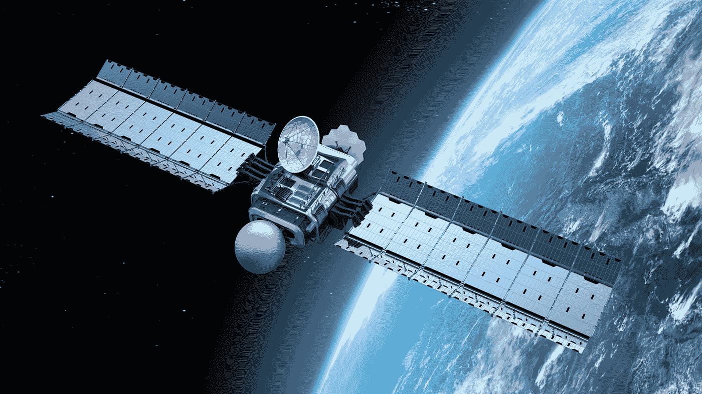

# 种子、卫星和传感器——科技如何种植今年的作物

> 原文：<https://towardsdatascience.com/seeds-satellites-and-sensors-how-technology-is-planting-this-years-crop-2f38b5a2296c?source=collection_archive---------1----------------------->

他们说成功是 90%的准备和 10%的汗水的结果。这适用于许多活动及其潜在结果。农业就是这样一种努力，计划和准备是成功收获的主要因素。

为健康茁壮的作物打下良好的基础至关重要。在撰写本文时，几乎是春天了，所以对许多种植者来说，种植指日可待。由于作物生长和繁殖周期的性质，农业具有很强的季节性。每种作物都有一个健康种子发芽所需的土壤温度、湿度和肥力的最佳窗口。

这个播种窗口是生长季节最关键的时期之一。对于种植者来说，在正确的时间将正确的种子与正确的土壤相匹配是重中之重(*仔细权衡，试图确定各种商品的市场价格走向*)。

一旦播种开始，接下来就是执行了。将适量的种子放在合适的深度，让它们同时发芽，有助于管理风险。统一的作物意味着相同的护理和管理措施可以应用于整个季节(*假设不存在其他主要的可变性来源*)。

然而，如果种子在不同的时间发芽，那么作物的成熟度和整体健康状况会在整个田地中发生变化。正在进行的作物季节变化管理可能会出现问题，并可能导致收获时产量的重大损失。

幸运的是，现有的技术可以帮助种植者高精度地管理播种。目标是建立一个坚实的基础，使作物能够茁壮成长。一些新兴的精量播种技术可以改装到现有设备上，而不需要购买大量资本。

## **事半功倍**

随着商品价格在可预见的未来保持在历史低位，种植者不太倾向于购买新设备。然而，他们确实认识到需要不断改进他们的经营，并寻找新的方法来提高产量、降低成本和增加农场利润。

农业是资本高度密集的行业。以中西部一个 2000 英亩的玉米和大豆农场为例。资本成本可能包括每英亩约 5，000 美元的土地价值、300，000 美元的大马力拖拉机、200，000 美元的精密播种机、350，000 美元的联合收割机……你明白了吧。

除此之外，农民每英亩还必须投入数百元用于种子、化学药品、肥料和其他投入成本。正如你所看到的，一些农民可能有数百万美元的收入，却无法保证他们年底的作物收入。

资本设备最终会磨损并需要更换，然而，如果种植者目前的机器处于良好的工作状态，那么当利润如此之低时，就没有必要更换它。播种机技术就属于这一类。一台新的精密高速播种机的成本可能高达 25 万美元，而升级现有播种机的成本约为 4 万美元。

通过将正确的硬件升级与正确的精准农业软件相结合，经济回报将变得非常可观。此外，在大宗商品价格上涨后，效率的提高每年都会持续很久。

## **种子、卫星和传感器**

农业中有许多活动部件，需要考虑大量信息。幸运的是，技术正在帮助消除分析和规划阶段的大量繁重工作。

现在农民在种植过程中可以利用的一些技术包括:

*种子科技*

*   种子杂交技术(使种子特性与土壤和条件相匹配)
*   种子处理(建立抗虫害和杂草能力)
*   种子微生物(处理种子以减少肥料需求)

*卫星*

*   种子位置的精确放置(精确施肥)
*   卫星参考数据(对理解现场可变性至关重要)
*   实时季节图像(测量作物生物量的卫星图像)

*传感器*

*   关闭控制以防止种子重叠(使用较少的种子)
*   单行控制(使种子品种与土壤类型相匹配)
*   精确的下压力系统(均匀的种子深度和出苗)

**投资回报**

所有这些技术都提供了一定程度的经济回报。例如，消除种子深度、重叠和位置的可变性具有明显的投资回报。各种自动化下压力技术的制造商报告称，与传统系统相比，玉米产量每英亩可提高 10-11 蒲式耳。因此，即使玉米价格为每蒲式耳 3.50 美元，这也相当于可观的回报。

假设整个作物的平均产量每英亩增加 5 蒲式耳。在前面引用的农场示例中，2000 英亩的农场每英亩 17.50 美元，即第一年 35000 美元。几乎一年就能收回硬件升级成本，这意味着投资在接下来的几年里会产生正回报。

土壤类型的可变性越大，控制下压力的需求就越大，潜在回报也就越大。新的自动化设备还带来了其他好处，因为在换季期间减少了重新校准和设置。

**数据驱动决策**

当结合新一代自动化精准农业软件工具，如 [AgDNA](https://agdna.com/) 时，回报甚至会更高。这些[基于云的大数据工具](https://www.linkedin.com/pulse/can-big-data-deliver-big-returns-agriculture-paul-turner)能够分析上一季数百万英亩的土地，以确定最佳的种子和土壤组合。

每年都有这么多新的杂交种子技术被引进，种植者几乎不可能确定哪一种适合他的操作。然而，AgDNA 等新一代大数据平台可以在云端运行这些[预测分析](https://www.linkedin.com/pulse/how-predictive-analytics-make-farming-more-paul-turner)，并产生惊人的结果。

对大量数据集进行基准分析，以确定给定土壤类型和其他属性的最佳种子品种，可以带来每英亩 30 美元以上的回报。对于种植者来说，这是非常宝贵的信息，不仅可以让他们了解什么最适合他们的农场，还可以让他们根据选择参与标杆管理服务的其他种植者的经验获得洞察力。

**结论**

因此，尽管 2017 年农业大宗商品价格前景看好，但种植者仍有重大机会利用新兴硬件和软件技术，获得明显的经济回报。作物生产行业作为一个整体，在寻求更高的产量和更高的效率方面继续推进创新的边界。

因此，下次你在杂货店或吃你最喜欢的谷物时，请放心，全国各地的农民正在采用创新技术和耕作方法，以实现更可持续的未来。