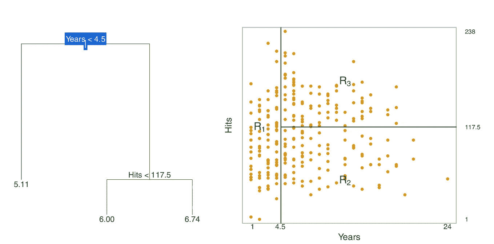
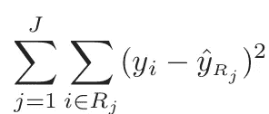
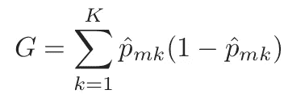
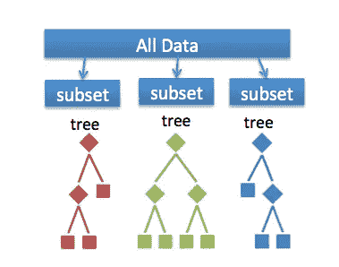
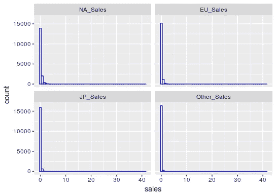
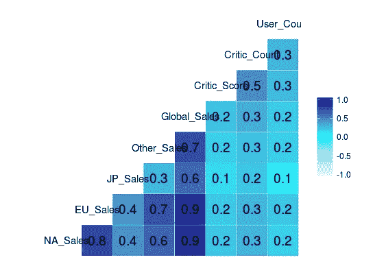
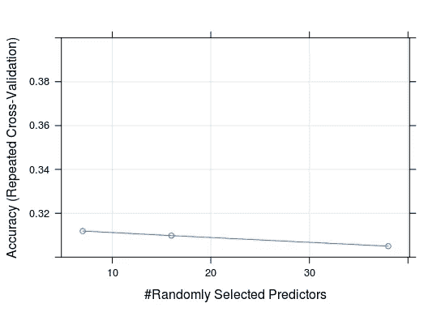
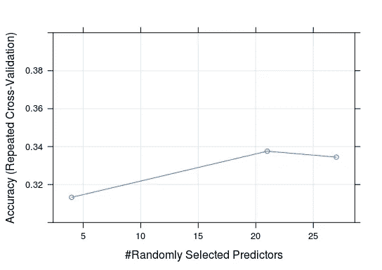
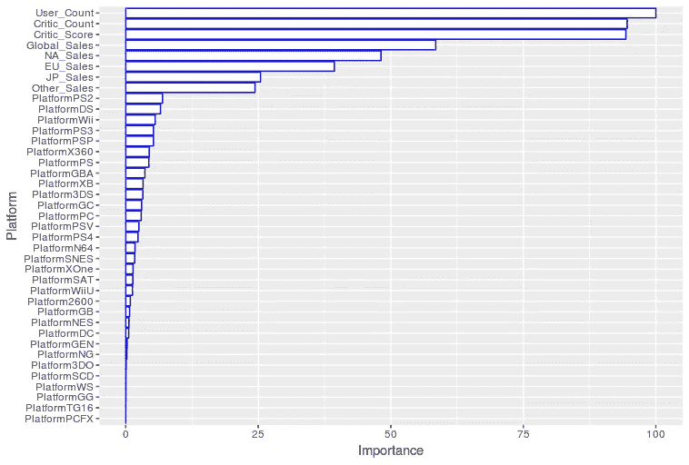
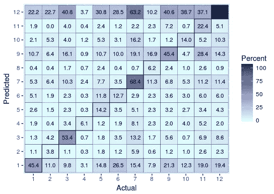

# 从决策树看随机森林——对随机森林的一种解释

> 原文：<https://towardsdatascience.com/seeing-the-random-forest-from-the-decision-trees-an-intuitive-explanation-of-random-forest-beaa2d6a0d80?source=collection_archive---------1----------------------->


So many bagged decision trees, so little processing resources.

在过去的这个周末，我有点无聊，决定温习一下我的简历。作为一名在 [Insight](http://insighthealthdata.com) 的研究员，我几乎完全是用 Python 编程的，但我实际上没有做过太多的 R 语言预测分析，除了非常普通的线性回归。我想要一个有点干净的数据源，这样我就可以在 r 中进行建模了。因此，一个好的干净数据源是好的 ole' [kaggle](http://kaggle.com) 。我决定研究一个[视频游戏销售数据集](https://www.kaggle.com/rush4ratio/video-game-sales-with-ratings)。

# 决定，决定…

决策树，以及它们的表亲如袋装决策树、随机森林、梯度推进决策树等。，通常被称为[系综方法。](https://en.wikipedia.org/wiki/Ensemble_learning)

为了理解更复杂的集成方法，我认为理解这些方法中最常见的决策树和随机森林是很好的。让我们举一个最简单的例子:使用决策树的回归。对于一个给定的 n 维数据集，你可以生成一个有 n 个分支和 n 个叶子的决策树。决策树的目标是确定最大程度减少残差平方和的分支，并尽可能提供最具预测性的叶子。也许一个数字会有所帮助…



Taken from the book ***Introduction to Statistical Learning***

上图显示了一个棒球相关的数据集，我们想要确定一个球员的日志工资。在左图中，如果一个球员的经验少于 4.5 年，他们预计可以赚 511 万美元。如果一个玩家有超过 4.5 年的经验，但少于 117.5 次点击，他们预计会赚 6 千美元(同样基于日志)。在右边的数据中，预测值分别代表子空间 R1、R2 和 R3。



For those who like the see the math: decision trees essentially grow branches that reduce the sum of the errors for Rj sub-spaces in the data.

上面的例子使用了连续的数据，但是我们可以将其扩展到分类。在分类设置中，我们本质上是在增加分支以减少分类错误，尽管这并不那么简单。在分类设置中，我们采用一种类似熵的度量，并尝试减少每个分支的熵值，以提供最佳的分支分裂。[基尼指数](https://en.wikipedia.org/wiki/Decision_tree_learning#Gini_impurity)是一个常用的指标。



p-hat mk 表示来自第 k 类的第 m 个区域中的观测值的比例。从本质上说，基尼指数是一种方差的度量。方差越大，错误分类就越多。因此，基尼系数越低，分类越好。

# 将这些预测打包…

决策树通常被称为“贪婪的”。这只是算法如何试图确定减少误差的最佳方式的函数。不幸的是，这导致了模型过度拟合和模型过度一般化。

一种用于应对这种情况的方法被称为[自举聚合或简称为‘bagging’](https://en.wikipedia.org/wiki/Bootstrap_aggregating)。如果你理解统计学中的 bootstrapping 的概念(在估计未知人口的方差和误差方面)，当涉及决策树时，bagging 是类似的。

在打包过程中，我们决定要从数据集中抽取多少个重复的引导，将它们放入同一个决策树中，然后将它们聚合在一起。这给了我们一个更健壮的结果，并且不容易过度拟合。

此外，通常每棵装袋的树会留下三分之一的样本。然后，我们可以将装袋的树与该样本进行拟合，并获得[袋外误差率](https://en.wikipedia.org/wiki/Out-of-bag_error)。这实质上是交叉验证的决策树版本，尽管您可以在超出袋外错误率的基础上执行交叉验证！

# 进入随机森林

现在我们对决策树和装袋有了大致的了解，随机森林的概念就相对简单了。香草随机森林是一个袋装决策树，其中一个附加算法在每次分裂时随机抽取 *m* 个预测值。这有助于对随机森林中使用的树进行去相关处理，并有助于自动应对[多重共线性。](https://en.wikipedia.org/wiki/Multicollinearity)

在分类中，所有的树都聚集在一起。从这种聚合中，该模型实质上采取了投票/投票来将数据分配给一个类别。

对于给定的观察，我们可以通过观察每个袋装树为该观察输出什么类来预测类。然后我们查看所有的树，看看这个观察被预测了多少次。如果观察结果是根据大多数袋装树预测的，则为该观察结果指定一个类别。



A random forest takes a random subset of features from the data, and creates n random trees from each subset. Trees are aggregated together at end.

# 一个在 R 中应用随机森林的危险的简短例子，使用视频游戏 Sales kaggle 数据集

[可在此处找到数据集的概述。](https://www.kaggle.com/rush4ratio/video-game-sales-with-ratings)

我所有乱七八糟的代码都可以在我的 github 上找到。

**本例的目标是看看销售数字和游戏所在的主机是否可以预测其类型(例如，体育、动作、RPG、策略等)。).**

在这个例子中，我使用了`caret`和`ggplot2`。我使用包`dummies`为分类预测器生成虚拟变量。

我想得到一些使用`caret`的练习，它本质上是 R 版的`scikit-learn`。但是首先，和任何数据集一样，有必要对其进行一点探索。我的一般方法是首先在数据中寻找古怪之处，探索潜在的相关性，然后再深入一点，看看数据中是否有任何其他值得注意的趋势。理想情况下，您会希望在建模之前从各个方面检查数据。为了简洁起见，我跳过了一些数据探索，直接进行了一些建模。

首先，我检查了数据中缺失的值。有一大堆的`NaNs`，所以我继续使用`DMwR`包做了 K-最近邻插补。

接下来，我想检查一下销售数据，看看是否有异常值。曾经有。而且分布是高度倾斜的。



Most sales were far less than $20 million total.

我继续使用对数转换将它们标准化。


Normalized-ish, but still sorta skewed.

在这里，我为每个游戏运行的不同主机生成虚拟变量，然后检查相关性。毫不奇怪，全球销售额与所有其他销售额相关联。评论家分数和计数不是。这里没有显示控制台的相关性。考虑到控制台虚拟数据的稀疏性，这里没有什么值得注意的。如果多重共线性是一个大问题，可以简单地删除全局销售变量，而不是保留所有其他销售变量。



在`caret`中，我做了 80%-20%的训练测试分割，作为进行建模的惯例。我将所有的流派重新标为数字，它们如下:

1.  运动
2.  平台游戏
3.  竞赛
4.  角色扮演游戏
5.  难题
6.  多方面的
7.  射手
8.  模拟
9.  行动
10.  战斗的
11.  冒险
12.  战略

我做了一些网格搜索在每个树分裂可用的功能数量。回想一下，当随机森林为树中的每个节点创建一个分割时，它不会获取所有可用的功能。这是模型中可操作的*超参数*。

```
mtry <- sqrt(ncol(vg))
tunegrid <- expand.grid(.mtry = mtry)
```

在上面的代码片段中，我将列数的平方根作为可用的初始数字特性。在此基础上进行网格搜索，使得`caret`将迭代初始起始变量，然后在下一次拟合迭代中进行另一次 sqrt(ncol(vg))附加特征，然后再次评估模型。

```
metric <- 'Accuracy'
control <- trainControl(method = 'repeatedcv', number = 10, repeats = 2, search = 'random', savePredictions = TRUE)
```

接下来，我将我的度量设置为准确性，因为这是一个分类过程。我做交叉验证来评估我的训练数据是否不可靠。典型的折叠次数为 5-10 次(表示为`number`参数)。我做了一个随机搜索，因为它更快，计算量更小。

使用 caret，我训练了两个模型。一个有 15 棵袋装树。另一个有 500 袋树。500 树模型需要一些时间来运行(可能大约 30 分钟？).人们可以很容易地将袋装树木的数量纳入网格搜索中。为了简洁(和时间)，我只比较了两个模型。

注:我允许模型使用 Box Cox 来确定如何适当地规范化数据(它对数据进行了对数转换)。

```
model_train1 <- train(Genre ~ ., data = vg_train, method = 'rf', trControl = control, tunegrid = tunegrid, metric = metric, ntree = 15, preProcess = c('BoxCox'))model_train2 <- train(Genre ~ ., data = vg_train, method = 'rf', trControl = control, tunegrid = tunegrid, metric = metric, ntree = 500, preProcess = c('BoxCox'))
```

我的交叉验证结果显示，500 树模型做得好一点点…但只是一点点。给定交叉验证结果，每个分割 21 个特征似乎是合适的。



Model 1 with 15 bagged trees.



Model 2 with 500 bagged trees

我的准确度是***然而全然可怕的*** 。我在 Model 2 **的整体准确率只有 34.4%。**

随机森林允许我们查看*特征重要性*，这是一个特征的基尼指数在每次分裂时降低了多少。某个特征的基尼指数下降得越多，它就越重要。下图从 0 到 100 分对这些特性进行评分，100 分是最重要的。

看来**用户数**和**评论家数**尤为重要。然而，鉴于模型拟合度如此之差，我不确定解释这些变量有多大用处。我已经包含了变量重要性代码的一个片段，以防您想要复制它。



```
# Save the variable importance values from our model object generated from caret.
x<-varImp(model_train2, scale = TRUE)# Get the row names of the variable importance data
rownames(x$importance)# Convert the variable importance data into a dataframe
importance <- data.frame(rownames(x$importance), x$importance$Overall)# Relabel the data
names(importance)<-c('Platform', 'Importance')# Order the data from greatest importance to least important
importance <- transform(importance, Platform = reorder(Platform, Importance))# Plot the data with ggplot.
ggplot(data=importance, aes(x=Platform, y=Importance)) +
  geom_bar(stat = 'identity',colour = "blue", fill = "white") + coord_flip())
```

我们可以查看混淆矩阵，看看有多少准确的分类和错误的分类。对角线表示正确的分类百分比。斜线表示模型错误分类一个流派的次数百分比。



太可怕了。射击游戏有 68%的机会被正确分类……但是也有很大一部分时间被错误分类为策略游戏。

# 外卖食品

为什么我们的模型做得这么差？有几个原因。该模型往往不符合数据。这可能意味着 random forest 不够复杂，不足以捕捉数据中的趋势，我们可能必须使用另一个模型来使用更复杂的方法。然而，更有可能的是，这些特征根本不能预测视频游戏的类型。

如果我们的功能有点糟糕，我们可以做两件事之一:我们可以为给定的数据集设计一些额外的功能。例如，我们可能能够创建一个变量，表示数据中每种游戏类型的平均评论家分数，作为一个预测器(但这可能是无趣的)。

我们可能要做的是从视频游戏存储库中获取一些额外的信息，该存储库中可能有每种类型的视频游戏的额外历史销售数据。第二个简单的方法是简单地计算每个流派的总销售额，然后将其应用于整个数据集。这么多选择！

或者答案更简单。可能是数据在类别方面不平衡。如果是这种情况(如果你进一步检查数据的话，确实如此)，你可能想要修剪或合并流派来纠正这种情况。

# 结论

随机森林是机器学习中常用的模型，通常被称为经常使用的现成模型。在许多情况下，它的性能优于它的许多等效参数，并且启动时计算量较小。当然，对于任何模型，请确保您知道为什么要选择模型，例如随机森林(提示，可能您不知道您的数据的分布，可能您的数据非常高维，可能您有很多共线性，可能您想要一个易于解释的模型)。不要像我在这里一样漫不经心地选择一个模型。:-)

# 资源

我并不真正深入研究随机森林的机制。如果你想深入了解，我强烈推荐两本书:

*   [统计学习简介:R 中的应用](http://www-bcf.usc.edu/~gareth/ISL/)
*   [统计学习的要素](http://statweb.stanford.edu/~tibs/ElemStatLearn/)

后者被一些人认为是机器学习的圣经！