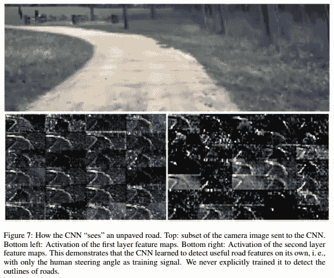

# 看路——自动驾驶汽车入门

> 原文：<https://towardsdatascience.com/seeing-the-road-getting-started-with-self-driving-cars-31cbc68d290a?source=collection_archive---------6----------------------->

在一个奇怪的虐待狂事件中，我决定一头扎进自动驾驶汽车，把人工智能作为一个副业。有一家咨询公司，一个蹒跚学步的孩子，几乎没有空闲时间，我想，“顺便上些课程？这真是个好主意！”[1] .至少，也许我可以解开一些技术之谜

在参加自驾课程的过程中，我经常与人谈论这项技术。我在与人们谈论自动驾驶汽车时发现，大多数人要么对当前的技术水平感到惊讶，要么感到震惊。这是很自然的反应。驾驶已经成为如此明显的人类努力，以至于大多数人不可能理解计算机可以在很少或没有驾驶员错误的情况下在更高的程度上执行这项任务。或者他们认为自动驾驶汽车还很遥远，他们不必担心。

但是，低估计算机的能力并不是驾驶所独有的。在我年轻的时候，作为一个无耻的糟糕棋手，我崇拜大师们的激情和强度。用“创造性、侵略性、不屈不挠”这样的术语来说，卡斯帕罗夫确实是 1997 年在一系列电视比赛中倒下之前的最后几位大师之一。这成了国际象棋中计算机算法的转折点，他们没有回头。如今，即使是一款 20 美元的普通游戏,[的等级也比](https://www.chess.com/article/view/the-best-computer-chess-engines)[的特级大师](https://ratings.fide.com/top.phtml?list=men)高。象棋是人类能力巅峰的时代迅速陨落，并且没有回头。

Even if you didn’t like chess you have to admire that soundtrack

同样，自动驾驶汽车将在更短的时间内超越人类的能力。这很好，因为我无法想象教我女儿开车的压力。

# 计算机视觉

人类司机没有太多的传感器来工作，但他们有一个出色的视觉系统。驾驶是为配合它而量身定做的。交通标志、车道标志和转向灯(甚至在宝马上)为在环境中导航提供了线索。但是看到一些东西并不等同于理解它的背景。我们可以看到道路标记，但理解它们的含义完全不同。对于计算机来说，驾驶的感知部分是复杂的(大多数司机也是如此，认真看路)，大多数人认为这是人类擅长的地方。如果自动驾驶汽车要在路上行驶，他们不仅需要看到道路，还需要理解这些标记背后的背景。

自动驾驶汽车的计算机视觉技术现在反映了我们对人类视觉的了解(或猜测)。眼睛在视锥细胞中执行一系列图像转换，提取颜色、线条和图案，并将这些信息传递给大脑进行处理。它从不捕捉整个图像，而是简单地聚焦不同的区域来寻找模式。这就是为什么你可以数球的移动，却看不到大猩猩。

NVIDIA 和其他公司已经采用了这个概念，并将其集成在一个学习算法中，称为[卷积神经网络](https://en.wikipedia.org/wiki/Convolutional_neural_network) (CNN)。CNN 是机器视觉中的一个重要工具，并且已经被证明在大量的计算机视觉领域中是有效的。在驾驶中，我们希望专注于道路上的视觉指示器，CNN 可以通过简单地用驾驶视频训练它来识别道路特征。

End to End Learning for Self-Driving Cars, NVIDIA, [https://arxiv.org/pdf/1604.07316v1.pdf](https://arxiv.org/pdf/1604.07316v1.pdf)

NVIDIAs 的实现甚至走得更远，教汽车仅使用摄像头视觉导航道路。如果你认为这种类型的技术仅限于拥有巨额研究预算的大大学或公司，这里有一个应用于模拟课程的相同技术，作为 3 个月自动驾驶课程的一小部分；

应用于自动驾驶汽车的计算机视觉领域还很遥远。与谷歌、宝马、奔驰和几乎所有其他汽车制造商在计算机视觉方面所做的工作相比，这里甚至连概念都是初级的。

也许我们需要一个人对机器车的挑战…

[1]如果你熟悉他们的话，我正在参加 Udacity 的几个[纳米学位](https://www.udacity.com/nanodegree)项目，专门研究人工智能和自动驾驶汽车。它们是对该领域的很好的介绍，并吸引了一些顶级的行业人员。它们涵盖了大量的信息，有时感觉就像从消防水管里喝水一样。