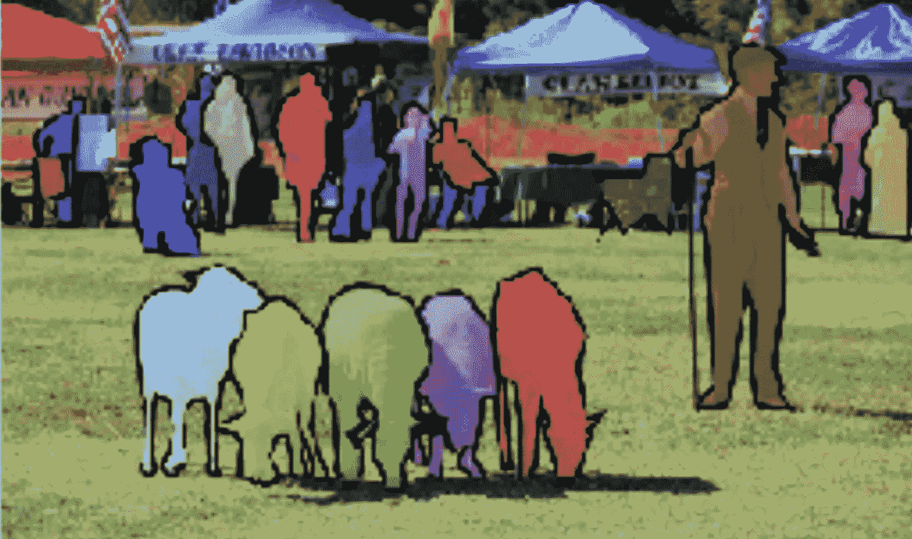
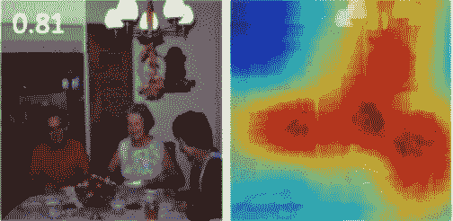
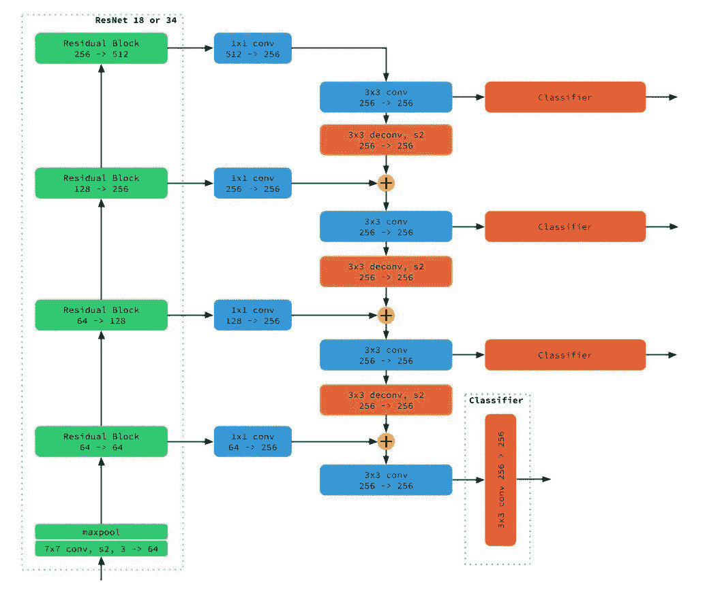
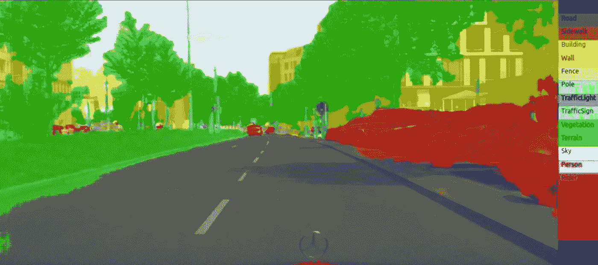

# 分割、定位和计数图像中的对象实例

> 原文：<https://towardsdatascience.com/segmenting-localizing-and-counting-object-instances-in-an-image-878805fef7fc?source=collection_archive---------0----------------------->

当我们视觉感知世界时，可能会获得大量的数据。如果你用现代相机拍一张照片，它会有超过 400 万像素和几兆字节的数据。

但实际上，在一张照片或一个场景中，我们人类消耗的有趣数据很少。这取决于任务，但例如在一个场景中，我们寻找其他动物和人类，他们的位置，他们的行动。我们可能会通过寻找面孔来衡量情绪，或者行动的强度和严重性来了解整个场景中的情况。

开车时，我们会寻找可通行的道路、其他车辆、行人和移动物体的行为，并注意交通标志、灯光和道路标记。

在大多数情况下，我们会寻找一些物体，它们的 x，y，z 位置，并拒绝绝大多数我们称之为背景的东西。背景是我们的任务不需要注意的任何东西。如果我们在找钥匙，人们可以做背景。

有时我们也需要数数，并且能够说出一种物体有多少，它们在哪里。

在大多数情况下，我们观察一个场景，并希望获得以下信息:

Ideal segmentation, localization and instance counting in a visual scene. Segmentation gives precise boundaries of object instances, a much more refined approach that bounding boxes.

我们可能还想在第二次扫视时获得更多的细节信息，例如面部关键点、人体骨骼关键点的位置等等。一个例子:

Our facial keypoints detector neural network in action

我们现在将回顾如何通过神经网络和深度学习算法来实现这一点。

我们应该明白，人类的视觉在视觉场景中是多次传递的。这意味着我们递归地观察波形中的视觉场景，首先在最短的时间内获得最粗糙的内容，对于时间敏感的任务。然后，我们可能会一遍又一遍地扫视，以找到越来越多的细节，用于精确的任务。例如，在驾驶情况下，我们想知道我们是否在路上，是否有障碍物。为了快速响应，我们着眼于粗略的特征。我们对将要撞上的车的颜色或牌子/型号不感兴趣。我们只需要快速刹车。但如果我们在人群中寻找特定的人，我们会先找到人，然后找到他们的脸，然后用多种眼神研究他们的脸。

神经网络不需要遵循人脑的规则和方式，但通常在算法的第一次迭代中这样做是一个好主意。

现在，如果你运行一个神经网络来对一幅大图像中的物体进行分类，你会在输出端得到几幅地图。这些地图包含物体在多个位置出现的概率。但是因为分类神经网络想要将大量的像素减少到少量的数据(分类)，所以它们也在某种程度上失去了精确定位对象实例的能力。请参见下面的示例:

Neural network raw output on a large image: probability of person category

请注意，您得到的输出是“免费的”,这意味着我们确实需要运行除神经网络之外的任何其他算法来找到定位概率。输出图的分辨率通常较低，并且取决于神经网络、其输入训练眼大小和输入图像大小。通常这是粗糙的，但是对于许多任务来说这已经足够了。这不能给你所有对象的精确实例分割和精确的边界。

为了获得最精确的边界，我们使用分割神经网络，例如我们的 [LinkNet](https://codeac29.github.io/projects/linknet/index.html) ，这里[修改了](https://medium.com/@dawood95/using-generative-ladder-networks-to-build-a-facial-keypoints-detector-7769e4dbf96a)来检测许多不同种类的图像关键点和边界框。：

Our [Generative Ladder Network](https://medium.com/towards-data-science/a-new-kind-of-deep-neural-networks-749bcde19108) used to detect key-points in an image (facial, bounding boxes, body pose, etc…). This uses a [special new network](https://medium.com/@dawood95/using-generative-ladder-networks-to-build-a-facial-keypoints-detector-7769e4dbf96a) architecture designed for maximum efficiency.

这些类型的神经网络是[生成梯形网络](https://medium.com/towards-data-science/a-new-kind-of-deep-neural-networks-749bcde19108)，它使用编码器作为分类网络和解码器，能够在输入图像平面上提供精确的定位和图像分割。

这种网络为同时识别、分类和定位任何种类的对象提供了最佳性能。

以下是我们可以用[生成式梯形网络](https://medium.com/towards-data-science/a-new-kind-of-deep-neural-networks-749bcde19108)获得的结果:

Typical results obtained with [LinkNet](https://codeac29.github.io/projects/linknet/index.html) and [Generative Ladder Networks](https://medium.com/towards-data-science/a-new-kind-of-deep-neural-networks-749bcde19108) — see videos [here](https://codeac29.github.io/projects/linknet/index.html\)

生成梯形网络的计算量不是很大，因为编码器是一个标准的神经网络，可以设计成高效的，像 [eNet](https://arxiv.org/abs/1606.02147) 或 [LinkNet](https://codeac29.github.io/projects/linknet/index.html) 。解码器是一个上采样神经网络，它可以被制造得非常快并且计算成本低廉，例如在 [eNet](https://arxiv.org/abs/1606.02147) 中，或者使用像 [LinkNet](https://codeac29.github.io/projects/linknet/index.html) 这样的旁路层来提高精度。

旁路层用于通知每层的解码器如何在多个尺度上聚集特征，以实现更好的场景分割。由于编码器层对某些层中的图像数据进行下采样，因此编码器必须根据编码器中发现的特征对每层的神经图进行上采样。

**我们多年来一直在争论和论证******像**[**LinkNet**](https://codeac29.github.io/projects/linknet/index.html)**为分类、精确定位和切分提供了主干。**分割在图像中提供了更精细的定位，也为神经网络提供了更好的训练示例。原因是精确的边界比不精确的边界(如边界框)更有效地将对象组合在一起。显而易见，一个边界框将包含许多背景或其他类别的像素。用这样的错误标签训练神经网络会降低网络的分类能力，因为背景信息会混淆其训练。我们建议不要使用边界框。**

**在过去，文献中充斥着使用边界框的方法，对神经网络的使用效率非常低，甚至对它们的工作方式和使用方式的理解也很差。次优方法列表在这里: [Yolo](https://pjreddie.com/darknet/yolo/) ， [SSD 单拍多盒检测器](https://arxiv.org/abs/1512.02325)， [R-CNN](https://arxiv.org/abs/1504.08083) 。对这些劣质方法的回顾和比较是[这里是](https://medium.com/@phelixlau/speed-accuracy-trade-offs-for-modern-convolutional-object-detectors-bbad4e4e0718) —我们注意到 SSD 是唯一一种至少尝试使用神经网络作为尺度金字塔来回归边界框的方法。**

**这些方法不合格的原因列表:**

*   **使用低效编码器作为 VGG**
*   **使用边界框进行训练比使用更精确的分割标签产生更差的准确性**
*   **复杂的体系结构，有些不能通过端到端的反向传播来训练**
*   **边界框的选择性搜索、边界框的裁剪和回归并不是一种优雅的端到端方法，而是让人想起在深度神经网络之前执行计算机视觉的方式:作为不同方法的任意集合**
*   **需要一个单独的“客观”网络来查找区域建议**
*   **在多个尺度上使用低效且庞大的分类器来回归边界框**

**最近的工作来自:[密集物体检测的焦点损失](https://arxiv.org/abs/1708.02002)更有见地，因为它表明[生成梯形网络](https://medium.com/towards-data-science/a-new-kind-of-deep-neural-networks-749bcde19108)可以被视为基本框架，该框架应该驱动未来的神经网络设计，例如分类、定位(参见注释 1)。**

**但是我们如何使用像 [LinkNet](https://codeac29.github.io/projects/linknet/index.html) 这样的网络来执行包围盒回归、关键点检测和实例计数呢？这可以通过在每个解码器层的输出端附加子网来实现，如这里的[和这里的](https://arxiv.org/abs/1708.02002)和[所做的那样。这些子网需要最少网络和小分类器来快速有效地工作。这些网络的设计需要由有经验的神经网络架构工程师来执行。请看我们最近的工作](https://adrianbulat.com/face-alignment)[在这里](https://medium.com/@dawood95/using-generative-ladder-networks-to-build-a-facial-keypoints-detector-7769e4dbf96a)，我们展示了一个像 [LinkNet](https://codeac29.github.io/projects/linknet/index.html) 这样的单一神经网络是如何执行所有提到的任务的。**

# **总结:**

*   **不要使用边界框(注 3)**
*   **使用[生成梯形网络](https://medium.com/towards-data-science/a-new-kind-of-deep-neural-networks-749bcde19108)作为主神经网络(注 1)——参见此处[的](https://medium.com/@dawood95/using-generative-ladder-networks-to-build-a-facial-keypoints-detector-7769e4dbf96a)**
*   **添加分支以定位、分割和查找关键点**
*   **使用高效的编码器架构(注 4)**
*   **不要使用这些网络来执行动作识别和分类(注 2)**

****注 1:**[最近的一篇关于定位、分割和实例级视觉识别方法的教程](https://instancetutorial.github.io/)也指出，像 [LinkNet](https://codeac29.github.io/projects/linknet/index.html) 这样的模型是对象检测的通用框架。他们称[生成梯形网络](https://medium.com/towards-data-science/a-new-kind-of-deep-neural-networks-749bcde19108)为:特征金字塔网络(FPN)。他们认识到[生成式梯形网络](https://medium.com/towards-data-science/a-new-kind-of-deep-neural-networks-749bcde19108)具有编码器下采样内置的内在比例金字塔。他们还认识到，解码器可以对图像进行上采样，以更好地定位、分割和完成更多任务。**

****注 2:** 试图从单一图像中识别动作并不是一个好主意。动作生活在视频空间中。图像可以让你了解一个动作，因为它可以识别一个与动作相关的关键帧，但它不能代替准确分类动作所需的序列学习。不要在单个帧上使用这些技术来分类动作。你不会得到准确的结果。使用基于视频的神经网络，如 [CortexNet](https://engineering.purdue.edu/elab/CortexNet/) 或[类似的](https://arxiv.org/abs/1503.08909)。**

****注 3:** 分割标签比包围盒更费力获得。用粗略的边界框来标记图像更容易，以便手动精确地绘制所有对象的轮廓。这是像包围盒这样的劣质技术长期存在的一个原因，这是由越来越多的具有包围盒的大型数据集的可用性决定的。但最近有一些技术可以帮助分割图像，尽管可能不如人类标记精确，但至少可以自动分割大量图像。参见[本](https://people.eecs.berkeley.edu/~pathak/unsupervised_video/)作品(通过观察物体移动学习特征)和[本](https://arxiv.org/abs/1603.03911)作为参考。**

****注 4:**[生成式梯形网络](https://medium.com/towards-data-science/a-new-kind-of-deep-neural-networks-749bcde19108)的编码器网络需要高效设计，以实现实际应用中的真实性能。人们不能使用花费 1 秒来处理一帧的分段神经网络。然而，文献中的大多数结果只关注于获得最佳的*精度*。我们认为最好的度量是*准确性/推理时间*，正如这里所报告的。这是我们 [eNet](https://arxiv.org/abs/1606.02147) 和 [LinkNet](https://codeac29.github.io/projects/linknet/index.html) 的关键设计。一些论文仍然使用 VGG 作为输入网络，这是迄今为止效率最低的模型。**

# **关于作者**

**我在硬件和软件方面都有将近 20 年的神经网络经验(一个罕见的组合)。在这里看关于我:[媒介](https://medium.com/@culurciello/)、[网页](https://e-lab.github.io/html/contact-eugenio-culurciello.html)、[学者](https://scholar.google.com/citations?user=SeGmqkIAAAAJ)、 [LinkedIn](https://www.linkedin.com/in/eugenioculurciello/) 等等…**