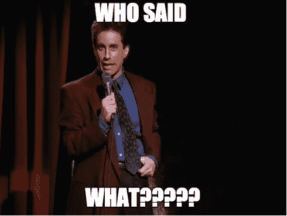
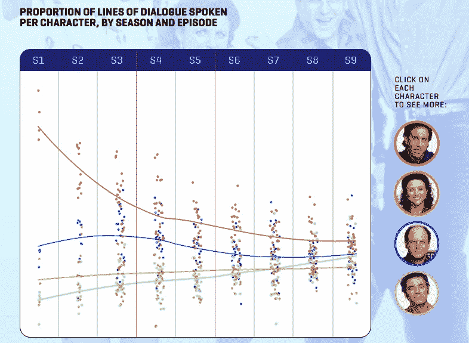
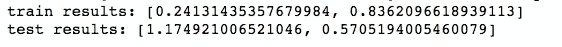
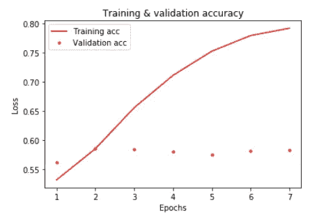
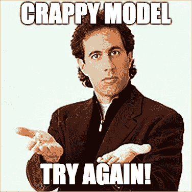
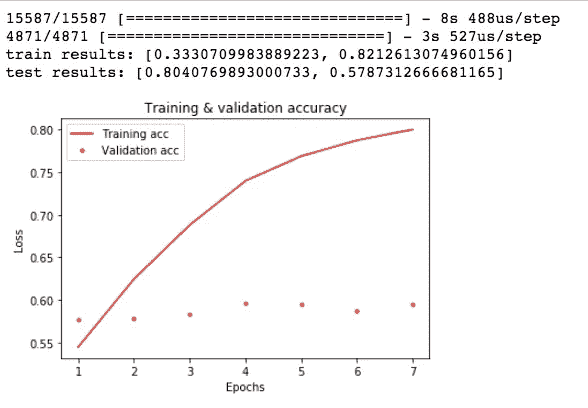
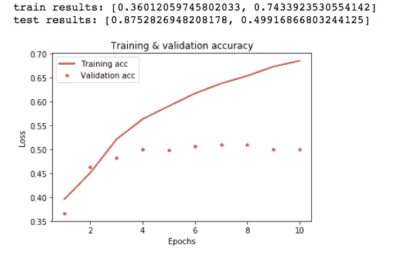

# 宋飞与神经网络:一个关于虚无的博客(第二部分)

> 原文：<https://towardsdatascience.com/seinfeld-with-neural-network-a-blog-about-nothing-part-2-50ac642c705f?source=collection_archive---------10----------------------->

继续我的科学研究所有数据的旅程，我终于进入了深度学习和人工神经网络(ANN)的世界。这个话题绝对是最吸引人的话题之一，但也是我最紧张的话题之一。我的焦虑主要源于这样一个事实，即这个故事的技术和数学方面非常吓人、复杂，对我的舒适区来说太乏味了。然而，在了解到神经网络本质上是一种组合以及通过反向传播迭代调整的权重和偏差的炼金术之后，我的焦虑水平大大降低了，我确信神经网络不仅强大，而且超级酷。

任何优秀的数据科学学生都知道，学习新概念的最佳方式是良好的实践。我决定以我之前关于宋飞的博客为基础，将新概念应用于一个老问题，并测试各种工具的组合来提高我的模型的分类准确性。迷你项目的目标是获得建立神经网络和自然语言处理的经验。

 [## 宋飞与 TF-IDF:一个什么都没有的博客

### 在为我的班级项目分析 OKCupid 约会简介一周后，我想做一些有趣的事情，同时仍然…

towardsdatascience.com](/seinfeld-with-tf-idf-a-blog-about-nothing-1732abcfd773) 

之前的模型涉及使用 TF-IDF 对文本进行矢量化，并使用投票分类器来训练机器学习模型，以预测哪个字符说了哪一行。实验取得了 43%的准确率，不算很大。有了人工神经网络及其更好地提取特征的能力，我认为可能值得尝试一种新的模型。

Overview of dialogue distribution for each of the main characters over the 9 seasons. Jerry has significantly more dialogues than the rest of the characters, signaling a class imbalance. [https://www.ceros.com/originals/breaking-down-seinfeld/](https://www.ceros.com/originals/breaking-down-seinfeld/)

首先，考虑到 Jerry 的对话和其他演员之间的类别不平衡，我决定只运行来自 George、Elaine 和 Kramer 的对话的模型。下面列出了模型的精度结果。

The model does not perform better with increase epochs, it essentially plateaus at around epoch 2 for this particular model.

83%的训练准确率和 57.05%的低测试准确率表明，该模型对于我正在执行的特定分类来说过于笼统，并且该模型不适合该任务。使用带有计数矢量化的新矢量化，对超参数进行一些调整，并添加正则化，结果仍然暗淡无光。

考虑到我随机猜测的基线是 33.33%，之前模型的准确率是 48%，模型的测试准确率 57.83%可能不显著，但它仍然比随机猜测要好。

A slight increase in test data accuracy and epoch numbers. An increase in epoch number will increase my training accuracy, however, the tradeoff struggles with the long training time.

最后，我决定让杰瑞回来。这需要额外的调整来适应类的不平衡，结果见下文。

With Jerry added back to the mix, the accuracy is slightly lower as I expected, however, it still outperforms the previous model.

49.92%的准确率并不令人印象深刻，但这是使用浅层学习模型或 4 个类别之间随机猜测的 25%基线的 43%的改进。相对而言，我对我训练的模型并不那么失望，但是，我对它的表现也不是特别满意。

由于神经网络更擅长提取人类语言中的特征，因此它通常是用于自然语言处理的更有效的模型。然而，由于语言在与上下文相关联时是有意义的，所以我喜欢尝试的另一种方法是 Word2Vec。Word2Vec 被认为是更好的矢量化/嵌入方法，可以更好地处理语言数据。

 [## 单词的矢量表示|张量流

### 目标是对嵌入参数\(\theta\)进行更新，以改进(在这种情况下，最大化)这个目标…

www.tensorflow.org](https://www.tensorflow.org/tutorials/representation/word2vec) 

对于诸如语音识别之类的任务，成功执行识别任务需要编码数据，因为人类的认知能力允许我们从原始文本中识别含义，而计算机从稀疏矩阵中辨别矢量化文本的上下文具有挑战性，因为传统的自然语言处理系统将单词视为离散元素。因此，使用 TF-IDF 和 CountVectorization，正如我对我的模型所做的那样，计算机在识别语言模式和字符的区别方面面临着挑战。

我这个迷你项目的下一步是尝试不同的矢量化技术，结合不同的机器学习模型(监督或无监督)，以便比较和对比每个模型的结果性能。即使我还没有完全用尽我的机器学习工具包，随着更多的时间和更多的练习，我可能能够将这些野生神经网络计算成一个足够的分类模型，以区分彼此的字符。

使用 Seinfeld 脚本帮助我了解了许多关于每个机器学习模型的细微差别以及使用自然语言处理的挑战。

资源:

 [## 宋飞编年史

### 完整的宋飞正传剧本和剧集细节

www.kaggle.com](https://www.kaggle.com/thec03u5/seinfeld-chronicles)