# 宋飞与 TF-IDF:一个什么都没有的博客

> 原文：<https://towardsdatascience.com/seinfeld-with-tf-idf-a-blog-about-nothing-1732abcfd773?source=collection_archive---------11----------------------->

在为我的班级项目分析了 [OKCupid 约会简介](https://github.com/rudeboybert/JSE_OkCupid)一周之后，我想做一些有趣的事情，同时还得到了一些急需的单词矢量化练习，TF-IDF ( ***术语频率，逆文档频率)。***

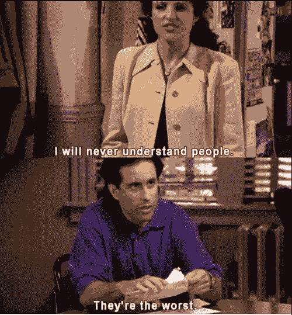

由于我最近没怎么看电视，探索经典情景喜剧《宋飞正传》中的这个[数据集](https://www.kaggle.com/thebrownviking20/who-said-this-line-eda-classification-keras-ann/data)似乎是一个有趣的想法，我将尝试预测哪个角色说了哪句台词。

[TF-IDF](https://en.wikipedia.org/wiki/Tf%E2%80%93idf) 是一种矢量化形式，它根据术语在样本中的独特程度对样本中的每个术语进行加权。基本上，这种方法有助于提取与特定来源密切相关的关键词。将 TF-IDF 的概念应用到我的《宋飞正传》挑战中:如果一个单词被角色经常使用，那么这个单词不够独特，不足以帮助指示哪个角色说了那个对话；另一方面，如果一个单词经常被其中一个角色提及，但很少被其他角色提及，这个单词就成为了一个强有力的指示器，告诉我们是哪个角色说了这句话。

为了缩小数据集的范围以优化效率，我根据每个角色说出的行数选择了主要角色，并挑选了前 5 个角色进行处理。此外，为了找出剧中哪个角色说了最多的话，下图显示了杰瑞在所有角色中拥有最多的台词和最多的单词...这个节目是以他的名字命名的，所以这并不奇怪。

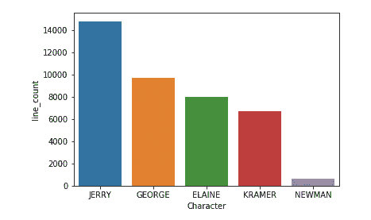

number of dialogues for each of the main characters

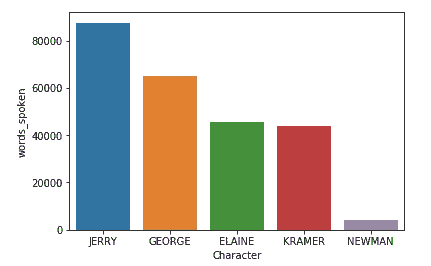

number of words spoken by each of the characters

知道 Jerry 说了大部分台词，我意识到单词 predictor 将受到这种限制的挑战。因为大多数台词是杰瑞说的，所以数据集在他的对话上有很大权重。此外，作为该剧的编剧和制片人，他的声音可能会渗透到其他角色的对话中。如下面我们的 TF-IDF 分类模型的摘要所示，在数据集中包括 Jerry 的对话时，我们的精度是 43%，而没有 Jerry 的对话时，我们的精度是 48%。精确度比我预期的要低。

Prediction model without Jerry

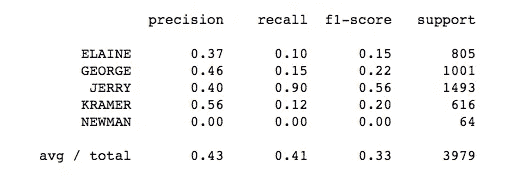

Prediction model with Jerry

为了更好地理解角色之间的对话有多相似，我使用了一个名为 g [ensim](https://radimrehurek.com/gensim/tutorial.html) 的语义库，由 [Kaggle Kernal](https://www.kaggle.com/thebrownviking20/who-said-this-line-eda-classification-keras-ann) 提出，它有一个相似性方法，能够确定特定文档和一组其他文档之间的相似程度。通过使用 TF-IDF 为每个角色的对话转换一个单词包，用单词计数作为每个单词的权重，我能够对 gensim 库中的文本运行[相似性查询](https://radimrehurek.com/gensim/tutorial.html)。下图显示了一个字符的对话分数，作为与每个文档进行比较的查询向量。相似性得分范围从 0 到 1，0 表示不相似，1 表示非常相似。

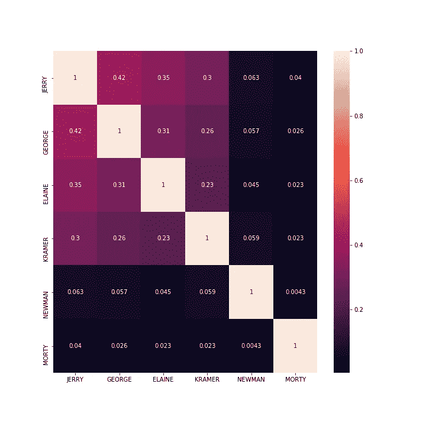

visualization of how similar each of the characters’ corpus in relation to another.

图表证实了我的怀疑，杰瑞、乔治、伊莱恩和克莱默非常相似。乔治和杰瑞的对话是最相似的，这也解释了为什么这两个人是最好的朋友。人物对话相似性的可视化是数据集局限性的另一个解释。因为主要角色所讲的语言非常相似，所以预测模型无法检测角色对话之间的细微差别。

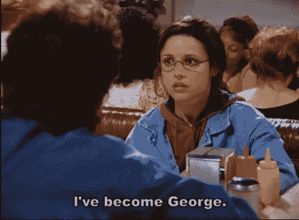

我不愿意放弃享受数据集的乐趣，所以我探索了用预测工具娱乐自己的其他方式。考虑到这部剧是由杰瑞·宋飞和拉里·戴维共同编剧/制作的，我想看看这个模型是否能够预测拉里和剧中其他主要角色之间的差异。

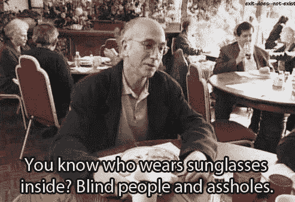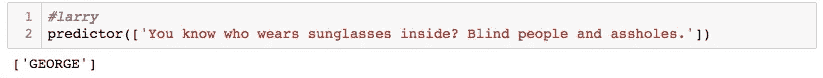

这个结果并没有让我吃惊。由于拉里是这部剧的原创作者之一，他的声音和乔治的声音一定非常相似。为了好玩，我测试了拉里在《抑制你的热情》中最著名的几段话，看看这个模型的表现如何。拉里更像乔治还是杰瑞？

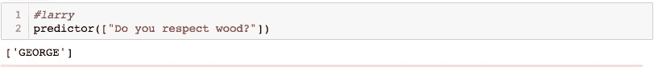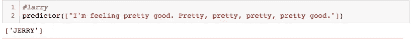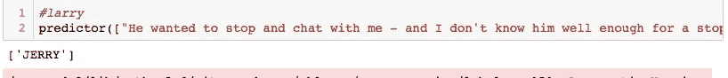

参与这项挑战给了我一些使用 TF-IDF 作为语言预测工具的实践，同时，我也有机会学习 gensim 的功能，并从预测模型中获得一些乐趣。我很想知道如果我用《抑制你的热情》中的对话训练模型，该模型是否能够区分宋飞和拉里的声音。此外，我很好奇这个模型在真实的文本样本中是否会有更好的性能，在真实的文本样本中，声音的作者不是由房间中真正有趣的作者创建的。