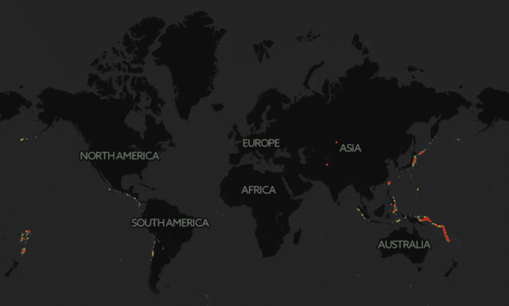
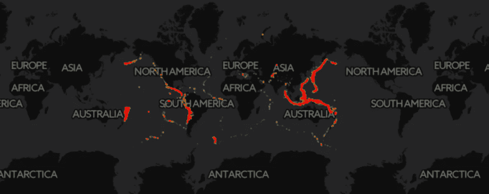
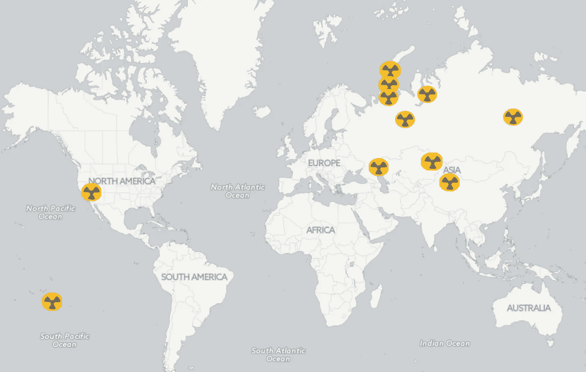

# 测绘世界各地的地震活动

> 原文：<https://towardsdatascience.com/seismic-activities-around-the-world-976dbf759e54?source=collection_archive---------4----------------------->

自 1965 年以来，全球平均每年发生 441 次 5.5 级以上地震。5.5-6.0 的震级可能会造成轻微的破坏，而 6.1 或更高的震级可能会在人口密集的地区造成重大破坏。

Magnitude 6.1 or over

来自国家地震信息中心(NEIC)的数据集包含地震的日期时间、坐标、震级和类型(并非所有地震都是由自然引起的，少数是由 20 世纪 60-90 年代的核弹引起的地震活动)。)

当观察重大地震时，我们可以看到东亚和东南亚的高度集中，尤其是印度尼西亚。

Magnitude 5.5–6.0

可视化这些不太重要的地震给了我们一个“火环”的清晰视图，这是一个位于太平洋盆地的地震带。

除了自然灾害之外，研究由核弹引起的地震也是值得的。

seismic activity from nuclear bombs in 1960s-1990s. Icon from [http://www.flaticon.com/free-icon/radiation_195741#term=radioactivity&page=1&position=20](http://www.flaticon.com/free-icon/radiation_195741#term=radioactivity&page=1&position=20)

试验的可怕核弹的数量简直让我吃惊。由于数据只涵盖到 1965 年，那些早期的活动，如广岛不包括在内。

我今天学到的:

*   传单地图很酷，但[fleet . extras](https://github.com/bhaskarvk/leaflet.extras)包只是增加了这种酷炫感，有像 addWebGLHeatmap 和 addDrawToolBar 这样的功能。
*   有几种方法可以将地理坐标映射到国家。但是，对于该数据集，许多数据点位于海洋中，不会映射到国家。

这是我第 100 天项目的第 11 天。我的 [github](https://github.com/yanhann10/Kaggle_Dataset/blob/master/earthquakes/earthquakes.Rmd) 上的全部代码。感谢阅读。