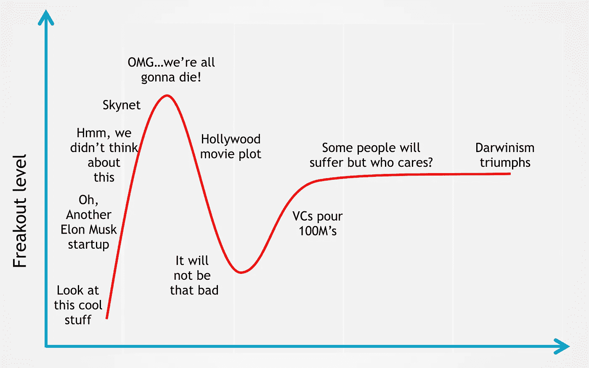
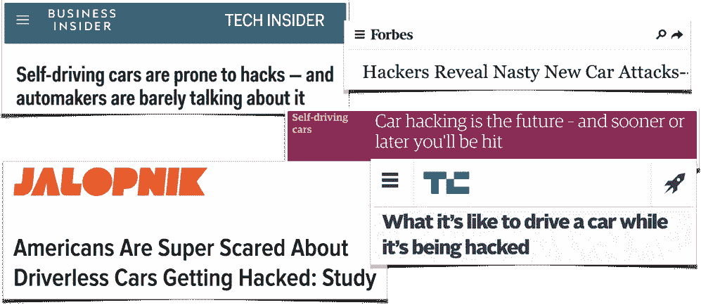
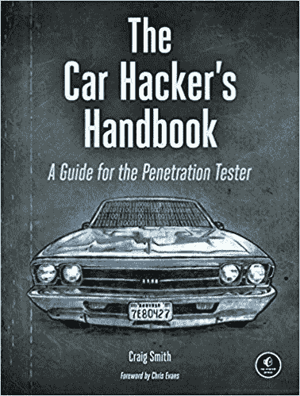

# 自动驾驶汽车——我们应该因为黑客而扣上安全带吗？

> 原文：<https://towardsdatascience.com/self-driving-cars-should-we-buckle-up-because-of-hackers-9faee2940500?source=collection_archive---------7----------------------->

## 保护 CAN 总线和避开传感器欺骗是迈向 5 级自治的一部分。

Freakout level as a new technology navigates the hype cycle

自从第一个网络摄像头出现以来，我们已经看到了大量联网设备出错的轶事。消费和工业物联网的滚雪球扩大了可能被恶意攻击的设备的数量。黑客已经控制了设备，监视人们，扰乱企业和政府，将数以千计的设备涌入 T2 僵尸网络。这样的例子不胜枚举。

每一项新技术都驱使坏人花费时间和精力去寻找利用他人的方法。物联网技术是一个大目标:智能助理、联网家庭、医疗保健设备、交通系统、制造传感器等。

物联网安全是一个热门话题，大玩家都知道。最近，芯片制造商 ARM [宣布了平台安全架构(PSA)](https://www.bloomberg.com/news/articles/2017-10-23/softbank-s-arm-makes-bid-to-standardize-iot-security-industry) ，这是一项针对开发者、硬件和芯片提供商的行业标准提案。Standard *schmstandard* ，但是微软、谷歌、思科、Sprint 和其他公司都支持它，所以谁知道呢？

## 汽车黑客和自动驾驶技术

对物联网安全的普遍担忧促使技术和主流媒体产生点击诱饵和耸人听闻的新闻。毫不奇怪，自动驾驶技术现在也出现了同样的情况。

## CAN 总线和汽车黑客

[控制器局域网(CAN)总线](https://en.wikipedia.org/wiki/CAN_bus)是由博世和英特尔于 1983 年开发的标准，其当前版本于 20 世纪 90 年代发布。CAN 是一种串行通信协议，允许在车辆部件(如制动器)之间进行分布式实时通信和控制👀，动力转向🙀、窗户、空调、安全气囊、巡航控制、信息娱乐系统、车门、电动汽车的电池和充电系统等。

通过对 CAN 总线进行逆向工程，我们能够通过软件向车辆发出命令。所以控制一辆车就是访问 CAN 总线。因为它的主要焦点是安全性和可靠性，所以它从未提供任何加强安全性的方法——例如，通过认证或加密。

[汽车黑客手册](https://www.amazon.com/gp/product/1593277032/ref=as_li_tl?ie=UTF8&camp=1789&creative=9325&creativeASIN=1593277032&linkCode=as2&tag=cacheop-20&linkId=8475f3940e926ee2fecab6e738c1cd60)是向任何人介绍这些部件的“圣经”。这本书研究脆弱性；详细解释了 CAN 总线上以及设备和系统之间的通信。

## 自动驾驶

自动驾驶车辆将给我们的生活带来实质性的转变。人工智能、计算机视觉和传感器技术的进步正在将我们推向[第五级](https://en.wikipedia.org/wiki/Autonomous_car#Levels_of_driving_automation)场景(汽车方向盘是“可选”的，不需要任何人为干预的状态。)

这一切都是由摩尔定律和数十亿美元的资本促成的。

就这样，我们的老朋友 CAN 总线突然变得流行起来。原因是大多数自动驾驶汽车公司不是从零开始设计或制造自己的车辆。他们正在开发控制汽车的软件——更具体地说是控制转向、加速和刹车。[查看这里](https://news.voyage.auto/an-introduction-to-the-can-bus-how-to-programmatically-control-a-car-f1b18be4f377)来自 [Voyage](https://voyage.auto/) (一种自动驾驶出租车服务)的工程师如何使用福特嘉年华的 CAN 总线来控制其温度。

根据自动驾驶技术传感器捕获的大量数据，制动、加速或改变转向角度的命令被发送到 CAN 总线。安装的摄像头、雷达和[激光雷达](https://en.wikipedia.org/wiki/Lidar)是汽车的眼睛和耳朵。粗略地说，十几个传感器混合数据(称为传感器融合)来跟踪车辆环境，本地软件实时做出所有决定。

## 但是汽车是物联网的一部分吗？

对于自动驾驶技术来说，好消息是每辆车都像一个封闭的系统。不需要持续的云连接到汽车。它们最终将连接到外部世界来发送和接收信息，例如交通报告。仍然存在这样的风险，即与自动驾驶功能无关的另一个系统——如 wi-fi——可能会为黑客提供一个入口。这种黑客行为促使克莱斯勒在 2015 年召回 140 万辆汽车。

## 传感器欺骗

外部因素可以影响汽车传感器的行为，或者欺骗它的人工智能“认为”它“看到”不同的东西。

许多关于对抗性扰动的论文表明，深度神经网络可以被愚弄来错误分类对象。例如，通过在交通标志上添加伪装成涂鸦艺术的贴纸，软件会将其解释为不同的东西。看下面的视频。

现在有[项研究](https://iotsecurity.eecs.umich.edu/#roadsigns)正在进行中，[用机器学习模型来对抗](https://arxiv.org/abs/1706.06083)这些扰动，这些模型通过训练具有更高抵抗力的网络来保证鲁棒性。

除了摄像头，还有其他已知类型的传感器欺骗。一组中国研究人员[成功发起攻击](https://www.documentcloud.org/documents/3004659-DEF-CON-whitepaper-on-Tesla-sensor-jamming-and.html)，使用现成的无线电、声音和光工具来欺骗特斯拉的超声波传感器和毫米波雷达，影响其自动驾驶系统。

韩国的另一个小组想出了一种方法( [PDF](http://eprint.iacr.org/2017/613.pdf) )在路上创造假的物体，这些物体被激光雷达检测到，使汽车锁住刹车以避免撞车。

## 前方的路

因为我们处理的是乘客和行人的生命，所以安全必须始终是首要考虑的问题。不幸的是，在没有尖端技术的情况下，车辆武器化已经成为现实。大多数黑客攻击相当于临时攻击，比如有人从天桥上向汽车投掷重物。或者类似于将激光指示器瞄准驾驶员的眼睛。

你上一次从高层建筑的顶层乘电梯时担心黑客会让电梯坠落 30 层以上是什么时候？嗯，有人认为[自动驾驶汽车就像电梯](https://www.theatlantic.com/technology/archive/2015/12/magic-boxes-with-buttons/419841/)。

变革即将到来，现在的问题是什么时候，而不是如何。所以让我们系好安全带上路吧！