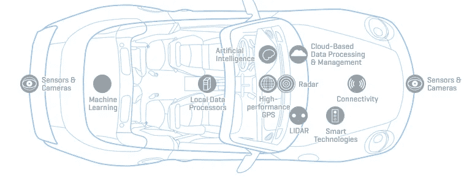
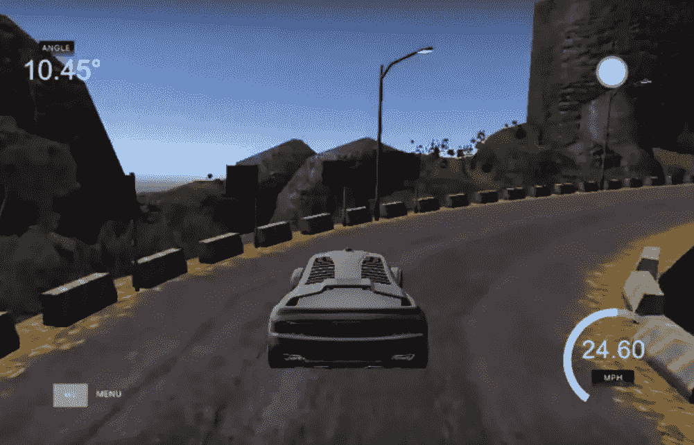
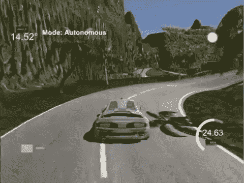

# 使用深度学习的自动驾驶汽车

> 原文：<https://towardsdatascience.com/self-driving-cars-using-deep-learning-14add64fa8a2?source=collection_archive---------5----------------------->

无人驾驶汽车无疑将成为未来的标准交通方式。从优步和谷歌到丰田和通用汽车的大公司都愿意花费数百万美元来实现它们，因为未来的市场预计价值数万亿美元。在过去的几年里，我们看到了这一领域的巨大发展，优步、特斯拉和 Waymo 的汽车记录中总共有 800 万英里。

当然，由于硬件和软件方面的许多不同技术进步，自动驾驶汽车现在已经成为现实。激光雷达传感器、照相机、全球定位系统、超声波传感器协同工作，从每一个可能的来源接收数据。这些数据使用先进的算法进行实时分析，使自动驾驶功能成为可能。

[https://www.technologyreview.com/s/609674/whats-driving-autonomous-vehicles/](https://www.technologyreview.com/s/609674/whats-driving-autonomous-vehicles/)

形成自动驾驶管道有 5 个基本步骤，顺序如下:

1.  本地化
2.  感觉
3.  预言；预测；预告
4.  规划
5.  控制

定位基本上是自动驾驶车辆如何准确地知道它在世界上的位置。在这一步中，他们从所有上述传感器(传感器融合)获得数据，并使用一种称为卡尔曼滤波器的技术以最高的精度找到他们的位置。[卡尔曼滤波器](https://en.wikipedia.org/wiki/Kalman_filter)是一种概率方法，使用随时间变化的测量值来估计物体的位置状态。另一种广泛使用的技术是[粒子过滤器](https://en.wikipedia.org/wiki/Particle_filter#Particle_filters)。

感知是汽车感知和理解周围环境的方式。这就是计算机视觉和神经网络发挥作用的地方。但稍后会详细介绍。

在预测步骤中，汽车预测周围每个物体(车辆或人)的行为。它们将如何运动，朝哪个方向，以什么速度，沿着什么轨迹运动。这里最常用的模式之一是递归神经网络，因为它可以从过去的行为中学习并预测未来。

路径规划是不言自明的。它是汽车规划路线的地方，或者说是产生轨迹的地方。这是通过搜索算法(如 [A*](https://en.wikipedia.org/wiki/A*_search_algorithm) )、点阵规划和强化学习来完成的。

最后，控制工程师从这里接手。他们使用上一步生成的轨迹来相应地改变汽车的转向、加速和刹车。最常见的方法是 [PID](https://en.wikipedia.org/wiki/PID_controller) 控制，但也有一些其他方法，如[线性二次调节器(LQR)](https://en.wikipedia.org/wiki/Linear%E2%80%93quadratic_regulator) 和[模型预测控制(MPC)](https://en.wikipedia.org/wiki/Model_predictive_control)

顺便说一句，如果你想了解更多，请查看 Udacity 免费提供的两门精彩课程:

嗯，我认为现在是我们自己制造自动驾驶汽车的时候了。好吧，不全是。但我们能做的是使用驾驶模拟器，记录下摄像头看到的东西。然后，我们可以将这些帧输入神经网络，希望汽车能够学会如何自己驾驶。让我想想…

我们将使用 Udacity 开源的[自动驾驶汽车模拟器](https://github.com/udacity/self-driving-car-sim)。要使用它，你需要安装 Unity 游戏引擎。现在有趣的部分来了:

不言而喻，我花了大约一个小时记录帧。是一些认真工作的人。我不是在鬼混。

无论如何，现在模拟器已经从 3 个不同的角度产生了 1551 帧，还记录了 517 个不同状态下的转向角、速度、油门和刹车。

在 keras 中构建模型之前，我们必须读取数据，并将它们分成训练集和测试集。

之后，我们将建立我们的模型，该模型具有 5 个卷积层、1 个漏失层和 4 个密集层。

网络将只输出一个值，即转向角。

在我们传递模型的输入之前，我们应该做一些预处理。请注意，这是通过 OpenCV 完成的，OpenCV 是一个为图像和视频操作而构建的开源库。

首先，我们必须产生更多数据，我们将通过扩充现有数据来做到这一点。例如，我们可以翻转现有的图像，翻译它们，添加随机阴影或改变它们的亮度。

接下来，我们必须确保裁剪和调整图像大小，以适应我们的网络。

培训时间:

现在我们有了经过训练的模型。它本质上克隆了我们的驾驶行为。让我们看看我们是怎么做的。为此，我们需要一个简单的服务器(socketio server)将模型预测实时发送给模拟器。我不打算谈论太多关于服务器的细节。重要的是我们利用模拟器实时生成的帧和日志来预测转向角度的部分。

结果是:

还不错。一点也不差。

我们真的做到了。我认为 Udacity 的模拟器是开始学习自动驾驶车辆的最简单的方法。

总而言之，自动驾驶汽车已经开始成为主流，毫无疑问，它们比我们大多数人想象的更快变得司空见惯。建造一个非常复杂，因为它需要从传感器到软件的许多不同的组件。但是这里我们只是迈出了非常非常小的第一步。

重要的是未来就在眼前。令人兴奋的是…

> ***如果您有任何想法、评论、问题或者您只想了解我的最新内容，请随时在***[**Linkedin**](https://www.linkedin.com/in/sergios-karagiannakos/)**，**[**Twitter**](https://twitter.com/KarSergios)**，**[**insta gram**](https://www.instagram.com/sergios_krg/)**，**[**Github**](https://github.com/SergiosKar)**或在我的**

*原载于 2018 年 9 月 4 日*[*sergioskar . github . io*](https://sergioskar.github.io/Self_driving_cars/)*。*