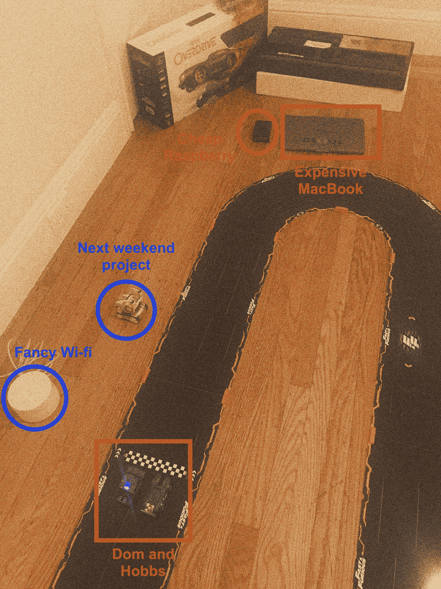
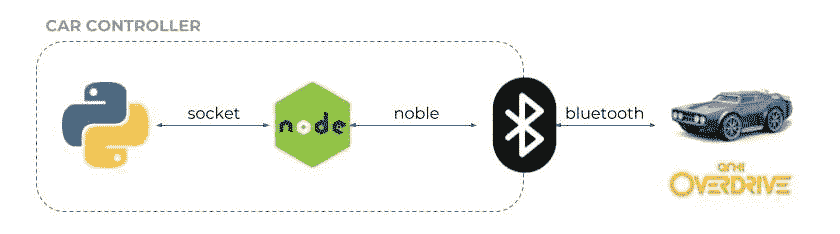
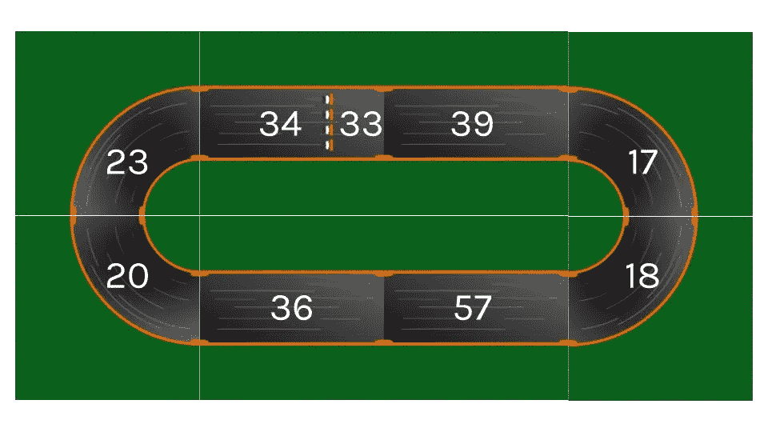
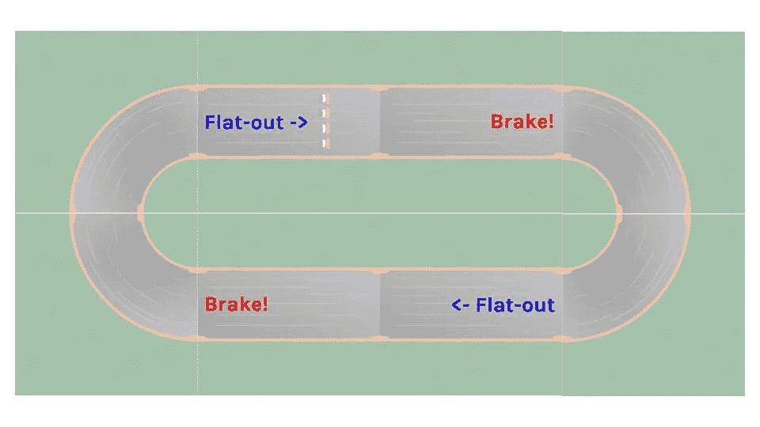

# 无人驾驶(非常小)汽车——第一部分

> 原文：<https://towardsdatascience.com/self-driving-very-small-cars-part-i-398cca26f930?source=collection_archive---------4----------------------->

## 在野外用 Python，蓝牙汽车和多米尼克·托雷托做人工智能。

## 人工智能与物理世界相遇(在预算之内)

> “我是那种欣赏好身材的男孩，不管身材如何。”——多米尼克·托雷托

A 自动驾驶汽车初创公司现在在[非常火](https://www.crunchbase.com/lists/autonomous-vehicles-2017/8c8f3beb-a676-4be5-968e-5402558c07fc/organization.companies):即使不考虑通常的嫌疑人(、 [Waymo](https://waymo.com/) 、 [Cruise](https://getcruise.com/) 等)。)，有一大堆不太知名、资金相对较少的初创公司正在攻击这个领域(甚至还有一个 [Udacity 课程](https://www.udacity.com/course/self-driving-car-engineer-nanodegree--nd013)！).这里的关键词是*相对*:你如何做并不重要，与你的标准 SaaS 公司相比，这只是一个很高的价格(因为像[激光雷达](https://news.voyage.auto/an-introduction-to-lidar-the-key-self-driving-car-sensor-a7e405590cff)这样的酷工具*非常*昂贵+收集训练/测试数据是一件痛苦的事情)。

为什么这些人要享受所有的乐趣？在我们破烂不堪的车库里，我们就不能做点什么来开始玩耍吗？事实证明，行业中一个常见的举动是使用模拟器，从*特设的*物理引擎到[现成的视频游戏](https://www.technologyreview.com/s/602317/self-driving-cars-can-learn-a-lot-by-playing-grand-theft-auto/)(你也可以在你的浏览器中尝试[！).然而，我们在周末的黑客活动中尝试了一些别的东西:我们没有用现实世界来换取对现实世界的模拟，而是选择缩小问题的规模，用一个*玩具宇宙*来工作。](https://www.metacar-project.com/)

以前已经强调过*玩具*的教育(甚至研究)价值:如果你年纪足够大，还记得人工智能时代的美好时光，你可能会想起一只昂贵的[索尼狗](https://en.wikipedia.org/wiki/AIBO)是[机器人世界杯球队](https://www.youtube.com/watch?v=lhYdQbSq5Mo)之类的天堂(有趣的事实:我写的第一个程序运行在一只白蓝相间的艾博上，它现在在好机器狗的天堂里自由自在地游荡)。具体来说，在谈到移动玩具时，荣誉奖当然要归功于[车辆](https://www.amazon.com/Vehicles-Experiments-Psychology-Valentino-Braitenberg/dp/0262521121)，这是由[瓦伦蒂诺·布莱滕贝格](https://en.wikipedia.org/wiki/Valentino_Braitenberg)撰写的一本聪明的书，在书中，简单的车辆展现出越来越复杂的“合成心理学”特征。

在这篇由两部分组成的文章中，我们将建立一个基于 Python 的开发环境来发送/接收赛车上的蓝牙小汽车的信息。由于我们缺钱，但不缺款式，我们将从著名的 Anki Overdrive 赛车套装的[速度与激情](https://www.anki.com/en-us/fast-and-furious)版开始。

> 如果你像我们一样生活，一次一个 Git commit，跟随我们一起踏上从零到无人驾驶(非常小)汽车的疯狂旅程。

写这篇文章时，还没有好莱坞名人受到伤害。

*免责声明:这是一个有趣的周末项目，绝不是经过深思熟虑的研究声明或生产就绪代码；事实证明，在选定的环境中，有许多真实的汽车无法再现(稍后将详细介绍)。也就是说，我们开始学习蓝牙的东西，更有趣的是，如何在不同的约束下构建人工智能和学习问题，而不是我们习惯的 API 开发的稀薄世界。*

*请注意，这个帖子的所有代码都免费* [*在 Github*](https://github.com/jacopotagliabue/anki-drive-python-sdk) *上提供。*

## 设置

> "你刚刚赢得了与魔鬼共舞的机会，孩子。"—卢克·霍布斯

为了开始与卢克和多姆一起玩，我们只需要一条装有蓝牙汽车的赛道和一台可以与它们对话的计算机，这样我们就可以教它如何自动驾驶:

*   正如预期的那样，我们选择了 [Anki Overdrive](https://www.anki.com/en-us/overdrive) 作为我们的小尺度物理宇宙。Overdrive 被宣传为“[智能战斗赛车系统](https://www.youtube.com/watch?v=qnfgcyxVYmQ)”，它基本上是你的旧[polis til](https://upload.wikimedia.org/wikipedia/commons/0/02/Pista_polistil.png)/[scale xtric](https://www.youtube.com/watch?v=ZTDg6gaxx2s)赛道的蓝牙版本。让 Overdrive 对书呆子友好的是，包含与汽车交互的蓝牙协议的 [Drive SDK](https://github.com/anki/drive-sdk) 是开源的(然而，弄清楚汽车通信的具体细节花了我们一段时间:见下文)；
*   就“具有蓝牙功能的计算机”而言，我们选择 Python+node 来通过 [noble](https://www.npmjs.com/package/noble) 实现跨平台兼容性，因此几乎任何东西都应该只需很小的修改，甚至不需要修改。具体来说，我们使用我们的 [Rasp Pi 3B+](https://www.raspberrypi.org/products/raspberry-pi-3-model-b-plus/) 在 Linux 上编译和运行原始 C 库，并在大多数实验中使用我们的 2017 MacBook Pro。

没有一个车库项目可以说是完整的，如果没有一张低分辨率的粒状照片——所以这是我们的([这里](https://drive.google.com/file/d/1KOnZiX9q1YuZdqtM2eaoDkS5V9Li6RtK/view?usp=sharing)是原件):



The difference between man and boy is apparently the price of their toys.

## 愤怒但不要太快:去试驾

首先，让我们测试一下设置:在深入研究 Anki Drive 协议之前，我们检查一下我们是否可以使用现成的库从我们的蓝牙汽车中读取/向我们的蓝牙汽车发送消息。我们将运行两个测试:为您自己的设置选择一个您最喜欢的。

**Anki 官方 C 工具上的一个树莓派**

*   按照此处的说明[编译并安装示例 Anki 应用程序(不要忘记首先安装所有依赖项)；](https://github.com/anki/drive-sdk/wiki/Getting-Started-on-Ubuntu)
*   启动`vehicle-scan` app 扫描车辆(记下 id！);
*   使用上面获取的 id 启动`vehicle-tool`连接到车辆；
*   测试一堆命令([截屏](https://drive.google.com/file/d/1-gy4HG1KNWZrA22Or-abW3M0hzCiaEfb/view) +笨拙的[我](https://drive.google.com/file/d/1pJgGoeoHjgerM7wI2h-JWtPym-pXAt4y/view?usp=sharing)开车通过码头的视频)。

**2017 款 Mac Book Pro 上的 Chrome 68+web app+** [**蓝牙 API**](https://googlechrome.github.io/samples/web-bluetooth/device-info.html?allDevices=true)

*   **将您的浏览器指向这个精彩的演示[这里](https://webbluetoothcg.github.io/demos/bluetooth-racing-cars/)；**
*   **连接并测试一堆命令(笨拙的[我用浏览器](https://drive.google.com/file/d/1KqsnO5pmfAUtyTtCWI1OVg_QwIQBMwMs/view?usp=sharing)开车的视频)。**

**任务开始！**

## **使用 Python 实现实时汽车通信**

> **“我们做我们最擅长的事情。我们随机应变，好吗？”—布莱恩·奥康纳**

**既然我们知道一切正常，现在是 Python 时间了！我们只能找到一个[非官方的 Python 包装器](https://github.com/xerodotc/overdrive-python)用于驱动 SDK:代码实际上看起来很惊人，我们在 Raspberry 上测试成功`example.py`；但是依赖于 [bluepy](https://github.com/IanHarvey/bluepy) ，所以只是在 Linux 上运行。**

**我们最终开发的 hack-y 解决方案是来自上面的 Python 包装器(的简化版本)、一个不错的 Java [包装器](https://github.com/adessoAG/anki-drive-java)和这个[节点项目](https://github.com/IBM-Cloud/node-mqtt-for-anki-overdrive)的想法的混合:**

****

**特别是，所有的“决定”都将在 Python 层做出，正如预期的那样，但 Python 不会直接与汽车通信，因为一个小节点网关(用 [noble](https://www.npmjs.com/package/noble) 构建)将从蓝牙传感器提供所需的跨平台抽象；在内部，Python 和 node 将利用套接字连接的速度来读/写信息。**

**如果你想了解更多关于包装器本身的信息，回购协议是有点自我说明的，结尾的*附录*会给你一个很好的高层次概述。如果您只是想开始驾驶，您需要:**

*   **记下目标车辆的蓝牙设备 id**
*   **克隆[回购](https://github.com/jacopotagliabue/anki-drive-python-sdk)**
*   **cd 放入节点文件夹，用`npm install`下载依赖项**
*   **cd 放入 python 文件夹，并下载您最喜欢的 Python env `pip install -r requirements.txt`的依赖项(如果有的话)**
*   **启动节点网关`node node_server.js PORT UUID`**
*   **从你最喜欢的 Python env，运行`python constant_speed_example.py —-car=UUID`并看到车辆移动！**

***(这是我* [*在一分钟内完成所有这些步骤*](https://drive.google.com/file/d/1h1tjzRUQm2BZqDkZn6zhacXShGYioxgU/view) *，为了方便起见，重用了一个 Python virtualenv)***

**我们已经准备好开始我们的第一个四分之一英里！**

## **我们的第一个四分之一英里**

> **“要么骑要么死，记得吗？”—多米尼克·托雷托**

**我们要做的第一件事就是绕着我们的椭圆形轨道匀速跑，比如说，400 毫米/秒(我知道，那是*太慢了*)。**

****

**Oval track with piece identifiers (IDs from our kit).**

**(可以用回购中的`constant_speed_example.py`来做同样的事情；轨迹图像取自[此处](https://github.com/tiker/AnkiNodeDrive/tree/master/images)。**

**我们的 Python 应用程序将开始实时打印汽车位置通知，例如:**

```
{'location': 17, 'piece': 36, 'offset': 67.5, 'speed': 390, 'self_speed': 400, 'clockwise': 7, 'notification_time': datetime.datetime(2018, 8, 25, 21, 9, 33, 359248), 'is_clockwise': False}{'location': 23, 'piece': 57, 'offset': 67.5, 'speed': 422, 'self_speed': 400, 'clockwise': 71, 'notification_time': datetime.datetime(2018, 8, 25, 21, 9, 32, 229689), 'is_clockwise': True}...
```

**`piece`和`speed`都很琐碎(`speed`是车辆记录的速度，`self_speed`是我们命令设定的“理论”速度)，`offset`标识“车道”(见此处的一个直观解释[，位置是一个增量整数(见此处](https://raw.githubusercontent.com/IBM-Bluemix/node-mqtt-for-anki-overdrive/master/screenshots/offset.jpg)的一个很好的直观解释[**)。**](https://raw.githubusercontent.com/IBM-Bluemix/node-mqtt-for-anki-overdrive/master/screenshots/tracks.jpg)**

> **我们现在可以走快了吗？我们当然可以，但是在踩油门之前，我们需要解决一个基本问题:我们如何测量跑完一圈需要的时间？当我们梦想改进我们的机器辅助驾驶策略时，我们**需要**一种方法来衡量我们一圈接一圈的速度。**

**即使位置更新没有*那么频繁*(因为我们每秒收到 3/4 次通知)，我们也将简单地以 33 分段(起跑线)上两次连续通过之间的时间作为圈速**。**这是在我们的椭圆形跑道上以 400 毫米/秒的速度运行`lap_time_example.py`的输出:**

```
time lap in seconds was 9.046201
...
time lap in seconds was 9.029405
...
time lap in seconds was 9.045055
...
time lap in seconds was 9.044495
...
```

**虽然有一些差异，但看起来没那么糟糕(SD 0.007)！作为进一步的测试，这是在 800 毫米/秒下的相同程序:**

```
time lap in seconds was 4.497926
...
time lap in seconds was 4.502276
...
time lap in seconds was 4.497534
...
```

**还是合理的！作为第一近似值，这就足够了。**

**正如我们刚刚看到的(惊喜惊喜！)，通过提高车辆速度，我们获得了更好的性能(在 800 毫米/秒时，时间几乎正好是 400 毫米/秒时的 1/2)。为什么我们不越走越快呢？嗯，这不是*那么*微不足道，因为我们的宇宙很小，但仍然是物理现实的。为了理解我的意思，如果我们以 1000 毫米/秒的速度初始化汽车，会发生这样的情况:**

**Oooops**

**即使是多米尼克·托雷托也不可能转过那个弯(嗯，[也许**他**可能有](https://www.youtube.com/watch?v=NGeFA2fWzX8&feature=youtu.be))！**

**让我们从专业飞行员手册(或者实际上只是常识)中获取一些技巧:我们将写下稍微复杂一点的驾驶政策(参见`custom_policy_example.py`)，如下所示:**

*   **在每个直线段开始时，我们将速度增加到 1000 毫米/秒；**
*   **就在掉头之前，我们将刹车并将速度降低到 800 毫米/秒。**

****

**Pretty basic, but we need to start somewhere, don’t we?**

**结果在数量上(更快的单圈时间)和质量上都更好:车辆行为现在更加真实:**

**We’re drifting baby!**

**当然，许多其他改进会立即浮现在脑海中，例如以更智能的方式使用车道。**

> **由于可能的优化是无止境的，如果计算机能解决这个问题，那该多好？ **是的，它会**(也就是说，最终，玩具车如此有趣的全部科学借口)。**

**在我们的玩具世界里，确实有很多有趣的数据问题可以尝试和提问:**

*   **给定赛道配置，车辆如何学习最佳“驾驶策略”？这实际上是两个挑战合二为一:学习一项政策并将其推广——如果在一个领域学到的东西可以立即用于另一个看不见的领域，那不是很酷吗？**
*   **当我们将*其他车辆*引入组合时，会有什么变化？例如，我们可以让他们相互竞争，或者我们可以使用第二个工具来学习合作行为(例如避免碰撞)。**
*   **除了赛道配置之外，我们能否以其他变量作为学习过程的条件？例如，我们可以想象通过一个以不同方式实现它们的*汽车*接口，从当前库中抽象出转向和制动命令。会有什么变化？**
*   **使用当前的传感器，车辆能有多智能？正如我们已经看到的位置，传感器是非常基本的，不允许细粒度的控制:我们可以做些什么来更智能地利用我们所拥有的(例如，插值位置？)我们可以轻松添加哪些东西，让我们有更多的玩法(例如带物体识别功能的网络摄像头)？**
*   **…当然还有更多我们没有想到的！**

**重要的是，我们现在有一个基本的，但功能性的设置来运行实验，并从我们的小型汽车中收集数据。在*第二部*中，我们将开始将所有这些工程材料投入使用，并帮助我们为无人驾驶汽车设计越来越智能的行为(剧透:我们将从使用 Mac 键盘手动驾驶[开始)。](https://drive.google.com/file/d/1pPGWealQBgCosGAlSewOLw09nUzpqLpE/view?usp=sharing)**

## **附录:回购结构**

**本教程使用的代码是开源的，拥有 Apache 许可证[。请注意，当前的`master`是作为 *alpha* 发布的，因为它只包含了最基本的东西:没有单元测试，没有花哨的东西，几乎没有对错误的保护，等等..随着实验的进展，我们希望对代码库进行一些改进:非常欢迎反馈和贡献！](https://www.apache.org/licenses/LICENSE-2.0)**

**项目结构非常简单，两个主要文件夹包含 node 和 Python 代码:**

```
node_app
    node_socket-app
       node_server.js
    package-lock.json
python_app
    py_overdrive_sdk
        py_overdrive.py
    track_images/
    create_track_image.py
    constant_speed_example.py
    track_discovery_example.py
    custom_policy_example.py
    requirements.txt
.gitignore
```

**`node_server.js`是一个服务器扫描和与蓝牙设备聊天的简单节点实现(受[这个包装器](https://github.com/adessoAG/anki-drive-java/blob/master/src/main/nodejs/server.js)的启发)。当服务器启动时， *noble* 等待蓝牙设备可用，并开始使用 Anki 特征 UUIDs 进行扫描。剩下的代码只是服务器监听来自 Python 的事件并执行蓝牙相关的逻辑:“元命令”带有语法 **COMMAND|PARAM** (例如**CONNECT | ba 0 d6a 19–1bf 6–4681–93da-e 9c 28 F2 b 6743**)，而 car 命令是十六进制字符串，直接发送给车辆(例如 **03900101** 启用 SDK 模式)。仅供参考，这也是我在 node 中编写的第一个应用程序(所以如果它不工作，那就是我的借口！).**

**`py_overdrive.py`包含`Overdrive`类，该类封装了车辆相关逻辑和来自/去往节点网关的通信。我们利用 Python 线程和队列来处理并发进程，以非阻塞的方式写入、读取和处理位置事件。在初始化时，如果一个函数被提供给构造器，系统将采取定制的动作(“驱动策略”)来响应位置事件(简单的用例见`custom_policy_example.py`)。`track_discovery_example.py`和配套的脚本`create_track_image.py`将让你开始绘制轨道的不同部分，并打印出布局(附注:代码只是一个快速而肮脏的存根，它做出了许多简化的假设)。**

**如果你愿意帮忙，repo `README`包含了一个正在进行的改进和实验清单。随时寻求评论、反馈和想法。**

## **再见，太空牛仔**

****

**请继续关注，因为我们将很快带着*第二部分回来。*如果您有问题、反馈或评论，请将您的故事分享到[jacopo . taglia bue @ tooso . ai](mailto:jacopo.tagliabue@tooso.ai)。**

**别忘了在 [Linkedin](https://www.linkedin.com/company/tooso) 、 [Twitter](https://twitter.com/tooso_ai) 和 [Instagram](https://www.instagram.com/tooso_ai/) 上获取 [Tooso](http://tooso.ai/) 的最新消息。**

## **感谢**

**这将是一个*月*的项目，而不是一个周末的项目，没有互联网和互联网上的出色的人分享他们的代码和想法(具体的学分见回购内的链接):就复制+粘贴而言，这个项目确实是首屈一指的。**

**当然，如果没有 Anki 让机器人民主化的愿景，这一切都不可能实现。我们第一次发现 [Anki](https://www.crunchbase.com/organization/anki) 是通过 Cozmo，一个[瓦力般可爱的小机器人](https://www.youtube.com/watch?v=xVLFyTTdTPk)和一个奇妙的 [Python SDK](https://www.anki.com/en-us/cozmo/SDK) (Cozmo 的可能性使它成为各种周末项目的令人难以置信的游乐场)。虽然我们当然与 Anki *blah blah 法律事务没有任何关系，但我懒得复制+粘贴 blah blah blah*，我们非常喜欢他们的产品。**