# 自学习人工智能代理 IV:随机策略梯度

> 原文：<https://towardsdatascience.com/self-learning-ai-agents-iv-stochastic-policy-gradients-b53f088fce20?source=collection_archive---------13----------------------->

## 在连续的动作空间中控制人工智能:从自动驾驶汽车到机器人。

## 自学习人工智能代理系列—目录

*   [第一部分:马尔可夫决策过程](/self-learning-ai-agents-part-i-markov-decision-processes-baf6b8fc4c5f)
*   [第二部分:深度 Q 学习](/self-learning-ai-agents-part-ii-deep-q-learning-b5ac60c3f47)
*   [第三部分:深度(双)Q 学习](/deep-double-q-learning-7fca410b193a)
*   第四部分:随机政策梯度(**本文**)
*   第五部分:确定性政策梯度

## 0.介绍

使用 [*深度 Q 学习*](/self-learning-ai-agents-part-ii-deep-q-learning-b5ac60c3f47) 和 [*深度(双)Q 学习*](/deep-double-q-learning-7fca410b193a) 我们能够在离散的动作空间中控制 AI，其中可能的动作可能简单到向左或向右、向上或向下。尽管有这些简单的可能性，人工智能代理仍然能够完成令人惊讶的任务，例如以超人的表现玩雅达利游戏，或者在棋盘游戏中击败世界上最好的人类选手 T21。

然而，强化学习的许多现实应用，如**训练机器人**或**无人驾驶汽车**需要代理从连续空间中选择最佳行动。让我们用一个例子来讨论连续作用空间这个术语。

当你开车转动方向盘时，**你可以控制方向盘转动的幅度**。这就产生了一个**连续的动作空间**:例如，对于某个范围内的每一个正实数 ***x*** ，“向右转动轮子 ***x*** 度”。或者你踩油门到什么程度？这也是一个持续的输入。

> **记住**:连续的动作空间意味着(理论上)有无限量的可能动作。

事实上，我们在现实生活中会遇到的大多数动作都来自连续动作空间。这就是为什么理解我们如何训练一个在有无限可能性的情况下选择行动的人工智能是如此重要。

这就是随机政策梯度算法显示其优势的地方。

## 你如何实践随机政策梯度？

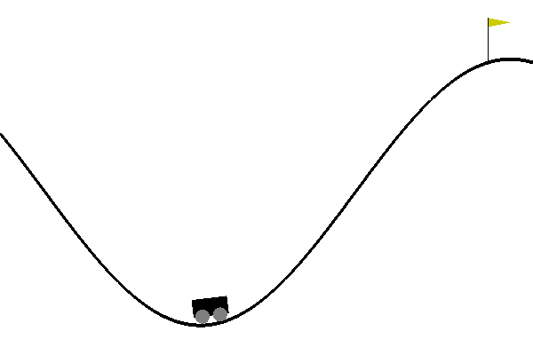

OpenAI 健身房“连续登山”问题的这个例子是用随机政策梯度解决的，如下所示。有据可查的源代码可以在我的 [*GitHub 资源库*](https://github.com/artem-oppermann/Deep-Reinforcement-Learning) *中找到。我选择 MountainCarContinuous 作为一个例子，因为这个问题的训练时间非常短，你可以很快地自己重现它。如果你看完这篇文章想练习一下，克隆库，执行***src/policy gradients/random/random _ pg . py***启动算法。*

## 1.随机政策

在[马尔可夫决策过程](/self-learning-ai-agents-part-i-markov-decision-processes-baf6b8fc4c5f)中，我引入了人工智能代理作为一个神经网络，它与**环境**(电脑游戏、棋盘、现实生活等)相互作用。)通过观察它的**状态 s** (屏幕像素、板配置等。)并根据当前可观测状态*采取**动作 *a、****

**

*Fig. 1 Schematic depiction of deep reinforcement learning*

*对于处于**状态*s*的每一个**动作*a*t**，AI 代理接收一个**奖励**。**奖励**的数量告诉**代理**他的**动作**在这个特定的**状态**中关于解决给定目标的质量，例如学习如何走路或赢得一个计算机游戏。任何给定的**状态**下的**动作**由**策略π** 决定。***

> *在[马尔可夫决策过程](/self-learning-ai-agents-part-i-markov-decision-processes-baf6b8fc4c5f)中，我引入了**策略**作为 AI 的策略，该策略决定了他从一个状态 ***s*** 到下一个状态***s’***的移动，跨越所有可能状态 **s_1** 的整个序列，...，**环境中的 s_n** 。*

*在[深度 Q 学习](/self-learning-ai-agents-part-ii-deep-q-learning-b5ac60c3f47)中，代理遵循策略 **π** ，该策略告知在状态 ***s*** 中采取**动作，这对应于最高动作值 ***Q(s，a)*** 。行动价值函数是我们从状态 **s** 开始，采取行动 **a** ，然后遵循政策 **π** 所获得的预期回报(所有状态的回报总和)(比较[马尔可夫决策过程](/self-learning-ai-agents-part-i-markov-decision-processes-baf6b8fc4c5f) ) **。*****

***在随机策略的情况下，基本思想是通过参数概率分布来表示策略:***

*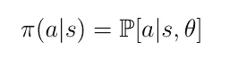*

*Eq. 1 Stochastic policy as a probability distribution.*

*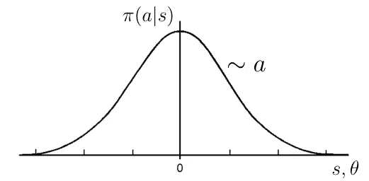*

*Fig. 1 Sample an action **a** from the policy, which is a normal distribution in this case.*

*该分布根据一个参数向量 ***θ*** 随机选择状态 ***s*** 中的动作 ***a*** 。作为概率分布的策略的一个例子是高斯分布，其中我们随机选择一个动作*，作为这个分布的样本(图 1)。这就产生了动作*是一个连续变量。***

> ******记住*** :与深度 Q 学习相反，策略**现在是从状态*到动作*的直接映射/函数。*******

## *******一步法*******

*******但是我们如何确定当前的政策π是一个好政策呢？为此我们必须为π定义一个性能函数，我们称之为 ***J(θ)*** 。*******

*****我们来讨论一个简单的案例，这里我们要衡量的是 ***π*** 的质量/性能只针对代理的一个步骤(从状态 ***s*** 到下一个状态***s’***)。在这种情况下，我们可以将质量函数定义如下:*****

*****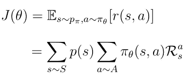*****

*****Eq. 2*****

*****等式中的第二行无非是期望操作符 ***E*** 对期望动作的执行——值 ***r(s，a)*** 对于动作 ***a*** 处于状态****s***是从环境中选择的，而 ***a*** 是根据策略选择的 R_a_s 是状态 ***s*** 中动作 ***a*** 的奖励。******

> *******请注意** : ***r(s，a)*** 与 **Q(s，a)** 或 **q(s，a)** 含义相同，但仅针对一步流程**。*******

*****必须考虑到，在深度强化学习中，环境是随机的，这意味着采取行动并不能保证代理人最终会处于他想要的状态。环境在一定程度上决定了代理的最终位置。因为动作值***【s，a】***依赖于*也*依赖于下一个状态***【s’***(*参见等式。17 在* [*马尔可夫决策过程中*](/self-learning-ai-agents-part-i-markov-decision-processes-baf6b8fc4c5f) )我们必须平均报酬 ***R_a_s*** 整体转移概率***p(s):= p(s→s’)***从状态 ***s*** 到下一个状态***s’。*** 再者*因为 ***R_a_s*** 也取决于行动，我们必须将所有可能的 ***π(a，s)上的报酬平均化。*********

## *****2.随机政策梯度定理*****

*****策略梯度算法通常通过对这种随机策略进行采样并朝着更大的累积回报的方向调整策略参数来进行。*****

*****现在我们已经定义了策略 ***π、*** 的性能，我们可以更进一步，讨论如何学习最优策略。由于 ***π(θ)*** 取决于一些参数 ***θ*** ( *这些参数在大多数情况下是神经网络*的权重和偏差)我们必须找到使性能最大化的最优 ***θ*** 。*****

*****政策梯度法背后的基本思想是在*绩效梯度的方向上调整政策的这些参数***【θ】***。******

****如果我们计算 ***J(θ)*** 的梯度，我们得到下面的表达式:****

****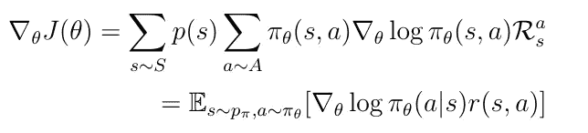****

****Eq. 3 The gradient of the performance function for the one-step process.****

****因为我们想要找到使性能最大化的*，所以我们必须更新*进行*梯度上升*——与梯度下降相反，我们想要找到使预定义损失函数最小化的参数。******

*****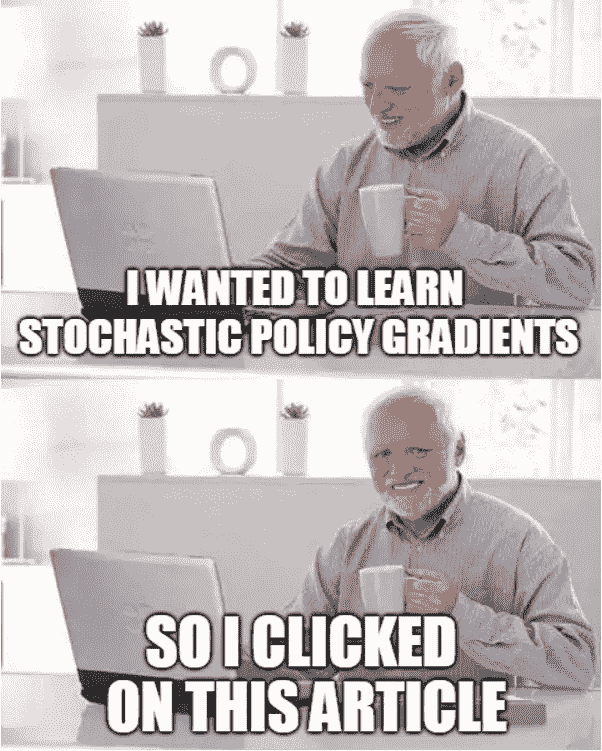*****

## *****多步骤过程*****

*****既然我们知道了如何改进一步式流程的策略，我们可以继续这个案例，在这里我们考虑 AI 智能体在整个*状态序列中的移动过程。******

*****实际上，这种情况并没有那么困难，如果我们记住，在遵循一个政策*从一个状态到另一个状态的运动过程中，我们将获得的(折扣)奖励的总和，就是行动-价值函数 ***Q(s，a)*** 的准确定义。这产生了多步骤过程的策略梯度的以下定义，其中单个预期回报***【r(s，a)】***与预期累积回报(回报总和) ***Q(s，a)*** 交换。******

*****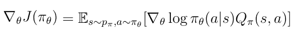*****

*****Eq. 4 The gradient of the performance function for the multi-step process.*****

## *****3.演员-评论家算法*****

*****根据等式使用更新规则的算法。4 被称为*演员评论家算法*。策略 ***π(a|s)*** 被称为*参与者*，因为*参与者*决定了在 ***s*** 状态下必须采取的动作。与此同时，*评论家* ***Q(s，a)，*** 通过赋予*演员*的行为一个质量值来达到*批评*的目的。*****

*****可以看到***J【θ】***的渐变与这个的质量值成比例。高质量值表明在状态*中采取的动作 ***a*** 实际上是一个好的选择，并且可以增加性能方向上的 ***θ*** 的更新。反之适用于小质量值。******

*****现实中，我们无法预先知道***【Q(s，a)】T3。因此我们必须用一个函数 ***Q_w(s，a)*** 来近似它，这个函数依赖于参数 ***w*** 。一般来说 ***Q_w(s，a)*** 可以通过神经网络来估计。********

*****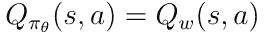*****

*****Eq. 5 Estimation of the action-value function.*****

*****这产生了性能梯度的新定义:*****

*****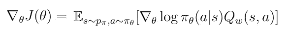*****

*****E6\. A new definition of the performance gradient.*****

*****总之，随机策略梯度算法试图完成以下两件事:*****

*   *****更新*演员* ***π*** 的参数 ***θ*** 朝向表演的渐变 ***J(θ)********
*   *****用常规的*时间差异学习*算法更新*评论家*的参数 **w** ，这是我在深度 Q 学习中介绍的。*****

*****整个 Actor-Critic 算法可以用下面的伪代码来表示:*****

*****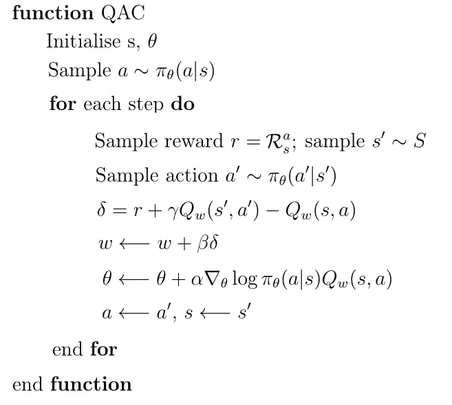*****

*****算法的关键部分发生在代表人工智能代理生命周期的循环中。让我们更深入地讨论每一步:*****

*   *****通过在状态*中采取动作*从环境中获得奖励 ***R*** ，并观察新状态***【s’**********
*   *****给定这个新状态***s’***样本一个动作 ***一个’***随机地从分布 ***π********
*   *****使用旧的*， ***a*** 和新的***s’***，***a’***计算时间差异目标δ******
*   *****根据时间差异学习更新规则更新参数 ***w*** 。(**更好的替代**:用常规的*梯度下降*算法最小化***r+γQ(s’，a’)***和**【s，a】*之间的距离来更新**w*****。)*******
*   ******通过向性能梯度 ***J(θ)*** 执行*梯度上升*步骤，更新策略的参数 ***θ*********
*   ******将新状态 ***s'*** 设为旧状态 ***s*** ，并将新动作 ***a'*** 设为旧动作 ***a*********
*   ******如果进程没有终止，从头开始循环******

## ******4.减少方差******

******众所周知，Actor-Critic-Algorithm 的普通实现具有很高的方差。减小这种方差的一种可能性是从动作值***【Q(s，a)】***中减去状态值 ***V(s)*** (等式 1)。7) ***。*** 状态值在[马尔可夫决策过程](/self-learning-ai-agents-part-i-markov-decision-processes-baf6b8fc4c5f)中被定义为*预期的*总奖励，如果它在状态 ***、*** 中开始它的进程而不考虑动作，AI 代理将会收到该奖励。******

******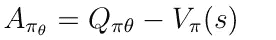******

******Eq. 7 Definition of the advantage.******

******这个新术语被定义为 ***优势*** 并且可以被插入到性能的梯度中。利用这一优势在减少算法的方差方面显示了有希望的结果。******

******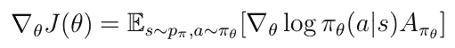******

******Eq. 8 Advantages is inserted into the policy gradient.******

******在具有优势的另一方面，我们引入了要求具有第三函数逼近器(如神经网络)来估计*的问题。然而，可以看出**预期的**时间差误差为***【V(s)】***(等式。9) 无非是优点。*******

*******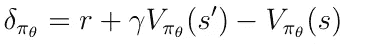*******

*******Eq. 9 Temporal difference error of V(s).*******

*******这可以用 ***Q(s，a)*** 的一个定义来表示，就是***r***+***γV(s’)***的*期望*值。通过减去剩余的项 ***V(s)*** 我们获得优势 ***A*** (等式 1)的先前定义。10) ***。**********

*******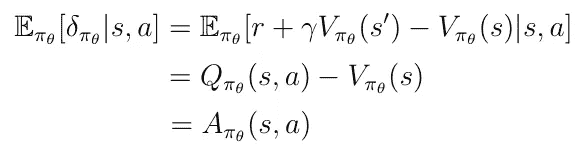*******

*******Eq. 10 Advantage equals the expected TD-Error of V(s).*******

*******最后，我们可以将***【V(s)***的时差误差插入到***【J(s)***的梯度中。这样做我们一举两得:*******

*   *******我们减少了整个算法的方差*******
*   *******同时，我们去掉了三次函数近似*******

*******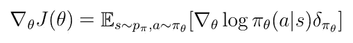*******

*******Eq. 11*******