# 自学习人工智能代理第一部分:马尔可夫决策过程

> 原文：<https://towardsdatascience.com/self-learning-ai-agents-part-i-markov-decision-processes-baf6b8fc4c5f?source=collection_archive---------2----------------------->

## 深度强化学习理论的数学指南

这是关于自我学习人工智能代理的多部分系列的第一篇文章，或者更准确地说，是深度强化学习。本系列的目的不仅仅是让你对这些话题有一个直觉。相反，我想为您提供对最流行和最有效的深度强化学习方法背后的理论、数学和实现的更深入的理解。

## 自学习人工智能代理系列—目录

*   第一部分:马尔可夫决策过程(**本文**)
*   [第二部分:深度 Q 学习](/self-learning-ai-agents-part-ii-deep-q-learning-b5ac60c3f47)
*   [第三部分:深度(双)Q 学习](/deep-double-q-learning-7fca410b193a)
*   [第四部分:持续行动空间的政策梯度](/self-learning-ai-agents-iv-stochastic-policy-gradients-b53f088fce20)
*   第五部分:决斗网络
*   第六部分:异步演员-评论家代理
*   …

Fig. 1\. AI agent learned how to run and overcome obstacles.

## 马尔可夫决策过程—目录

*   **0。简介**
*   **1。简而言之强化学习**
*   **2。马尔可夫决策过程**
*   2.1 马尔可夫过程
*   2.2 马尔可夫奖励过程
*   2.3 价值函数
*   **3。贝尔曼方程**
*   3.1 马尔可夫报酬过程的贝尔曼方程
*   3.2 马尔可夫决策过程— *定义*
*   3.3 政策
*   3.4 动作值函数
*   3.5 最佳政策
*   3.6 贝尔曼最优方程

## 如果你喜欢这篇文章，想分享你的想法，问问题或保持联系，请随时通过 LinkedIn 与我联系。

# 0.介绍

深度强化学习正在兴起。近年来，深度学习的其他子领域没有被研究人员和全球大众媒体谈论得更多。深度学习中的大多数杰出成就都是由于深度强化学习而取得的。从谷歌的阿尔法围棋(Alpha Go)击败了世界上最好的人类棋手(这一成就在几年前被认为是不可能的),到 DeepMind 的人工智能智能代理(AI agents ),它们可以自学行走、奔跑和克服障碍(图 1-3)。

Fig. 2\. AI agent learned how to run and overcome obstacles.

Fig. 3\. AI agent learned how to run and overcome obstacles.

自 2014 年以来，其他人工智能代理在玩老派雅达利游戏如突破(图 4)时超过了人类水平。在我看来，所有这些最令人惊讶的事情是，这些人工智能代理中没有一个是由人类明确编程或教会如何解决这些任务的。他们是靠深度学习和强化学习的力量自己学会的。这个多部分系列的第一篇文章的目标是为您提供必要的数学基础，以便在接下来的文章中处理这个人工智能子领域中最有前途的领域。

Fig. 4 AI agent learned how to play Atari’s Breakthrough.

## 1.简而言之，深度强化学习

深度强化学习可以概括为构建一个直接从与环境的交互中学习的算法(或 AI agent)(图 5)。环境可以是真实的世界、计算机游戏、模拟甚至是棋盘游戏，如围棋或象棋。像人类一样，人工智能**代理**从其**动作**的结果中学习，而不是从被明确教导中学习。

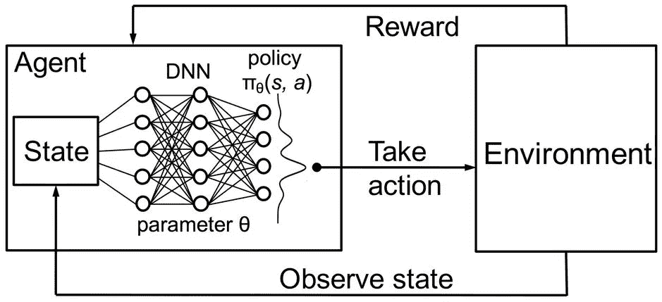

Fig. 5 Schematic depiction of deep reinforcement learning

在深度强化学习中，**代理**由神经网络表示。神经网络直接与环境互动。它观察**环境**的当前**状态**并决定采取哪个**动作**(例如向左、向右移动等。)基于当前**状态**和过去的经验。基于所采取的**动作**，AI 代理接收**奖励。**奖励**的数量**决定了所采取的**行动**在解决给定问题方面的质量(例如学习如何走路)。一个**代理**的目标是学习在任何给定的情况下采取**行动**，使累积的**回报**随着时间的推移而最大化。

# 2.马尔可夫决策过程

一个**马尔可夫决策过程** ( **MDP** )是一个离散时间随机控制过程。MDP 是迄今为止我们为人工智能代理的复杂环境建模的最好方法。代理旨在解决的每个问题都可以被认为是一系列状态 *S1、S2、S3……Sn*(例如，一个状态可以是围棋/国际象棋棋盘配置)。代理采取行动并从一种状态转移到另一种状态。在接下来的内容中，你将学习在任何给定的情况下，决定代理人必须采取何种行动的数学方法。

## 2.1 马尔可夫过程

**马尔可夫过程**是描述一系列可能状态的随机模型，其中当前状态仅依赖于先前状态。这也称为马尔可夫性质(等式)。1).对于强化学习，这意味着人工智能主体的下一个状态只依赖于上一个状态，而不是之前的所有状态。

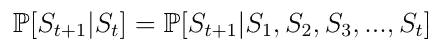

Eq. 1 Markov Property

马尔可夫过程是一个随机过程。意味着从当前状态 ***s*** 到下一个状态***s’***的过渡只能以一定的概率发生***Pss*’**(等式。2).在马尔可夫过程中，被告知向左的代理只会以某个概率(例如 0.998)向左。在小概率情况下，由环境来决定代理的最终位置。

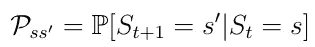

Eq. 2 Transition probability from state **s** to state **s’.**

***Pss*’**可以被认为是状态转移矩阵 ***P*** 中的一个条目，该矩阵定义了从所有状态 ***s*** 到所有后继状态***’s***的转移概率。3).

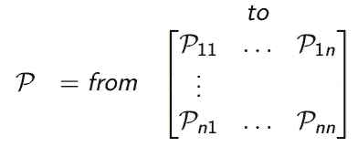

Eq. 3\. Transition probability matrix.

> **记住**:一个马尔可夫过程(或马尔可夫链)是一个元组 **< *S*** ， ***P* >** 。 **S** 是状态的(有限)集合。 **P** 是状态转移概率矩阵。

## 2.2 马尔可夫奖励过程

一个马氏奖励过程是一个元组 **< *S，P，R* >** 。这里 ***R*** 是代理人在状态 ***s*** (Eq。4).这一过程的动机是，对于一个旨在实现某个目标(例如赢得一场国际象棋比赛)的人工智能主体来说，某些状态(比赛配置)在策略和赢得比赛的潜力方面比其他状态更有希望。

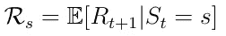

Eq. 4\. Expected reward in a state **s**.

兴趣的首要话题是总奖励 ***Gt*** (Eq。5)这是代理将在所有状态序列中收到的预期累积奖励。每个奖励由所谓的折扣因子γ ∈ [0，1]加权。贴现回报在数学上是方便的，因为它避免了循环马尔可夫过程中的无限回报。此外，贴现因子意味着我们越是在未来，回报就变得越不重要，因为未来往往是不确定的。如果奖励是经济上的，即时奖励可能比延迟奖励获得更多的利息。此外，动物/人类的行为显示出对即时回报的偏好。

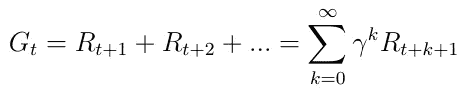

Eq. 5\. Total reward across all states.

## 2.3 价值函数

另一个重要的概念是价值函数 **v(s)** 的概念。value 函数将一个值映射到每个状态 ***s*** 。状态 ***s*** 的值被定义为如果 AI 代理在状态 ***s*** 中开始其进程，它将接收的*预期*总奖励(等式。6).

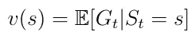

Eq. 6\. Value function, the expected return starting in state **s**.

价值函数可以分解为两部分:

*   代理人在状态****【s .***下收到的即时报酬 R(t+1)*
*   *状态*之后的下一个状态的贴现值 v(s(t+1))**

**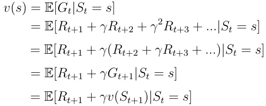**

**Eq. 7 Decomposition of the value function.**

**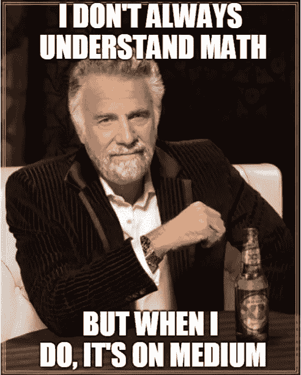**

# **3.贝尔曼方程**

## **3.1**马尔可夫奖励**过程的贝尔曼方程**

**分解的值函数(等式。8)也称为马尔可夫奖励过程的贝尔曼方程。该功能可以在节点图中可视化(图 6)。从状态 ***s*** 开始导致值 ***v(s)*** 。处于状态 ***s*** 我们有一定的概率***【Pss’***结束于下一个状态***s’***。在这个特例中，我们有两个可能的下一个状态。为了获得值 **v(s)** ，我们必须对可能的下一个状态的值***s v(s)***求和，该值由概率***【Pss’***加权，并加上从处于状态 ***s*** 中得到的直接奖励。这产生了等式。如果我们在等式中执行期望操作符 *E* ，这就是等式 8。**

**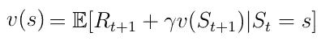**

**Eq. 8 Decomposed value function.**

**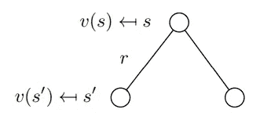**

**Fig. 6 Stochastic transition from **s** to **s’**.**

**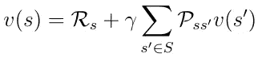**

**Eq. 9 Bellman Equation after execution of the expectation operator E.**

## **3.2 马尔可夫决策过程—定义**

**马尔可夫决策过程是一个带有决策的马尔可夫回报过程。马尔可夫决策过程由一组元组 **< S，A，P，R >来描述，A** 是代理在状态 **s** 中可以采取的有限的可能动作集合。因此，处于状态 ***s*** 的直接回报现在也取决于代理在这种状态下采取的动作*(等式。10).***

***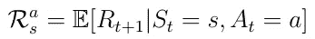***

***Eq. 10 Expected reward depending on the action in a state **s**.***

## ***3.3 政策***

***在这一点上，我们将讨论代理如何决定在一个特定的状态下必须采取的行动。这是由所谓的策略***【π】***(等式。11).从数学上来说，策略是给定状态 ***s*** 下所有动作的分布。该策略确定从状态*到代理必须采取的动作*的映射。*****

***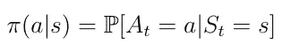***

***Eq. 11 Policy as a mapping from **s** to **a**.***

> *****记住**:直观地说，策略π可以描述为代理根据当前状态 **s** 选择某些动作的策略。***

***该政策导致了国家价值函数的新定义 **v(s)** (等式。我们现在把它定义为从状态 ***s*** 开始，然后遵循一个策略 **π的期望收益。*****

**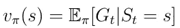**

**Eq. 12 State-value function.**

## **3.4 动作值函数**

**除了状态值函数之外，另一个重要的函数是所谓的动作值函数 **q(s，a)** (等式。13) **。**行动值函数是我们从状态 **s** 开始，采取行动 **a** ，然后遵循策略 **π** 所获得的预期收益。注意，对于状态 ***s*** ， ***q(s，a)*** 可以取几个值，因为在状态 ***s*** 中代理可以采取几个动作。 ***Q(s，a)*** 的计算由神经网络实现。给定一个状态 ***s*** 作为输入，网络以标量形式计算该状态下每个可能动作的质量(图 7)。更高的质量意味着对于给定的目标更好的行动。**

**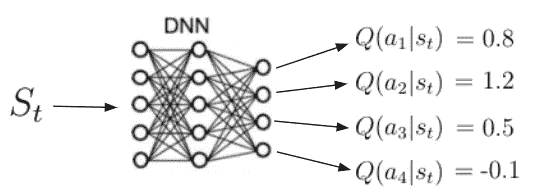**

**Fig. 7 Illustration of the action-value function.**

> ****记住:**行动价值函数告诉我们，在特定状态下采取特定行动有多好。**

**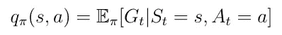**

**Eq. 13 Action-value function.**

**之前，状态值函数 ***v(s)*** 可以分解为以下形式:**

**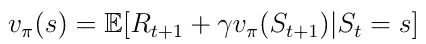**

**Eq. 14 Decomposed state-value function.**

**同样的分解可以应用于动作值函数:**

**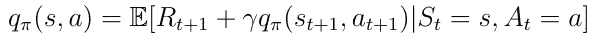**

**Eq. 15 Decomposed action-value function.**

**此时，让我们讨论一下***【v(s)***和 ***q(s，a)*** 是如何相互关联的。这些函数之间的关系可以在图表中再次可视化:**

**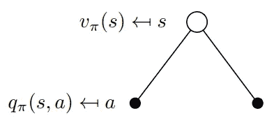**

**Fig. 8 Visualization of the relation between **v(s)** and **q(s,a)**.**

**在这个例子中，处于状态 ***s*** 允许我们采取两种可能的动作 ***a*** 。根据定义，在特定的状态下采取特定的动作给了我们动作值 ***q(s，a)*** 。价值函数***【v(s)***是在状态***【s】***(Eq)中采取行动*的概率(非策略 **π** )加权的可能***【q(s，a)*** 之和。16) ***。******

**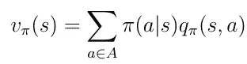**

**Eq. 16 State-value function as weighted sum of action-values.**

****

**现在让我们考虑图 9 中相反的情况。二叉树的根现在是一种状态，在这种状态下我们选择采取一个特定的动作*。记住马尔可夫过程是随机的。采取行动并不意味着你会百分百确定地到达你想去的地方。严格地说，你必须考虑采取行动后在其他州结束的可能性。在这种特殊情况下，在采取行动*之后，你可能会以两种不同的下一个状态*结束:*****

***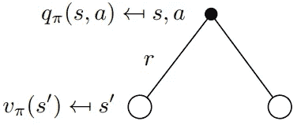***

***Fig. 9 Visualization of the relation between **v(s)** and **q(s,a)**.***

***要获得行动值，您必须获得由概率**Pss’**加权的贴现状态值，以结束所有可能的状态(在本例中只有 2 个),并添加即时奖励:***

***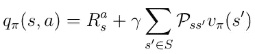***

***Eq. 17 Relation between **q(s,a)** and **v(s)**.***

***现在我们知道了这些函数之间的关系，我们可以从等式中插入***【v(s)】***。16 从 Eq 变成 ***q(s，a)*** 。17.我们得到等式。18，可以注意到，当前 **q(s，a)** 和下一个动作值**q(s’，a’)**之间存在递归关系。***

**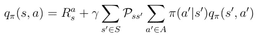**

**Eq. 18 Recursive nature of the action-value function.**

**这种递归关系可以在二叉树中再次可视化(图 10)。我们从 **q(s，a)** 开始，以某个概率在下一个状态 **s'** 中结束 ***Pss'*** 从那里我们可以以概率***【π***采取行动***' a '***并以行动值**结束为了获得 q(s，a)** ,我们必须沿着树向上，对所有概率进行积分，如等式 1 所示。18.**

**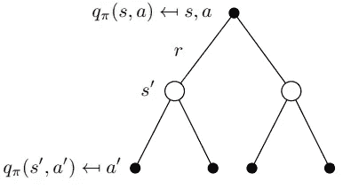**

**Fig. 10 Visualization of the recursive behavior of q(s,a).**

## **3.5 最佳政策**

**深度强化学习中最重要的感兴趣的主题是找到最佳动作值函数 **q*** 。寻找 **q*** 意味着代理人确切地知道在任何给定状态下动作的质量。此外，代理可以根据质量决定必须采取的行动。让我们定义一下 **q*** 的意思。最可能的行动价值函数是遵循最大化行动价值的政策的函数:**

**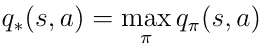**

**Eq. 19 Definition of the best action-value function.**

**为了找到可能的最佳策略，我们必须在**q(s，a)**上最大化。最大化意味着我们只从所有可能的动作中选择动作*，其中 ***q(s，a)*** 具有最高值。这就产生了最优策略π的如下定义:***

**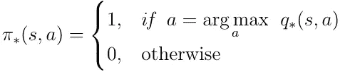**

**Eq. 20 Optimal policy. Take actions that maximize q(s,a).**

## **3.6 贝尔曼最优方程**

**最优策略的条件可以代入方程。18.从而为我们提供了*贝尔曼最优性方程:***

**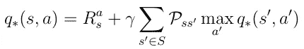**

**Eq. 21 *Bellman Optimality Equation***

**如果人工智能代理可以解决这个方程，那么它基本上意味着给定环境中的问题得到了解决。代理人知道在任何给定的状态或情况下任何可能的行动的质量，并能相应地行动。**

> **解决*贝尔曼*最优方程将是接下来文章的主题。在接下来的文章中，我将向你展示第一种叫做深度 Q 学习的技术。**